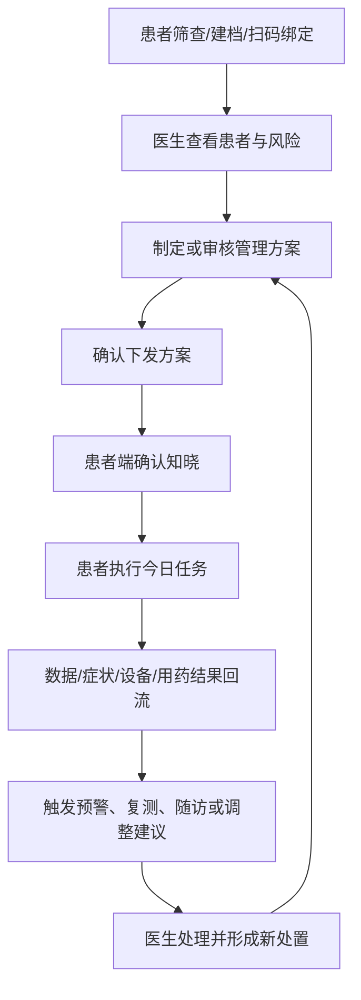
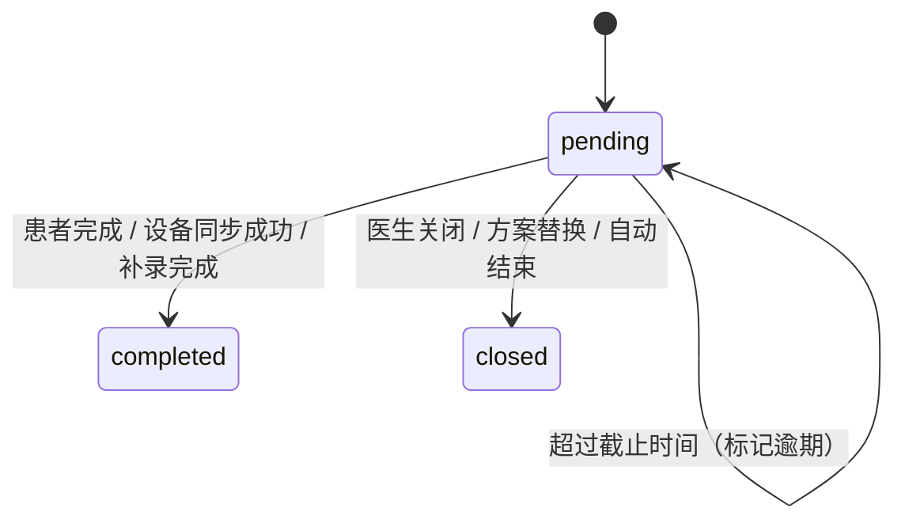

# 医患闭环主PRD

版本：V0.1  
适用范围：医生 PC 管理端 + 患者微信小程序  
文档定位：作为跨端主线 PRD，统一描述方案、任务、预警、随访、医患沟通和状态流转

## 1. 这份文档解决什么问题

原有文档更多是按端拆开写：

- 医生端写“如何制定方案”
- 患者端写“如何执行任务”

这样会导致中间最关键的部分分散在两边：

- 方案下发后患者端如何承接
- 哪些模块生成任务，生成什么任务
- 预警、复测、随访、方案调整如何彼此串联
- 调整方案后旧任务怎么结束、新任务怎么生成

这份主 PRD 专门负责把这些跨端闭环写清楚。

## 2. 业务闭环总图



## 3. 文档主线

本期建议按以下业务闭环维护主 PRD：

1. 筛查与建档闭环
2. 管理方案闭环
3. 执行任务闭环
4. 预警闭环
5. 随访闭环
6. 医生建议与结构化沟通闭环
7. 设备与数据同步闭环
8. 状态机、任务模型与版本规则

## 4. 筛查与建档闭环

### 4.1 业务目标

- 帮患者快速完成初始筛查，形成风险画像。
- 让医生在正式介入前，先看到风险标签、关键证据和患者基础档案。
- 建立医患服务关系，作为后续方案、预警、随访的前提。

### 4.2 医生端承担什么

- 生成绑定二维码
- 查看患者基本信息、筛查结果、风险标签
- 选择是否纳入持续管理
- 确认疾病标签或保留风险标签

### 4.3 患者端承担什么

- 完成筛查
- 授权绑定医生
- 补充基础信息和病史

### 4.4 闭环关键点

- 风险标签不等于确诊标签。
- 医生确认疾病后，才进入正式方案和随访链路。
- 未绑定医生的患者，只能获得轻量提醒和自我管理内容，不进入完整医患管理闭环。

## 5. 管理方案闭环

### 5.1 业务目标

- 将医生决策从“口头建议”沉淀为结构化方案。
- 让患者端看到的是“今天要做什么”，而不是后台模块配置。
- 支持方案调整时旧任务结束、新任务生成，避免任务体系越滚越乱。

### 5.2 医生端核心动作

- 新建或审核系统推荐方案
- 编辑方案基础信息和各功能模块
- 保存草稿
- 确认下发
- 后续调整方案
- 停用或结束方案

### 5.3 患者端核心动作

- 查看当前阶段方案说明
- 确认已知晓
- 承接今日任务
- 查看随访安排和近期调整

### 5.4 方案模块建议

P0 主模块建议保留：

- 方案基础信息
- 管理目标
- 指标测量方案
- 预警规则
- 随访计划

条件模块按疾病和患者情况启用：

- 症状记录
- 用药方案
- 设备监测方案
- 生活方式方案

当前不建议保留独立的“患者指导”模块，患者端展示内容应由系统根据方案编译生成。

### 5.5 方案调整规则

- 调整方案不生成新的“草稿副本让患者继续跑旧任务”。
- 更合理的做法是：旧方案结束，新版本方案生效。
- 旧方案关联的未完成任务统一关闭。
- 新方案按最新模块配置重新生成新任务。
- 时间轴必须保留方案版本切换记录。

### 5.6 方案主状态

当前建议只保留方案生命周期主状态，患者疑问、即将到期、待复盘等都降级为标签：

- `draft`
- `pending_patient_confirm`
- `active`
- `stopped`
- `completed`
- `rejected`

主状态定义：

| 状态 | 含义 | 说明 |
| --- | --- | --- |
| `draft` | 草稿 | 医生编辑中或系统推荐待审核，患者不可见 |
| `pending_patient_confirm` | 待患者确认 | 医生已下发，等待患者确认知晓 |
| `active` | 执行中 | 患者已确认，方案开始承接任务 |
| `stopped` | 已停用 | 医生中止本阶段执行 |
| `completed` | 已完成 | 本阶段执行结束 |
| `rejected` | 已驳回 | 医生驳回系统推荐草稿 |

### 5.7 方案下发与生效规则

- 医生确认下发，不等于患者已经开始执行。
- 患者端必须承接一个“已知晓并开始执行”的确认动作。
- 默认任务开始时间以患者确认时间或医生设置的计划开始时间为准。
- 安全类提醒和紧急建议不等待患者确认方案后才展示。

简化流转：

```text
draft
  -> pending_patient_confirm
  -> active
  -> stopped / completed
```

### 5.8 方案模块精简原则

P0 方案模块不宜大而全，建议按“核心必需 + 条件启用”组织。

核心必需模块：

- 方案基础信息
- 管理目标
- 指标测量方案
- 随访计划

条件启用模块：

- 预警规则
- 症状记录
- 用药方案
- 设备监测方案
- 生活方式方案

精简口径：

- 不保留独立 `患者指导` 模块。
- 不在每个模块重复展示“医生端配置”等解释性文案。
- 患者说明由系统编译生成，不让医生逐模块填写。
- `预警规则` 改为非必填，允许直接使用全局规则。

## 6. 执行任务闭环

### 6.1 业务目标

- 患者端聚焦“执行”，不是“理解后台模块结构”。
- 医生端看到患者依从性、关键缺失和复测回流。
- 任务体系尽量轻，不做复杂多分叉状态机。

### 6.2 当前建议任务类型

P0 患者端高频透出任务类型：

- 指标记录
- 用药/治疗执行
- 症状评估
- 睡眠报告
- 生活方式
- 随访准备
- 复测任务
- 设备任务
- 确认知晓

### 6.3 任务状态机

当前建议统一为：

- `pending`
- `completed`
- `closed`

补充说明：

- `overdue` 不再作为主状态，只作为 `pending` 的逾期标签。
- 当前不保留 `unable`。
- 当前不保留 `invalidated` 作为任务主状态，统一归入 `closed`，通过 `close_reason` 区分关闭原因。



### 6.4 患者端展示原则

- 以“今日任务”视角展示，不直接展示后台模块。
- 每张任务卡只展示：任务名、建议时间、简短说明、状态、主按钮。
- 患者端不提供“无法完成”作为通用操作。
- 如需沟通困难或异常，统一走问题反馈、设备异常或联系医生入口。

## 7. 预警闭环

### 7.1 业务目标

- 在关键风险出现时推动患者复测、补数据或联系医生。
- 帮医生优先处理真正需要介入的患者。

### 7.2 医生端核心动作

- 查看预警列表
- 识别证据链
- 确认是否需要复测、随访、方案调整或转诊
- 记录采纳、修改或驳回结果

### 7.3 患者端核心动作

- 查看风险提示
- 补做复测
- 查看医生提醒
- 在必要时联系医生

### 7.4 与方案的关系

- 预警规则可使用全局默认规则，不要求每位医生都个体化设置。
- 个体化预警是增强能力，不应阻塞方案下发。
- 预警触发后优先生成复测任务、随访准备任务或医生处理待办，不建议引入过多患者端分支。

### 7.5 当前建议预警层级

P0 建议只保留三层：

- 提醒
- 重要
- 紧急

不建议继续细分更多等级，不然医生端筛选和患者端表达都会变重。

### 7.6 当前必须承接的预警动作

医生端动作：

- 查看证据
- 发送建议
- 创建复测任务
- 创建随访
- 调整方案
- 建议线下就医
- 关闭并留痕

患者端动作：

- 复测
- 补充记录
- 查看医生建议
- 必要时联系医生或线下就医

### 7.7 预警关闭口径

关闭预警不删除事件本身，只代表“当前医生处理已结束”。

建议保留关闭原因：

- 已处理
- 数据误差
- 设备误差
- 患者已线下处理
- 无需继续处理
- 其他

## 8. 随访闭环

### 8.1 业务目标

- 让随访从“约个时间”变成“有准备、有记录、有产出”的闭环。

### 8.2 医生端核心动作

- 创建随访计划
- 明确随访目的、时间、需要准备的数据
- 记录随访结论
- 根据结论决定是否调整方案

### 8.3 患者端核心动作

- 查看下次随访时间
- 根据要求准备记录、报告和问题
- 提交必要的随访前信息

### 8.4 与任务的关系

- 随访前要求患者准备的数据，应生成“随访准备任务”。
- 随访结束后如果需要新方案，按“旧任务关闭、新任务生成”处理。

### 8.5 当前建议随访类型

- 计划内随访
- 预警后随访
- 方案复盘随访
- 医生临时随访
- 转诊后追踪随访

其中 P0 最重要的是前三类，已经够支撑日常闭环。

### 8.6 当前建议随访状态

为避免状态过重，随访状态建议保留：

- `pending_patient_prepare`
- `pending_doctor`
- `overdue`
- `completed`
- `rescheduled`
- `cancelled`

这套状态只用于随访对象本身，不影响方案和任务主状态。

### 8.7 随访结束后允许的结果

医生完成随访后，必须明确一个结果：

- 继续当前方案
- 调整方案
- 资料不足，补充数据
- 建议复诊/转诊
- 结束本阶段

这个结果会直接决定：

- 是否生成补充任务
- 是否进入方案调整
- 是否生成下次随访

## 9. 医生建议与结构化沟通闭环

### 9.1 业务目标

- 沟通尽量结构化，减少医生手写长文本，也避免患者端变成复杂 IM。

### 9.2 建议的呈现方式

医生端：

- 可发起结构化问题
- 可发送阶段建议
- 可要求患者补充信息

患者端：

- 以消息卡或问题卡形式接收
- 通过单选、多选、简短文本进行回复
- 回复后沉淀为结构化摘要，供医生复看

### 9.3 当前产品原则

- 不建议先做重 IM 聊天系统。
- 优先做“消息流 + 结构化回复卡”。
- 结构化沟通优先承接：数据异常、依从性确认、随访准备。

### 9.4 结构化沟通最小模板

P0 不需要做复杂消息系统，建议只承接 3 类结构化沟通：

1. 数据异常沟通
2. 执行依从性沟通
3. 随访准备沟通

每次沟通控制在 3-5 个问题内，避免把患者端做成问卷系统。

## 10. 设备与数据同步闭环

### 10.1 业务目标

- 让设备同步回流到方案、任务、预警和医生判断中，而不是孤立存在。

### 10.2 关键原则

- 设备绑定和同步异常，应优先作为设备任务或问题提示处理。
- 设备数据进入时间轴，并标识来源。
- 睡眠报告、血氧等设备数据可直接触发复测任务或医生待处理事项。

## 11. 页面与文档拆分原则

这份主 PRD 负责回答：

- 为什么做
- 医患两端如何闭环
- 状态怎么流转
- 任务如何生成
- 模块之间如何串联

端侧 SPEC 分别负责回答：

- 页面入口是什么
- 每个页面展示什么
- 字段有哪些
- 交互怎么做
- 前端和后端具体怎么开发

## 12. 后续迁移建议

下一步建议按下面顺序逐步迁移老内容：

1. 先把方案管理、随访计划、预警处理的闭环规则集中到这份主 PRD。
2. 再把医生端页面级内容拆到医生端 SPEC。
3. 再把患者端页面路径、任务展示和反馈入口拆到患者端 SPEC。
4. 最后统一收口状态机、任务类型、核心数据模型，作为附录或基础规则文档。
