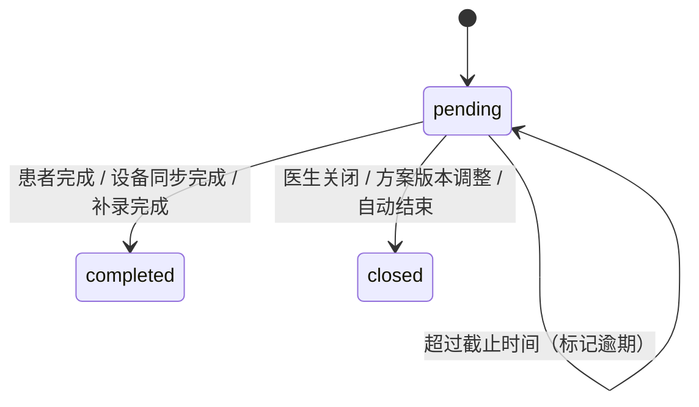

# 执行任务闭环PRD

版本：V0.1  
适用范围：医生 PC 管理端 + 患者微信小程序  
文档定位：承接任务从方案/预警/随访生成，到患者执行、医生查看、状态流转和结果回流的完整闭环

## 1. 业务定位

执行任务是系统底层模型，不作为医生端管理方案页面的一级业务文案。医生端展示为“指标测量方案、症状记录方案、用药方案、设备监测方案、随访计划”等；患者端展示为“今日待完成、今日记录、用药提醒、随访准备”。

任务的职责是把抽象的方案、随访、预警、医生建议翻译成患者真的能执行的最小动作。

## 2. 任务来源

| 来源 | 底层生成 | 患者端展示示例 |
| --- | --- | --- |
| 管理方案 | 周期性任务 | 每天空腹血糖、每晚服药、每周睡眠报告 |
| 随访计划 | 准备任务 | 随访前完成近 7 天血糖、症状问卷、上传报告 |
| 风险预警 | 临时任务 | 立即复测血糖、补充症状、查看睡眠报告 |
| 临时干预 | 临时任务/临时随访准备 | 未来 3 天加测血压、本周补充一次睡眠报告 |
| 医生建议 | 一次性待办 | 本周三前复测血压、补充用药备注 |
| 设备管理 | 设备任务 | 绑定设备、同步数据、检查 CPAP 使用记录 |
| 健康筛查/疾病标签 | 补充资料任务 | 完善病史、补充检查报告、确认症状 |

## 3. 核心规则

- 任务是底层可执行的最小单元，前台文案必须转换成患者可理解待办。
- 管理方案和随访计划只配置规则，真正执行时生成任务实例。
- 同一患者同一时间段的相似任务要支持合并展示，避免待办过载。
- 医生确认后的方案事项才能下发患者端。
- 任务完成、逾期、补录和关闭都要留痕。

## 4. P0 任务类型

### 4.1 全量任务类型

| 任务类型 | 说明 | 对应疾病/场景 |
| --- | --- | --- |
| 指标记录 | 血糖、血压、血氧、呼吸频率、体重等记录 | 糖尿病、慢阻肺、高血压 |
| 用药/治疗执行 | 服药、吸入药、氧疗、CPAP、肺康复 | 全部疾病 |
| 症状评估 | 低血糖症状、咳喘、气促、睡眠症状、头痛胸闷 | 全部疾病 |
| 睡眠报告 | 上传或同步睡眠报告、查看睡眠分析 | 睡眠呼吸障碍 |
| 随访准备 | 随访问卷、资料确认、近期记录补齐 | 随访计划 |
| 复测任务 | 异常后再次测量并反馈 | 预警处理 |
| 生活方式 | 饮食、运动、限盐、戒烟、睡眠卫生 | 慢病长期管理 |
| 设备任务 | 添加设备、同步设备、检查连接状态 | 设备数据采集 |
| 确认知晓 | 确认已知晓方案并开始执行 | 方案下发后 |
| 评估量表 | CAT、mMRC、ESS、STOP-Bang 等 | 筛查、随访、方案复盘 |

### 4.2 P0 患者端高频透出任务

建议直接展示的高频任务类型收敛为：

- 指标记录
- 用药/治疗执行
- 症状评估
- 睡眠报告
- 生活方式
- 随访准备
- 复测任务
- 设备任务
- 确认知晓

复杂量表和报告上传在 P0 不作为首页主任务类型重点暴露。

## 5. 任务状态机

### 5.1 当前最终口径

- `pending`
- `completed`
- `closed`



### 5.2 状态定义

| 状态 | 说明 |
| --- | --- |
| `pending` | 待完成 |
| `completed` | 已完成 |
| `closed` | 已关闭 |

### 5.3 补充规则

- `overdue` 不再作为独立主状态，只是 `pending` 的时间标签。
- 当前不保留 `unable`。
- 当前不保留 `invalidated`，统一并入 `closed`。
- 逾期后补完成，直接进入 `completed`，并记录补录时间与实际发生时间。

## 6. 任务生成规则

### 6.1 管理方案生成任务

- 按方案周期和频率生成任务实例。
- 每天只生成当天及未来短周期任务，避免一次性生成过多。
- 方案下发后先生成 `确认知晓` 任务。
- 患者确认后，再按计划开始时间生成周期性任务。
- 新版本方案生效后，旧版本未完成任务关闭，新版本任务重新生成。

### 6.2 随访计划生成任务

- 创建随访后自动生成准备任务。
- 准备材料按随访类型和疾病模板生成。
- 随访改期后，未完成准备任务的截止时间同步调整。
- 随访取消后，准备任务取消或转为普通补充资料任务。

### 6.3 预警生成任务

- 指标异常可生成复测任务。
- 预警后任务优先级默认为重要或紧急。
- 紧急预警任务不替代线下就医提示。
- 复测完成后回写预警详情，供医生继续处理或关闭。

### 6.3A 复测任务完成校验口径

复测任务是否完成，不按“提交了几条数据”粗暴判断，而按医生发起复测时配置的指标、场景、频率和时长判断。

建议规则：

- 先判断记录是否命中当前复测要求：
  - 指标一致
  - 场景一致
  - 记录时间落在复测有效期内
- 按天校验，不按总条数累计，避免患者一天补多条记录抵掉多天要求
- 若同一天要求多个场景，则该天所有必需场景都满足才算当天完成
- 若一次复测包含多个指标，则所有子指标要求都完成后，父级复测任务才进入 `completed`
- 睡眠报告类按“是否在有效期内提交有效报告”判断完成，不按日频累计
- 部分完成作为展示进度，不单独升级复杂主状态

### 6.4 临时干预生成任务

- 临时干预用于补充短期观察和额外执行动作，不改变长期方案主结构。
- 可生成临时测量、临时症状记录、临时复测、临时随访准备等任务。
- 临时任务必须带截止时间和来源事件。
- 临时干预结束后任务自动关闭，不回写为长期方案规则。

### 6.5 医生建议生成待办

- 医生发送建议时可勾选“生成患者端待办”。
- 可生成一次性待办，也可转为短周期待办。
- 患者完成后医生端显示执行状态。

## 7. 任务合并与降噪

### 7.1 合并规则

| 合并场景 | 规则 |
| --- | --- |
| 同一时间段多指标 | 合并为晨间测量、睡前测量等任务组 |
| 同一随访准备材料 | 合并去重，只展示一次 |
| 方案和预警同时要求复测 | 保留更高优先级和更早截止时间 |
| 多病共管重复生活方式事项 | 合并为一条患者可理解待办 |
| 设备采集已完成 | 自动完成对应记录事项，并标记来源为设备 |

### 7.2 任务组要求

- 患者端可展开查看子任务
- 医生端可查看每个子任务完成状态
- 完成率按子任务计算
- 重要/紧急子任务未完成时，任务组不能显示全部完成

## 8. 患者端展示与交互

### 8.1 入口

- 首页今日待办
- 方案页今日任务
- 随访计划页准备材料
- 预警详情页复测待办
- 医生建议消息卡片

### 8.2 任务卡展示

```text
事项名称
来源标签：管理方案/随访/预警/医生建议
截止时间或建议执行时间
事项说明
关联疾病或指标
操作按钮：去记录、去打卡、上传报告、填写问卷、确认已读
状态：待完成、已完成、已逾期
```

### 8.3 患者操作

- 完成事项
- 补录事项
- 查看事项来源
- 查看医生说明
- 异常值提交后补充症状或备注

### 8.4 限制规则

- 患者不能修改目标、频率、截止时间、用药剂量和治疗执行要求。
- 用药/治疗任务只允许记录实际执行情况。
- 患者不能删除、跳过或关闭医生下发任务。

## 9. 医生端执行情况管理

### 9.1 展示位置

| 页面 | 展示内容 |
| --- | --- |
| 患者列表 | 今日待完成事项完成度、连续未完成、随访准备完成度 |
| 患者 360 总览 | 今日待完成、逾期事项、关键事项缺失 |
| 随访详情页 | 随访准备完成情况 |
| 预警详情页 | 复测完成情况 |
| 数据看板 | 完成率、逾期率、任务类型分布 |

### 9.2 医生操作

- 查看执行明细
- 调整未来测量/记录频率
- 关闭未来待办
- 手动新增临时待办
- 将未完成事项转为随访问题
- 对重要/紧急未完成事项发送提醒或创建随访

## 10. 与风险分、预警、随访的关系

- 任务完成率影响健康风险分中的数据完整度和依从性
- 关键任务连续未完成可生成数据缺失预警
- 紧急预警复测任务完成后回写预警处理证据
- 随访准备任务完成度影响医生端排序
- 任务执行结果进入干预效果评估

## 11. 与管理方案模板的映射

| 管理方案模板字段 | 生成任务类型 | 关键映射 |
| --- | --- | --- |
| `metric_measurement_plan` | 指标记录/复测任务 | 指标编码、测量场景、频率、推荐时间、目标范围 |
| `symptom_record_plan` | 症状评估 | 症状组、症状项、严重程度、持续时间 |
| `medication_plan` | 用药/治疗执行 | 药品、剂量、频次、服用时间 |
| `device_monitoring_plan` | 设备任务/睡眠报告/CPAP 任务 | 设备类型、同步要求 |
| `followup_rule` | 随访准备 | 首次随访时间、准备材料 |
| `alert_rules` | 复测任务/随访准备 | 触发条件、预警等级、患者动作 |
| `patient_description` | 确认知晓 | 方案说明、风险提示、确认回执 |

## 12. 一句话总结

**任务不是独立业务模块，而是方案、预警、随访和临时干预在患者端真正落地的执行层。**
