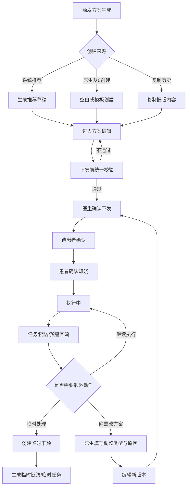

# 管理方案闭环PRD

版本：V0.1  
适用范围：医生 PC 管理端 + 患者微信小程序  
文档定位：承接管理方案从生成、审核、下发、执行到版本切换的完整业务闭环

## 0. 关联 SPEC

- 医生端交互开发详见：[医生PC端-管理方案SPEC](/Users/ks-hz/Desktop/数字孪生/docs/spec/医生PC端-管理方案SPEC.md)
- 患者端页面承接详见：[患者端-方案页SPEC](/Users/ks-hz/Desktop/数字孪生/docs/spec/患者端-方案页SPEC.md)

## 1. 业务定位

管理方案是医生确认后下发给患者的一段时间慢病管理计划。系统可以基于疾病标签、风险分层、健康风险分、近期指标、症状、用药和设备数据生成初始化方案草稿，但必须由医生审核、修改或确认后才能推送到患者端。

管理方案的产品定位是长期方案，强调阶段稳定执行，不鼓励因单次预警或单次随访频繁改动。短期异常、补充观察和额外跟进优先通过 `临时干预` 承接。

它不是单纯的配置页，也不是后台模板集合，而是医患两端连续管理的中枢：

- 对医生端，它是阶段管理决策的结构化承载。
- 对患者端，它会被翻译成“当前阶段目标 + 今日任务 + 随访安排 + 异常处理提示”。
- 对系统底层，它会生成任务、随访、预警和版本留痕。

## 2. P0 范围

### 2.1 P0 必须保留

- 系统生成推荐方案草稿
- 医生查看证据、审核、修改、驳回或确认下发
- 患者确认已知晓并开始执行
- 方案生成患者端待办、预警规则和计划内随访
- 方案版本、患者确认和关键变更进入时间轴

### 2.2 P0 不做

- 复杂方案模板后台
- 复杂规则引擎
- 方案多医生共同编辑
- 患者选择执行哪个医生方案
- 字段级复杂 diff
- 方案批量下发
- 自动下发
- 在线开药、处方流转、支付、医保
- 复杂生活方式课程体系

## 3. 核心闭环

## 4. 方案来源与生成条件

### 4.1 方案来源

- 系统推荐草稿
- 医生从 0 创建
- 基于模板创建
- 复制历史方案

### 4.2 初始化方案生成条件

| 场景 | 触发条件 | 结果 |
| --- | --- | --- |
| 首次建档 | 患者完成筛查并与医生绑定 | 生成系统推荐草稿 |
| 医生确认疾病 | 风险标签被医生确认 | 生成或更新系统草稿 |
| 风险等级变化 | 健康风险分跨等级下降或出现紧急预警 | 生成或更新系统草稿 |

### 4.3 草稿生成规则

- 同一患者、同一主责医生、同一疾病域，在同一管理阶段只保留一个未下发草稿。
- 已存在未下发草稿时，系统更新推荐项，但不能静默覆盖医生已修改内容。
- 若已有执行中方案，不允许新草稿直接覆盖患者当前执行内容。

## 5. 临时干预与正式调方案

### 5.1 核心原则

- 预警后、随访后出现短期异常或补充观察需求，优先创建 `临时干预`。
- 临时干预用于承接短周期、临时性的新增动作，不改变当前长期管理方案主结构。
- 临时干预支持两类动作：
  - 临时随访
  - 临时任务
- 只有当医生判断当前长期方案本身需要改变时，才进入正式调方案流程。

### 5.2 正式调方案的准入条件

以下场景才建议修改已下发方案：

- 阶段目标需要改变
- 指标频率、治疗执行、随访节奏等长期规则需要改变
- 疾病管理重心发生变化
- 患者执行效果经过复盘后，需要切换管理强度

### 5.3 调整留痕要求

已下发方案被医生调整时，必须补充以下信息：

| 字段 | 类型 | 必填 | 规则 |
| --- | --- | --- | --- |
| 调整类型 | select | 是 | 预警后调整、随访后调整 |
| 调整原因 | textarea | 是 | 医生填写调整依据，患者不可见 |

## 6. 方案版本与调整规则

这是当前方案管理里最关键的规则之一。

### 5.1 最终建议

- 调整方案时，不建议让患者继续沿用旧任务再并存一个新草稿。
- 更合理的是：原方案保留为历史版本，新版本重新生效。
- 旧版本未完成任务在新版本确认生效后统一关闭。
- 新版本按最新配置重新生成新任务。

### 5.2 版本处理口径

- 方案主记录保留，版本号递增
- 历史完成任务、设备同步结果、手动记录和随访证据保留
- 旧版本未完成任务关闭原因统一记录为 `方案版本调整`
- 时间轴必须保留版本切换事件

## 7. 方案主状态

### 6.1 主状态

- `draft`
- `pending_patient_confirm`
- `active`
- `stopped`
- `completed`
- `rejected`

### 6.2 定义

| 状态 | 含义 | 说明 |
| --- | --- | --- |
| `draft` | 草稿 | 医生编辑中或系统推荐待审核，患者不可见 |
| `pending_patient_confirm` | 待患者确认 | 医生已下发，等待患者确认知晓 |
| `active` | 执行中 | 患者已确认，方案开始承接任务 |
| `stopped` | 已停用 | 医生中止本阶段执行 |
| `completed` | 已完成 | 本阶段执行结束 |
| `rejected` | 已驳回 | 医生驳回系统推荐草稿 |

### 6.3 状态标签

以下信息不进入主状态，统一作为标签或事件：

- 患者未确认
- 患者有疑问
- 即将到期
- 待复盘
- 调整版本

## 8. 医生端方案结构

### 7.1 模块精简原则

P0 不宜大而全，建议按“核心必需 + 条件启用”组织。

核心必需模块：

- 方案基础信息
- 管理目标
- 指标测量方案
- 随访计划

条件启用模块：

- 预警规则
- 症状记录
- 用药方案
- 设备监测方案
- 生活方式方案

不保留独立 `患者指导` 模块。

### 7.2 方案组成

| 模块 | 内容 | 是否患者端可见 |
| --- | --- | --- |
| 阶段信息 | 方案名称、适用疾病、周期、版本 | 是 |
| 管理目标 | 阶段目标、量化目标、目标周期、达成口径 | 是 |
| 指标测量方案 | 血糖、血压、SpO2、呼吸频率、体重、睡眠报告等 | 是 |
| 症状记录方案 | 症状项、记录频率、触发条件 | 是 |
| 用药方案 | 用药提醒、来源、剂量、频次、执行记录 | 是 |
| 设备监测方案 | 设备类型、采集方式、同步要求 | 是 |
| 生活方式方案 | 饮食、运动、戒烟、睡眠卫生等 | 是 |
| 预警规则 | 复测、随访、联系医生、线下就医提示 | 部分可见 |
| 随访计划 | 首次随访时间、频率、准备材料 | 是 |
| 医生内部备注 | 医生判断、风险解释、后续关注点 | 否 |

## 9. 方案基础信息

### 8.1 字段

| 字段 | 类型 | 必填 | 规则 |
| --- | --- | --- | --- |
| 方案名称 | input | 是 | 默认按“疾病 + 周期”生成 |
| 适用疾病 | multi-select | 是 | 糖尿病、高血压、睡眠呼吸障碍、慢阻肺 |
| 方案周期 | select/date range | 是 | 7/14/30/90/180 天 |
| 方案来源 | auto | 是 | 系统草稿/医生创建/模板创建/历史复制 |
| 计划开始日期 | date | 是 | 默认患者确认次日开始 |
| 医生端摘要 | textarea | 否 | 医生内部摘要，其他模块不重复配置 |
| 医生内部备注 | textarea | 否 | 患者不可见 |

已下发方案进入调整模式时，额外展示：

| 字段 | 类型 | 必填 | 规则 |
| --- | --- | --- | --- |
| 调整类型 | select | 是 | 预警后调整、随访后调整 |
| 调整原因 | textarea | 是 | 患者不可见 |

### 8.2 当前交互口径

- 方案基础信息在详情页内直接编辑，不再强依赖单独抽屉。
- 适用疾病使用多选下拉样式，不直接把整块列表铺开。
- 方案发布时再统一校验，不在顶部和右侧重复提示。

## 10. 管理目标

### 9.1 目标结构

管理目标由两层组成：

- 阶段目标
- 量化目标

### 9.2 阶段目标字段

| 字段 | 类型 | 必填 | 说明 |
| --- | --- | --- | --- |
| 阶段目标 | textarea/template | 是 | 建议 20-80 字 |
| 目标周期 | select | 是 | 默认跟随方案周期 |

### 9.3 量化目标字段

| 字段 | 类型 | 必填 | 说明 |
| --- | --- | --- | --- |
| 目标项 | 预置不可改 | 是 | 从疾病目标库预置 |
| 单位 | auto | 是 | 自动带出 |
| 目标值 | number/range | 是 | 医生可调整 |
| 是否启用 | switch | 是 | 至少启用 1 项 |

### 9.4 本期预置量化目标

糖尿病：

- 空腹血糖：4.4-7.0 mmol/L
- 餐后 2h 血糖：<10.0 mmol/L
- 低血糖事件：0 次
- 血糖记录完成率：>=80%
- 用药执行率：>=90%

慢阻肺：

- 静息 SpO2：>=93%
- 活动后 SpO2：>=90%
- 呼吸频率：12-20 次/分
- 症状加重次数：0
- 吸入药执行率：>=90%

睡眠呼吸障碍：

- 睡眠时长：>=6 小时
- AHI：<15 次/小时
- 最低血氧：>=90%
- CPAP 使用时长：>=4 小时/晚
- 睡眠报告完成率：>=80%

高血压：

- 家庭收缩压 SBP：<135 mmHg
- 家庭舒张压 DBP：<85 mmHg
- 极高血压事件：0 次
- 血压记录完成率：>=80%
- 用药执行率：>=90%

## 10. 指标测量方案

### 10.1 字段

| 字段 | 类型 | 是否必填 | 规则 |
| --- | --- | --- | --- |
| 指标名称 | select | 是 | 血糖、血压、SpO2、呼吸频率、体重、睡眠报告 |
| 方案周期 | select/date range | 是 | 7/14/30/90/180 天 |
| 适用疾病 | multi-select | 是 | 从患者确认疾病或风险标签中选择 |
| 计划开始日期 | date | 是 | 患者确认次日开始 |
| 测量场景 | multi-select | 条件必填 | 与指标和疾病相关 |
| 测量频率 | frequency selector | 是 | 每日、每周 N 天 |

### 10.2 测量场景枚举

血糖：

- 凌晨
- 空腹
- 早餐后 2h
- 午餐前
- 午餐后 2h
- 晚餐前
- 睡前
- 随机

血压：

- 晨起
- 睡前
- 随机

SpO2 / 呼吸频率：

- 静息后
- 活动后
- 睡前

### 10.3 当前交互口径

- `测量场景` 使用点击后展开的下拉多选，不直接整块平铺。
- 生成患者待办、允许补记、允许反馈无法完成这些勾选不再给医生配置，系统内部默认处理。

## 11. 用药方案边界

用药方案定位为“用药管理与提醒”，不是电子处方系统。

### 11.1 支持

- 记录患者当前用药
- 配置用药提醒和打卡
- 记录漏服、不良反应和备注
- 统计用药执行率

### 11.2 不支持

- 在线开具处方
- 处方审核、流转、支付、医保结算
- 患者自行修改医生确认的药品、剂量、频次和周期

### 11.3 字段

| 字段 | 必填 | 说明 |
| --- | --- | --- |
| 药品名称 | 是 | 可手动录入或从常用药品库选择 |
| 单次剂量/用量 | 是 | 如 1 片、2 吸 |
| 服用频次 | 是 | 每日 1 次/2 次/3 次/4 次、每 8 小时 1 次、每 12 小时 1 次、隔日 1 次、每 3 日 1 次、必要时、紧急时 |
| 服用时间 | 是 | 早餐后、晚餐后、睡前等 |
| 开始/结束日期 | 是 | 用于生成提醒和执行统计 |
| 用药来源 | 是 | 既有处方、线下医嘱、出院记录、专科方案、患者自述、随访确认 |
| 是否关键用药 | 否 | 可触发依从性关注 |

## 12. 预警规则在方案中的位置

- 预警规则改为非必填增强模块。
- 医生可以直接使用全局默认预警规则。
- 只有需要个体化时才进入个体配置。
- 不应因为未个体化预警规则就阻塞方案下发。

## 13. 随访计划在方案中的位置

### 13.1 核心口径

- 随访计划是方案的一部分，不建议完全独立孤立配置。
- 方案下发后自动生成计划内随访。
- 随访准备材料直接由方案中的测量、报告、症状和用药要求派生。

### 13.2 默认随访时间建议

| 疾病/风险 | 首次随访 |
| --- | --- |
| 糖尿病低风险 | 4 周 |
| 糖尿病中风险 | 1-2 周 |
| 糖尿病高风险 | 3-7 天 |
| 慢阻肺低风险 | 4 周 |
| 慢阻肺中风险 | 1-2 周 |
| 慢阻肺高风险 | 3-7 天 |
| 睡眠呼吸障碍低风险 | 4-8 周 |
| 睡眠呼吸障碍中风险 | 2-4 周 |
| 睡眠呼吸障碍高风险 | 1-2 周 |
| 高血压低风险 | 4 周 |
| 高血压中风险 | 1-2 周 |
| 高血压高风险 | 3-7 天 |

## 14. 医生端页面与交互口径

### 14.1 页面模式

- 系统草稿审核
- 医生从 0 创建
- 基于模板创建
- 复制历史方案
- 随访/预警后复盘调整

### 14.2 当前页面原则

- 方案详情页就是主编辑页，不要所有模块都再套一层“点编辑才能编辑”。
- 方案基础信息优先内联编辑。
- 顶部冗余校验提示、右侧重复发布校验提示删掉，统一在发布时校验。
- 页面底部固定操作条保留 `保存草稿 / 确认下发`。

## 15. 患者端承接方式

### 15.1 患者端看到什么

- 当前方案名称
- 当前阶段目标
- 今日待完成任务
- 随访安排
- 异常处理提示

### 15.2 患者端不看到什么

- 系统草稿
- 医生内部备注
- 复杂模块配置细节
- 方案冲突
- 历史字段 diff

### 15.3 确认页

患者确认的是“已知晓并开始执行当前生效方案”，不是选择某个医生方案。

## 16. 冲突规则

### 16.1 P0 只保留一种硬冲突

| 冲突类型 | 判断规则 | 处理要求 |
| --- | --- | --- |
| 疾病域冲突 | 同一患者、同一疾病域、同一时间存在多个执行中或待确认方案 | 必须选择替换旧方案或取消下发 |

### 16.2 暂不做

- 综合方案冲突
- 目标冲突
- 测量频率冲突
- 用药提醒冲突
- 随访冲突

## 17. 与任务、预警、随访的关系

- 方案负责定义阶段管理框架
- 任务负责承接患者执行
- 预警负责识别异常并拉起处置
- 随访负责阶段复盘与调整入口

一句话总结：

**方案不是孤立页面，它是任务、预警、随访的源头。**
