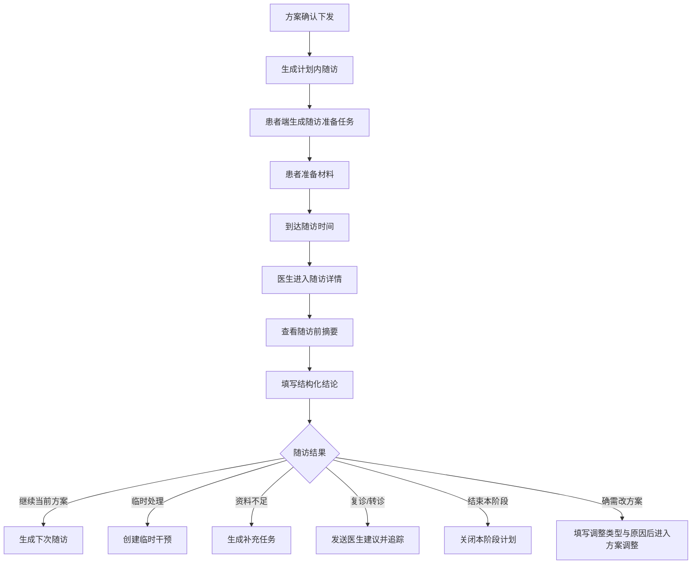

# 随访闭环PRD

版本：V0.1  
适用范围：医生 PC 管理端 + 患者微信小程序  
文档定位：承接随访从生成、患者准备、医生处理、结论沉淀到继续执行、临时干预或必要时正式调方案的闭环

## 1. 业务定位

随访管理用于检查管理方案执行效果，支持由方案自动生成，也支持医生临时创建。随访不是普通聊天，需要结构化采集患者执行、指标、症状和医生结论。多数情况下，随访结论应先推动继续执行、补充观察或临时干预，而不是直接改长期方案。

它不是 IM，也不是复杂排班系统，而是：

- 阶段性复盘
- 关键异常追踪
- 资料补充入口
- 临时干预入口
- 必要时方案调整入口

## 2. P0 范围

### 2.1 P0 必须保留

- 管理方案自动生成计划内随访
- 预警后随访、方案复盘随访、医生临时随访
- 患者端生成随访准备任务
- 医生查看随访前摘要
- 医生填写结构化结论
- 结论回流方案、任务和建议

### 2.2 P0 不做

- 在线问诊
- 视频问诊
- 重 IM 聊天
- 复杂排班
- 多医生协同随访
- 问卷库后台
- 批量随访与大屏

## 3. 核心闭环

## 4. 随访与管理方案关系

- 方案创建时应设置随访规则
- 随访计划读取当前方案的目标、任务、预警规则和准备材料
- 随访结束可创建临时干预；确需修改长期策略时才调用方案编辑器生成新版本
- 每条计划内随访应记录来源方案 ID 与方案版本

## 5. 默认随访计划

初始化管理方案中的随访计划是方案的一部分，不要求医生从 0 单独创建。

### 5.1 默认随访规则

| 疾病/风险 | 首次随访时间 | 随访重点 | 患者准备材料 |
| --- | --- | --- | --- |
| 糖尿病低风险 | 4 周 | 血糖达标、记录完整度、用药执行 | 近 7 天血糖、用药打卡、饮食/运动备注 |
| 糖尿病中风险 | 1-2 周 | 异常时点、低/高血糖、依从性 | 近 7 天多时点血糖、低血糖症状、用药记录 |
| 糖尿病高风险 | 3-7 天 | 低血糖/持续高血糖风险 | 近 3-7 天血糖、症状、用药、饮食备注 |
| 慢阻肺低风险 | 4 周 | 症状稳定性、吸入药执行 | SpO2、呼吸频率、症状、吸入药打卡 |
| 慢阻肺中风险 | 1-2 周 | 低氧、症状加重、急性加重风险 | 近 7 天 SpO2、症状记录、吸入药执行 |
| 慢阻肺高风险 | 3-7 天 | 低氧和急性加重风险 | SpO2、症状、氧疗/吸入药执行、异常备注 |
| 睡眠呼吸障碍低风险 | 4-8 周 | 睡眠规律、报告完成度 | 睡眠报告、睡眠时长、白天嗜睡 |
| 睡眠呼吸障碍中风险 | 2-4 周 | AHI/ODI、夜间低氧、症状 | 睡眠报告、最低血氧、T90、晨起头痛/嗜睡 |
| 睡眠呼吸障碍高风险 | 1-2 周 | 夜间低氧、CPAP 依从性 | 睡眠报告、CPAP 使用、漏气、残余 AHI |
| 高血压低风险 | 4 周 | 血压达标、生活方式 | 近 7 天晨起/睡前血压、用药、备注 |
| 高血压中风险 | 1-2 周 | 晨峰、持续偏高、用药执行 | 近 7 天血压、心率、症状、用药 |
| 高血压高风险 | 3-7 天 | 极高血压、症状、复诊风险 | 近 3-7 天血压、症状、用药、复测记录 |

危急/急性风险默认生成 24-72 小时追踪随访，而不是普通计划内随访。

## 6. 随访类型

- 首次随访
- 计划内随访
- 预警后随访
- 方案复盘随访
- 医生临时随访
- 转诊后随访

其中 P0 最关键的是：

- 计划内随访
- 预警后随访
- 方案复盘随访

## 7. 随访状态

### 7.1 状态

- `pending_patient_prepare`
- `pending_doctor`
- `overdue`
- `completed`
- `rescheduled`
- `cancelled`

### 7.2 定义

| 状态 | 说明 |
| --- | --- |
| `pending_patient_prepare` | 已创建，等待患者完成准备材料 |
| `pending_doctor` | 到达时间或材料完成，等待医生处理 |
| `overdue` | 超过计划时间未处理 |
| `completed` | 医生已保存随访结论 |
| `rescheduled` | 原计划时间已调整 |
| `cancelled` | 医生取消，需记录原因 |

## 8. 医生端页面结构

### 8.1 列表页

列表页建议优先展示：

- 今日待随访
- 逾期随访
- 预警后随访
- 待患者准备

### 8.2 列表筛选

| 筛选 | 选项 |
| --- | --- |
| 时间 | 今日、本周、逾期、自定义 |
| 状态 | 待患者准备、待医生处理、已完成、已取消、已逾期 |
| 来源 | 管理方案、预警、医生手动、患者咨询、转诊 |
| 疾病 | 糖尿病、慢阻肺、睡眠呼吸障碍、高血压、多病共管 |

### 8.3 列表字段

| 字段 | 说明 |
| --- | --- |
| 患者 | 姓名、年龄、绑定关系 |
| 疾病/风险 | 医生确认疾病、风险标签、当前健康风险分 |
| 随访信息 | 类型、来源、计划时间、是否逾期 |
| 准备完成度 | 记录、报告、症状、用药是否完成 |
| 关键摘要 | 最近异常、预警、方案执行率 |
| 操作 | 开始随访、改期、取消、查看 360 |

## 9. 创建随访

### 9.1 入口

- 患者 360 顶部
- 预警详情
- 管理方案审核页
- 随访列表新建入口

### 9.2 字段

| 字段 | 类型 | 必填 | 说明 |
| --- | --- | --- | --- |
| 患者 | selector | 是 | 从列表或当前患者带入 |
| 随访类型 | select | 是 | 首次、计划内、预警后、方案复盘、临时、转诊后 |
| 来源 | auto/select | 是 | 管理方案/预警/医生手动/患者咨询 |
| 关联方案 | selector | 可选 | 默认关联当前执行中方案 |
| 关联预警 | selector | 可选 | 预警后随访必填 |
| 计划时间 | datetime | 是 | 支持快捷时间 |
| 随访方式 | select | 是 | 小程序问卷、电话、线下、医生端记录 |
| 准备材料 | checklist | 是 | 指标、报告、症状、用药记录、备注 |
| 患者端说明 | textarea | 是 | 告知患者需准备什么 |
| 负责人 | selector | 是 | 医生/家庭医生/健康管理师 |
| 是否提醒患者 | switch | 是 | 默认开启 |

## 10. 随访详情

### 10.1 页面结构

- 顶部患者条
- 左侧：随访前摘要
- 中间：医生结构化记录
- 右侧：下一步动作

### 10.2 随访前摘要内容

- 本次随访目的
- 准备材料完成度
- 近 7/14/30 天关键指标
- 症状变化
- 用药/治疗执行
- 设备/睡眠报告
- 近期预警

### 10.3 结构化记录字段

| 模块 | 字段 |
| --- | --- |
| 随访目的 | 计划内、预警后、方案复盘、临时 |
| 准备情况 | 完成、部分完成、未完成 |
| 指标判断 | 改善、稳定、恶化、资料不足 |
| 症状判断 | 无明显变化、改善、加重 |
| 用药/治疗执行 | 良好、一般、差、无法判断 |
| 设备数据 | 正常同步、部分缺失、未同步 |
| 医生结论 | 继续方案、调整方案、资料不足、复诊/转诊、结束本阶段 |
| 患者端建议 | 患者可见 |
| 医生内部备注 | 患者不可见 |
| 下次随访时间 | 可选 |

## 11. 随访结束后的结果

医生完成随访后必须明确一个结果：

- 继续当前方案
- 临时干预
- 资料不足，补充数据
- 建议复诊/转诊
- 结束本阶段
- 调整方案

### 11.1 后续动作

| 结论 | 后续动作 |
| --- | --- |
| 继续当前方案 | 自动生成下一次计划内随访 |
| 指标改善，短期补充观察 | 创建临时任务或临时随访 |
| 指标未改善，需短期加强跟进 | 创建临时任务或临时随访 |
| 出现高风险，需要复诊/转诊 | 生成医生建议、转诊提示和追踪随访 |
| 资料不足，需补充数据 | 生成补充记录/报告任务 |
| 结束本阶段 | 关闭本阶段随访计划 |
| 当前长期方案需要修改 | 填写调整类型与原因后进入方案调整 |

## 12. 患者端同步

患者端需要承接：

- 随访日期
- 准备材料
- 倒计时
- 随访结论
- 下一步任务

患者端不展示：

- 医生内部备注
- 未确认草稿
- 驳回原因

## 13. 与方案、任务、建议的关系

- 随访准备会生成任务
- 随访结论可驱动临时干预；只有长期策略变化时才驱动方案调整
- 随访后可发送医生建议
- 随访是阶段复盘的核心节点

一句话总结：

**随访不是附属提醒，它是方案闭环里“复盘和再决策”的关键桥。**
