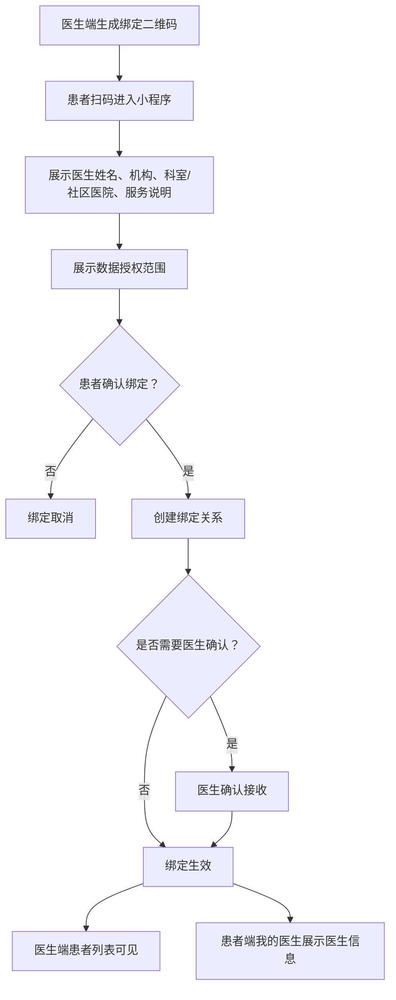
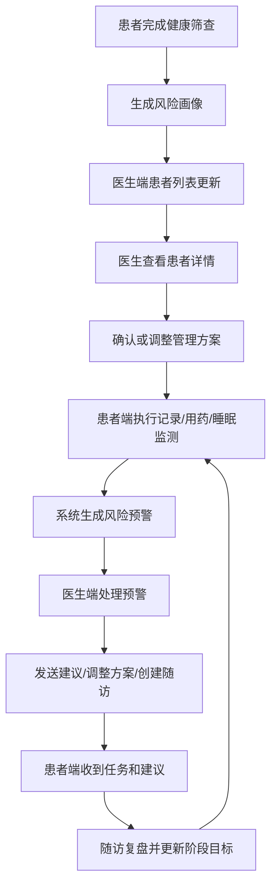

# 医生 PC 端 PRD

版本：V0.1  
适用端：医生 PC 管理端  
关联患者端：微信小程序  
关联疾病：糖尿病、慢阻肺、睡眠呼吸障碍  
关联模块：健康筛查、指标记录、设备数据、风险预警、管理方案、随访计划

## 1. 产品定位

医生 PC 端用于承接患者端产生的筛查、记录、设备和预警数据，帮助医生以较低时间成本完成患者分层、风险识别、数据解读、管理方案维护和随访闭环。

医生 PC 端不是诊断系统，也不是处方系统。系统可以提供风险提示、趋势汇总和管理建议模板，但疾病诊断、用药调整、治疗决策必须由医生确认并留痕。

医生 PC 端同时是未来数字孪生辅助诊疗能力的主要承载端。本期需要先建设轻量数字画像、趋势偏离解释、规则证据链和医生反馈闭环，为后续疾病状态预测、耐药机制识别、远程诊断辅助和治疗方案准确率优化积累可用数据。

### 1.1 核心目标

- 让医生快速识别“今天最需要处理的人”。
- 让医生在 1-2 分钟内看懂单个患者近期风险和关键数据。
- 将患者端血糖、血氧、睡眠、症状、用药、设备数据整合为可解释的管理视图。
- 支持医生处理预警、发送建议、调整管理方案、创建随访计划。
- 形成轻量数字画像，让医生看到患者个体基线、趋势偏离、主要风险证据和干预效果。
- 为后续医生端与患者端消息、处方、复诊、设备报告解读和数字孪生辅助诊疗预留扩展。

### 1.2 MVP 边界

本期做：

- 医生登录与患者权限控制。
- 工作台、患者列表、患者详情。
- 健康筛查结果查看。
- 指标趋势和记录明细查看。
- 设备绑定和设备数据状态查看。
- 风险预警处理。
- 管理方案创建/编辑/下发。
- 随访计划创建、随访记录和随访结论。
- 医生建议发送与留痕。
- 轻量数字画像：展示基础画像、疾病画像、近期趋势偏离、主要风险证据和干预状态。
- 规则/模型输出留痕：记录规则版本、证据数据、医生采纳/修改/驳回结果。

本期暂不做：

- 在线问诊音视频。
- 医保、支付、药品交易。
- 电子处方完整闭环。
- AI 自动诊断或自动调整治疗。
- 完整数字孪生预测模型和耐药机制识别模型。
- 医生直接修改设备原始数据。
- 多机构复杂运营后台。

## 2. 用户角色

| 角色 | 权限范围 | 核心任务 |
| --- | --- | --- |
| 普通医生 | 查看分配给自己的患者 | 处理预警、查看数据、调整方案、随访 |
| 家庭医生 | 查看通过扫码绑定或社区分配给自己的患者 | 覆盖社区医院慢病管理，长期随访、一般预警处理、转诊建议 |
| 慢病管理医生/护士 | 查看管理组内患者 | 批量筛查缺失数据、提醒记录、准备随访 |
| 科室负责人 | 查看科室患者和医生处理情况 | 监督预警处理及时率、随访完成率 |
| 系统管理员 | 账号、角色、规则和模板配置 | 不参与患者医疗处理 |

MVP 至少支持“普通医生/家庭医生”两类医生角色。家庭医生面向社区医院和基层慢病管理场景，通常通过扫码与患者建立绑定关系，重点处理日常随访、记录缺失、一般预警和转诊建议；专科医生可处理高风险预警、复杂方案调整和报告解读。数据权限按医生与患者绑定关系控制。

## 3. 医患扫码绑定

### 3.1 业务目标

扫码绑定用于建立医生与患者的服务关系。绑定后，医生端患者列表出现该患者，医生可查看授权范围内的筛查、记录、设备、预警、方案和随访数据。

### 3.2 绑定入口

| 端 | 入口 | 说明 |
| --- | --- | --- |
| 医生 PC 端 | 患者管理 - 生成绑定二维码 | 医生线下向患者展示二维码 |
| 医生 PC 端 | 工作台 - 快速绑定患者 | 社区义诊、随访现场快速绑定 |
| 患者小程序 | 我的医生 - 扫码绑定 | 患者主动扫码绑定 |
| 患者小程序 | 首页/健康档案绑定提示 | 未绑定医生时引导绑定 |

### 3.3 绑定流程



### 3.4 绑定规则

- 二维码有效期建议为 10 分钟，过期后不可绑定。
- 二维码需绑定医生 ID、机构 ID、生成时间、有效期和可选服务类型。
- 患者扫码后必须主动确认授权，不允许静默绑定。
- 患者确认前需展示医生姓名、机构、科室/社区医院、角色、服务说明和数据授权范围。
- MVP 可默认患者确认后自动绑定；后续可配置“医生二次确认”。
- 绑定成功后，医生端患者列表、工作台统计、预警列表同步出现该患者相关数据。
- 患者可申请解绑；医生可解除绑定；解绑后医生不可查看患者新增数据。
- 历史预警处理、医生建议、方案调整、随访结论和审计日志保留。

### 3.5 绑定状态

| 状态 | 说明 |
| --- | --- |
| pending_patient | 已生成二维码，等待患者扫码确认 |
| pending_doctor | 患者已确认，等待医生接收 |
| active | 绑定生效 |
| rejected | 医生拒绝或患者取消 |
| expired | 二维码过期 |
| revoked | 已解绑 |

## 4. 业务闭环



## 5. 信息架构

医生 PC 端采用左侧主导航 + 顶部全局搜索 + 右侧内容区。

| 一级菜单 | 页面 | 说明 |
| --- | --- | --- |
| 工作台 | 今日概览 | 今日预警、随访、缺失记录、待确认方案 |
| 患者管理 | 患者列表、患者详情 | 医生端核心入口 |
| 风险预警 | 预警列表、预警详情 | 支持集中处理高风险事件 |
| 数字画像 | 个体基线、趋势偏离、风险解释、干预效果 | MVP 做轻量视图，后续升级为数字孪生 |
| 管理方案 | 方案模板、患者方案 | 创建和维护阶段管理方案 |
| 随访管理 | 随访日历、随访列表、随访详情 | 创建计划、记录结论 |
| 设备数据 | 设备绑定状态、报告状态 | 查看设备关联和数据同步状态 |
| 消息建议 | 医生建议记录 | 查看已发送建议和患者阅读状态 |
| 系统设置 | 个人信息、模板设置 | MVP 可弱化 |

## 6. 工作台

### 6.1 页面目标

医生打开 PC 端后，第一眼看到需要优先处理的患者和任务，而不是普通数据报表。

### 6.2 页面布局

```text
顶部：搜索患者姓名/手机号/患者ID

今日概览卡片
待处理预警    高风险患者    今日随访    连续缺失记录    待确认方案

左侧主列表：待处理预警
右侧辅助区：今日随访 / 数据缺失 / 新筛查患者

底部：最近处理记录
```

### 6.3 工作台指标

| 指标 | 说明 | 点击去向 |
| --- | --- | --- |
| 待处理预警 | 状态为待医生处理的预警数 | 预警列表 |
| 高风险患者 | 当前风险等级为高或存在高危预警 | 患者列表 |
| 今日随访 | 今日计划随访患者数 | 随访列表 |
| 连续缺失记录 | 连续 2 天及以上未完成关键记录 | 患者列表 |
| 待确认方案 | 系统生成但未被医生确认的方案 | 方案列表 |

### 6.4 优先级规则

工作台任务按以下优先级排序：

1. 高风险预警未处理。
2. 中风险预警超 24 小时未处理。
3. 今日随访即将开始。
4. 患者连续缺失关键数据。
5. 新完成筛查但尚未生成医生方案。

## 7. 患者列表

### 7.1 页面目标

患者列表用于快速筛选管理对象，并让医生无需进入详情也能判断患者当前状态。

### 7.2 筛选条件

| 筛选项 | 选项 |
| --- | --- |
| 风险等级 | 全部、低、中、高 |
| 疾病标签 | 糖尿病、慢阻肺、睡眠呼吸障碍、多病共管 |
| 管理阶段 | 新建档、已筛查、待确认方案、管理中、待随访 |
| 预警状态 | 有待处理预警、无待处理预警 |
| 数据状态 | 今日已记录、今日未记录、连续缺失、设备未绑定 |
| 随访状态 | 今日随访、本周随访、逾期未随访 |
| 医生归属 | 我的患者、科室患者 |

### 7.3 列表字段

| 字段 | 说明 |
| --- | --- |
| 患者信息 | 姓名、性别、年龄、手机号脱敏 |
| 疾病标签 | 糖尿病、慢阻肺、睡眠呼吸障碍风险 |
| 风险等级 | 低/中/高，展示最高风险来源 |
| 今日状态 | 已记录、未记录、异常、待复测 |
| 最新关键指标 | 血糖、血压、SpO2、睡眠报告摘要 |
| 最新预警 | 预警名称、等级、发生时间 |
| 设备状态 | 已绑定血氧仪/睡眠设备、未绑定、同步异常 |
| 方案状态 | 未生成、待确认、执行中、需调整 |
| 下次随访 | 日期、是否逾期 |

### 7.4 行操作

- 查看详情。
- 处理预警。
- 创建随访。
- 发送建议。
- 标记重点关注。

## 8. 患者详情

患者详情是医生端核心页面。建议采用“顶部患者概览 + 左侧患者导航 + 右侧内容面板”的结构，避免信息全部堆在一个长页面。

### 8.1 顶部患者概览

展示：

- 姓名、性别、年龄、手机号脱敏。
- 疾病标签和风险等级。
- 管理阶段：已筛查、待确认方案、管理中、待随访。
- 最近一次记录时间。
- 当前待处理预警数。
- 绑定设备状态。
- 快捷操作：发送建议、调整方案、创建随访。

### 8.2 详情页 Tab

| Tab | 说明 |
| --- | --- |
| 总览 | 风险摘要、今日记录、近期异常、方案执行 |
| 健康筛查 | 筛查结果、原始问卷、异常项 |
| 指标趋势 | 血糖、血压、血氧、睡眠、症状、用药趋势 |
| 记录明细 | 患者所有指标记录和来源 |
| 睡眠报告 | 睡眠报告列表和单次报告分析 |
| 设备管理 | 绑定设备、同步状态、设备号 |
| 预警记录 | 当前和历史预警 |
| 管理方案 | 当前方案、历史方案、任务配置 |
| 随访记录 | 计划、准备材料、结论 |
| 医生建议 | 已发送建议、患者阅读/执行状态 |

### 8.3 轻量数字画像

轻量数字画像是本期为未来数字孪生预留的医生端核心视图，不做黑盒诊断，只做可解释的状态聚合和趋势偏离提示。

页面内容：

| 模块 | 展示内容 | 设计目的 |
| --- | --- | --- |
| 个体基线 | 近 30 天血糖、血压、SpO2、睡眠、症状、用药依从性基线 | 为后续个体化预测建立参照 |
| 疾病画像 | 糖尿病、慢阻肺、睡眠呼吸障碍风险/诊断标签 | 支持多病共管 |
| 趋势偏离 | 相比个体基线的异常变化，如空腹血糖连续偏高、夜间低氧增加 | 不只看单次阈值，而看趋势变化 |
| 风险解释 | 当前主要风险、证据数据、数据来源、规则版本 | 让医生知道系统为什么提示风险 |
| 干预状态 | 最近医生建议、患者执行情况、复测结果、随访结论 | 为干预效果评估留数据 |

交互要求：

- 点击风险解释可查看触发规则、证据记录和规则版本。
- 医生可对系统建议执行“采纳、修改后采纳、驳回”，必须填写处理意见或驳回原因。
- 患者端只展示医生确认后的建议；未确认的系统建议不直接下发给患者。
- 每次处理结果都进入后续模型评估样本，用于计算医生采纳率、误报率、漏报率和干预效果。

## 9. 健康筛查查看

### 9.1 页面目标

医生查看患者初始风险来源，判断是否需要完善资料、线下就医、生成管理方案或纳入重点管理。

### 9.2 展示内容

| 模块 | 内容 |
| --- | --- |
| 筛查摘要 | 总体风险等级、三类疾病分项风险、完成时间 |
| 风险来源 | 高风险项、中风险项、缺失项 |
| 分项评分 | 基础信息、病史、指标、症状、生活方式 |
| 原始问卷 | 按问卷分组展示患者答案 |
| 推荐动作 | 生成方案、建议完善指标、建议绑定设备、建议线下就医 |

### 9.3 医生操作

- 标记已读。
- 发送建议。
- 生成管理方案。
- 标记需要随访。
- 要求患者补充缺失资料。

医生端不编辑患者原始问卷；如发现错误，可要求患者端重新填写或由医生添加备注。

## 10. 指标趋势

### 10.1 页面目标

医生需要快速判断患者近期控制情况，而不是逐条翻记录。

### 10.2 总体布局

```text
时间范围：近7天 / 近30天 / 自定义

指标组：
血糖 | 血压 | 血氧呼吸 | 睡眠 | 症状 | 用药

上方：关键结论摘要
中间：趋势图
下方：异常点和关联记录
```

### 10.3 血糖趋势

展示：

- 最新血糖和测量时点。
- 空腹、餐后 2h、睡前、随机分时点趋势。
- 达标率、偏高次数、偏低次数。
- 低血糖事件列表。
- 关联症状：心慌、出汗、手抖、头晕、乏力等。
- 关联用药和饮食备注。

交互：

- 可按测量时点筛选趋势。
- 点击异常点查看该次记录详情。
- 支持查看患者端备注和关联症状。

### 10.4 血压趋势

展示：

- 收缩压/舒张压双线趋势。
- 最新血压。
- 偏高次数。
- 晨起/睡前等场景标签。
- 与头痛、头晕等症状关联。

### 10.5 血氧呼吸趋势

展示：

- SpO2 趋势。
- 脉率趋势。
- 呼吸频率趋势，如患者有记录。
- 低氧事件次数。
- 活动后、静息、睡前等场景。
- 关联症状：气短、胸闷、咳嗽、喘息、乏力、紫绀等。

说明：

- 白天 SpO2 和脉率属于血氧呼吸趋势。
- 夜间最低血氧、ODI、AHI、低氧累计时长应进入睡眠报告分析，不混在普通血氧趋势中。

### 10.6 睡眠趋势

展示：

- 睡眠报告日期列表。
- 睡眠时长趋势。
- AHI、ODI、最低血氧、低氧累计时长趋势。
- CPAP 佩戴时长，如患者有治疗记录。
- 报告有效性：有效、无效、设备不支持、生成中。

### 10.7 症状趋势

展示：

- 症状类型分布。
- 严重程度变化。
- 症状与指标异常关联。
- “今日无不适”记录，用于区分真实无症状和漏记。

### 10.8 用药趋势

展示：

- 用药计划执行率。
- 漏服次数。
- 待服/已服状态。
- 吸入药、氧疗、CPAP 执行情况。
- 患者备注和不良反应反馈。

## 11. 记录明细

### 11.1 页面目标

承接患者端所有指标记录，医生端可做更强筛选，但默认视图必须简洁。

### 11.2 字段

| 字段 | 说明 |
| --- | --- |
| 记录时间 | 精确到分钟 |
| 指标名称 | 血糖、血压、SpO2、症状、用药等 |
| 指标值 | 数值或文本 |
| 单位 | mmol/L、%、mmHg、次/分 |
| 状态 | 正常、偏高、偏低、异常、无效 |
| 记录场景 | 血糖时点、血氧场景、症状场景 |
| 数据来源 | 手动记录、设备采集、医生录入 |
| 设备号 | 设备数据必显 |
| 关联症状 | 有则展示 |
| 备注 | 患者备注、医生备注 |
| 修改记录 | 是否修改、修改人、修改时间 |

### 11.3 操作

- 查看详情。
- 添加医生备注。
- 标记设备记录无效。
- 对手动记录发起复核建议。
- 导出随访摘要，后续版本支持。

医生端不直接删除患者记录；删除应由患者端或管理员按审计规则处理。

## 12. 设备管理与设备数据

### 12.1 页面目标

医生需要知道患者是否已经具备持续监测条件，以及设备数据是否可信。

### 12.2 展示内容

| 模块 | 内容 |
| --- | --- |
| 已绑定设备 | 设备名称、型号、设备号、绑定时间 |
| 设备状态 | 正常、未同步、同步异常、已解绑 |
| 最近同步 | 最近同步时间、最近数据类型 |
| 数据能力 | 支持 SpO2、脉率、AHI、ODI、体位、睡眠分期、鼾声等 |
| 报告状态 | 睡眠报告生成中、有效、无效、设备不支持 |

### 12.3 设备能力提示

- ZG-M11A 支持体位时，睡眠报告展示体位分析。
- ZG-M11B 或未返回体位数据时，医生端展示“当前设备/本次报告暂不支持体位分析”。
- 未绑定设备但患者存在睡眠风险时，医生可发送“建议绑定睡眠监测设备”。

## 13. 风险预警

### 13.1 预警列表

筛选：

- 风险等级：高、中、低。
- 疾病类型：糖尿病、慢阻肺、睡眠呼吸障碍。
- 状态：待医生处理、待患者复测、已处理、已关闭。
- 时间范围。
- 患者归属。

列表字段：

- 患者信息。
- 预警名称。
- 风险等级。
- 触发时间。
- 触发依据。
- 患者是否已复测。
- 医生处理状态。

### 13.2 预警详情

展示：

- 预警结论：例如“连续 3 天空腹血糖高于目标”。
- 触发规则：阈值、连续天数、关联指标。
- 原始记录：具体血糖/血氧/睡眠/症状数据。
- 关联趋势：近 7 天或近 30 天图表。
- 患者备注与症状。
- 历史相似预警。

### 13.3 医生处理动作

| 动作 | 患者端可见 | 说明 |
| --- | --- | --- |
| 建议复测 | 是 | 生成患者端待办 |
| 发送医生建议 | 是 | 可使用模板后编辑 |
| 调整记录频率 | 是 | 更新管理方案任务 |
| 创建随访 | 是 | 患者端展示随访计划 |
| 建议线下就医 | 是 | 高风险时常用 |
| 继续观察 | 是 | 需填写观察原因 |
| 关闭预警 | 可选 | 需填写关闭原因 |
| 内部备注 | 否 | 仅医生端可见 |

高风险预警必须填写处理意见，不允许无理由关闭。

## 14. 管理方案

### 14.1 页面目标

管理方案是医生端向患者端下发任务、目标、建议和随访安排的核心载体。

### 14.2 方案组成

| 模块 | 内容 |
| --- | --- |
| 阶段目标 | 例如“连续 7 天完成空腹血糖记录” |
| 指标目标 | 血糖目标、血压目标、SpO2 关注阈值 |
| 记录任务 | 血糖、血压、血氧、症状、睡眠、用药 |
| 用药建议 | 药品、剂量、频次、服用时机，MVP 定位为建议/记录，不做处方 |
| 生活方式建议 | 饮食、运动、戒烟、睡眠、设备佩戴 |
| 预警规则 | 哪些情况触发复测/医生处理 |
| 随访安排 | 下次随访日期、准备材料 |

### 14.3 方案模板

MVP 内置模板：

- 糖尿病 7 天初始监测方案。
- 糖尿病血糖偏高强化记录方案。
- 慢阻肺血氧与症状观察方案。
- 睡眠低氧/OSA 风险观察方案。
- 多病共管基础方案。

### 14.4 方案状态

| 状态 | 说明 |
| --- | --- |
| 草稿 | 医生编辑中，患者不可见 |
| 待确认 | 系统生成或医生未确认 |
| 已下发 | 患者端可见并开始执行 |
| 执行中 | 患者正在执行 |
| 已完成 | 到达阶段周期或医生手动结束 |
| 已停用 | 不再执行，但保留历史 |

### 14.5 交互规则

- 医生修改方案后，患者端首页、方案页、今日待办同步更新。
- 修改指标目标后，新记录使用新目标；历史记录保留记录时目标，便于追溯。
- 用药建议修改需留痕，后续接入处方系统前避免使用“处方已调整”等强医疗表述。

## 15. 随访管理

### 15.1 随访列表

筛选：

- 今日随访。
- 本周随访。
- 逾期未随访。
- 已完成。
- 高风险优先。

字段：

- 患者姓名。
- 随访时间。
- 随访类型：首次、常规、预警后、方案复盘。
- 准备材料完成度。
- 近期异常摘要。
- 当前方案状态。

### 15.2 随访详情

页面结构：

```text
患者基础信息
本次随访目的
随访前摘要
  近7天关键指标
  预警处理记录
  用药/任务完成情况
  睡眠报告摘要
医生记录
  随访结论
  问题与建议
  是否调整方案
  下次随访时间
```

### 15.3 随访准备材料

患者端需要准备，医生端查看完成度：

- 近 7 天血糖记录。
- 近 7 天血压/血氧记录。
- 最近睡眠报告。
- 症状记录。
- 用药执行记录。
- 患者备注或问题。

### 15.4 随访结束动作

- 保存随访结论。
- 更新管理方案。
- 创建下次随访。
- 发送随访后建议。
- 关闭相关预警。

## 16. 医生建议

### 16.1 建议类型

| 类型 | 示例 |
| --- | --- |
| 复测建议 | “请今天晚餐后 2 小时复测血糖” |
| 记录建议 | “连续 3 天补充晨起血氧记录” |
| 设备建议 | “建议绑定睡眠监测设备完成 1 晚监测” |
| 生活方式建议 | “晚餐减少高糖主食，记录餐后血糖变化” |
| 就医建议 | “若胸闷气短加重，请及时线下就医” |
| 随访建议 | “请在本周五前完成随访准备材料” |

### 16.2 发送规则

- 可从患者详情、预警详情、随访详情发送。
- 支持模板选择后编辑。
- 支持设置患者端是否需要确认已读。
- 发送后记录医生、时间、内容、来源场景。

## 17. 数据模型补充

### 17.1 doctor_patient_relation

| 字段 | 类型 | 说明 |
| --- | --- | --- |
| `id` | string | 关系 ID |
| `doctor_id` | string | 医生 ID |
| `patient_id` | string | 患者 ID |
| `relation_status` | string | pending_patient/pending_doctor/active/rejected/expired/revoked |
| `bind_method` | string | qr_code/assignment/import |
| `qr_token_id` | string | 二维码 token ID |
| `organization_id` | string | 医生所属机构/社区医院 ID |
| `doctor_role` | string | specialist/family_doctor/nurse |
| `authorization_scope` | object | 患者授权的数据范围 |
| `assigned_at` | datetime | 分配时间 |
| `assigned_by` | string | 分配人 |
| `confirmed_at` | datetime | 绑定生效时间 |
| `revoked_at` | datetime | 解绑时间 |
| `revoked_by` | string | 解绑发起方 |

### 17.2 doctor_advice

| 字段 | 类型 | 说明 |
| --- | --- | --- |
| `id` | string | 建议 ID |
| `doctor_id` | string | 医生 ID |
| `patient_id` | string | 患者 ID |
| `source_type` | string | alert/followup/plan/manual |
| `source_id` | string | 来源记录 ID |
| `advice_type` | string | 复测/记录/设备/就医/随访 |
| `content` | text | 建议内容 |
| `visible_to_patient` | boolean | 是否患者可见 |
| `read_at` | datetime | 患者阅读时间 |
| `confirmed_at` | datetime | 患者确认时间 |
| `created_at` | datetime | 创建时间 |

### 17.3 management_plan

| 字段 | 类型 | 说明 |
| --- | --- | --- |
| `id` | string | 方案 ID |
| `patient_id` | string | 患者 ID |
| `doctor_id` | string | 医生 ID |
| `template_id` | string | 模板 ID |
| `stage_name` | string | 阶段名称 |
| `status` | string | draft/pending/active/completed/stopped |
| `targets` | object | 指标目标 |
| `tasks` | array | 记录、用药、睡眠、症状任务 |
| `medication_advice` | array | 用药建议 |
| `lifestyle_advice` | array | 生活方式建议 |
| `followup_at` | datetime | 下次随访时间 |
| `published_at` | datetime | 下发时间 |
| `created_at` | datetime | 创建时间 |
| `updated_at` | datetime | 更新时间 |

### 17.4 risk_alert

| 字段 | 类型 | 说明 |
| --- | --- | --- |
| `id` | string | 预警 ID |
| `patient_id` | string | 患者 ID |
| `alert_type` | string | glucose/oxygen/sleep/symptom/medication |
| `level` | string | low/medium/high |
| `title` | string | 预警标题 |
| `reason` | text | 触发原因 |
| `evidence` | object | 触发数据 |
| `rule_code` | string | 触发规则编码 |
| `rule_version` | string | 触发规则版本 |
| `status` | string | pending_patient/pending_doctor/resolved/closed |
| `handled_by` | string | 处理医生 |
| `handled_at` | datetime | 处理时间 |
| `handle_result` | text | 处理结论 |
| `doctor_feedback` | string | accept/modify/reject |
| `feedback_reason` | text | 修改或驳回原因 |
| `created_at` | datetime | 创建时间 |

### 17.5 followup_plan

| 字段 | 类型 | 说明 |
| --- | --- | --- |
| `id` | string | 随访 ID |
| `patient_id` | string | 患者 ID |
| `doctor_id` | string | 医生 ID |
| `followup_type` | string | 首次/常规/预警后/方案复盘 |
| `scheduled_at` | datetime | 计划时间 |
| `status` | string | pending/completed/overdue/canceled |
| `prep_requirements` | array | 准备材料 |
| `summary` | text | 随访摘要 |
| `conclusion` | text | 医生结论 |
| `next_followup_at` | datetime | 下次随访 |

### 17.6 digital_twin_profile

MVP 阶段命名为轻量数字画像，用于沉淀未来数字孪生所需的聚合状态。

| 字段 | 类型 | 说明 |
| --- | --- | --- |
| `id` | string | 数字画像 ID |
| `patient_id` | string | 患者 ID |
| `baseline_summary` | object | 个体基线摘要 |
| `disease_profile` | object | 疾病画像 |
| `physiology_state` | object | 生理状态 |
| `behavior_state` | object | 行为状态 |
| `risk_state` | object | 风险状态 |
| `intervention_state` | object | 干预状态 |
| `updated_at` | datetime | 最近更新时间 |

### 17.7 rule_execution_log

用于记录规则或模型输出，支撑未来预警准确率、医生采纳率和模型优化。

| 字段 | 类型 | 说明 |
| --- | --- | --- |
| `id` | string | 执行记录 ID |
| `patient_id` | string | 患者 ID |
| `rule_code` | string | 规则编码 |
| `rule_version` | string | 规则版本 |
| `input_snapshot` | object | 输入数据快照 |
| `output_result` | object | 输出结果 |
| `evidence_record_ids` | array | 证据记录 ID |
| `doctor_feedback` | string | accept/modify/reject |
| `created_at` | datetime | 创建时间 |

## 18. 接口草案

| 接口 | 方法 | 说明 |
| --- | --- | --- |
| `/api/doctor/dashboard` | GET | 医生工作台 |
| `/api/doctor/patients` | GET | 患者列表 |
| `/api/doctor/bind-qrcodes` | POST | 生成医患绑定二维码 |
| `/api/doctor/bind-relations/{id}/confirm` | POST | 医生确认接收患者 |
| `/api/doctor/bind-relations/{id}/revoke` | POST | 医生解除绑定 |
| `/api/doctor/patients/{id}` | GET | 患者详情总览 |
| `/api/doctor/patients/{id}/screening` | GET | 筛查结果 |
| `/api/doctor/patients/{id}/metrics/trends` | GET | 指标趋势 |
| `/api/doctor/patients/{id}/records` | GET | 记录明细 |
| `/api/doctor/patients/{id}/digital-profile` | GET | 轻量数字画像 |
| `/api/doctor/patients/{id}/sleep-reports` | GET | 睡眠报告列表 |
| `/api/doctor/patients/{id}/devices` | GET | 设备状态 |
| `/api/doctor/alerts` | GET | 预警列表 |
| `/api/doctor/alerts/{id}` | GET | 预警详情 |
| `/api/doctor/alerts/{id}/handle` | POST | 处理预警 |
| `/api/doctor/rule-executions/{id}` | GET | 规则/模型输出证据 |
| `/api/doctor/plans` | GET/POST | 方案列表/创建 |
| `/api/doctor/plans/{id}` | GET/PUT | 方案详情/编辑 |
| `/api/doctor/plans/{id}/publish` | POST | 下发方案 |
| `/api/doctor/followups` | GET/POST | 随访列表/创建 |
| `/api/doctor/followups/{id}` | GET/PUT | 随访详情/更新 |
| `/api/doctor/advice` | POST | 发送医生建议 |

## 19. 权限与审计

- 医生/家庭医生仅能查看与自己扫码绑定、机构分配或患者授权的患者。
- 家庭医生默认可处理日常随访、记录缺失、一般预警和转诊建议；高风险预警和复杂治疗调整可按机构规则转交专科医生。
- 医患扫码绑定、医生确认、解绑、授权范围变更必须进入审计日志。
- 科室负责人可查看科室患者，但具体操作需记录身份。
- 医生所有预警处理、方案调整、随访结论、建议发送必须记录操作人、操作时间和内容。
- 患者敏感信息展示需脱敏，完整手机号/身份证等仅在有权限时展示。
- 设备原始数据不能被医生直接修改，只能标记无效、添加备注或要求患者复测。
- 医生内部备注与患者可见建议必须区分。

## 20. 非功能要求

| 类型 | 要求 |
| --- | --- |
| 性能 | 患者列表 3 秒内加载，患者详情 3 秒内展示核心摘要 |
| 可用性 | 高风险预警入口必须首屏可见 |
| 可追溯 | 所有医疗相关操作有审计日志 |
| 可扩展 | 指标、疾病标签、预警规则、方案模板配置化 |
| 安全 | 医生端需要登录态、权限校验、操作防越权 |

## 21. 验收标准

- 医生可以登录并看到自己的患者列表。
- 家庭医生可以生成绑定二维码，患者扫码确认后建立绑定关系。
- 绑定成功后，家庭医生/医生端患者列表可看到该患者，患者端“我的医生”展示医生信息。
- 患者或医生解除绑定后，医生不可继续查看患者新增健康数据。
- 医生可以按风险、疾病、预警、数据缺失、随访状态筛选患者。
- 医生可以进入患者详情查看筛查、指标趋势、记录明细、睡眠报告、设备状态。
- 患者端新增血糖/血氧/症状/用药记录后，医生端记录明细和趋势可更新。
- 患者触发高血糖、低血氧、睡眠低氧等预警后，医生端预警列表出现待处理记录。
- 医生可以处理预警并发送建议，患者端可看到患者可见建议。
- 医生可以创建或编辑管理方案并下发，患者端今日待办和方案页同步。
- 医生可以创建随访计划、记录随访结论并设置下次随访。
- 所有医生操作均有操作日志。

## 22. 待确认问题

- 医生端是否需要支持多机构、多科室和医生组权限。
- 管理方案中的用药建议是否需要与处方系统区分展示。
- 医生建议是否需要患者确认已读，还是仅展示阅读状态。
- 预警处理是否需要 SLA 统计和超时提醒。
- 是否需要为医生端增加“批量发送记录提醒”能力。
- 患者端与医生端是否需要实时消息，还是 MVP 先使用站内通知。
