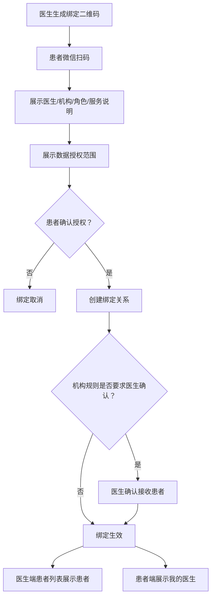

# 医生 PC 端 PRD

版本：V1.0 目标态
适用端：医生 PC 管理端
关联患者端：微信小程序
关联疾病：糖尿病、慢阻肺、睡眠呼吸障碍
产品定位：慢病数字孪生辅助诊疗医生工作台

## 1. 产品定位

医生 PC 端是慢病数字孪生智能管理平台的临床工作台，承接患者端微信小程序、居家设备、健康筛查、院内检查、用药、症状、随访和医生处置数据，为医生提供患者分层管理、风险预测、辅助诊断、治疗反应评估、随访干预和效果追踪能力。

医生端不只是“看数据”的后台，而是面向慢病连续管理的辅助诊疗系统。系统通过多源数据融合形成患者个体化疾病画像和数字孪生状态，帮助医生提升疾病状态预测准确率、治疗反应/耐药风险识别灵敏度、远程诊断与治疗方案准确率，并降低患者并发症发生率。

医学安全边界：

- 系统提供风险提示、证据解释、辅助诊疗建议和方案推荐。
- 系统不自动确诊、不自动开方、不替代医生做最终医疗决策。
- 所有诊断结论、治疗建议、用药调整、转诊建议必须由医生确认后生效。
- 所有模型输出必须可解释、可追溯、可被医生采纳、修改或驳回。

## 2. 产品目标

| 目标 | 说明 |
| --- | --- |
| 提升疾病状态预测准确率 | 融合连续指标、症状、用药、设备报告和院内检查，识别个体趋势偏离 |
| 提升治疗反应/耐药风险识别灵敏度 | 区分依从性不足、记录缺失、生活方式影响、药物反应不足和疑似治疗不敏感 |
| 提升远程诊断与治疗方案准确率 | 为医生提供结构化证据、相似历史、风险解释和可编辑方案建议 |
| 降低并发症率 | 通过早期预警、及时复测、随访、转诊和方案调整减少长期风险 |
| 提升医生管理效率 | 让医生优先处理高风险、高价值、需干预患者 |
| 建立模型反馈闭环 | 记录医生采纳、修改、驳回和干预效果，持续优化规则和模型 |

## 3. 用户角色

| 角色 | 使用范围 | 核心任务 |
| --- | --- | --- |
| 专科医生 | 内分泌科、呼吸科、睡眠医学科 | 复杂风险处理、诊断辅助、治疗方案确认、报告解读 |
| 家庭医生 | 社区医院、基层医疗、家庭医生签约服务 | 扫码绑定患者、长期随访、一般预警处理、转诊建议 |
| 慢病管理医生/护士 | 慢病中心、互联网医院、健康管理团队 | 批量患者管理、任务提醒、随访记录、依从性干预 |
| 科室负责人 | 科室或慢病项目管理 | 查看质控、预警处理效率、随访完成率、服务效果 |
| 医院/项目管理员 | 医院、区域平台、项目运营方 | 管理机构、账号、角色、规则、模板、内容和审计 |

权限原则：

- 医生只能查看通过扫码绑定、机构分配、服务团队授权或患者授权的患者。
- 家庭医生默认处理日常随访、记录缺失、一般预警和转诊建议。
- 专科医生处理高风险预警、复杂治疗方案、疑似急性加重、疑似治疗不敏感和诊断辅助。
- 护士/健康管理师可执行提醒、随访记录和患者教育，但不能确认诊断或治疗调整。
- 科室负责人和管理员以质控和运营为主，不能绕过患者授权查看不相关患者隐私。

## 4. 核心业务闭环


## 5. 医患扫码绑定

### 5.1 绑定目标

扫码绑定用于建立医生与患者的服务关系。绑定生效后，医生端可查看患者授权范围内的数据，患者端可看到绑定医生、医生建议、随访计划和方案任务。

### 5.2 绑定入口

| 发起方 | 入口 | 场景 |
| --- | --- | --- |
| 医生 PC 端 | 患者管理 - 生成绑定二维码 | 门诊、社区随访、义诊、家庭医生签约 |
| 医生 PC 端 | 工作台 - 快速绑定患者 | 医生现场快速建立服务关系 |
| 患者小程序 | 我的医生 - 扫码绑定 | 患者主动绑定医生 |
| 患者小程序 | 首页/健康档案绑定提示 | 未绑定医生且有高风险或随访需求 |
| 管理后台 | 批量分配患者 | 医院/项目已有患者导入 |

### 5.3 绑定流程



### 5.4 绑定规则

- 二维码有效期建议 10 分钟，过期后不可使用。
- 二维码必须绑定医生 ID、机构 ID、医生角色、生成时间、有效期和服务类型。
- 患者扫码后必须看到医生姓名、机构、科室/社区医院、角色、服务说明和授权范围。
- 患者确认授权后才可建立绑定关系，不允许静默绑定。
- 机构可配置“患者确认即生效”或“医生二次确认后生效”。
- 患者和医生均可申请解绑，解绑后医生不能查看患者新增数据。
- 历史处理记录、方案、随访、建议和审计日志必须保留。
- 授权范围变更、解绑、重新绑定必须记录操作日志。

### 5.5 绑定状态

| 状态 | 说明 |
| --- | --- |
| pending_patient | 已生成二维码，等待患者扫码确认 |
| pending_doctor | 患者已确认，等待医生接收 |
| active | 绑定生效 |
| rejected | 医生拒绝或患者取消 |
| expired | 二维码过期 |
| revoked | 已解绑 |

## 6. 信息架构

医生 PC 端采用左侧主导航、顶部全局搜索、右侧内容工作区的结构。

| 一级模块 | 页面 | 说明 |
| --- | --- | --- |
| 工作台 | 今日概览、重点患者、待办队列 | 医生每日工作入口 |
| 患者管理 | 患者列表、分组、标签、扫码绑定 | 管理患者池 |
| 患者 360 | 总览、时间轴、趋势、记录、报告、方案 | 单患者全景管理 |
| 数字孪生 | 疾病画像、个体基线、趋势偏离、风险解释 | 辅助诊疗核心 |
| 风险预警 | 预警列表、预警详情、处置闭环 | 集中处理风险事件 |
| 辅助诊疗 | 诊断辅助、治疗反应评估、方案推荐 | 医生确认后生效 |
| 管理方案 | 方案模板、患者方案、任务配置 | 下发患者端任务 |
| 随访管理 | 随访日历、随访详情、随访结论 | 标准化随访 |
| 设备与报告 | 设备状态、睡眠报告、血氧报告 | 管理设备数据可信度 |
| 消息建议 | 医生建议、患者阅读、执行反馈 | 医患沟通留痕 |
| 数据看板 | 人群指标、服务质量、模型效果 | 项目和科室质控 |
| 系统设置 | 账号、角色、规则、模板、审计 | 管理配置 |

## 7. 工作台

### 7.1 页面目标

工作台帮助医生优先处理最需要医学干预的患者，而不是简单按时间展示数据。

### 7.2 页面布局

```text
顶部：全局搜索患者姓名/手机号/患者ID/设备号

关键指标卡：
待处理高风险  今日随访  疑似急性风险  疑似治疗不敏感  数据缺失  待确认方案

主工作区：
左侧：优先处理队列
中间：选中患者摘要
右侧：快捷操作和最近处理记录

底部：质控与服务效果摘要
```

### 7.3 待处理队列

| 队列 | 排序逻辑 | 典型动作 |
| --- | --- | --- |
| 高风险预警 | 红色/橙色风险、持续异常、伴随症状 | 查看证据、建议就医、发起随访 |
| 疑似急性加重 | 慢阻肺症状升高、SpO2 下降、用药异常 | 症状复评、复测血氧、转诊建议 |
| 疑似治疗不敏感 | 指标持续不达标且依从性较好 | 复核用药、建议检查、专科评估 |
| 数据缺失 | 关键任务连续未完成 | 发送提醒、安排随访 |
| 待确认方案 | 系统生成或患者状态变化触发 | 审核并下发方案 |
| 今日随访 | 到期、逾期、预警后随访 | 填写随访结论 |

### 7.4 优先级规则

1. 红色风险或疑似急性风险。
2. 橙色风险且 24 小时内未处理。
3. 疑似治疗不敏感或连续方案失败。
4. 今日随访或逾期随访。
5. 连续缺失关键数据。
6. 待确认方案和新完成筛查患者。

## 8. 患者管理

### 8.1 患者列表字段

| 字段 | 说明 |
| --- | --- |
| 患者信息 | 姓名、性别、年龄、手机号脱敏 |
| 医患关系 | 绑定医生、家庭医生、服务团队、绑定状态 |
| 疾病标签 | 糖尿病、慢阻肺、睡眠呼吸障碍、多病共管 |
| 数字孪生状态 | 稳定、趋势偏离、风险升高、干预中 |
| 最新关键指标 | 血糖、血压、SpO2、睡眠摘要、症状摘要 |
| 预警状态 | 最新预警、等级、发生时间 |
| 治疗反应 | 达标、波动、疑似依从性差、疑似治疗不敏感 |
| 设备状态 | 已绑定、同步异常、报告生成中、设备不支持 |
| 方案状态 | 待确认、执行中、需调整 |
| 下次随访 | 日期、是否逾期 |

### 8.2 筛选条件

- 风险等级：低、中、高、急性风险。
- 疾病标签：糖尿病、慢阻肺、睡眠呼吸障碍、多病共管。
- 医患关系：我的患者、家庭医生患者、科室患者、待确认绑定。
- 管理状态：新建档、已筛查、方案执行中、干预中、待随访。
- 数据状态：今日已记录、今日未记录、连续缺失、设备同步异常。
- 治疗反应：达标、波动大、疑似依从性差、疑似治疗不敏感。
- 随访状态：今日、本周、逾期、已完成。

### 8.3 行操作

- 查看患者 360。
- 处理预警。
- 查看数字孪生解释。
- 生成/调整方案。
- 创建随访。
- 发送医生建议。
- 转诊/转专科。
- 标记重点关注。

## 9. 患者 360

患者 360 是医生端单患者主页面，按“概览 - 证据 - 决策 - 执行 - 反馈”组织信息。

### 9.1 顶部患者概览

展示：

- 姓名、性别、年龄、手机号脱敏。
- 家庭医生、专科医生、服务团队。
- 疾病标签、风险等级、数字孪生状态。
- 绑定设备、最近同步时间。
- 当前方案、方案执行率。
- 待处理预警和待随访。
- 快捷操作：处理预警、调整方案、发送建议、创建随访、转诊。

### 9.2 页面 Tab

| Tab | 说明 |
| --- | --- |
| 总览 | 当前状态、近期异常、今日任务、医生建议 |
| 时间轴 | 筛查、记录、报告、预警、随访、方案调整 |
| 数字孪生 | 个体基线、趋势偏离、风险解释、预测结果 |
| 指标趋势 | 血糖、血压、血氧、睡眠、症状、用药 |
| 记录明细 | 所有患者端和设备数据 |
| 睡眠报告 | 睡眠报告列表和单次分析 |
| 设备管理 | 设备绑定、同步状态、设备能力 |
| 健康筛查 | 筛查结果和原始问卷 |
| 管理方案 | 当前方案、历史方案、任务配置 |
| 随访记录 | 随访计划、准备材料、结论 |
| 医生建议 | 建议历史、患者阅读和执行状态 |

## 10. 数字孪生辅助诊疗

### 10.1 模块定位

数字孪生模块用于汇总患者个体化疾病状态，提供风险预测、趋势偏离解释、治疗反应评估和辅助诊疗建议。它是医生决策支持工具，不是自动诊断工具。

### 10.2 数字孪生画像

| 画像层 | 内容 | 用途 |
| --- | --- | --- |
| 基础画像 | 年龄、性别、BMI、家族史、吸烟史、生活方式 | 基础风险分层 |
| 疾病画像 | 糖尿病类型/风险、慢阻肺分级、OSA 风险/诊断 | 多病共管 |
| 生理状态 | 血糖、血压、SpO2、脉率、睡眠、体重、肺功能 | 状态识别 |
| 行为状态 | 用药、饮食、运动、吸烟、CPAP/氧疗执行 | 依从性分析 |
| 症状状态 | 症状类型、程度、持续时间、关联指标 | 急性风险识别 |
| 风险状态 | 急性风险、并发症风险、治疗不敏感风险 | 预警和随访 |
| 干预状态 | 医生建议、方案、随访、患者执行结果 | 效果评估 |

### 10.3 趋势偏离分析

展示：

- 当前值 vs 个体基线。
- 近 7 天、30 天、90 天趋势。
- 异常点与症状、用药、睡眠、设备报告的关联。
- 系统判定的主要偏离原因。
- 数据可信度：记录完整度、设备有效性、缺失情况。

交互：

- 点击趋势点查看原始记录。
- 点击风险解释查看规则版本、模型版本和证据快照。
- 医生可标记“符合临床判断 / 不符合 / 需复核”。

### 10.4 疾病状态预测

| 疾病 | 预测目标 | 关键证据 |
| --- | --- | --- |
| 糖尿病 | 高/低血糖风险、血糖波动风险、长期并发症风险 | 血糖时点、血压、BMI、用药、症状、HbA1c、依从性 |
| 慢阻肺 | 急性加重风险、低氧风险、症状恶化风险 | SpO2、呼吸频率、咳痰气促、CAT/mMRC、吸入药、活动能力 |
| 睡眠呼吸障碍 | 夜间低氧风险、OSA 风险、CPAP 依从性风险 | AHI、ODI、最低血氧、低氧时长、ESS、STOP-Bang、CPAP 使用 |

输出要求：

- 展示风险等级、置信度、主要证据和建议动作。
- 不使用绝对化文案，如“必然发生”“已确诊”。
- 医生可采纳、修改、驳回，系统记录反馈。

### 10.5 治疗反应与耐药风险识别

慢病场景下“耐药机制识别”在产品层面不直接等同于分子机制诊断，应先落为“治疗反应不足/疑似耐药或不敏感风险识别”。系统需要帮助医生区分以下情况：

| 类型 | 判断线索 | 医生动作 |
| --- | --- | --- |
| 依从性不足 | 漏服、未测、设备未同步、任务未完成 | 加强提醒、随访教育 |
| 生活方式影响 | 饮食、运动、睡眠、吸烟等备注异常 | 生活方式干预 |
| 治疗反应不足 | 依从性较好但指标持续不达标 | 复核方案、建议检查、专科评估 |
| 疑似药物不良反应 | 症状与用药时间相关 | 记录不良反应、医生评估 |
| 疑似耐药/治疗不敏感 | 多次方案调整后仍异常，排除依从性问题 | 建议进一步检查或转专科 |

重要边界：

- 系统只提示“疑似治疗反应不足/疑似耐药风险”，不得直接给出耐药诊断。
- 需要医生结合检查、病史、用药和临床判断确认。
- 每次医生判断要记录依据和处理结果，用于模型持续优化。

## 11. 指标趋势与记录明细

### 11.1 血糖趋势

展示：

- 空腹、餐后 2h、睡前、随机等分时点趋势。
- 达标率、偏高次数、偏低次数、波动幅度。
- 低血糖事件和高血糖事件。
- 血糖与饮食、运动、用药、睡眠、症状的关联。
- 个体目标范围和医生调整历史。

### 11.2 血压趋势

展示：

- 收缩压/舒张压双线趋势。
- 晨起、睡前、随机等场景。
- 与头痛、头晕、睡眠低氧、用药的关联。
- 高血压风险和并发风险提示。

### 11.3 血氧呼吸趋势

展示：

- SpO2、脉率、呼吸频率趋势。
- 活动后、静息、睡前等场景。
- 低氧事件次数。
- 与胸闷、气短、咳嗽、喘息、紫绀等症状关联。
- 夜间低氧进入睡眠报告，不混入白天血氧趋势主图。

### 11.4 睡眠趋势

展示：

- 睡眠时长、入睡/起床时间、睡眠效率。
- AHI、ODI、最低血氧、平均血氧、低氧累计时长。
- 睡眠分期、体位、鼾声、体动。
- CPAP 使用时长、漏气、残余 AHI。
- 报告有效性和设备能力说明。

### 11.5 症状趋势

展示：

- 症状类型分布。
- 严重程度变化。
- 症状与指标异常、用药、睡眠的关联。
- “今日无不适”记录。
- 慢阻肺 CAT/mMRC、睡眠 ESS 等量表变化。

### 11.6 用药与治疗执行

展示：

- 用药计划执行率。
- 漏服、补服、待服。
- 吸入药、氧疗、CPAP 执行情况。
- 患者备注、不良反应。
- 治疗反应与指标变化关联。

### 11.7 记录明细字段

| 字段 | 说明 |
| --- | --- |
| 记录时间 | 精确到分钟 |
| 指标名称 | 血糖、血压、SpO2、症状、用药等 |
| 指标值 | 数值或文本 |
| 单位 | mmol/L、%、mmHg、次/分 |
| 状态 | 正常、偏高、偏低、异常、无效 |
| 记录场景 | 血糖时点、血氧场景、症状场景 |
| 数据来源 | 手动记录、设备采集、医生录入、院内检查 |
| 设备号 | 设备数据必显 |
| 关联症状 | 有则展示 |
| 关联用药 | 有则展示 |
| 规则版本 | 状态判定和预警依据 |
| 备注 | 患者备注、医生备注 |
| 修改记录 | 修改人、修改时间、修改原因 |

## 12. 风险预警

### 12.1 预警类型

| 类型 | 示例 |
| --- | --- |
| 糖尿病风险 | 低血糖、高血糖、波动过大、长期未测、疑似治疗不敏感 |
| 慢阻肺风险 | SpO2 下降、症状加重、急性加重风险、吸入药漏用 |
| 睡眠风险 | 夜间低氧、AHI/ODI 异常、CPAP 使用不足、残余 AHI 偏高 |
| 用药风险 | 连续漏服、不良反应、依从性下降 |
| 数据风险 | 关键指标缺失、设备同步异常、报告无效 |

### 12.2 预警详情

展示：

- 预警结论。
- 风险等级和置信度。
- 触发规则/模型版本。
- 原始证据记录。
- 趋势图和相似历史。
- 患者备注、症状、用药、设备状态。
- 推荐处理动作。

### 12.3 医生处理动作

| 动作 | 患者端可见 | 说明 |
| --- | --- | --- |
| 建议复测 | 是 | 生成患者端待办 |
| 发送医生建议 | 是 | 模板选择后可编辑 |
| 调整记录频率 | 是 | 更新患者端任务 |
| 调整管理方案 | 是 | 医生确认后生效 |
| 创建随访 | 是 | 患者端展示随访计划 |
| 建议线下就医 | 是 | 高风险或急性风险 |
| 转专科/转上级 | 是/可选 | 家庭医生转专科 |
| 继续观察 | 是 | 需填写原因 |
| 关闭预警 | 可选 | 需填写关闭原因 |
| 内部备注 | 否 | 医生端可见 |

处理要求：

- 高风险预警必须填写处理意见。
- 系统建议必须记录医生采纳、修改或驳回。
- 关闭预警必须记录原因。
- 处理后需要追踪患者是否执行，以及执行后的复测/随访结果。

## 13. 辅助诊疗

### 13.1 诊断辅助

系统根据健康筛查、院内检查、设备报告和连续记录给出结构化诊断参考。

展示：

- 疑似疾病或风险方向。
- 支持证据和反向证据。
- 缺失检查项。
- 建议补充资料。
- 参考指南或规则来源。

医生操作：

- 采纳为诊断参考。
- 修改后确认。
- 驳回并填写原因。
- 要求患者补充检查或转诊。

### 13.2 方案推荐

系统可基于患者状态推荐管理方案：

- 指标监测频率。
- 用药/治疗执行提醒。
- 睡眠监测或 CPAP 管理。
- 慢阻肺症状问卷和肺康复任务。
- 随访时间。
- 复诊或检查建议。

所有方案必须医生确认后下发。

### 13.3 远程诊疗摘要

为医生远程评估提供摘要：

- 近期关键异常。
- 指标趋势。
- 用药执行。
- 症状变化。
- 睡眠报告。
- 预警和处理历史。
- 患者主诉和问题。
- 系统建议关注点。

## 14. 管理方案

### 14.1 方案组成

| 模块 | 内容 |
| --- | --- |
| 阶段目标 | 控糖、稳氧、改善睡眠、提升依从性等 |
| 指标目标 | 血糖、血压、SpO2、睡眠、症状量表 |
| 记录任务 | 血糖、血压、血氧、症状、睡眠、用药 |
| 用药/治疗建议 | 药品、吸入药、氧疗、CPAP、肺康复 |
| 生活方式建议 | 饮食、运动、戒烟、体重、睡眠 |
| 预警规则 | 复测、随访、就医、转诊触发条件 |
| 随访安排 | 日期、方式、准备材料 |

### 14.2 方案状态

| 状态 | 说明 |
| --- | --- |
| 草稿 | 医生编辑中，患者不可见 |
| 待确认 | 系统推荐或医生未确认 |
| 已下发 | 患者端可见 |
| 执行中 | 患者正在执行 |
| 待复盘 | 到期或触发复评 |
| 已完成 | 阶段结束 |
| 已停用 | 不再执行，保留历史 |

### 14.3 交互规则

- 方案修改后同步患者端首页、方案页和今日待办。
- 指标目标变更后，新记录使用新目标，历史记录保留当时目标。
- 用药调整必须由医生确认并留痕。
- 系统推荐方案不得直接下发给患者。

## 15. 随访管理

### 15.1 随访类型

| 类型 | 说明 |
| --- | --- |
| 首次随访 | 建档后或首次绑定后 |
| 常规随访 | 按方案周期执行 |
| 预警后随访 | 高风险或连续异常后 |
| 方案复盘 | 阶段方案到期后 |
| 转诊后随访 | 家庭医生转专科或线下就医后 |

### 15.2 随访详情

页面结构：

```text
患者基础信息
本次随访目的
随访前摘要
  近期关键指标
  预警处理记录
  用药/任务完成情况
  睡眠报告摘要
  数字孪生趋势偏离
医生记录
  随访结论
  问题与建议
  是否调整方案
  是否转诊/复诊
  下次随访时间
```

### 15.3 随访结束动作

- 保存随访结论。
- 更新管理方案。
- 生成患者端任务。
- 创建下次随访。
- 发送随访后建议。
- 关闭或升级相关预警。
- 记录干预效果评估节点。

## 16. 设备与报告

### 16.1 设备管理

展示：

- 已绑定设备。
- 设备型号、设备号、绑定时间。
- 最近同步时间。
- 电量和同步状态。
- 支持指标能力。
- 异常和无效数据。

### 16.2 睡眠报告

展示：

- 睡眠时长、入睡时间、起床时间。
- AHI、ODI、最低血氧、平均血氧、低氧累计时长。
- 呼吸暂停、低通气、事件类型。
- 睡眠分期、体位、鼾声、体动。
- CPAP 使用时长、漏气、残余 AHI。
- 报告有效性和设备能力说明。

### 16.3 数据可信度

系统需要提示：

- 手动记录、设备采集、医生录入、院内检查的来源差异。
- 设备原始数据是否被标记无效。
- 是否存在连续缺失。
- 是否存在设备不同型号导致指标能力差异。

## 17. 消息建议

### 17.1 建议类型

| 类型 | 示例 |
| --- | --- |
| 复测建议 | “请今天晚餐后 2 小时复测血糖” |
| 记录建议 | “连续 3 天补充晨起血氧记录” |
| 设备建议 | “建议绑定睡眠监测设备完成 1 晚监测” |
| 生活方式建议 | “晚餐减少高糖主食，记录餐后血糖变化” |
| 就医建议 | “若胸闷气短加重，请及时线下就医” |
| 转诊建议 | “建议预约呼吸专科进一步评估” |
| 随访建议 | “请在本周五前完成随访准备材料” |

### 17.2 发送规则

- 可从患者 360、预警详情、随访详情、辅助诊疗建议发送。
- 支持模板选择后编辑。
- 支持患者端确认已读。
- 支持设置是否生成患者端任务。
- 发送后记录医生、时间、内容、来源场景和患者执行情况。

## 18. 数据看板与质控

### 18.1 医生效率

- 单医生管理患者数。
- 预警处理时长。
- 高风险处理及时率。
- 随访完成率。
- 医生建议采纳和执行率。

### 18.2 患者管理效果

- 血糖达标率。
- 血压控制率。
- 夜间低氧改善率。
- CPAP 依从率。
- 慢阻肺急性加重识别率。
- 任务完成率。
- 复诊率和失访率。

### 18.3 模型效果

- 预警准确率。
- 误报率。
- 漏报率。
- 医生采纳率。
- 医生修改率。
- 驳回原因分布。
- 干预后指标改善率。

## 19. 数据模型

### 19.1 doctor_patient_relation

| 字段 | 类型 | 说明 |
| --- | --- | --- |
| `id` | string | 关系 ID |
| `doctor_id` | string | 医生 ID |
| `patient_id` | string | 患者 ID |
| `relation_status` | string | pending_patient/pending_doctor/active/rejected/expired/revoked |
| `bind_method` | string | qr_code/assignment/import |
| `qr_token_id` | string | 二维码 token ID |
| `organization_id` | string | 医生所属机构/社区医院 ID |
| `doctor_role` | string | specialist/family_doctor/nurse |
| `authorization_scope` | object | 患者授权的数据范围 |
| `confirmed_at` | datetime | 绑定生效时间 |
| `revoked_at` | datetime | 解绑时间 |

### 19.2 digital_twin_profile

| 字段 | 类型 | 说明 |
| --- | --- | --- |
| `id` | string | 数字孪生画像 ID |
| `patient_id` | string | 患者 ID |
| `baseline_summary` | object | 个体基线 |
| `disease_profile` | object | 疾病画像 |
| `physiology_state` | object | 生理状态 |
| `behavior_state` | object | 行为状态 |
| `symptom_state` | object | 症状状态 |
| `risk_state` | object | 风险状态 |
| `intervention_state` | object | 干预状态 |
| `model_version` | string | 模型版本 |
| `updated_at` | datetime | 更新时间 |

### 19.3 risk_alert

| 字段 | 类型 | 说明 |
| --- | --- | --- |
| `id` | string | 预警 ID |
| `patient_id` | string | 患者 ID |
| `alert_type` | string | glucose/oxygen/sleep/symptom/medication/treatment_response |
| `level` | string | green/yellow/orange/red |
| `title` | string | 预警标题 |
| `reason` | text | 触发原因 |
| `evidence` | object | 触发证据 |
| `rule_code` | string | 规则编码 |
| `rule_version` | string | 规则版本 |
| `model_version` | string | 模型版本 |
| `status` | string | pending_patient/pending_doctor/resolved/closed/escalated |
| `doctor_feedback` | string | accept/modify/reject |
| `feedback_reason` | text | 修改或驳回原因 |
| `handled_by` | string | 处理医生 |
| `handled_at` | datetime | 处理时间 |

### 19.4 clinical_decision_support

| 字段 | 类型 | 说明 |
| --- | --- | --- |
| `id` | string | 辅助建议 ID |
| `patient_id` | string | 患者 ID |
| `support_type` | string | diagnosis/treatment/monitoring/referral |
| `recommendation` | object | 建议内容 |
| `evidence_snapshot` | object | 证据快照 |
| `confidence` | number/string | 置信度或可信等级 |
| `doctor_action` | string | accept/modify/reject |
| `doctor_comment` | text | 医生意见 |
| `created_at` | datetime | 创建时间 |

### 19.5 intervention_outcome

| 字段 | 类型 | 说明 |
| --- | --- | --- |
| `id` | string | 干预效果 ID |
| `patient_id` | string | 患者 ID |
| `intervention_type` | string | advice/plan/followup/referral |
| `intervention_id` | string | 关联干预 |
| `execution_status` | string | completed/skipped/not_done |
| `pre_metrics` | object | 干预前指标 |
| `post_metrics` | object | 干预后指标 |
| `outcome_summary` | text | 效果摘要 |
| `evaluated_at` | datetime | 评估时间 |

## 20. 接口草案

| 接口 | 方法 | 说明 |
| --- | --- | --- |
| `/api/doctor/dashboard` | GET | 医生工作台 |
| `/api/doctor/patients` | GET | 患者列表 |
| `/api/doctor/bind-qrcodes` | POST | 生成医患绑定二维码 |
| `/api/doctor/bind-relations/{id}/confirm` | POST | 医生确认接收患者 |
| `/api/doctor/bind-relations/{id}/revoke` | POST | 医生解除绑定 |
| `/api/doctor/patients/{id}` | GET | 患者 360 总览 |
| `/api/doctor/patients/{id}/timeline` | GET | 患者时间轴 |
| `/api/doctor/patients/{id}/digital-twin` | GET | 数字孪生画像 |
| `/api/doctor/patients/{id}/metrics/trends` | GET | 指标趋势 |
| `/api/doctor/patients/{id}/records` | GET | 记录明细 |
| `/api/doctor/patients/{id}/sleep-reports` | GET | 睡眠报告 |
| `/api/doctor/patients/{id}/devices` | GET | 设备状态 |
| `/api/doctor/alerts` | GET | 预警列表 |
| `/api/doctor/alerts/{id}` | GET | 预警详情 |
| `/api/doctor/alerts/{id}/handle` | POST | 处理预警 |
| `/api/doctor/clinical-support/{id}` | GET | 辅助诊疗建议详情 |
| `/api/doctor/clinical-support/{id}/feedback` | POST | 医生采纳/修改/驳回 |
| `/api/doctor/plans` | GET/POST | 方案列表/创建 |
| `/api/doctor/plans/{id}` | GET/PUT | 方案详情/编辑 |
| `/api/doctor/plans/{id}/publish` | POST | 下发方案 |
| `/api/doctor/followups` | GET/POST | 随访列表/创建 |
| `/api/doctor/followups/{id}` | GET/PUT | 随访详情/更新 |
| `/api/doctor/advice` | POST | 发送医生建议 |
| `/api/doctor/analytics` | GET | 数据看板 |

## 21. 权限与审计

- 医生/家庭医生仅能查看与自己扫码绑定、机构分配或患者授权的患者。
- 诊断确认、治疗方案调整、用药建议、转诊建议必须记录医生身份和时间。
- 系统建议的采纳、修改、驳回必须留痕。
- 患者敏感信息展示需脱敏。
- 设备原始数据不能被医生直接修改，只能标记无效、添加备注或要求复测。
- 医生内部备注与患者可见建议必须区分。
- 绑定、解绑、授权范围变更必须进入审计日志。
- 所有模型输出必须记录模型版本、规则版本和证据快照。

## 22. 非功能要求

| 类型 | 要求 |
| --- | --- |
| 性能 | 患者列表 3 秒内加载，患者 360 核心摘要 3 秒内展示 |
| 可用性 | 高风险、急性风险、疑似治疗不敏感必须有明确入口 |
| 可解释 | 所有预警和辅助建议必须展示证据链 |
| 可追溯 | 医疗相关操作、模型输出、医生反馈全部留痕 |
| 可扩展 | 疾病、指标、规则、模型、方案模板配置化 |
| 安全 | 登录态、权限校验、敏感字段脱敏、防越权 |

## 23. 验收标准

- 家庭医生可以生成绑定二维码，患者扫码确认后建立绑定关系。
- 医生可以查看授权患者的患者 360、数字孪生画像、趋势和报告。
- 患者新增记录、设备同步、筛查和随访数据后，医生端可在时间轴和趋势中看到。
- 系统可识别高风险、趋势偏离、疑似急性加重和疑似治疗不敏感。
- 所有预警和辅助建议均展示证据、规则/模型版本和推荐动作。
- 医生可以对系统建议采纳、修改或驳回，并记录原因。
- 医生确认后的建议、方案和随访任务同步到患者端。
- 干预后系统可追踪患者执行情况和指标变化。
- 数据看板可查看医生效率、患者管理效果和模型效果。
- 所有绑定、解绑、诊疗建议、方案调整、预警关闭和模型反馈均有审计日志。
