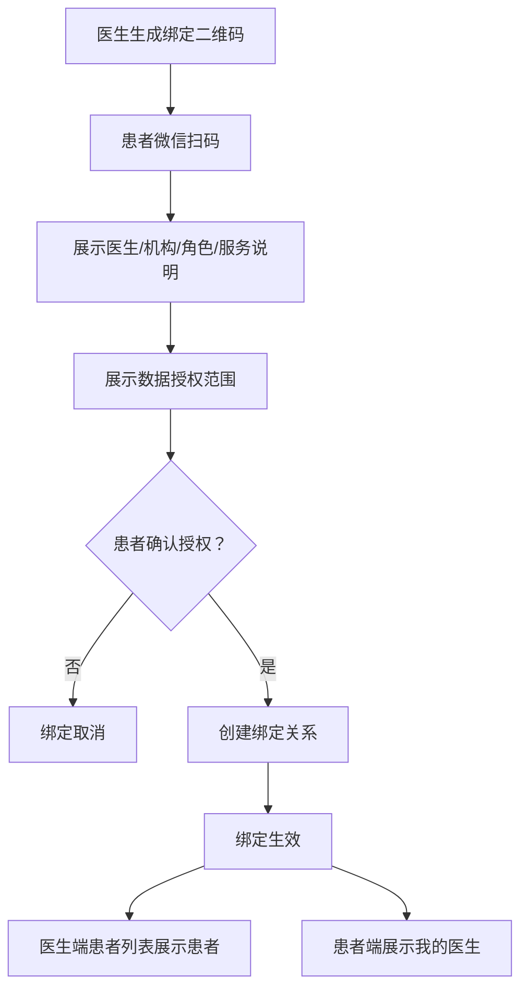
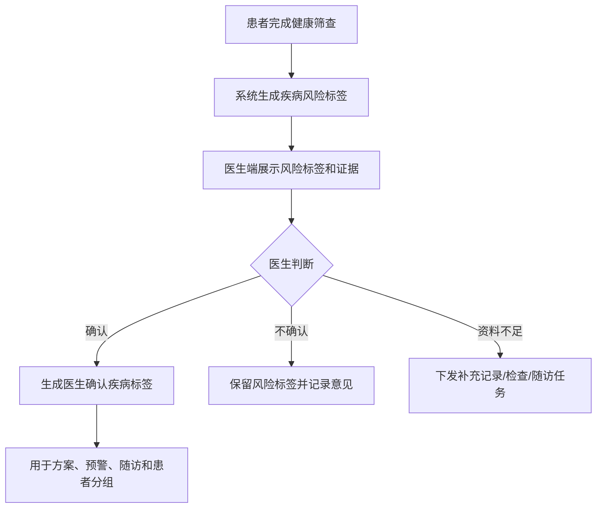
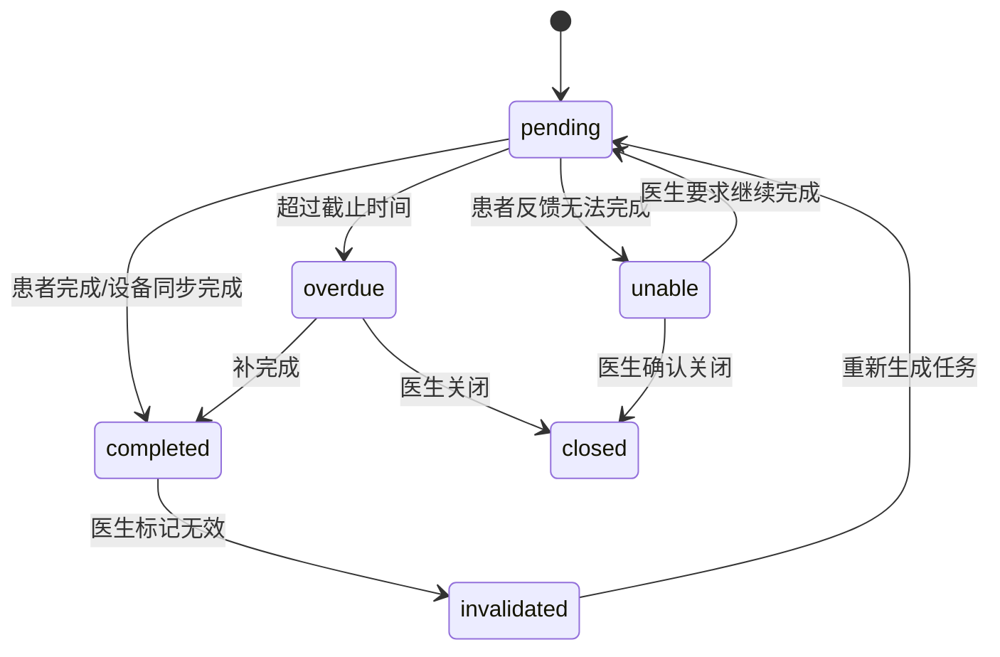

# 医生 PC 端 PRD

版本：V1.0 目标态
适用端：医生 PC 管理端
关联患者端：微信小程序
关联疾病：糖尿病、慢阻肺、睡眠呼吸障碍
产品定位：慢病数字孪生辅助诊疗医生工作台

## 1. 产品定位

医生 PC 端是慢病数字孪生智能管理平台的临床工作台，承接患者端微信小程序、居家设备、健康筛查、院内检查、用药、症状、随访和医生处置数据，为医生提供患者分层管理、风险预测、辅助诊断、治疗反应评估、随访干预和效果追踪能力。

医生端不只是“看数据”的后台，而是面向慢病连续管理的辅助诊疗系统。系统通过多源数据融合形成患者个体化疾病画像和数字孪生状态，帮助医生提升疾病状态预测准确率、治疗反应/耐药风险识别灵敏度、远程诊断与治疗方案准确率，并降低患者并发症发生率。

医学安全边界：

- 系统提供风险提示、证据解释、辅助诊疗建议和方案推荐。
- 系统不自动确诊、不自动开方、不替代医生做最终医疗决策。
- 所有诊断结论、治疗建议、用药调整、转诊建议必须由医生确认后生效。
- 所有模型输出必须可解释、可追溯、可被医生采纳、修改或驳回。

## 2. 产品目标

| 目标 | 说明 |
| --- | --- |
| 提升疾病状态预测准确率 | 融合连续指标、症状、用药、设备报告和院内检查，识别个体趋势偏离 |
| 提升治疗反应/耐药风险识别灵敏度 | 区分依从性不足、记录缺失、生活方式影响、药物反应不足和疑似治疗不敏感 |
| 提升远程诊断与治疗方案准确率 | 为医生提供结构化证据、相似历史、风险解释和可编辑方案建议 |
| 降低并发症率 | 通过早期预警、及时复测、随访、转诊和方案调整减少长期风险 |
| 提升医生管理效率 | 让医生优先处理高风险、高价值、需干预患者 |
| 建立模型反馈闭环 | 记录医生采纳、修改、驳回和干预效果，持续优化规则和模型 |

## 3. 用户角色

| 角色 | 使用范围 | 核心任务 |
| --- | --- | --- |
| 专科医生 | 内分泌科、呼吸科、睡眠医学科 | 复杂风险处理、诊断辅助、治疗方案确认、报告解读 |
| 家庭医生 | 社区医院、基层医疗、家庭医生签约服务 | 扫码绑定患者、长期随访、一般预警处理、转诊建议 |
| 慢病管理医生/护士 | 慢病中心、互联网医院、健康管理团队 | 批量患者管理、任务提醒、随访记录、依从性干预 |
| 科室负责人 | 科室或慢病项目管理 | 查看质控、预警处理效率、随访完成率、服务效果 |
| 医院/项目管理员 | 医院、区域平台、项目运营方 | 管理机构、账号、角色、规则、模板、内容和审计 |

权限原则：

- 医生只能查看通过医生二维码扫码绑定并获得患者授权的患者。
- 家庭医生默认处理日常随访、记录缺失、一般预警和转诊建议。
- 专科医生处理高风险预警、复杂治疗方案、疑似急性加重、疑似治疗不敏感和诊断辅助。
- 护士/健康管理师可执行提醒、随访记录和患者教育，但不能确认诊断或治疗调整。
- 科室负责人和管理员以质控和运营为主，不能绕过患者授权查看不相关患者隐私。

## 4. 核心业务闭环


## 5. 医患扫码绑定

### 5.1 绑定目标

扫码绑定用于建立医生与患者的服务关系。当前版本只支持“医生生成二维码，患者扫码确认授权”这一条主流程；暂不纳入后台/机构分配患者、患者扫码机构码、服务团队绑定。绑定生效后，医生端可查看患者授权范围内的数据，患者端可看到绑定医生、医生建议、随访计划和方案任务。

### 5.2 绑定入口

| 发起方 | 入口 | 场景 |
| --- | --- | --- |
| 医生 PC 端 | 患者管理 - 生成绑定二维码 | 门诊、社区随访、义诊、家庭医生签约 |
| 医生 PC 端 | 工作台 - 快速绑定患者 | 医生现场快速建立服务关系 |
| 患者小程序 | 我的医生 - 扫码绑定 | 患者主动绑定医生 |
| 患者小程序 | 首页/健康档案绑定提示 | 未绑定医生且有高风险或随访需求 |

### 5.3 绑定流程



### 5.4 绑定规则

- 二维码有效期建议 10 分钟，过期后不可使用。
- 二维码必须绑定医生 ID、机构 ID、医生角色、生成时间、有效期和服务类型。
- 患者扫码后必须看到医生姓名、机构、科室/社区医院、角色、服务说明和授权范围。
- 患者确认授权后才可建立绑定关系，不允许静默绑定。
- 当前版本默认患者确认后绑定生效；医生二次确认、机构分配、服务团队绑定不纳入当前医患关系建立流程。
- 患者和医生均可申请解绑，解绑后医生不能查看患者新增数据。
- 历史处理记录、方案、随访、建议和审计日志必须保留。
- 授权范围变更、解绑、重新绑定必须记录操作日志。

### 5.5 绑定状态

| 状态 | 说明 |
| --- | --- |
| pending_patient | 已生成二维码，等待患者扫码确认 |
| active | 绑定生效 |
| rejected | 医生拒绝或患者取消 |
| expired | 二维码过期 |
| revoked | 已解绑 |

## 6. 信息架构

医生 PC 端采用左侧主导航、顶部全局搜索、右侧内容工作区的结构。

| 一级模块 | 页面 | 说明 |
| --- | --- | --- |
| 工作台 | 今日概览、重点患者、待办队列 | 医生每日工作入口 |
| 患者管理 | 患者列表、分组、标签、扫码绑定 | 管理患者池 |
| 患者 360 | 总览、时间轴、趋势、记录、报告、方案 | 单患者全景管理 |
| 数字孪生 | 疾病画像、个体基线、趋势偏离、风险解释 | 辅助诊疗核心 |
| 风险预警 | 预警列表、预警详情、处置闭环 | 集中处理风险事件 |
| 辅助诊疗 | 诊断辅助、治疗反应评估、方案推荐 | 医生确认后生效 |
| 管理方案 | 方案模板、患者方案、任务配置 | 下发患者端任务 |
| 随访管理 | 随访日历、随访详情、随访结论 | 标准化随访 |
| 设备与报告 | 设备状态、睡眠报告、血氧报告 | 管理设备数据可信度 |
| 消息建议 | 医生建议、患者阅读、执行反馈 | 医患沟通留痕 |
| 数据看板 | 人群指标、服务质量、模型效果 | 项目和科室质控 |
| 系统设置 | 账号、角色、规则、模板、审计 | 管理配置 |

## 7. 疾病标签管理

### 7.1 标签定位

疾病标签不由患者手动选择后直接生效，而是采用“健康筛查系统提示疾病风险 + 医生确认疾病”的机制。

| 标签类型 | 来源 | 用途 |
| --- | --- | --- |
| 疾病风险标签 | 健康筛查、关键指标、设备报告、症状问卷 | 风险分层、医生提醒、补充资料建议 |
| 医生确认疾病 | 医生根据院内诊断、筛查结果、记录趋势和设备报告确认 | 正式管理方案、随访路径、预警规则、患者分组 |

### 7.2 标签流程



### 7.3 医生端操作

- 查看风险标签证据。
- 确认疾病标签。
- 修改疾病标签。
- 移除医生确认疾病标签。
- 标记资料不足并下发补充任务。
- 查看标签变更历史。

### 7.4 展示规则

- 患者端展示“疾病风险”时必须使用风险提示文案，不表达为确诊。
- 医生确认后，患者端健康档案可展示“医生确认疾病”。
- 医生端患者列表同时展示疾病风险标签和医生确认疾病标签，但视觉上需要区分。
- 医生确认疾病标签变化后，管理方案、随访计划、预警规则和数字孪生画像需要同步更新。

## 8. 工作台

### 8.1 页面目标

工作台帮助医生优先处理最需要医学干预的患者，而不是简单按时间展示数据。

### 8.2 页面布局

```text
顶部：全局搜索患者姓名/手机号/患者ID/设备号

关键指标卡：
待处理高风险  今日随访  疑似急性风险  疑似治疗不敏感  数据缺失  待确认方案

主工作区：
左侧：优先处理队列
中间：选中患者摘要
右侧：快捷操作和最近处理记录

底部：质控与服务效果摘要
```

### 8.3 待处理队列

| 队列 | 排序逻辑 | 典型动作 |
| --- | --- | --- |
| 高风险预警 | 红色/橙色风险、持续异常、伴随症状 | 查看证据、建议就医、发起随访 |
| 疑似急性加重 | 慢阻肺症状升高、SpO2 下降、用药异常 | 症状复评、复测血氧、转诊建议 |
| 疑似治疗不敏感 | 指标持续不达标且依从性较好 | 复核用药、建议检查、专科评估 |
| 数据缺失 | 关键任务连续未完成 | 发送提醒、安排随访 |
| 待确认方案 | 系统生成或患者状态变化触发 | 审核并下发方案 |
| 今日随访 | 到期、逾期、预警后随访 | 填写随访结论 |

### 8.4 优先级规则

1. 红色风险或疑似急性风险。
2. 橙色风险且 24 小时内未处理。
3. 疑似治疗不敏感或连续方案失败。
4. 今日随访或逾期随访。
5. 连续缺失关键数据。
6. 待确认方案和新完成筛查患者。

## 9. 患者管理

### 9.1 页面定位

患者管理列表用于帮助医生、家庭医生和慢病管理人员快速完成“找患者、分层、排序、批量处理”。列表页不承载深度分析，深度分析进入患者 360。

核心任务：

- 找到某个患者。
- 找到当前最需要处理的患者。
- 识别高风险、待随访、数据缺失、方案需调整人群。
- 快速发起预警处理、随访、建议、扫码绑定。
- 批量处理低风险运营动作，例如记录提醒、随访提醒、设备绑定提醒。

### 9.2 页面布局

```text
顶部工具区
  搜索框：姓名 / 手机号 / 患者ID / 设备号
  主按钮：生成绑定二维码
  快捷入口：导入/刷新 / 批量提醒 / 筛选保存

统计概览
  全部患者  高风险  今日随访  数据缺失  待确认疾病  待确认方案  待处理预警

左侧筛选区
  重点关注、风险等级、疾病标签、方案状态、随访状态、数据状态、设备状态

右侧患者列表
  患者卡片/表格行
  批量选择
  行内快捷操作
```

### 9.3 顶部统计卡

| 统计卡 | 口径 | 点击行为 |
| --- | --- | --- |
| 全部患者 | 当前医生授权患者总数 | 清空快捷筛选 |
| 高风险 | 当前红色/橙色风险患者 | 筛选高风险 |
| 今日随访 | 今天计划随访患者 | 筛选今日随访 |
| 数据缺失 | 连续缺失关键记录患者 | 筛选数据缺失 |
| 待确认疾病 | 有疾病风险标签但未医生确认 | 筛选待确认标签 |
| 待确认方案 | 系统已为患者生成管理方案，但尚未医生审核确认 | 筛选待确认方案患者 |
| 待处理预警 | 状态为待医生处理 | 跳转或筛选预警患者 |

### 9.4 筛选条件

| 筛选组 | 选项 |
| --- | --- |
| 重点关注 | 全部、仅看重点关注 |
| 风险等级 | 低风险、中风险、高风险、疑似急性风险 |
| 疾病风险标签 | 糖尿病风险、慢阻肺风险、睡眠呼吸障碍风险 |
| 医生确认疾病 | 糖尿病、慢阻肺、睡眠呼吸障碍、多病共管 |
| 管理状态 | 新建档、已筛查、方案执行中、干预中、待随访 |
| 方案状态 | 无方案、系统已生成待医生确认、执行中、需调整、待复盘 |
| 数据状态 | 今日已记录、今日未记录、连续缺失、设备同步异常 |
| 治疗反应 | 达标、波动大、疑似依从性差、疑似治疗不敏感 |
| 随访状态 | 今日、本周、逾期、已完成 |
| 设备状态 | 已绑定、未绑定、同步异常、报告生成中、报告无效 |
| 标签状态 | 有风险标签、待医生确认、已医生确认、资料不足 |

筛选规则：

- 支持多条件组合。
- 支持保存常用筛选，例如“今日高风险”“家庭医生待随访”“睡眠低氧待处理”。
- 高风险、今日随访、待处理预警应支持一键筛选。
- 列表默认按风险和待处理优先级排序，不按创建时间排序。

### 9.5 排序规则

默认排序：

1. 红色风险或疑似急性风险。
2. 高风险且待医生处理。
3. 今日随访或逾期随访。
4. 疑似治疗不敏感。
5. 连续缺失关键记录。
6. 待确认疾病标签。
7. 最近有新记录或新报告。

可选排序：

- 最近记录时间。
- 最近预警时间。
- 随访日期。
- 方案执行率。
- 风险等级。
- 数据完整度。

### 9.6 患者列表字段

| 字段 | 说明 |
| --- | --- |
| 患者信息 | 姓名、性别、年龄、手机号脱敏、患者 ID |
| 医患关系 | 绑定医生、家庭医生、绑定状态、绑定时间 |
| 标签 | 疾病风险标签、医生确认疾病、重点关注标签 |
| 今日状态 | 今日任务完成度、是否有新记录、是否有待办 |
| 最新关键指标 | 血糖、血压、SpO2、睡眠摘要、症状摘要，展示异常高亮 |
| 数字孪生状态 | 稳定、趋势偏离、风险升高、干预中 |
| 最新预警 | 预警等级、预警名称、触发时间 |
| 治疗反应 | 达标、波动、疑似依从性差、疑似治疗不敏感 |
| 设备状态 | 已绑定、未绑定、同步异常、报告生成中、报告无效 |
| 方案状态 | 无方案、系统已生成待医生确认、执行中、需调整、待复盘 |
| 随访状态 | 下次随访日期、是否逾期、随访类型 |
| 操作 | 查看 360、处理预警、发建议、建随访、标记重点 |

### 9.7 行内快捷操作

| 操作 | 触发条件 | 结果 |
| --- | --- | --- |
| 查看 360 | 所有患者 | 进入患者详情 |
| 处理预警 | 有待处理预警 | 打开预警处理抽屉或跳转预警详情 |
| 发送建议 | 所有患者 | 打开建议模板弹窗 |
| 创建随访 | 所有患者 | 打开随访创建弹窗 |
| 确认疾病 | 有疾病风险标签未确认 | 打开疾病标签确认弹窗 |
| 调整方案 | 有执行中方案或需调整 | 进入方案编辑 |
| 绑定设备提醒 | 未绑定关键设备 | 给患者发送设备绑定建议 |
| 标记重点 | 所有患者 | 加入重点关注 |

### 9.8 批量操作

批量操作只用于低风险、非诊疗决策类动作，避免批量医疗处置带来风险。

支持：

- 批量发送记录提醒。
- 批量发送随访提醒。
- 批量发送设备绑定提醒。
- 批量标记重点关注。
- 批量分配随访任务给健康管理师。

不支持：

- 批量确认疾病。
- 批量调整治疗方案。
- 批量关闭高风险预警。
- 批量发送个体化治疗建议。

### 9.9 空状态与异常状态

| 场景 | 页面表现 |
| --- | --- |
| 无患者 | 展示“暂无患者”，主按钮为“生成绑定二维码” |
| 无筛选结果 | 展示“当前筛选无患者”，支持清空筛选 |
| 数据同步失败 | 列表顶部提示“部分数据同步延迟” |
| 患者已解绑 | 保留历史处理记录，患者行置灰，新增数据不可见 |
| 权限不足 | 不展示敏感信息，提示无查看权限 |

## 10. 患者 360

患者 360 是医生端单患者主页面，按“概览 - 证据 - 决策 - 执行 - 反馈”组织信息。医生从这里完成单患者状态判断、风险解释、辅助诊疗、方案调整和随访复盘。

### 10.1 页面布局

```text
顶部患者条
  基础信息 / 医患关系 / 疾病标签 / 风险等级 / 快捷操作

左侧锚点导航
  总览、数字孪生、指标趋势、记录明细、睡眠报告、设备、预警、方案、随访、建议

中间主内容区
  当前选中模块详情

右侧决策侧栏
  当前风险、系统建议、医生操作、最近处理记录
```

设计原则：

- 顶部患者条始终吸顶，医生滚动查看时仍能看到患者身份和关键风险。
- 右侧决策侧栏固定展示当前可执行动作，减少医生在页面中来回寻找按钮。
- 所有系统建议必须提供证据入口，不允许只给结论。
- 患者 360 默认进入“总览”，高风险跳转时可直接定位到预警详情。

### 10.2 顶部患者条

展示：

- 姓名、性别、年龄、手机号脱敏。
- 家庭医生、专科医生。
- 疾病风险标签、医生确认疾病、风险等级、数字孪生状态。
- 绑定设备、最近同步时间。
- 当前方案、方案执行率。
- 待处理预警和待随访。
- 快捷操作：处理预警、调整方案、发送建议、创建随访、转诊。

快捷操作规则：

- 有高风险预警时，主按钮为“处理预警”。
- 有待确认疾病标签时，显示“确认疾病”。
- 有疑似治疗不敏感时，显示“复核方案”。
- 无当前方案时，显示“生成方案”。
- 有今日随访时，显示“记录随访”。

### 10.3 总览模块

总览用于让医生在 1 分钟内理解患者当前状态。

内容结构：

| 区域 | 内容 |
| --- | --- |
| 当前结论 | 当前总体状态、最高风险、需要优先处理的事项 |
| 疾病标签 | 系统风险标签、医生确认疾病、待确认标签 |
| 近期异常 | 最近 7/30 天异常指标、症状、设备报告 |
| 今日任务 | 患者今日记录、用药、随访准备完成度 |
| 方案执行 | 当前方案目标、执行率、待调整提示 |
| 医生建议 | 最近建议、患者是否已读/执行 |

### 10.4 数字孪生模块

内容：

- 个体基线。
- 疾病画像。
- 趋势偏离。
- 疾病状态预测。
- 治疗反应/疑似不敏感。
- 风险解释和证据链。
- 干预效果评估。

交互：

- 点击风险结论查看证据。
- 医生可对系统判断标记：符合、部分符合、不符合、需复核。
- 医生反馈进入模型效果评估。

### 10.5 时间轴模块

时间轴按时间倒序聚合所有关键事件：

| 类型 | 示例 |
| --- | --- |
| 筛查 | 完成健康筛查、评分变化、风险标签生成 |
| 记录 | 血糖、血压、血氧、症状、用药、睡眠 |
| 设备 | 设备绑定、同步、报告生成、无效报告 |
| 预警 | 预警触发、患者复测、医生处理 |
| 方案 | 方案创建、下发、调整、停用 |
| 随访 | 随访创建、完成、结论 |
| 医生建议 | 建议发送、患者已读、患者执行 |

交互：

- 支持按事件类型筛选。
- 支持点击事件打开详情抽屉。
- 关键医疗操作展示操作者和时间。

### 10.6 指标趋势模块

展示：

- 血糖、血压、血氧、睡眠、症状、用药趋势。
- 支持近 7 天、30 天、90 天、自定义。
- 支持异常点联动记录明细。
- 支持按疾病视角组合指标，例如糖尿病视角、慢阻肺视角、睡眠视角。

### 10.7 记录明细模块

展示所有患者端记录和设备数据，字段包括：

- 记录时间。
- 指标名称和值。
- 单位。
- 状态。
- 来源。
- 场景。
- 设备号。
- 关联症状/用药。
- 备注。
- 修改记录。

医生操作：

- 查看详情。
- 添加医生备注。
- 标记设备记录无效。
- 建议患者复测。

### 10.8 睡眠报告模块

展示：

- 睡眠报告列表。
- 单次睡眠报告分析。
- AHI、ODI、最低血氧、低氧时长。
- 睡眠分期、体位、鼾声、体动。
- CPAP 使用情况。
- 报告有效性和设备能力。

医生操作：

- 查看完整报告。
- 标记报告无效。
- 建议复测睡眠。
- 建议线下睡眠评估或 CPAP 随访。

### 10.9 预警模块

展示：

- 当前待处理预警。
- 历史预警。
- 预警证据链。
- 医生处理记录。
- 患者复测和执行反馈。

医生操作：

- 处理预警。
- 关闭预警。
- 转随访。
- 转专科。
- 下发复测任务。

### 10.10 管理方案模块

展示：

- 当前方案。
- 阶段目标。
- 指标目标。
- 任务配置。
- 用药/治疗建议。
- 方案执行率。
- 历史方案。

医生操作：

- 创建方案。
- 调整方案。
- 停用方案。
- 下发患者端。
- 进入方案复盘。

### 10.11 随访模块

展示：

- 当前随访计划。
- 随访准备材料。
- 历史随访结论。
- 下次随访建议。

医生操作：

- 创建随访。
- 记录随访结论。
- 调整下次随访时间。
- 生成随访后建议。

### 10.12 医生建议模块

展示：

- 已发送建议。
- 建议来源：预警、随访、方案、手动。
- 患者是否已读。
- 是否生成患者任务。
- 患者执行反馈。

医生操作：

- 发送新建议。
- 使用模板。
- 编辑后发送。
- 查看执行情况。

### 10.13 右侧决策侧栏

右侧侧栏根据当前患者状态动态变化。

| 状态 | 主操作 |
| --- | --- |
| 高风险预警 | 处理预警、建议就医、创建随访 |
| 待确认疾病标签 | 确认疾病、标记资料不足 |
| 疑似治疗不敏感 | 复核方案、建议检查、转专科 |
| 数据连续缺失 | 发送记录提醒、创建随访 |
| 睡眠报告异常 | 查看报告、建议复测、建议睡眠评估 |
| 方案到期 | 方案复盘、创建新方案 |

### 10.14 页面 Tab

| Tab | 说明 |
| --- | --- |
| 总览 | 当前状态、近期异常、今日任务、医生建议 |
| 时间轴 | 筛查、记录、报告、预警、随访、方案调整 |
| 数字孪生 | 个体基线、趋势偏离、风险解释、预测结果 |
| 指标趋势 | 血糖、血压、血氧、睡眠、症状、用药 |
| 记录明细 | 所有患者端和设备数据 |
| 睡眠报告 | 睡眠报告列表和单次分析 |
| 设备管理 | 设备绑定、同步状态、设备能力 |
| 健康筛查 | 筛查结果和原始问卷 |
| 管理方案 | 当前方案、历史方案、任务配置 |
| 随访记录 | 随访计划、准备材料、结论 |
| 医生建议 | 建议历史、患者阅读和执行状态 |

## 11. 数字孪生辅助诊疗

### 11.1 模块定位

数字孪生模块用于汇总患者个体化疾病状态，提供风险预测、趋势偏离解释、治疗反应评估和辅助诊疗建议。它是医生决策支持工具，不是自动诊断工具。

### 11.2 数字孪生画像

| 画像层 | 内容 | 用途 |
| --- | --- | --- |
| 基础画像 | 年龄、性别、BMI、家族史、吸烟史、生活方式 | 基础风险分层 |
| 疾病画像 | 糖尿病类型/风险、慢阻肺分级、OSA 风险/诊断 | 多病共管 |
| 生理状态 | 血糖、血压、SpO2、脉率、睡眠、体重、肺功能 | 状态识别 |
| 行为状态 | 用药、饮食、运动、吸烟、CPAP/氧疗执行 | 依从性分析 |
| 症状状态 | 症状类型、程度、持续时间、关联指标 | 急性风险识别 |
| 风险状态 | 急性风险、并发症风险、治疗不敏感风险 | 预警和随访 |
| 干预状态 | 医生建议、方案、随访、患者执行结果 | 效果评估 |

### 11.3 趋势偏离分析

展示：

- 当前值 vs 个体基线。
- 近 7 天、30 天、90 天趋势。
- 异常点与症状、用药、睡眠、设备报告的关联。
- 系统判定的主要偏离原因。
- 数据可信度：记录完整度、设备有效性、缺失情况。

交互：

- 点击趋势点查看原始记录。
- 点击风险解释查看规则版本、模型版本和证据快照。
- 医生可标记“符合临床判断 / 不符合 / 需复核”。

### 11.4 疾病状态预测

| 疾病 | 预测目标 | 关键证据 |
| --- | --- | --- |
| 糖尿病 | 高/低血糖风险、血糖波动风险、长期并发症风险 | 血糖时点、血压、BMI、用药、症状、HbA1c、依从性 |
| 慢阻肺 | 急性加重风险、低氧风险、症状恶化风险 | SpO2、呼吸频率、咳痰气促、CAT/mMRC、吸入药、活动能力 |
| 睡眠呼吸障碍 | 夜间低氧风险、OSA 风险、CPAP 依从性风险 | AHI、ODI、最低血氧、低氧时长、ESS、STOP-Bang、CPAP 使用 |

输出要求：

- 展示风险等级、置信度、主要证据和建议动作。
- 不使用绝对化文案，如“必然发生”“已确诊”。
- 医生可采纳、修改、驳回，系统记录反馈。

### 11.5 治疗反应与耐药风险识别

慢病场景下“耐药机制识别”在产品层面不直接等同于分子机制诊断，应先落为“治疗反应不足/疑似耐药或不敏感风险识别”。系统需要帮助医生区分以下情况：

| 类型 | 判断线索 | 医生动作 |
| --- | --- | --- |
| 依从性不足 | 漏服、未测、设备未同步、任务未完成 | 加强提醒、随访教育 |
| 生活方式影响 | 饮食、运动、睡眠、吸烟等备注异常 | 生活方式干预 |
| 治疗反应不足 | 依从性较好但指标持续不达标 | 复核方案、建议检查、专科评估 |
| 疑似药物不良反应 | 症状与用药时间相关 | 记录不良反应、医生评估 |
| 疑似耐药/治疗不敏感 | 多次方案调整后仍异常，排除依从性问题 | 建议进一步检查或转专科 |

重要边界：

- 系统只提示“疑似治疗反应不足/疑似耐药风险”，不得直接给出耐药诊断。
- 需要医生结合检查、病史、用药和临床判断确认。
- 每次医生判断要记录依据和处理结果，用于模型持续优化。

## 12. 指标趋势与记录明细

### 12.1 血糖趋势

展示：

- 空腹、餐后 2h、睡前、随机等分时点趋势。
- 达标率、偏高次数、偏低次数、波动幅度。
- 低血糖事件和高血糖事件。
- 血糖与饮食、运动、用药、睡眠、症状的关联。
- 个体目标范围和医生调整历史。

### 12.2 血压趋势

展示：

- 收缩压/舒张压双线趋势。
- 晨起、睡前、随机等场景。
- 与头痛、头晕、睡眠低氧、用药的关联。
- 高血压风险和并发风险提示。

### 12.3 血氧呼吸趋势

展示：

- SpO2、脉率、呼吸频率趋势。
- 活动后、静息、睡前等场景。
- 低氧事件次数。
- 与胸闷、气短、咳嗽、喘息、紫绀等症状关联。
- 夜间低氧进入睡眠报告，不混入白天血氧趋势主图。

### 12.4 睡眠趋势

展示：

- 睡眠时长、入睡/起床时间、睡眠效率。
- AHI、ODI、最低血氧、平均血氧、低氧累计时长。
- 睡眠分期、体位、鼾声、体动。
- CPAP 使用时长、漏气、残余 AHI。
- 报告有效性和设备能力说明。

### 12.5 症状趋势

展示：

- 症状类型分布。
- 严重程度变化。
- 症状与指标异常、用药、睡眠的关联。
- “今日无不适”记录。
- 慢阻肺 CAT/mMRC、睡眠 ESS 等量表变化。

### 12.6 用药与治疗执行

展示：

- 用药计划执行率。
- 漏服、补服、待服。
- 吸入药、氧疗、CPAP 执行情况。
- 患者备注、不良反应。
- 治疗反应与指标变化关联。

### 12.7 记录明细字段

| 字段 | 说明 |
| --- | --- |
| 记录时间 | 精确到分钟 |
| 指标名称 | 血糖、血压、SpO2、症状、用药等 |
| 指标值 | 数值或文本 |
| 单位 | mmol/L、%、mmHg、次/分 |
| 状态 | 正常、偏高、偏低、异常、无效 |
| 记录场景 | 血糖时点、血氧场景、症状场景 |
| 数据来源 | 手动记录、设备采集、医生录入、院内检查 |
| 设备号 | 设备数据必显 |
| 关联症状 | 有则展示 |
| 关联用药 | 有则展示 |
| 规则版本 | 状态判定和预警依据 |
| 备注 | 患者备注、医生备注 |
| 修改记录 | 修改人、修改时间、修改原因 |

## 13. 风险预警

风险预警模块承接患者端健康风险分、疾病专项分、异常指标、症状、用药和设备数据。患者端展示“分值 + 易懂原因 + 行动建议”，医生端展示“风险等级 + 预警事件 + 证据链 + 处置闭环”。

### 13.1 健康风险分与风险分层

#### 13.1.1 分值定义

- 分值范围：0-100 分。
- 分值方向：分数越高，表示近期慢病管理状态越稳定。
- 患者端展示：总分、等级、较昨日变化、主要扣分原因、下一步行动。
- 医生端展示：总分、专项分、风险等级、扣分构成、规则/模型版本、证据快照。
- 分值仅作为风险提示和患者管理排序依据，不作为诊断结论。

#### 13.1.2 综合风险等级

| 健康风险分 | 医生端风险等级 | 患者端表达 | 医生端默认动作 |
| ---: | --- | --- | --- |
| 85-100 | 低风险 | 状态稳定 | 常规管理 |
| 70-84 | 中风险 | 需要关注 | 观察趋势，必要时随访 |
| 50-69 | 高风险 | 风险偏高 | 进入待处理列表，建议医生查看 |
| 0-49 | 危急/高风险 | 建议尽快联系医生 | 强提醒，优先处理 |

特殊规则：

- 存在危急预警时，总分最高不得超过 49 分。
- 存在高风险预警未处理时，总分最高不得超过 69 分。
- 关键数据缺失会降低分值，但不能单独生成疾病诊断结论。
- 医生可针对个体化目标调整血糖、血压、血氧、睡眠等阈值，调整后必须记录规则版本。

#### 13.1.3 评分维度

| 维度 | 权重建议 | 医生端解释口径 |
| --- | ---: | --- |
| 指标状态 | 40 | 当前血糖、血氧、血压、睡眠等是否偏离目标 |
| 趋势变化 | 20 | 近 7/14/30 天是否持续变差 |
| 症状状态 | 15 | 症状是否出现、加重或与异常指标同向 |
| 用药/设备依从性 | 15 | 是否按计划用药、记录、佩戴或同步设备 |
| 数据完整度 | 10 | 是否按管理方案完成关键数据采集 |

公式：

```text
健康风险分 = max(0, min(100, 100 - 指标扣分 - 趋势扣分 - 症状扣分 - 依从性扣分 - 数据完整度扣分 + 改善加分))
```

医生端不直接展示复杂公式，默认展示“主要扣分原因”和“证据记录”。医生点击可查看完整规则版本、阈值、数据来源和计算时间。

#### 13.1.4 专项分

| 专项分 | 适用患者 | 核心依据 |
| --- | --- | --- |
| 血糖管理分 | 糖尿病风险/糖尿病患者 | 血糖时点、低血糖、高血糖、波动、记录频率、用药 |
| 血氧呼吸分 | 慢阻肺风险/慢阻肺患者 | SpO2、呼吸频率、低氧时长、症状、氧疗/设备数据 |
| 睡眠呼吸分 | 睡眠呼吸障碍风险/OSA 患者 | AHI、ODI、最低血氧、T90、睡眠时长、CPAP 依从性 |
| 用药依从分 | 所有管理中患者 | 打卡、漏服、备注、不良反应、医生方案执行 |

患者 360 顶部展示综合分，概览区展示专项分雷达或横向条。专项分下降时，系统需要说明对应疾病模块的主要证据。

#### 13.1.5 分值与预警关系

- 风险分层用于患者排序和状态表达。
- 预警用于具体异常事件处理。
- 分值下降不一定生成预警；但高风险/危急规则触发必须生成预警。
- 多个中风险事件叠加可导致综合分下降，并将患者推入高优先级管理列表。
- 预警处理后，若患者复测或随访结果改善，允许分值恢复，但保留历史分值快照。

#### 13.1.6 医生端展示位置

患者管理列表：

- 展示综合分、分值变化、风险等级、最高专项风险。
- 支持按分值区间和分值下降幅度筛选。
- 默认排序：危急预警、高风险预警、分值快速下降、今日随访、数据缺失。

患者 360：

- 顶部患者条展示综合分和风险等级。
- 总览模块展示专项分、扣分构成和近 30 天趋势。
- 预警模块展示具体事件和处理状态。
- 右侧决策栏展示“导致当前分值下降的前三项原因”。

预警详情：

- 展示触发前后分值变化。
- 展示本次预警影响的专项分。
- 展示是否触发分值上限规则，例如“存在危急低血糖，综合分上限 49”。

### 13.2 预警类型

| 类型 | 示例 |
| --- | --- |
| 糖尿病风险 | 低血糖、高血糖、波动过大、长期未测、疑似治疗不敏感 |
| 慢阻肺风险 | SpO2 下降、症状加重、急性加重风险、吸入药漏用 |
| 睡眠风险 | 夜间低氧、AHI/ODI 异常、CPAP 使用不足、残余 AHI 偏高 |
| 用药风险 | 连续漏服、不良反应、依从性下降 |
| 数据风险 | 关键指标缺失、设备同步异常、报告无效 |

### 13.3 预警详情

展示：

- 预警结论。
- 风险等级和置信度。
- 触发前后健康风险分变化。
- 影响的专项分。
- 触发规则/模型版本。
- 原始证据记录。
- 趋势图和相似历史。
- 患者备注、症状、用药、设备状态。
- 推荐处理动作。

### 13.4 医生处理动作

| 动作 | 患者端可见 | 说明 |
| --- | --- | --- |
| 建议复测 | 是 | 生成患者端待办 |
| 发送医生建议 | 是 | 模板选择后可编辑 |
| 调整记录频率 | 是 | 更新患者端任务 |
| 调整管理方案 | 是 | 医生确认后生效 |
| 创建随访 | 是 | 患者端展示随访计划 |
| 建议线下就医 | 是 | 高风险或急性风险 |
| 转专科/转上级 | 是/可选 | 家庭医生转专科 |
| 继续观察 | 是 | 需填写原因 |
| 关闭预警 | 可选 | 需填写关闭原因 |
| 内部备注 | 否 | 医生端可见 |

处理要求：

- 高风险预警必须填写处理意见。
- 系统建议必须记录医生采纳、修改或驳回。
- 关闭预警必须记录原因。
- 处理后需要追踪患者是否执行，以及执行后的复测/随访结果。

## 14. 辅助诊疗

### 14.1 诊断辅助

系统根据健康筛查、院内检查、设备报告和连续记录给出结构化诊断参考。

展示：

- 疑似疾病或风险方向。
- 支持证据和反向证据。
- 缺失检查项。
- 建议补充资料。
- 参考指南或规则来源。

医生操作：

- 采纳为诊断参考。
- 修改后确认。
- 驳回并填写原因。
- 要求患者补充检查或转诊。

### 14.2 方案推荐

系统可基于患者状态推荐管理方案：

- 指标监测频率。
- 用药/治疗执行提醒。
- 睡眠监测或 CPAP 管理。
- 慢阻肺症状问卷和肺康复任务。
- 随访时间。
- 复诊或检查建议。

所有方案必须医生确认后下发。

### 14.3 远程诊疗摘要

为医生远程评估提供摘要：

- 近期关键异常。
- 指标趋势。
- 用药执行。
- 症状变化。
- 睡眠报告。
- 预警和处理历史。
- 患者主诉和问题。
- 系统建议关注点。

## 15. 管理方案

管理方案是医生确认后下发给患者的一段时间慢病管理计划。系统可以基于疾病标签、风险分层、健康风险分、近期指标、症状、用药和设备数据生成初始化方案草稿，但必须由医生审核、修改或确认后才能推送到患者端。

### 15.1 业务定位

| 模块 | 定位 | 产物 |
| --- | --- | --- |
| 初始化方案模板 | 系统根据疾病和风险分层生成管理建议草稿 | 待医生确认的方案 |
| 患者管理方案 | 医生确认后的正式阶段计划 | 患者端任务、目标、预警规则、随访计划 |
| 随访计划 | 检查方案执行效果的时间安排 | 计划内随访、临时随访、预警后随访 |
| 医生建议 | 单次事件或沟通建议 | 消息卡片、预警处理意见、随访后建议 |

核心规则：

- 系统生成的是“推荐方案草稿”，不是自动医疗决策。
- 医生确认前患者不可见。
- 医生可以整体采纳、局部修改、驳回或改用空白方案。
- 方案发布后自动生成患者端今日待办、阶段目标、随访提醒和预警规则。
- 方案每次发布生成新版本，历史版本不可覆盖。

### 15.2 初始化方案生成条件

系统在以下场景生成初始化方案草稿：

| 场景 | 触发条件 | 方案状态 |
| --- | --- | --- |
| 首次建档 | 患者完成筛查并与医生绑定 | 待医生确认 |
| 医生确认疾病 | 疾病风险标签被医生确认 | 待医生确认 |
| 风险等级变化 | 健康风险分跨等级下降或出现高风险预警 | 待医生确认 |
| 随访结束 | 医生选择“需要调整方案” | 草稿 |
| 预警处理 | 医生选择“调整管理方案” | 草稿 |

生成输入：

- 医生确认疾病标签：糖尿病、慢阻肺、睡眠呼吸障碍、高血压。
- 疾病风险标签：尚未确诊但需管理的风险方向。
- 风险分层：低风险、中风险、高风险、危急/急性风险。
- 近期数据：7/14/30 天关键指标、症状、用药、设备、睡眠报告。
- 个体目标：年龄、合并症、医生设置的个体化目标。
- 当前方案版本和执行效果。

### 15.3 方案组成

| 模块 | 内容 | 是否患者端可见 |
| --- | --- | --- |
| 阶段信息 | 方案名称、适用疾病、风险等级、周期、版本 | 是 |
| 阶段目标 | 控糖、稳氧、改善睡眠、控压、提升依从性 | 是 |
| 指标目标 | 血糖、血压、SpO2、睡眠、症状量表等目标范围 | 是 |
| 记录任务 | 每日/每周测量、症状评估、报告上传、备注要求 | 是 |
| 用药/治疗执行 | 用药提醒、吸入药、氧疗、CPAP、生活方式执行 | 是，诊疗敏感内容按医生确认后展示 |
| 生活方式 | 饮食、运动、戒烟、体重、睡眠、肺康复 | 是 |
| 预警规则 | 复测、随访、就医、转诊触发条件 | 部分可见，患者端用易懂文案 |
| 随访规则 | 频率、首次随访时间、准备材料、触发条件 | 是 |
| 医生内部备注 | 医生判断、风险解释、后续关注点 | 否 |

### 15.4 风险分层通用策略

| 风险等级 | 管理强度 | 记录频率 | 随访频率 | 医生动作 |
| --- | --- | --- | --- | --- |
| 低风险 | 常规维持 | 按疾病基础频率 | 4-12 周 | 确认目标，常规教育 |
| 中风险 | 加强观察 | 增加关键指标记录 | 2-4 周 | 关注趋势，必要时调整任务 |
| 高风险 | 主动干预 | 高频记录和症状追踪 | 3-7 天或 1-2 周 | 发起随访，调整方案，必要时建议复诊 |
| 危急/急性风险 | 不适合仅线上管理 | 先复测/急症处理 | 24-72 小时内回访 | 强提示线下就医或转诊，医生确认后再制定阶段方案 |

### 15.5 初始化管理方案模板

以下模板为系统默认草稿，正式内容需医生审核确认。模板不直接自动调整处方药剂量，不替代诊断和治疗决策。

#### 15.5.1 糖尿病管理方案模板

| 风险等级 | 阶段目标 | 记录任务 | 生活方式/执行任务 | 预警规则 | 随访计划 |
| --- | --- | --- | --- | --- | --- |
| 低风险 | 维持血糖稳定，减少波动 | 每周 2-3 天记录空腹和餐后 2h 血糖；用药打卡 | 饮食备注、规律运动、低血糖教育 | 低血糖、连续高血糖、漏服 | 4 周一次常规随访 |
| 中风险 | 找到异常时点，提升达标率 | 连续 7 天记录空腹、餐后 2h、睡前或随机血糖；记录饮食/运动备注 | 强化饮食结构、运动执行、用药依从性 | 连续 2-3 次高于目标、血糖波动增大 | 1-2 周随访 |
| 高风险 | 降低低血糖/持续高血糖风险 | 每日多时点血糖，低血糖症状记录，用药和饮食必须备注 | 医生建议复测、必要时线下复诊 | 血糖 <3.9、<3.0、连续高血糖、症状伴异常 | 3-7 天内随访 |
| 危急/急性风险 | 优先安全处置 | 立即复测并记录症状、用药、饮食 | 患者端提示尽快联系医生/线下就医 | 严重低血糖、明显不适、极高血糖 | 24-72 小时内回访，医生确认后再下发阶段方案 |

默认患者任务：

- 血糖记录：凌晨、空腹、早餐后 2h、午餐前、午餐后 2h、晚餐前、晚餐后 2h、睡前、随机，按医生勾选生成。
- 备注字段：饮食、运动、用药、症状、其他。
- 用药任务：仅展示医生确认的用药提醒，患者不可自行改药。

#### 15.5.2 慢阻肺管理方案模板

| 风险等级 | 阶段目标 | 记录任务 | 生活方式/执行任务 | 预警规则 | 随访计划 |
| --- | --- | --- | --- | --- | --- |
| 低风险 | 稳定症状，维持活动能力 | 每周 2-3 次 SpO2、呼吸频率；每周症状评分 | 戒烟、吸入药打卡、肺康复训练 | 血氧下降、症状加重、漏用吸入药 | 4 周一次 |
| 中风险 | 识别急性加重早期信号 | 每日 SpO2，症状评分，咳嗽/咳痰/气促记录 | 强化吸入药依从性、活动耐量记录 | SpO2 持续低、咳痰气促加重 | 1-2 周随访 |
| 高风险 | 降低急性加重和低氧风险 | 每日多次 SpO2，必要时活动后血氧；症状每日记录 | 医生评估氧疗/复诊，肺康复谨慎执行 | SpO2 <90%、<88%、胸闷气促明显 | 3-7 天内随访 |
| 危急/急性风险 | 优先判断是否需线下处理 | 立即复测 SpO2，记录呼吸困难和胸闷 | 患者端强提示线下就医或联系医生 | 持续低氧、意识/胸痛/严重气促等危险信号 | 24-48 小时回访或转诊后随访 |

默认患者任务：

- 血氧记录：静息血氧、活动后血氧、睡前/夜间血氧按医生选择。
- 症状记录：咳嗽、咳痰、气促、胸闷、发热、活动耐量。
- 治疗执行：吸入药打卡、氧疗时长/氧流量记录、肺康复任务。

#### 15.5.3 睡眠呼吸障碍管理方案模板

| 风险等级 | 阶段目标 | 记录任务 | 生活方式/设备任务 | 预警规则 | 随访计划 |
| --- | --- | --- | --- | --- | --- |
| 低风险 | 保持规律睡眠，观察风险 | 每周睡眠报告或睡眠记录；白天嗜睡自评 | 控重、侧卧、睡眠卫生 | AHI/ODI 升高、低氧、憋醒 | 4-8 周随访 |
| 中风险 | 明确事件和低氧负担 | 每周 2-3 次睡眠报告；记录晨起头痛、白天嗜睡 | 设备监测、体位管理、睡前行为 | AHI >=15、最低血氧下降、T90 增加 | 2-4 周随访 |
| 高风险 | 降低夜间低氧和呼吸事件 | 连续睡眠报告，重点看 AHI、ODI、最低血氧、T90 | CPAP 使用提醒、漏气/残余 AHI 关注 | AHI >=30、低氧明显、CPAP 使用不足 | 1-2 周随访 |
| 危急/急性风险 | 优先处理严重夜间低氧 | 上传睡眠报告并记录憋醒、胸闷、白天嗜睡 | 建议睡眠门诊/线下评估 | 最低血氧显著降低、夜间憋醒伴低氧 | 24-72 小时回访 |

默认患者任务：

- 睡眠报告：睡眠时长、入睡/起床时间、睡眠分期、体位、鼾声、AHI、ODI、最低血氧、T90。
- CPAP 管理：使用时长、使用天数、漏气、残余 AHI、面罩问题。
- 症状记录：夜间憋醒、晨起头痛、白天嗜睡、夜尿、注意力下降。

#### 15.5.4 高血压管理方案模板

| 风险等级 | 阶段目标 | 记录任务 | 生活方式/执行任务 | 预警规则 | 随访计划 |
| --- | --- | --- | --- | --- | --- |
| 低风险 | 维持血压达标 | 每周 2-3 天晨起/睡前血压；用药打卡 | 限盐、运动、体重管理、戒烟限酒 | 连续升高、漏服 | 4 周一次 |
| 中风险 | 识别晨峰和持续偏高 | 每日晨起和睡前血压，记录心率和备注 | 强化限盐、运动、用药依从性 | 连续 >=140/90 或个体目标外 | 1-2 周随访 |
| 高风险 | 降低持续高血压风险 | 每日 2 次血压，异常复测，记录症状 | 医生评估是否复诊/调整方案 | >=180/110、头痛胸闷等症状 | 3-7 天内随访 |
| 危急/急性风险 | 优先排查高血压急症风险 | 立即复测并记录症状 | 患者端提示尽快线下就医 | 极高血压伴胸痛、神经症状、呼吸困难 | 24-48 小时回访 |

默认患者任务：

- 血压记录：晨起、睡前、随机，支持医生勾选。
- 同步记录：心率、是否服药、头痛/胸闷/头晕、运动/饮酒/睡眠备注。
- 目标范围：默认值可配置，医生需可设置个体化目标。

### 15.6 多病共管规则

患者同时存在多种疾病时，系统不简单叠加所有任务，应按风险和患者负担合并：

- 同类任务合并，例如血压、血糖、血氧统一进入“今日测量任务”。
- 同一时间段任务合并，例如晨起血压和空腹血糖可生成晨间任务组。
- 预警等级取最高风险，但展示每个疾病模块的风险原因。
- 随访可合并为一次综合随访，也可由医生拆分为专科随访。
- 医生确认方案时必须看到“任务负担提示”，例如每日任务数、预计耗时、连续记录天数。

### 15.7 医生端方案审核确认页

入口：

- 患者列表：待确认方案。
- 患者 360：当前方案卡片、风险提示、随访后建议。
- 预警详情：调整管理方案。
- 随访详情：随访结束后更新方案。

页面布局：

```text
顶部患者条
  姓名、年龄、疾病标签、健康风险分、风险等级、最近预警

左侧证据区
  疾病标签证据
  近 7/14/30 天指标趋势
  症状、用药、设备、睡眠报告摘要
  当前方案执行效果

中间方案编辑区
  方案基础信息
  疾病模块与风险分层
  指标目标
  记录任务
  用药/治疗执行提醒
  生活方式任务
  预警规则
  随访规则

右侧审核区
  系统推荐原因
  风险提示
  任务负担
  患者端预览
  操作按钮：确认下发、保存草稿、修改后下发、驳回推荐
```

核心交互：

- 医生可切换疾病模板和风险等级，系统自动刷新任务、随访频率和预警规则。
- 医生修改目标范围时，页面提示会影响患者端记录判定和预警规则。
- 医生删除高风险必需任务时，需要填写原因。
- 点击“患者端预览”展示患者将看到的方案文案、今日任务、随访提醒。
- 点击“确认下发”前二次确认：患者端将开始执行新方案，旧方案进入历史版本。
- 驳回系统推荐需选择原因：不适用、资料不足、已线下处理、风险判断不准确、其他。

表单字段：

| 字段 | 类型 | 必填 | 说明 |
| --- | --- | --- | --- |
| 方案名称 | input | 是 | 例如“糖尿病中风险 14 天管理方案” |
| 适用疾病 | multi-select | 是 | diabetes/copd/sleep_apnea/hypertension |
| 风险等级 | select | 是 | low/medium/high/urgent |
| 方案周期 | select/date | 是 | 7/14/30/90 天或自定义 |
| 指标目标 | structured | 是 | 按疾病展示 |
| 记录任务 | task builder | 是 | 频率、时间点、是否必填备注 |
| 治疗执行任务 | task builder | 可选 | 用药、吸入药、氧疗、CPAP 等 |
| 生活方式任务 | checklist | 可选 | 饮食、运动、戒烟、睡眠等 |
| 预警规则 | rule list | 是 | 可启用/停用/调整阈值 |
| 随访规则 | followup scheduler | 是 | 自动生成计划内随访 |
| 患者端说明 | textarea | 是 | 面向患者的简明说明 |
| 医生内部备注 | textarea | 否 | 患者不可见 |

### 15.8 方案状态

| 状态 | 说明 |
| --- | --- |
| 草稿 | 医生编辑中，患者不可见 |
| 待医生确认 | 系统推荐或随访/预警生成，患者不可见 |
| 已下发 | 患者端可见 |
| 执行中 | 患者正在执行 |
| 待复盘 | 到期或触发复评 |
| 已完成 | 阶段结束 |
| 已停用 | 不再执行，保留历史 |

### 15.9 交互规则

- 方案修改后同步患者端首页、方案页和今日待办。
- 指标目标变更后，新记录使用新目标，历史记录保留当时目标。
- 用药调整必须由医生确认并留痕。
- 系统推荐方案不得直接下发给患者。
- 已下发方案不可直接覆盖，只能生成新版本。
- 患者端可确认已知晓、执行任务、填写备注，但不可修改医生确认的目标和治疗任务。
- 方案发布后自动生成计划内随访；医生也可关闭自动随访，但需填写原因。

## 16. 随访管理

随访管理用于检查管理方案执行效果，支持由方案自动生成，也支持医生临时创建。随访不是普通聊天，需要结构化采集患者执行、指标、症状和医生结论，并可反向更新管理方案。

### 16.1 随访与管理方案关系

```text
管理方案发布
  -> 按随访规则生成计划内随访
  -> 患者按方案执行任务
  -> 随访前系统汇总准备材料
  -> 医生完成随访结论
  -> 继续当前方案 / 调整方案 / 发医生建议 / 转诊
  -> 必要时生成新方案版本和下一次随访
```

调用关系：

- 方案创建时必须设置随访规则。
- 随访计划可读取当前方案的目标、任务、预警规则和准备材料。
- 随访结束可调用方案编辑器生成新版本。
- 临时随访不一定改变方案，但必须记录结论。

### 16.2 随访类型

| 类型 | 说明 |
| --- | --- |
| 首次随访 | 建档后或首次绑定后 |
| 计划内随访 | 按管理方案周期自动生成 |
| 预警后随访 | 高风险或连续异常后 |
| 方案复盘 | 阶段方案到期后 |
| 医生临时随访 | 医生主动创建，用于患者咨询、异常复核、资料补充 |
| 转诊后随访 | 家庭医生转专科或线下就医后 |

### 16.3 随访计划列表页

入口：

- 左侧菜单“随访管理”。
- 患者管理列表“今日随访”统计卡。
- 患者 360 的随访模块。

页面布局：

```text
顶部筛选
  日期范围、医生/家庭医生、随访类型、疾病、风险等级、状态

统计卡
  今日待随访、逾期、预警后随访、高风险患者、已完成

列表/日历切换
  列表视图：适合批量处理
  日历视图：适合查看医生排班和随访节奏

随访列表
  患者信息、疾病标签、风险等级、随访类型、来源、准备完成度、计划时间、负责人、状态、操作
```

筛选项：

| 筛选 | 选项 |
| --- | --- |
| 时间 | 今日、本周、逾期、自定义 |
| 状态 | 待患者准备、待医生处理、已完成、已取消、已逾期 |
| 来源 | 管理方案、预警、医生手动、患者咨询、转诊 |
| 疾病 | 糖尿病、慢阻肺、睡眠呼吸障碍、高血压、多病共管 |
| 风险 | 低、中、高、危急/急性风险 |
| 负责人 | 当前医生、家庭医生、健康管理师 |

列表字段：

| 字段 | 说明 |
| --- | --- |
| 患者 | 姓名、年龄、绑定关系 |
| 疾病/风险 | 医生确认疾病、疾病风险标签、当前健康风险分 |
| 随访信息 | 类型、来源、计划时间、是否逾期 |
| 准备完成度 | 记录、报告、症状问卷、用药打卡是否完成 |
| 关键摘要 | 最近异常、预警、方案执行率 |
| 操作 | 开始随访、改期、取消、转交、查看 360 |

### 16.4 创建随访弹窗/页面

创建入口：

- 患者 360 顶部“创建随访”。
- 预警详情“转随访”。
- 管理方案审核页“添加随访规则”。
- 随访列表“新建随访”。

表单字段：

| 字段 | 类型 | 必填 | 说明 |
| --- | --- | --- | --- |
| 患者 | selector | 是 | 从患者列表或当前患者带入 |
| 随访类型 | select | 是 | 首次、计划内、预警后、方案复盘、临时、转诊后 |
| 来源 | auto/select | 是 | 管理方案/预警/医生手动/患者咨询 |
| 关联方案 | selector | 可选 | 默认关联当前执行中方案 |
| 关联预警 | selector | 可选 | 预警后随访必填 |
| 计划时间 | datetime | 是 | 支持快捷：24h、3天、7天、14天、30天 |
| 随访方式 | select | 是 | 小程序问卷、电话、视频、线下、医生端记录 |
| 准备材料 | checklist | 是 | 指标、报告、症状问卷、用药记录、备注 |
| 患者端说明 | textarea | 是 | 告知患者需要准备什么 |
| 负责人 | selector | 是 | 医生/家庭医生/健康管理师 |
| 是否提醒患者 | switch | 是 | 默认开启 |

交互规则：

- 从管理方案创建时，自动带入方案配置的准备材料和时间。
- 从预警创建时，自动带入预警证据和建议复测任务。
- 创建后患者端生成随访提醒和准备任务。
- 改期需填写原因，并同步患者端。
- 取消高风险随访需填写原因。

### 16.5 随访详情页

页面结构：

```text
患者基础信息
本次随访目的
随访前摘要
  近期关键指标
  预警处理记录
  用药/任务完成情况
  睡眠报告摘要
  数字孪生趋势偏离
医生记录
  随访结论
  问题与建议
  是否调整方案
  是否转诊/复诊
  下次随访时间
```

功能区：

| 区域 | 内容 |
| --- | --- |
| 患者基础信息 | 疾病标签、健康风险分、当前方案、下次复诊 |
| 随访目的 | 来源、触发原因、关联预警/方案 |
| 准备材料 | 指标记录、睡眠报告、症状问卷、用药打卡、患者备注 |
| 系统摘要 | 近 7/14/30 天变化、异常项、方案执行率 |
| 医生记录 | 结论、风险判断、建议、是否调整方案 |
| 患者端输出 | 随访后建议、下一步任务、下次随访时间 |

### 16.6 不同疾病随访模板

| 疾病 | 随访重点 | 必看数据 | 常见结论 |
| --- | --- | --- | --- |
| 糖尿病 | 达标率、低/高血糖、波动、饮食运动用药 | 血糖时点、低血糖症状、用药打卡、备注 | 继续方案、增加监测、建议复诊、调整方案 |
| 慢阻肺 | 低氧、症状变化、急性加重、吸入药依从性 | SpO2、呼吸频率、咳痰气促、吸入药、氧疗 | 稳定、疑似急性加重、转诊/复诊、强化依从性 |
| 睡眠呼吸障碍 | 呼吸事件、夜间低氧、CPAP 依从性 | AHI、ODI、最低血氧、T90、CPAP 使用、漏气 | 继续观察、改善佩戴、睡眠门诊评估 |
| 高血压 | 血压控制、晨峰、症状、用药依从性 | 晨起/睡前血压、心率、症状、用药 | 继续方案、加强监测、复诊评估 |

### 16.7 随访结束动作

- 保存随访结论。
- 继续当前管理方案。
- 进入方案编辑器，生成新方案版本。
- 生成患者端任务。
- 创建下次随访。
- 发送随访后建议。
- 关闭或升级相关预警。
- 记录干预效果评估节点。

必填结论：

| 结论 | 后续动作 |
| --- | --- |
| 状态稳定，继续当前方案 | 自动生成下一次计划内随访 |
| 指标改善，降低管理强度 | 打开方案编辑器，建议减少任务频率 |
| 指标未改善，加强管理 | 打开方案编辑器，建议增加记录和随访频率 |
| 出现高风险，需要复诊/转诊 | 生成医生建议、转诊提示和随访追踪 |
| 资料不足，需补充数据 | 生成患者端补充记录/报告任务 |

### 16.8 患者端同步

- 方案发布后，患者端展示当前阶段目标、今日任务、随访安排。
- 随访创建后，患者端展示随访日期、准备材料和倒计时。
- 随访结束后，患者端展示医生确认后的结论和下一步任务。
- 患者端不展示医生内部备注、系统未确认草稿和驳回原因。

## 17. 任务模块

任务模块是管理方案、随访计划、预警处理和医生建议落到患者端执行的统一承载层。所有患者端待办都应生成标准任务，任务执行结果回流到医生端，用于评估依从性、风险分、随访准备完成度和方案效果。

### 17.1 业务定位

| 来源 | 生成任务 | 示例 |
| --- | --- | --- |
| 管理方案 | 周期性任务 | 每天空腹血糖、每晚服药、每周睡眠报告 |
| 随访计划 | 准备任务 | 随访前完成近 7 天血糖、症状问卷、上传报告 |
| 风险预警 | 临时任务 | 立即复测血糖、补充症状、查看睡眠报告 |
| 医生建议 | 一次性任务 | 本周三前复测血压、补充用药备注 |
| 设备管理 | 设备任务 | 绑定设备、同步数据、检查 CPAP 使用记录 |
| 健康筛查/疾病标签 | 补充资料任务 | 完善病史、补充检查报告、确认症状 |

核心规则：

- 任务是患者端可执行的最小单元。
- 管理方案和随访计划只配置规则，真正执行时生成任务实例。
- 同一患者同一时间段的相似任务需要合并展示，避免待办过载。
- 医生确认后的任务才能下发患者端；系统自动生成的高风险临时任务需要标明来源。
- 任务完成、逾期、无法完成反馈、失败都要留痕。

### 17.2 任务类型

| 任务类型 | 说明 | 对应疾病/场景 |
| --- | --- | --- |
| 指标记录 | 血糖、血压、血氧、呼吸频率、体重等记录 | 糖尿病、慢阻肺、高血压 |
| 用药/治疗执行 | 服药、吸入药、氧疗、CPAP、肺康复 | 全部疾病 |
| 症状评估 | 低血糖症状、咳喘、气促、睡眠症状、头痛胸闷 | 全部疾病 |
| 睡眠报告 | 上传或同步睡眠报告、查看睡眠分析 | 睡眠呼吸障碍 |
| 报告上传 | 检查报告、线下就诊资料、设备报告 | 随访/诊断辅助 |
| 随访准备 | 随访问卷、资料确认、近期记录补齐 | 随访计划 |
| 复测任务 | 异常后再次测量并反馈 | 预警处理 |
| 生活方式 | 饮食、运动、限盐、戒烟、睡眠卫生 | 慢病长期管理 |
| 设备任务 | 添加设备、同步设备、检查连接状态 | 设备数据采集 |
| 确认阅读 | 确认已知晓方案、医生建议或风险提示 | 医患沟通留痕 |

### 17.3 任务可编辑字段

医生在方案审核、随访创建、预警处理和医生建议中创建/编辑任务时，应支持以下字段：

| 字段 | 类型 | 必填 | 说明 |
| --- | --- | --- | --- |
| 任务名称 | input | 是 | 患者端展示标题 |
| 任务类型 | select | 是 | 指标记录/用药/症状/随访准备等 |
| 适用疾病 | multi-select | 可选 | diabetes/copd/sleep_apnea/hypertension |
| 任务来源 | auto | 是 | 管理方案/随访/预警/医生建议/设备 |
| 关联对象 | selector | 可选 | 关联方案、随访、预警、医生建议 |
| 执行频率 | select/custom | 是 | 一次性、每日、每周、自定义周期 |
| 执行时间 | time/multi-time | 可选 | 晨起、餐前、餐后 2h、睡前、自定义 |
| 开始/结束日期 | date range | 是 | 任务有效期 |
| 截止时间 | datetime/rule | 可选 | 适用于复测、报告上传、随访准备 |
| 指标类型 | select | 条件必填 | 血糖、血压、SpO2、呼吸频率等 |
| 指标场景 | select | 条件必填 | 空腹、餐后 2h、晨起、睡前、静息等 |
| 目标范围 | range | 可选 | 用于患者端提示和异常判定 |
| 录入方式 | select | 是 | 手动、设备、手动或设备 |
| 是否允许补记 | switch | 是 | 默认允许，医生可关闭 |
| 是否允许反馈无法完成 | switch | 是 | 默认允许，反馈后任务仍保留为未完成或逾期 |
| 无法完成原因 | enum/custom | 条件必填 | 患者反馈无法完成时选择 |
| 是否必填备注 | switch | 可选 | 如异常值、漏服、症状加重时必填 |
| 患者端说明 | textarea | 是 | 简明说明任务目的和注意事项 |
| 医生内部备注 | textarea | 否 | 患者不可见 |
| 提醒方式 | checkbox | 可选 | 小程序订阅消息、首页提示、随访提醒 |
| 逾期处理 | rule | 可选 | 逾期提醒、推送医生、生成数据缺失预警 |
| 优先级 | select | 是 | 普通、重要、紧急 |

### 17.4 不同任务的专属字段

| 任务类型 | 专属字段 |
| --- | --- |
| 血糖记录 | 血糖时点、正常范围、是否要求饮食/运动/用药备注 |
| 血压记录 | 测量时段、是否记录心率、是否要求症状备注 |
| 血氧记录 | 静息/活动后/睡前、是否设备采集、低氧阈值 |
| 用药任务 | 药品名称、剂量、频次、服用时间、是否关键药物、漏服原因 |
| 吸入药任务 | 药物名称、吸入次数、使用时间、是否记录不适 |
| 氧疗任务 | 氧疗时长、氧流量、设备来源、是否仅记录不做调整建议 |
| CPAP 任务 | 使用时长目标、漏气关注、残余 AHI 关注、设备同步要求 |
| 症状评估 | 症状项、严重程度、持续时间、是否关联指标 |
| 睡眠报告 | 报告日期、数据来源、是否要求设备同步、报告关键项 |
| 随访准备 | 需要准备的数据范围、问卷、报告、备注、截止时间 |
| 生活方式 | 任务内容、完成标准、频次、是否允许自评 |

### 17.5 任务生成规则

管理方案生成任务：

- 按方案周期和频率生成任务实例。
- 每天只生成当天及未来短周期任务，避免一次性生成过多历史数据。
- 方案变更后，新任务按新版本生成，旧任务保留执行结果。
- 方案停用后，未开始任务取消，已完成任务保留。

随访计划生成任务：

- 创建随访后自动生成准备任务。
- 准备材料按随访类型和疾病模板生成。
- 随访改期后，未完成准备任务的截止时间同步调整。
- 随访取消后，准备任务取消或转为普通补充资料任务，由医生选择。

预警生成任务：

- 指标异常可生成复测任务。
- 预警后任务优先级默认为重要或紧急。
- 危急预警任务不替代线下就医提示。
- 复测完成后回写预警详情，支持医生继续处理或关闭预警。

医生建议生成任务：

- 医生发送建议时可勾选“生成患者任务”。
- 建议任务可以是一次性，也可以转为短周期任务。
- 患者完成后医生端显示执行状态。

### 17.6 任务合并与降噪

为降低患者负担，系统需要支持任务合并：

| 合并场景 | 规则 |
| --- | --- |
| 同一时间段多指标 | 合并为“晨间测量”或“睡前测量”任务组 |
| 同一随访准备材料 | 合并去重，只展示一次 |
| 方案和预警同时要求复测 | 保留更高优先级和更早截止时间 |
| 多病共管重复生活方式任务 | 合并为一条患者可理解任务 |
| 设备采集已完成 | 自动完成对应记录任务，并标记来源为设备 |

任务组展示要求：

- 患者端可展开查看子任务。
- 医生端可查看每个子任务完成状态。
- 任务组完成率按子任务计算。
- 高风险子任务未完成时，任务组不能显示全部完成。

### 17.7 患者端任务交互

患者端入口：

- 首页今日待办。
- 管理方案页任务清单。
- 随访计划页准备材料。
- 预警详情页复测任务。
- 医生建议消息卡片。

任务卡片展示：

```text
任务名称
来源标签：管理方案/随访/预警/医生建议
截止时间或建议执行时间
任务说明
关联疾病或指标
操作按钮：去记录、去打卡、上传报告、填写问卷、确认已读
状态：待完成、已完成、已逾期
```

患者操作：

- 完成任务。
- 补记任务。
- 反馈无法完成原因，任务不消失，仍按待完成或逾期处理。
- 查看任务来源。
- 查看医生说明。
- 异常值提交后自动提示是否补充症状或备注。

限制规则：

- 患者不能修改医生设置的任务目标、频率和截止时间。
- 高风险预警任务反馈无法完成后，应推送医生端并保留待处理状态。
- 用药/治疗任务只允许记录实际执行情况，不允许患者修改方案药品和剂量。
- 设备自动采集任务完成后，患者可补充备注。

### 17.8 医生端任务管理

医生端展示位置：

| 页面 | 展示内容 |
| --- | --- |
| 患者列表 | 今日任务完成度、连续未完成、随访准备完成度 |
| 患者 360 总览 | 今日任务、逾期任务、关键任务缺失 |
| 管理方案审核页 | 任务配置、任务负担、患者端预览 |
| 随访详情页 | 随访准备任务完成情况 |
| 预警详情页 | 复测任务完成情况 |
| 数据看板 | 任务完成率、逾期率、无法完成原因 |

医生操作：

- 查看任务明细。
- 调整未来任务频率。
- 暂停/取消未来任务。
- 手动新增临时任务。
- 将未完成任务转为随访问题。
- 对高风险未完成任务发送提醒或创建随访。

权限边界：

- 健康管理师可创建提醒类、随访准备类和资料补充类任务。
- 医生/家庭医生可创建和修改管理方案相关任务。
- 涉及用药、氧疗、CPAP、复诊/转诊的任务必须由医生确认。

### 17.9 任务状态机



状态说明：

| 状态 | 说明 |
| --- | --- |
| pending | 待完成 |
| completed | 已完成 |
| unable | 患者反馈无法完成 |
| overdue | 已逾期 |
| closed | 医生关闭 |
| invalidated | 记录无效，需重做 |

### 17.10 任务与风险分/预警/随访关系

- 任务完成率影响健康风险分中的数据完整度和依从性维度。
- 关键任务连续未完成可生成数据缺失预警。
- 高风险预警复测任务完成后，回写预警处理证据。
- 随访准备任务完成度影响医生端随访列表排序。
- 任务执行结果进入干预效果评估，用于判断管理方案是否有效。

## 18. 设备与报告

### 18.1 设备管理

展示：

- 已绑定设备。
- 设备型号、设备号、绑定时间。
- 最近同步时间。
- 电量和同步状态。
- 支持指标能力。
- 异常和无效数据。

### 18.2 睡眠报告

展示：

- 睡眠时长、入睡时间、起床时间。
- AHI、ODI、最低血氧、平均血氧、低氧累计时长。
- 呼吸暂停、低通气、事件类型。
- 睡眠分期、体位、鼾声、体动。
- CPAP 使用时长、漏气、残余 AHI。
- 报告有效性和设备能力说明。

### 18.3 数据可信度

系统需要提示：

- 手动记录、设备采集、医生录入、院内检查的来源差异。
- 设备原始数据是否被标记无效。
- 是否存在连续缺失。
- 是否存在设备不同型号导致指标能力差异。

## 19. 消息建议

### 19.1 建议类型

| 类型 | 示例 |
| --- | --- |
| 复测建议 | “请今天晚餐后 2 小时复测血糖” |
| 记录建议 | “连续 3 天补充晨起血氧记录” |
| 设备建议 | “建议绑定睡眠监测设备完成 1 晚监测” |
| 生活方式建议 | “晚餐减少高糖主食，记录餐后血糖变化” |
| 就医建议 | “若胸闷气短加重，请及时线下就医” |
| 转诊建议 | “建议预约呼吸专科进一步评估” |
| 随访建议 | “请在本周五前完成随访准备材料” |

### 19.2 发送规则

- 可从患者 360、预警详情、随访详情、辅助诊疗建议发送。
- 支持模板选择后编辑。
- 支持患者端确认已读。
- 支持设置是否生成患者端任务。
- 发送后记录医生、时间、内容、来源场景和患者执行情况。

## 20. 数据看板与质控

### 20.1 医生效率

- 单医生管理患者数。
- 预警处理时长。
- 高风险处理及时率。
- 随访完成率。
- 医生建议采纳和执行率。

### 20.2 患者管理效果

- 血糖达标率。
- 血压控制率。
- 夜间低氧改善率。
- CPAP 依从率。
- 慢阻肺急性加重识别率。
- 任务完成率。
- 复诊率和失访率。

### 20.3 模型效果

- 预警准确率。
- 误报率。
- 漏报率。
- 医生采纳率。
- 医生修改率。
- 驳回原因分布。
- 干预后指标改善率。

## 21. 数据模型

### 21.1 doctor_patient_relation

| 字段 | 类型 | 说明 |
| --- | --- | --- |
| `id` | string | 关系 ID |
| `doctor_id` | string | 医生 ID |
| `patient_id` | string | 患者 ID |
| `relation_status` | string | pending_patient/active/rejected/expired/revoked |
| `bind_method` | string | qr_code |
| `qr_token_id` | string | 二维码 token ID |
| `organization_id` | string | 医生所属机构/社区医院 ID |
| `doctor_role` | string | specialist/family_doctor/nurse |
| `authorization_scope` | object | 患者授权的数据范围 |
| `confirmed_at` | datetime | 绑定生效时间 |
| `revoked_at` | datetime | 解绑时间 |

### 21.2 disease_risk_tag

| 字段 | 类型 | 说明 |
| --- | --- | --- |
| `id` | string | 风险标签 ID |
| `patient_id` | string | 患者 ID |
| `tag_code` | string | diabetes_risk/copd_risk/sleep_apnea_risk/hypertension_risk |
| `tag_name` | string | 疾病风险标签名称 |
| `source_type` | string | screening/metric/device_report |
| `evidence` | object | 触发证据 |
| `risk_level` | string | low/medium/high |
| `status` | string | active/dismissed/converted |
| `created_at` | datetime | 创建时间 |

### 21.3 doctor_confirmed_disease

| 字段 | 类型 | 说明 |
| --- | --- | --- |
| `id` | string | 医生确认疾病 ID |
| `patient_id` | string | 患者 ID |
| `doctor_id` | string | 确认医生 ID |
| `disease_code` | string | diabetes/copd/sleep_apnea/hypertension |
| `disease_name` | string | 医生确认疾病名称 |
| `source_risk_tag_id` | string | 来源风险标签 ID |
| `evidence` | object | 医生确认依据 |
| `confirmed_at` | datetime | 确认时间 |
| `status` | string | active/removed |

### 21.4 digital_twin_profile

| 字段 | 类型 | 说明 |
| --- | --- | --- |
| `id` | string | 数字孪生画像 ID |
| `patient_id` | string | 患者 ID |
| `baseline_summary` | object | 个体基线 |
| `disease_profile` | object | 疾病画像 |
| `physiology_state` | object | 生理状态 |
| `behavior_state` | object | 行为状态 |
| `symptom_state` | object | 症状状态 |
| `risk_state` | object | 风险状态 |
| `intervention_state` | object | 干预状态 |
| `model_version` | string | 模型版本 |
| `updated_at` | datetime | 更新时间 |

### 21.5 risk_alert

| 字段 | 类型 | 说明 |
| --- | --- | --- |
| `id` | string | 预警 ID |
| `patient_id` | string | 患者 ID |
| `alert_type` | string | glucose/oxygen/sleep/symptom/medication/treatment_response |
| `level` | string | green/yellow/orange/red |
| `title` | string | 预警标题 |
| `reason` | text | 触发原因 |
| `evidence` | object | 触发证据 |
| `rule_code` | string | 规则编码 |
| `rule_version` | string | 规则版本 |
| `model_version` | string | 模型版本 |
| `status` | string | pending_patient/pending_doctor/resolved/closed/escalated |
| `doctor_feedback` | string | accept/modify/reject |
| `feedback_reason` | text | 修改或驳回原因 |
| `handled_by` | string | 处理医生 |
| `handled_at` | datetime | 处理时间 |

### 21.6 clinical_decision_support

| 字段 | 类型 | 说明 |
| --- | --- | --- |
| `id` | string | 辅助建议 ID |
| `patient_id` | string | 患者 ID |
| `support_type` | string | diagnosis/treatment/monitoring/referral |
| `recommendation` | object | 建议内容 |
| `evidence_snapshot` | object | 证据快照 |
| `confidence` | number/string | 置信度或可信等级 |
| `doctor_action` | string | accept/modify/reject |
| `doctor_comment` | text | 医生意见 |
| `created_at` | datetime | 创建时间 |

### 21.7 intervention_outcome

| 字段 | 类型 | 说明 |
| --- | --- | --- |
| `id` | string | 干预效果 ID |
| `patient_id` | string | 患者 ID |
| `intervention_type` | string | advice/plan/followup/referral |
| `intervention_id` | string | 关联干预 |
| `execution_status` | string | completed/unable/not_done |
| `pre_metrics` | object | 干预前指标 |
| `post_metrics` | object | 干预后指标 |
| `outcome_summary` | text | 效果摘要 |
| `evaluated_at` | datetime | 评估时间 |

### 21.8 management_plan_template

| 字段 | 类型 | 说明 |
| --- | --- | --- |
| `id` | string | 模板 ID |
| `template_code` | string | diabetes_low/copd_high/sleep_apnea_medium/hypertension_high 等 |
| `disease_code` | string | diabetes/copd/sleep_apnea/hypertension/multi_disease |
| `risk_level` | string | low/medium/high/urgent |
| `template_name` | string | 模板名称 |
| `stage_goal` | object | 阶段目标 |
| `metric_targets` | object | 默认指标目标 |
| `record_tasks` | json | 记录任务模板 |
| `treatment_tasks` | json | 用药/治疗执行任务模板 |
| `lifestyle_tasks` | json | 生活方式任务模板 |
| `alert_rules` | json | 默认预警规则 |
| `followup_rule` | object | 默认随访规则 |
| `patient_description` | text | 患者端说明模板 |
| `version` | string | 模板版本 |
| `status` | string | active/inactive |

### 21.9 patient_management_plan

| 字段 | 类型 | 说明 |
| --- | --- | --- |
| `id` | string | 患者方案 ID |
| `patient_id` | string | 患者 ID |
| `doctor_id` | string | 创建/确认医生 |
| `source_type` | string | system_template/doctor_created/followup/alert |
| `source_id` | string | 来源模板、随访或预警 ID |
| `disease_codes` | json | 适用疾病 |
| `risk_level` | string | 当前方案对应风险等级 |
| `plan_name` | string | 方案名称 |
| `plan_version` | number | 患者方案版本 |
| `status` | string | draft/pending_doctor/published/executing/review_due/completed/stopped |
| `start_date` | date | 生效日期 |
| `end_date` | date | 结束日期 |
| `metric_targets` | object | 指标目标 |
| `tasks` | json | 患者端任务 |
| `alert_rules` | json | 方案预警规则 |
| `followup_rule` | object | 随访规则 |
| `patient_visible_content` | object | 患者端可见内容 |
| `doctor_note` | text | 医生内部备注 |
| `review_action` | string | accept/modify/reject |
| `review_reason` | text | 修改或驳回原因 |
| `published_at` | datetime | 下发时间 |

### 21.10 followup_plan

| 字段 | 类型 | 说明 |
| --- | --- | --- |
| `id` | string | 随访计划 ID |
| `patient_id` | string | 患者 ID |
| `responsible_doctor_id` | string | 负责人 |
| `followup_type` | string | first/planned/alert/plan_review/manual/referral |
| `source_type` | string | management_plan/alert/doctor_manual/patient_consult/referral |
| `source_id` | string | 来源 ID |
| `related_plan_id` | string | 关联管理方案 |
| `related_alert_id` | string | 关联预警 |
| `scheduled_at` | datetime | 计划随访时间 |
| `method` | string | mini_program/phone/video/offline/doctor_record |
| `prepare_items` | json | 准备材料 |
| `patient_instruction` | text | 患者端说明 |
| `status` | string | pending_patient/pending_doctor/completed/cancelled/overdue |
| `reschedule_reason` | text | 改期原因 |
| `created_at` | datetime | 创建时间 |

### 21.11 followup_record

| 字段 | 类型 | 说明 |
| --- | --- | --- |
| `id` | string | 随访记录 ID |
| `followup_plan_id` | string | 关联随访计划 |
| `patient_id` | string | 患者 ID |
| `doctor_id` | string | 记录医生 |
| `pre_summary` | object | 随访前摘要 |
| `patient_feedback` | object | 患者准备材料和反馈 |
| `doctor_conclusion` | string | 随访结论 |
| `doctor_advice` | text | 患者可见建议 |
| `internal_note` | text | 医生内部备注 |
| `plan_action` | string | continue/current_adjust/new_plan/no_change |
| `new_plan_id` | string | 新方案 ID |
| `next_followup_at` | datetime | 下次随访时间 |
| `completed_at` | datetime | 完成时间 |

### 21.12 task_template

| 字段 | 类型 | 说明 |
| --- | --- | --- |
| `id` | string | 任务模板 ID |
| `template_code` | string | 模板编码 |
| `task_type` | string | metric_record/medication/symptom/sleep_report/followup_prepare/recheck/lifestyle/device/acknowledge |
| `disease_codes` | json | 适用疾病 |
| `risk_level` | string | low/medium/high/urgent |
| `title_template` | string | 任务标题模板 |
| `patient_instruction_template` | text | 患者端说明模板 |
| `default_frequency` | object | 默认频率 |
| `default_time_windows` | json | 默认执行时间 |
| `default_due_rule` | object | 默认截止规则 |
| `required_fields` | json | 完成任务需要的字段 |
| `allow_unable_feedback` | boolean | 是否允许反馈无法完成 |
| `allow_backfill` | boolean | 是否允许补记 |
| `priority` | string | normal/important/urgent |
| `version` | string | 模板版本 |
| `status` | string | active/inactive |

### 21.13 patient_task

| 字段 | 类型 | 说明 |
| --- | --- | --- |
| `id` | string | 患者任务 ID |
| `patient_id` | string | 患者 ID |
| `task_type` | string | 任务类型 |
| `source_type` | string | management_plan/followup/alert/advice/device/screening |
| `source_id` | string | 来源对象 ID |
| `related_plan_id` | string | 关联方案 |
| `related_followup_id` | string | 关联随访 |
| `related_alert_id` | string | 关联预警 |
| `disease_codes` | json | 适用疾病 |
| `title` | string | 患者端标题 |
| `patient_instruction` | text | 患者端说明 |
| `task_payload` | object | 任务配置，例如指标类型、目标范围、用药信息 |
| `schedule_rule` | object | 周期规则 |
| `scheduled_at` | datetime | 建议执行时间 |
| `due_at` | datetime | 截止时间 |
| `priority` | string | normal/important/urgent |
| `status` | string | pending/completed/unable/overdue/closed/invalidated |
| `allow_unable_feedback` | boolean | 是否允许反馈无法完成 |
| `allow_backfill` | boolean | 是否允许补记 |
| `unable_reason` | text | 无法完成原因 |
| `completed_at` | datetime | 完成时间 |
| `completed_by_source` | string | manual/device/system |
| `result_record_id` | string | 关联生成的记录 ID |
| `doctor_note` | text | 医生内部备注 |
| `created_at` | datetime | 创建时间 |

### 21.14 task_execution_log

| 字段 | 类型 | 说明 |
| --- | --- | --- |
| `id` | string | 执行日志 ID |
| `task_id` | string | 任务 ID |
| `patient_id` | string | 患者 ID |
| `action` | string | complete/unable/backfill/overdue/close/invalidate/reopen |
| `operator_type` | string | patient/doctor/system/device |
| `operator_id` | string | 操作人或设备 ID |
| `result_payload` | object | 执行结果 |
| `reason` | text | 原因 |
| `created_at` | datetime | 操作时间 |

## 22. 接口草案

| 接口 | 方法 | 说明 |
| --- | --- | --- |
| `/api/doctor/dashboard` | GET | 医生工作台 |
| `/api/doctor/patients` | GET | 患者列表 |
| `/api/doctor/bind-qrcodes` | POST | 生成医患绑定二维码 |
| `/api/doctor/bind-relations/{id}/confirm` | POST | 医生确认接收患者 |
| `/api/doctor/bind-relations/{id}/revoke` | POST | 医生解除绑定 |
| `/api/doctor/patients/{id}` | GET | 患者 360 总览 |
| `/api/doctor/patients/{id}/timeline` | GET | 患者时间轴 |
| `/api/doctor/patients/{id}/digital-twin` | GET | 数字孪生画像 |
| `/api/doctor/patients/{id}/disease-tags` | GET | 疾病风险标签和医生确认疾病 |
| `/api/doctor/patients/{id}/disease-tags/confirm` | POST | 确认疾病标签 |
| `/api/doctor/patients/{id}/disease-tags/{tag_id}/dismiss` | POST | 驳回或移除疾病标签 |
| `/api/doctor/patients/{id}/metrics/trends` | GET | 指标趋势 |
| `/api/doctor/patients/{id}/records` | GET | 记录明细 |
| `/api/doctor/patients/{id}/sleep-reports` | GET | 睡眠报告 |
| `/api/doctor/patients/{id}/devices` | GET | 设备状态 |
| `/api/doctor/alerts` | GET | 预警列表 |
| `/api/doctor/alerts/{id}` | GET | 预警详情 |
| `/api/doctor/alerts/{id}/handle` | POST | 处理预警 |
| `/api/doctor/clinical-support/{id}` | GET | 辅助诊疗建议详情 |
| `/api/doctor/clinical-support/{id}/feedback` | POST | 医生采纳/修改/驳回 |
| `/api/doctor/plan-templates` | GET | 查询初始化方案模板 |
| `/api/doctor/patients/{id}/plan-recommendation` | POST | 基于患者状态生成方案草稿 |
| `/api/doctor/plans` | GET/POST | 方案列表/创建 |
| `/api/doctor/plans/{id}` | GET/PUT | 方案详情/编辑 |
| `/api/doctor/plans/{id}/review` | POST | 医生确认、修改后确认或驳回方案 |
| `/api/doctor/plans/{id}/publish` | POST | 下发方案 |
| `/api/doctor/followups` | GET/POST | 随访列表/创建 |
| `/api/doctor/followups/{id}` | GET/PUT | 随访详情/更新 |
| `/api/doctor/followups/{id}/complete` | POST | 完成随访并保存结论 |
| `/api/doctor/followups/{id}/reschedule` | POST | 随访改期 |
| `/api/doctor/followups/{id}/cancel` | POST | 取消随访 |
| `/api/doctor/task-templates` | GET | 查询任务模板 |
| `/api/doctor/patients/{id}/tasks` | GET/POST | 查询或创建患者任务 |
| `/api/doctor/tasks/{id}` | GET/PUT | 任务详情/编辑未来任务 |
| `/api/doctor/tasks/{id}/close` | POST | 医生关闭任务 |
| `/api/doctor/tasks/{id}/reopen` | POST | 重新打开任务 |
| `/api/doctor/tasks/{id}/invalidate` | POST | 标记任务执行无效 |
| `/api/doctor/advice` | POST | 发送医生建议 |
| `/api/doctor/analytics` | GET | 数据看板 |

## 23. 权限与审计

- 医生/家庭医生仅能查看与自己通过医生二维码扫码绑定并获得患者授权的患者。
- 诊断确认、治疗方案调整、用药建议、转诊建议必须记录医生身份和时间。
- 系统建议的采纳、修改、驳回必须留痕。
- 患者敏感信息展示需脱敏。
- 设备原始数据不能被医生直接修改，只能标记无效、添加备注或要求复测。
- 医生内部备注与患者可见建议必须区分。
- 绑定、解绑、授权范围变更必须进入审计日志。
- 所有模型输出必须记录模型版本、规则版本和证据快照。

## 24. 非功能要求

| 类型 | 要求 |
| --- | --- |
| 性能 | 患者列表 3 秒内加载，患者 360 核心摘要 3 秒内展示 |
| 可用性 | 高风险、急性风险、疑似治疗不敏感必须有明确入口 |
| 可解释 | 所有预警和辅助建议必须展示证据链 |
| 可追溯 | 医疗相关操作、模型输出、医生反馈全部留痕 |
| 可扩展 | 疾病、指标、规则、模型、方案模板配置化 |
| 安全 | 登录态、权限校验、敏感字段脱敏、防越权 |

## 25. 验收标准

- 家庭医生可以生成绑定二维码，患者扫码确认后建立绑定关系。
- 医生可以查看授权患者的患者 360、数字孪生画像、趋势和报告。
- 患者新增记录、设备同步、筛查和随访数据后，医生端可在时间轴和趋势中看到。
- 系统可识别高风险、趋势偏离、疑似急性加重和疑似治疗不敏感。
- 所有预警和辅助建议均展示证据、规则/模型版本和推荐动作。
- 医生可以对系统建议采纳、修改或驳回，并记录原因。
- 医生确认后的建议、方案和随访任务同步到患者端。
- 干预后系统可追踪患者执行情况和指标变化。
- 数据看板可查看医生效率、患者管理效果和模型效果。
- 所有绑定、解绑、诊疗建议、方案调整、预警关闭和模型反馈均有审计日志。
