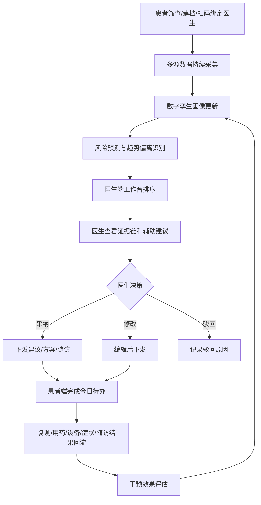
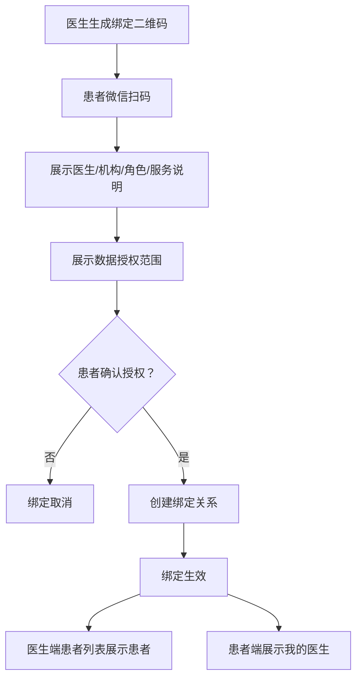
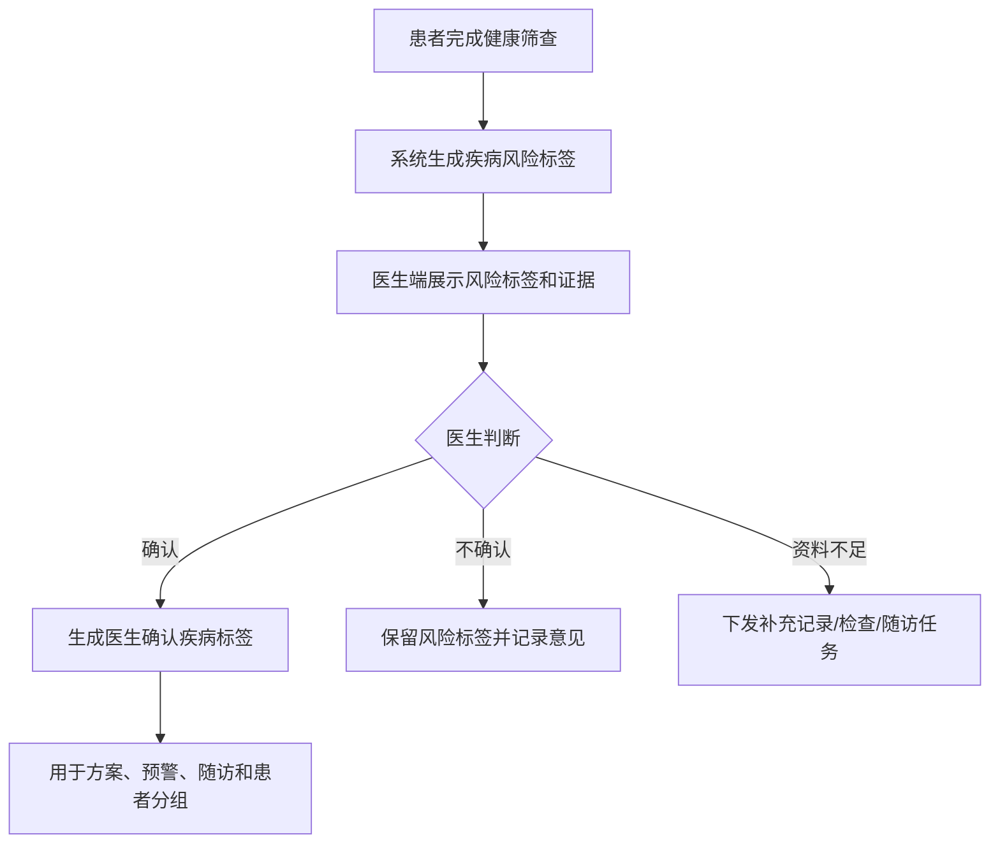
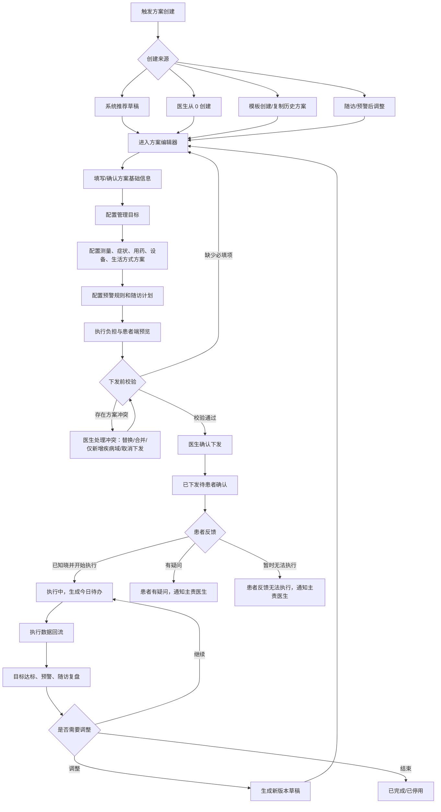
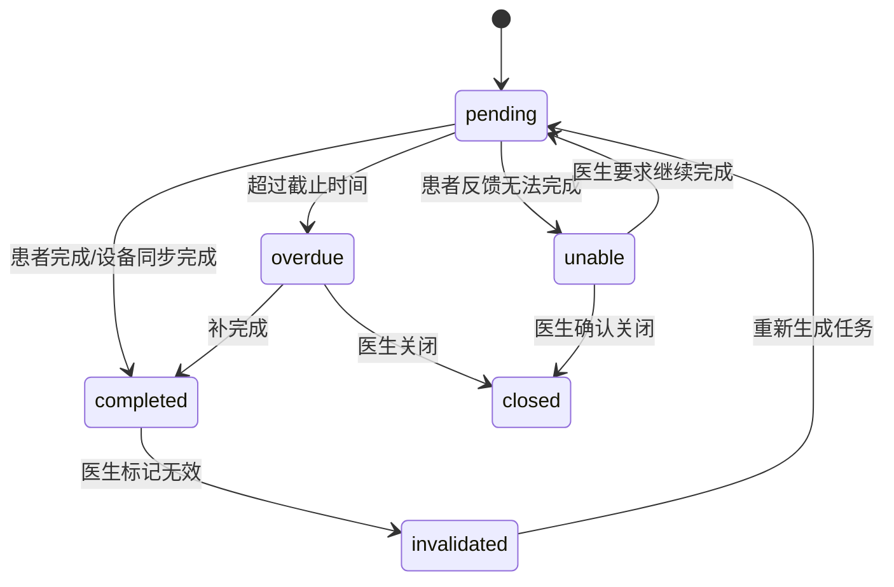

# 医生 PC 端 PRD

版本：V1.0 目标态
适用端：医生 PC 管理端
关联患者端：微信小程序
关联疾病：糖尿病、慢阻肺、睡眠呼吸障碍
产品定位：慢病数字孪生辅助诊疗医生工作台

## 1. 产品定位

医生 PC 端是慢病数字孪生智能管理平台的临床工作台，承接患者端微信小程序、居家设备、健康筛查、院内检查、用药、症状、随访和医生处置数据，为医生提供患者分层管理、风险预测、辅助诊断、治疗反应评估、随访干预和效果追踪能力。

医生端不只是“看数据”的后台，而是面向慢病连续管理的辅助诊疗系统。系统通过多源数据融合形成患者个体化疾病画像和数字孪生状态，帮助医生提升疾病状态预测准确率、治疗反应/耐药风险识别灵敏度、远程诊断与治疗方案准确率，并降低患者并发症发生率。

医学安全边界：

- 系统提供风险提示、证据解释、辅助诊疗建议和方案推荐。
- 系统不自动确诊、不自动开方、不替代医生做最终医疗决策。
- 所有诊断结论、治疗建议、用药调整、转诊建议必须由医生确认后生效。
- 所有模型输出必须可解释、可追溯、可被医生采纳、修改或驳回。

## 2. 产品目标

| 目标 | 说明 |
| --- | --- |
| 提升疾病状态预测准确率 | 融合连续指标、症状、用药、设备报告和院内检查，识别个体趋势偏离 |
| 提升治疗反应/耐药风险识别灵敏度 | 区分依从性不足、记录缺失、生活方式影响、药物反应不足和疑似治疗不敏感 |
| 提升远程诊断与治疗方案准确率 | 为医生提供结构化证据、相似历史、风险解释和可编辑方案建议 |
| 降低并发症率 | 通过早期预警、及时复测、随访、转诊和方案调整减少长期风险 |
| 提升医生管理效率 | 让医生优先处理高风险、高价值、需干预患者 |
| 建立模型反馈闭环 | 记录医生采纳、修改、驳回和干预效果，持续优化规则和模型 |

## 3. 用户角色

| 角色 | 使用范围 | 核心任务 |
| --- | --- | --- |
| 专科医生 | 内分泌科、呼吸科、睡眠医学科 | 复杂风险处理、诊断辅助、治疗方案确认、报告解读 |
| 家庭医生 | 社区医院、基层医疗、家庭医生签约服务 | 扫码绑定患者、作为主责医生进行多病共管、长期随访、一般预警处理、转诊建议 |
| 慢病管理医生/护士 | 慢病中心、互联网医院、健康管理团队 | 患者管理、任务提醒、随访记录、依从性干预 |
| 科室负责人 | 科室或慢病项目管理 | 查看质控、预警处理效率、随访完成率、服务效果 |
| 医院/项目管理员 | 医院、区域平台、项目运营方 | 管理机构、账号、角色、规则、模板、内容和审计 |

权限原则：

- 医生只能查看通过医生二维码扫码绑定并获得患者授权的患者。
- 家庭医生或专科医生均可作为患者当前主责医生；当前主责医生负责当前管理方案、预警、随访和医嘱与指导闭环。
- 家庭医生默认处理多病共管、日常随访、记录缺失、一般预警和转诊建议。
- 专科医生可作为主责医生，也可在转诊/会诊场景中作为协作医生处理复杂风险、治疗方案确认、疑似急性加重、疑似治疗不敏感和诊断辅助。
- 护士/健康管理师可执行提醒、随访记录和患者教育，但不能确认诊断或治疗调整。
- 科室负责人和管理员以质控和运营为主，不能绕过患者授权查看不相关患者隐私。

## 4. 核心业务闭环



## 5. 医患扫码绑定

### 5.1 绑定目标

扫码绑定用于建立医生与患者的服务关系。当前版本以“一个患者当前只有一个主责医生”为核心模型，主责医生可以是家庭医生，也可以是专科医生。当前版本只支持“医生生成二维码，患者扫码确认授权”这一条主流程；暂不纳入后台/机构分配患者、患者扫码机构码、服务团队绑定。绑定生效后，医生端可查看患者授权范围内的数据，患者端可看到当前主责医生、医嘱与指导、随访计划和方案待办。

### 5.2 绑定入口

| 发起方 | 入口 | 场景 |
| --- | --- | --- |
| 医生 PC 端 | 患者管理 - 添加患者 | 门诊、社区随访、义诊、家庭医生签约 |
| 医生 PC 端 | 工作台 - 快速绑定患者 | 医生现场快速建立服务关系 |
| 患者小程序 | 我的医生 - 扫码绑定 | 患者主动绑定医生 |
| 患者小程序 | 首页/健康档案绑定提示 | 未绑定医生且有高风险或随访需求 |

### 5.3 绑定流程



### 5.4 绑定规则

- 二维码有效期建议 10 分钟，过期后不可使用。
- 二维码必须绑定医生 ID、机构 ID、医生角色、生成时间、有效期和服务类型。
- 患者扫码后必须看到医生姓名、机构、科室/社区医院、角色、服务说明和授权范围。
- 患者确认授权后才可建立绑定关系，不允许静默绑定。
- 当前版本默认患者确认后绑定生效；医生二次确认、机构分配、服务团队绑定不纳入当前医患关系建立流程。
- 患者和医生均可申请解绑，解绑后医生不能查看患者新增数据。
- 历史处理记录、方案、随访、建议和审计日志必须保留。
- 授权范围变更、解绑、重新绑定必须记录操作日志。

### 5.5 主责医生与协作医生

本期医患关系采用“单一主责医生 + 转诊场景协作医生”的模型：

| 关系类型 | 说明 | 主要权限 |
| --- | --- | --- |
| 主责医生 | 患者当前唯一主责医生，可以是家庭医生或专科医生 | 创建/调整管理方案、处理预警、创建随访、下发医嘱与指导、查看授权数据 |
| 协作医生 | 转诊、会诊或专科协作场景下添加 | 查看授权范围内数据，给出会诊/转诊意见；是否可编辑方案由权限控制 |
| 历史医生 | 曾经作为主责医生或协作医生，但关系已结束 | 查看自己历史处理记录，默认不可编辑当前方案 |

核心规则：

- 一个患者同一时间只能有一个 active 主责医生。
- 家庭医生和专科医生都可以成为主责医生。
- 当前管理方案、预警处理、随访计划、医嘱与指导默认归属主责医生。
- 转诊不自动变更主责医生；转诊先作为医嘱与指导/转诊记录存在。
- 如果需要主责医生变更，必须由新主责医生接收并经患者授权确认，原主责医生关系转为历史。
- 协作医生只能在转诊/会诊场景中添加，默认不拥有患者完整长期管理权限。
- 患者端展示当前主责医生；如存在协作医生，可在“协作医生/转诊记录”中展示来源、角色和有效期。

### 5.6 转诊与主责医生变更

转诊分为两类：

| 类型 | 是否改变主责医生 | 说明 |
| --- | --- | --- |
| 转诊建议/专科评估 | 否 | 主责医生不变，患者按医嘱线下就诊或绑定协作医生，结果回流后由主责医生复盘 |
| 主责医生变更 | 是 | 新医生接收患者并经患者授权确认后，成为新的主责医生 |

主责医生变更流程：

```text
原主责医生发起转出或患者发起更换
  -> 新医生生成接收二维码或确认接收
  -> 患者确认授权
  -> 新医生成为主责医生
  -> 原主责医生关系转为历史
  -> 当前执行方案进入待复核状态
  -> 新主责医生选择继续、调整或停用当前方案
```

### 5.7 绑定状态

| 状态 | 说明 |
| --- | --- |
| pending_patient | 已生成二维码，等待患者扫码确认 |
| active | 绑定生效 |
| collaborator_active | 协作医生关系生效 |
| transferred | 主责医生已变更，原关系转为历史 |
| rejected | 医生拒绝或患者取消 |
| expired | 二维码过期 |
| revoked | 已解绑 |

## 6. 信息架构

医生 PC 端采用左侧主导航、顶部全局搜索、右侧内容工作区的结构。

| 一级模块 | 页面 | 说明 |
| --- | --- | --- |
| 工作台 | 今日概览、重点患者、待办队列 | 医生每日工作入口 |
| 患者管理 | 患者列表、分组、标签、扫码绑定 | 管理患者池 |
| 患者 360 | 总览、时间轴、趋势、记录、报告、方案 | 单患者全景管理 |
| 数字孪生 | 疾病画像、个体基线、趋势偏离、风险解释 | 辅助诊疗核心 |
| 风险预警 | 预警列表、预警详情、处置闭环 | 集中处理风险事件 |
| 辅助诊疗 | 诊断辅助、治疗反应评估、方案推荐 | 医生确认后生效 |
| 管理方案 | 方案模板、患者方案、测量/记录/用药/设备/随访方案 | 下发患者端待完成事项 |
| 随访管理 | 随访日历、随访详情、随访结论 | 标准化随访 |
| 设备与报告 | 设备状态、睡眠报告、血氧报告 | 管理设备数据可信度 |
| 医嘱与指导 | 医嘱与指导、患者阅读、执行反馈 | 医患沟通留痕 |
| 数据看板 | 人群指标、服务质量、模型效果 | 项目和科室质控 |
| 系统设置 | 账号、角色、规则、模板、审计 | 管理配置 |

## 7. 疾病标签管理

### 7.1 标签定位

疾病标签不由患者手动选择后直接生效，而是采用“健康筛查系统提示疾病风险 + 医生确认疾病”的机制。

| 标签类型 | 来源 | 用途 |
| --- | --- | --- |
| 疾病风险标签 | 健康筛查、关键指标、设备报告、症状问卷 | 风险分层、医生提醒、补充资料建议 |
| 医生确认疾病 | 医生根据院内诊断、筛查结果、记录趋势和设备报告确认 | 正式管理方案、随访路径、预警规则、患者分组 |

### 7.2 标签流程



### 7.3 医生端操作

- 查看风险标签证据。
- 确认疾病标签。
- 修改疾病标签。
- 移除医生确认疾病标签。
- 标记资料不足并下发补充任务。
- 查看标签变更历史。

### 7.4 展示规则

- 患者端展示“疾病风险”时必须使用风险提示文案，不表达为确诊。
- 医生确认后，患者端健康档案可展示“医生确认疾病”。
- 医生端患者列表同时展示疾病风险标签和医生确认疾病标签，但视觉上需要区分。
- 医生确认疾病标签变化后，管理方案、随访计划、预警规则和数字孪生画像需要同步更新。

## 8. 工作台

### 8.1 页面目标

工作台帮助医生优先处理最需要医学干预的患者，而不是简单按时间展示数据。

### 8.2 页面布局

```text
顶部：全局搜索患者姓名/手机号/患者ID/设备号

关键指标卡：
待处理高风险  今日随访  疑似急性风险  疑似治疗不敏感  数据缺失  待确认方案

主工作区：
左侧：优先处理队列
中间：选中患者摘要
右侧：快捷操作和最近处理记录

底部：质控与服务效果摘要
```

### 8.3 待处理队列

| 队列 | 排序逻辑 | 典型动作 |
| --- | --- | --- |
| 紧急预警 | 红色事件、严重异常、伴随急性症状 | 查看证据、建议就医、发起随访 |
| 疑似急性加重 | 慢阻肺症状升高、SpO2 下降、用药异常 | 症状复评、复测血氧、转诊建议 |
| 疑似治疗不敏感 | 指标持续不达标且依从性较好 | 复核用药、建议检查、专科评估 |
| 数据缺失 | 关键任务连续未完成 | 发送提醒、安排随访 |
| 待确认方案 | 系统生成或患者状态变化触发 | 审核并下发方案 |
| 今日随访 | 到期、逾期、预警后随访 | 填写随访结论 |

### 8.4 优先级规则

1. 红色风险或疑似急性风险。
2. 橙色风险且 24 小时内未处理。
3. 疑似治疗不敏感或连续方案失败。
4. 今日随访或逾期随访。
5. 连续缺失关键数据。
6. 待确认方案和新完成筛查患者。

## 9. 患者管理

### 9.1 页面定位

患者管理列表用于帮助医生、家庭医生和慢病管理人员快速完成“找患者、看状态、筛选处理”。列表页不承载深度分析，深度分析进入患者 360。

核心任务：

- 找到某个患者。
- 找到当前最需要处理的患者。
- 识别高风险、待随访、数据缺失、方案需调整人群。
- 快速发起预警处理、随访、建议、扫码绑定。
- 通过顶部统计卡和筛选条件快速定位需要处理的患者。

### 9.2 页面布局

```text
顶部工具区
  搜索框：姓名 / 手机号 / 患者ID / 设备号
  主按钮：添加患者，点击后展示绑定二维码
  快捷入口：导入/刷新

统计概览
  全部患者  高风险  今日随访  数据缺失  待确认疾病  待确认方案  待处理预警

左侧筛选区
  重点关注、风险等级、疾病标签、确诊疾病、方案状态、随访状态、数据状态

右侧患者列表
  患者卡片/表格行
  行内快捷操作
```

### 9.3 顶部统计卡

| 统计卡 | 口径 | 点击行为 |
| --- | --- | --- |
| 全部患者 | 当前医生授权患者总数 | 清空快捷筛选 |
| 高风险 | 当前红色/橙色风险患者 | 筛选高风险 |
| 今日随访 | 今天计划随访患者 | 筛选今日随访 |
| 数据缺失 | 连续缺失关键记录患者 | 筛选数据缺失 |
| 待确认疾病 | 有疾病风险标签但未医生确认 | 筛选待确认标签 |
| 待确认方案 | 系统已为患者生成管理方案，但尚未医生审核确认 | 筛选待确认方案患者 |
| 待处理预警 | 状态为待医生处理 | 跳转或筛选预警患者 |

### 9.4 筛选条件

| 筛选组 | 选项 |
| --- | --- |
| 重点关注 | 全部、仅看重点关注 |
| 风险等级 | 低风险、中风险、高风险、疑似急性风险 |
| 疾病风险标签 | 糖尿病风险、慢阻肺风险、睡眠呼吸障碍风险 |
| 确诊疾病 | 糖尿病、慢阻肺、睡眠呼吸障碍、多病共管 |
| 管理状态 | 新建档、已筛查、方案执行中、干预中、待随访 |
| 方案状态 | 无方案、系统已生成待医生确认、已下发待患者确认、执行中、患者有疑问、患者反馈无法执行、需调整、待复盘 |
| 数据状态 | 今日已记录、今日未记录、连续缺失、设备同步异常 |
| 治疗反应 | 达标、波动大、疑似依从性差、疑似治疗不敏感 |
| 随访状态 | 今日、本周、逾期、已完成 |

筛选规则：

- 支持多条件组合。
- 顶部统计概览卡片支持点击快捷筛选。
- 左侧筛选区支持手动组合筛选。
- 点击“全部患者”清空快捷筛选和手动筛选。
- 第一版不支持保存常用筛选。

### 9.5 排序规则

患者列表默认按绑定时间倒序排列，最新绑定的患者排在前面。

第一版不支持复杂排序和医生自定义排序。医生通过顶部统计概览卡片和左侧筛选区快速定位高风险、今日随访、待确认方案、数据缺失等患者。

### 9.6 患者列表字段

| 字段 | 说明 |
| --- | --- |
| 患者信息 | 姓名、性别、年龄、手机号脱敏、患者 ID |
| 医患关系 | 当前主责医生、医生角色、是否存在协作医生、绑定状态、绑定时间 |
| 标签 | 疾病风险标签、医生确认疾病、重点关注标签 |
| 今日状态 | 今日待办完成度、是否有新记录、是否有待办 |
| 最新关键指标 | 血糖、血压、SpO2、睡眠摘要、症状摘要，展示异常高亮 |
| 数字孪生状态 | 稳定、趋势偏离、风险升高、干预中 |
| 最新预警 | 预警等级、预警名称、触发时间 |
| 治疗反应 | 达标、波动、疑似依从性差、疑似治疗不敏感 |
| 设备状态 | 已绑定、未绑定、同步异常、报告生成中、报告无效 |
| 方案状态 | 无方案、系统已生成待医生确认、已下发待患者确认、执行中、患者有疑问、患者反馈无法执行、需调整、待复盘 |
| 随访状态 | 下次随访日期、是否逾期、随访类型 |
| 操作 | 查看 360、处理预警、发医嘱与指导、建随访、标记重点 |

### 9.7 行内快捷操作

| 操作 | 触发条件 | 结果 |
| --- | --- | --- |
| 查看 360 | 所有患者 | 进入患者详情 |
| 处理预警 | 有待处理预警 | 打开预警处理抽屉或跳转预警详情 |
| 发送医嘱与指导 | 所有患者 | 打开医嘱与指导模板弹窗 |
| 创建随访 | 所有患者 | 打开随访创建弹窗 |
| 确认疾病 | 有疾病风险标签未确认 | 打开疾病标签确认弹窗 |
| 调整方案 | 有执行中方案或需调整 | 进入方案编辑 |
| 绑定设备提醒 | 未绑定关键设备 | 给患者发送设备绑定建议 |
| 标记重点 | 所有患者 | 加入重点关注 |

### 9.8 批量操作

第一版暂不支持批量操作。

说明：

- 患者列表不提供批量选择。
- 不支持批量发送提醒、批量标记重点、批量分配随访任务。
- 不支持任何批量诊疗相关动作，例如批量确认疾病、批量调整方案、批量关闭预警。
- 后续如需提升运营效率，可在明确权限和风控后再设计批量能力。

### 9.9 空状态与异常状态

| 场景 | 页面表现 |
| --- | --- |
| 无患者 | 展示“暂无患者”，主按钮为“添加患者”，点击后展示绑定二维码 |
| 无筛选结果 | 展示“当前筛选无患者”，支持清空筛选 |
| 数据同步失败 | 列表顶部提示“部分数据同步延迟” |
| 患者已解绑 | 保留历史处理记录，患者行置灰，新增数据不可见 |
| 权限不足 | 不展示敏感信息，提示无查看权限 |

## 10. 患者 360

患者 360 是医生端单患者主页面，按“概览 - 证据 - 决策 - 执行 - 反馈”组织信息。医生从这里完成单患者状态判断、风险解释、辅助诊疗、方案调整和随访复盘。

### 10.1 页面布局

```text
顶部患者条
  基础信息 / 医患关系 / 疾病标签 / 风险等级 / 快捷操作

左侧锚点导航
  总览、数字孪生、指标趋势、记录明细、睡眠报告、设备、预警、方案、随访、医嘱与指导

中间主内容区
  当前选中模块详情

右侧决策侧栏
  当前风险、系统建议、医生操作、最近处理记录
```

设计原则：

- 顶部患者条始终吸顶，医生滚动查看时仍能看到患者身份和关键风险。
- 右侧决策侧栏固定展示当前可执行动作，减少医生在页面中来回寻找按钮。
- 所有系统建议必须提供证据入口，不允许只给结论。
- 患者 360 默认进入“总览”，高风险跳转时可直接定位到预警详情。

### 10.2 顶部患者条

展示：

- 姓名、性别、年龄、手机号脱敏。
- 当前主责医生、医生角色；存在协作医生时展示协作医生数量和来源。
- 疾病风险标签、医生确认疾病、风险等级、数字孪生状态。
- 绑定设备、最近同步时间。
- 当前方案、方案执行率。
- 待处理预警和待随访。
- 快捷操作：处理预警、调整方案、发送医嘱与指导、创建随访、转诊。

快捷操作规则：

- 有紧急预警时，主按钮为“处理预警”。
- 有待确认疾病标签时，显示“确认疾病”。
- 有疑似治疗不敏感时，显示“复核方案”。
- 无当前方案时，显示“生成方案”。
- 有今日随访时，显示“记录随访”。

### 10.3 总览模块

总览用于让医生在 1 分钟内理解患者当前状态。

内容结构：

| 区域 | 内容 |
| --- | --- |
| 当前结论 | 当前总体状态、最高风险、需要优先处理的事项 |
| 疾病标签 | 系统风险标签、医生确认疾病、待确认标签 |
| 近期异常 | 最近 7/30 天异常指标、症状、设备报告 |
| 今日待办 | 患者今日记录、用药、随访准备完成度 |
| 方案执行 | 当前方案目标、执行率、待调整提示 |
| 医嘱与指导 | 最近医嘱/指导、患者是否已读/执行 |

### 10.4 数字孪生模块

内容：

- 个体基线。
- 疾病画像。
- 趋势偏离。
- 疾病状态预测。
- 治疗反应/疑似不敏感。
- 风险解释和证据链。
- 干预效果评估。

交互：

- 点击风险结论查看证据。
- 医生可对系统判断标记：符合、部分符合、不符合、需复核。
- 医生反馈进入模型效果评估。

### 10.5 时间轴模块

时间轴按时间倒序聚合所有关键事件：

| 类型 | 示例 |
| --- | --- |
| 筛查 | 完成健康筛查、评分变化、风险标签生成 |
| 记录 | 血糖、血压、血氧、症状、用药、睡眠 |
| 设备 | 设备绑定、同步、报告生成、无效报告 |
| 预警 | 预警触发、患者复测、医生处理 |
| 方案 | 方案创建、下发、调整、停用 |
| 随访 | 随访创建、完成、结论 |
| 医嘱与指导 | 医嘱/指导发送、患者已读、患者执行 |

交互：

- 支持按事件类型筛选。
- 支持点击事件打开详情抽屉。
- 关键医疗操作展示操作者和时间。

### 10.6 指标趋势模块

展示：

- 血糖、血压、血氧、睡眠、症状、用药趋势。
- 支持近 7 天、30 天、90 天、自定义。
- 支持异常点联动记录明细。
- 支持按疾病视角组合指标，例如糖尿病视角、慢阻肺视角、睡眠视角。

### 10.7 记录明细模块

展示所有患者端记录和设备数据，字段包括：

- 记录时间。
- 指标名称和值。
- 单位。
- 状态。
- 来源。
- 场景。
- 设备号。
- 关联症状/用药。
- 备注。
- 修改记录。

医生操作：

- 查看详情。
- 添加医生备注。
- 标记设备记录无效。
- 建议患者复测。

### 10.8 睡眠报告模块

展示：

- 睡眠报告列表。
- 单次睡眠报告分析。
- AHI、ODI、最低血氧、低氧时长。
- 睡眠分期、体位、鼾声、体动。
- CPAP 使用情况。
- 报告有效性和设备能力。

医生操作：

- 查看完整报告。
- 标记报告无效。
- 建议复测睡眠。
- 建议线下睡眠评估或 CPAP 随访。

### 10.9 预警模块

展示：

- 当前待处理预警。
- 历史预警。
- 预警证据链。
- 医生处理记录。
- 患者复测和执行反馈。

医生操作：

- 处理预警。
- 关闭预警。
- 转随访。
- 转专科。
- 下发复测任务。

### 10.10 管理方案模块

展示：

- 当前方案。
- 管理目标：阶段目标、量化目标。
- 指标测量方案。
- 症状记录方案。
- 用药方案。
- 设备监测方案。
- 用药/治疗建议。
- 方案执行率。
- 历史方案。

医生操作：

- 创建方案。
- 调整方案。
- 停用方案。
- 下发患者端。
- 进入方案复盘。

### 10.11 随访模块

展示：

- 当前随访计划。
- 随访准备材料。
- 历史随访结论。
- 下次随访建议。

医生操作：

- 创建随访。
- 记录随访结论。
- 调整下次随访时间。
- 生成随访后建议。

### 10.12 医嘱与指导模块

展示：

- 已发送医嘱与指导。
- 来源：预警、随访、方案、手动。
- 患者是否已读。
- 是否生成患者端待办。
- 患者执行反馈。

医生操作：

- 发送新医嘱或指导。
- 使用模板。
- 编辑后发送。
- 查看执行情况。

### 10.13 右侧决策侧栏

右侧侧栏根据当前患者状态动态变化。

| 状态 | 主操作 |
| --- | --- |
| 紧急预警 | 处理预警、建议就医、创建随访 |
| 待确认疾病标签 | 确认疾病、标记资料不足 |
| 疑似治疗不敏感 | 复核方案、建议检查、转专科 |
| 数据连续缺失 | 发送记录提醒、创建随访 |
| 睡眠报告异常 | 查看报告、建议复测、建议睡眠评估 |
| 方案到期 | 方案复盘、创建新方案 |

### 10.14 页面 Tab

| Tab | 说明 |
| --- | --- |
| 总览 | 当前状态、近期异常、今日待完成、医嘱与指导 |
| 时间轴 | 筛查、记录、报告、预警、随访、方案调整 |
| 数字孪生 | 个体基线、趋势偏离、风险解释、预测结果 |
| 指标趋势 | 血糖、血压、血氧、睡眠、症状、用药 |
| 记录明细 | 所有患者端和设备数据 |
| 睡眠报告 | 睡眠报告列表和单次分析 |
| 设备管理 | 设备绑定、同步状态、设备能力 |
| 健康筛查 | 筛查结果和原始问卷 |
| 管理方案 | 当前方案、历史方案、测量/记录/用药/设备方案 |
| 随访记录 | 随访计划、准备材料、结论 |
| 医嘱与指导 | 医嘱与指导历史、患者阅读和执行状态 |

## 11. 数字孪生辅助诊疗

### 11.1 模块定位

数字孪生模块用于汇总患者个体化疾病状态，提供风险预测、趋势偏离解释、治疗反应评估和辅助诊疗建议。它是医生决策支持工具，不是自动诊断工具。

### 11.2 数字孪生画像

| 画像层 | 内容 | 用途 |
| --- | --- | --- |
| 基础画像 | 年龄、性别、BMI、家族史、吸烟史、生活方式 | 基础风险分层 |
| 疾病画像 | 糖尿病类型/风险、慢阻肺分级、OSA 风险/诊断 | 多病共管 |
| 生理状态 | 血糖、血压、SpO2、脉率、睡眠、体重、肺功能 | 状态识别 |
| 行为状态 | 用药、饮食、运动、吸烟、CPAP/氧疗执行 | 依从性分析 |
| 症状状态 | 症状类型、程度、持续时间、关联指标 | 急性风险识别 |
| 风险状态 | 急性风险、并发症风险、治疗不敏感风险 | 预警和随访 |
| 干预状态 | 医嘱与指导、方案、随访、患者执行结果 | 效果评估 |

### 11.3 趋势偏离分析

展示：

- 当前值 vs 个体基线。
- 近 7 天、30 天、90 天趋势。
- 异常点与症状、用药、睡眠、设备报告的关联。
- 系统判定的主要偏离原因。
- 数据可信度：记录完整度、设备有效性、缺失情况。

交互：

- 点击趋势点查看原始记录。
- 点击风险解释查看规则版本、模型版本和证据快照。
- 医生可标记“符合临床判断 / 不符合 / 需复核”。

### 11.4 疾病状态预测

| 疾病 | 预测目标 | 关键证据 |
| --- | --- | --- |
| 糖尿病 | 高/低血糖风险、血糖波动风险、长期并发症风险 | 血糖时点、血压、BMI、用药、症状、HbA1c、依从性 |
| 慢阻肺 | 急性加重风险、低氧风险、症状恶化风险 | SpO2、呼吸频率、咳痰气促、CAT/mMRC、吸入药、活动能力 |
| 睡眠呼吸障碍 | 夜间低氧风险、OSA 风险、CPAP 依从性风险 | AHI、ODI、最低血氧、低氧时长、ESS、STOP-Bang、CPAP 使用 |

输出要求：

- 展示风险等级、置信度、主要证据和建议动作。
- 不使用绝对化文案，如“必然发生”“已确诊”。
- 医生可采纳、修改、驳回，系统记录反馈。

### 11.5 治疗反应与耐药风险识别

慢病场景下“耐药机制识别”在产品层面不直接等同于分子机制诊断，应先落为“治疗反应不足/疑似耐药或不敏感风险识别”。系统需要帮助医生区分以下情况：

| 类型 | 判断线索 | 医生动作 |
| --- | --- | --- |
| 依从性不足 | 漏服、未测、设备未同步、任务未完成 | 加强提醒、随访教育 |
| 生活方式影响 | 饮食、运动、睡眠、吸烟等备注异常 | 生活方式干预 |
| 治疗反应不足 | 依从性较好但指标持续不达标 | 复核方案、建议检查、专科评估 |
| 疑似药物不良反应 | 症状与用药时间相关 | 记录不良反应、医生评估 |
| 疑似耐药/治疗不敏感 | 多次方案调整后仍异常，排除依从性问题 | 建议进一步检查或转专科 |

重要边界：

- 系统只提示“疑似治疗反应不足/疑似耐药风险”，不得直接给出耐药诊断。
- 需要医生结合检查、病史、用药和临床判断确认。
- 每次医生判断要记录依据和处理结果，用于模型持续优化。

## 12. 指标趋势与记录明细

### 12.1 血糖趋势

展示：

- 空腹、餐后 2h、睡前、随机等分时点趋势。
- 达标率、偏高次数、偏低次数、波动幅度。
- 低血糖事件和高血糖事件。
- 血糖与饮食、运动、用药、睡眠、症状的关联。
- 个体目标范围和医生调整历史。

### 12.2 血压趋势

展示：

- 收缩压/舒张压双线趋势。
- 晨起、睡前、随机等场景。
- 与头痛、头晕、睡眠低氧、用药的关联。
- 高血压风险和并发风险提示。

### 12.3 血氧呼吸趋势

展示：

- SpO2、脉率、呼吸频率趋势。
- 活动后、静息、睡前等场景。
- 低氧事件次数。
- 与胸闷、气短、咳嗽、喘息、紫绀等症状关联。
- 夜间低氧进入睡眠报告，不混入白天血氧趋势主图。

### 12.4 睡眠趋势

展示：

- 睡眠时长、入睡/起床时间、睡眠效率。
- AHI、ODI、最低血氧、平均血氧、低氧累计时长。
- 睡眠分期、体位、鼾声、体动。
- CPAP 使用时长、漏气、残余 AHI。
- 报告有效性和设备能力说明。

### 12.5 症状趋势

展示：

- 症状类型分布。
- 严重程度变化。
- 症状与指标异常、用药、睡眠的关联。
- “今日无不适”记录。
- 慢阻肺 CAT/mMRC、睡眠 ESS 等量表变化。

### 12.6 用药与治疗执行

展示：

- 用药计划执行率。
- 漏服、补服、待服。
- 吸入药、氧疗、CPAP 执行情况。
- 患者备注、不良反应。
- 治疗反应与指标变化关联。

### 12.7 记录明细字段

| 字段 | 说明 |
| --- | --- |
| 记录时间 | 精确到分钟 |
| 指标名称 | 血糖、血压、SpO2、症状、用药等 |
| 指标值 | 数值或文本 |
| 单位 | mmol/L、%、mmHg、次/分 |
| 状态 | 正常、偏高、偏低、异常、无效 |
| 记录场景 | 血糖时点、血氧场景、症状场景 |
| 数据来源 | 手动记录、设备采集、医生录入、院内检查 |
| 设备号 | 设备数据必显 |
| 关联症状 | 有则展示 |
| 关联用药 | 有则展示 |
| 规则版本 | 状态判定和预警依据 |
| 备注 | 患者备注、医生备注 |
| 修改记录 | 修改人、修改时间、修改原因 |

## 13. 风险预警

风险预警模块承接患者端健康风险分、疾病专项分、异常指标、症状、用药和设备数据。患者端展示“分值 + 易懂原因 + 行动建议”，医生端展示“风险等级 + 预警事件 + 证据链 + 处置闭环”。

### 13.1 健康风险分与风险分层

#### 13.1.1 分值定义

- 分值范围：0-100 分。
- 分值方向：分数越高，表示近期慢病管理状态越稳定。
- 患者端展示：总分、等级、较昨日变化、主要扣分原因、下一步行动。
- 医生端展示：总分、专项分、风险等级、扣分构成、规则/模型版本、证据快照。
- 分值仅作为风险提示和患者管理排序依据，不作为诊断结论。

#### 13.1.2 综合风险等级

| 健康风险分 | 医生端风险等级 | 患者端表达 | 医生端默认动作 |
| ---: | --- | --- | --- |
| 85-100 | 低风险 | 状态稳定 | 常规管理 |
| 70-84 | 中风险 | 需要关注 | 观察趋势，必要时随访 |
| 50-69 | 高风险 | 风险偏高 | 进入待处理列表，建议医生查看 |
| 0-49 | 危急/高风险 | 建议尽快联系医生 | 强提醒，优先处理 |

特殊规则：

- 存在紧急预警时，总分最高不得超过 49 分。
- 存在重要预警未处理时，总分最高不得超过 69 分。
- 关键数据缺失会降低分值，但不能单独生成疾病诊断结论。
- 医生可针对个体化目标调整血糖、血压、血氧、睡眠等阈值，调整后必须记录规则版本。

#### 13.1.3 评分维度

| 维度 | 权重建议 | 医生端解释口径 |
| --- | ---: | --- |
| 指标状态 | 40 | 当前血糖、血氧、血压、睡眠等是否偏离目标 |
| 趋势变化 | 20 | 近 7/14/30 天是否持续变差 |
| 症状状态 | 15 | 症状是否出现、加重或与异常指标同向 |
| 用药/设备依从性 | 15 | 是否按计划用药、记录、佩戴或同步设备 |
| 数据完整度 | 10 | 是否按管理方案完成关键数据采集 |

公式：

```text
健康风险分 = max(0, min(100, 100 - 指标扣分 - 趋势扣分 - 症状扣分 - 依从性扣分 - 数据完整度扣分 + 改善加分))
```

医生端不直接展示复杂公式，默认展示“主要扣分原因”和“证据记录”。医生点击可查看完整规则版本、阈值、数据来源和计算时间。

#### 13.1.4 专项分

| 专项分 | 适用患者 | 核心依据 |
| --- | --- | --- |
| 血糖管理分 | 糖尿病风险/糖尿病患者 | 血糖时点、低血糖、高血糖、波动、记录频率、用药 |
| 血氧呼吸分 | 慢阻肺风险/慢阻肺患者 | SpO2、呼吸频率、低氧时长、症状、氧疗/设备数据 |
| 睡眠呼吸分 | 睡眠呼吸障碍风险/OSA 患者 | AHI、ODI、最低血氧、T90、睡眠时长、CPAP 依从性 |
| 用药依从分 | 所有管理中患者 | 打卡、漏服、备注、不良反应、医生方案执行 |

患者 360 顶部展示综合分，概览区展示专项分雷达或横向条。专项分下降时，系统需要说明对应疾病模块的主要证据。

#### 13.1.5 分值与预警关系

- 风险分层用于患者状态表达和快捷筛选。
- 预警用于具体异常事件处理。
- 分值下降不一定生成预警；但重要/紧急规则触发必须生成预警。
- 多个中风险事件叠加可导致综合分下降，并可通过高风险或分值筛选被医生识别。
- 预警处理后，若患者复测或随访结果改善，允许分值恢复，但保留历史分值快照。

#### 13.1.6 医生端展示位置

患者管理列表：

- 展示综合分、分值变化、风险等级、最高专项风险。
- 支持按分值区间和分值下降幅度筛选。
- 默认按绑定时间倒序展示患者；高风险、今日随访、待确认方案、数据缺失等场景通过统计卡和筛选区快速筛选。

患者 360：

- 顶部患者条展示综合分和风险等级。
- 总览模块展示专项分、扣分构成和近 30 天趋势。
- 预警模块展示具体事件和处理状态。
- 右侧决策栏展示“导致当前分值下降的前三项原因”。

预警详情：

- 展示触发前后分值变化。
- 展示本次预警影响的专项分。
- 展示是否触发分值上限规则，例如“存在危急低血糖，综合分上限 49”。

### 13.2 预警类型

本期必须支持的预警覆盖糖尿病、慢阻肺/血氧呼吸、睡眠呼吸障碍、高血压、用药/任务依从性和数据质量。预警用于风险提示、复测和医生处理，不用于自动诊断。

预警等级：

| 等级 | 页面表达 | 医生端处理要求 | 患者端表达 |
| --- | --- | --- | --- |
| 提醒 | 蓝/灰 | 可进入记录，不强制处理 | 建议关注 |
| 重要 | 黄/橙 | 进入待处理，可创建任务、建议或随访 | 建议复测/补充记录/联系医生 |
| 紧急 | 红 | 强提醒，建议尽快处理或线下就医 | 建议尽快联系医生或线下就医 |

### 13.3 本期必须预警规则

默认阈值需支持后台/医生端配置；若医生为患者设置了个体化目标，以个体化目标优先。

#### 13.3.1 糖尿病预警

| 预警 | 默认触发规则 | 等级 | 患者端动作 | 医生端动作 |
| --- | --- | --- | --- | --- |
| 低血糖 | 血糖 < 3.9 mmol/L | 重要 | 立即提示处理并复测 | 查看症状，发送建议，创建复测任务 |
| 严重低血糖 | 血糖 < 3.0 mmol/L，或患者记录意识异常/需要他人协助 | 紧急 | 强提示联系医生/线下就医 | 必须处理，必要时建议线下就医 |
| 空腹血糖连续偏高 | 空腹血糖连续 3 天高于医生目标；无个体目标时默认 > 7.0 mmol/L | 重要 | 复测并补充饮食/用药备注 | 查看趋势，调整记录频率，必要时创建随访 |
| 餐后血糖连续偏高 | 餐后 2h 血糖连续 3 次高于医生目标；无个体目标时默认 >= 10.0 mmol/L | 重要 | 补充饮食和用药备注 | 发送建议或创建随访 |
| 随机血糖明显偏高 | 随机血糖 >= 16.7 mmol/L，或伴明显不适症状 | 重要/紧急 | 复测并联系医生 | 查看症状，建议复诊/线下评估 |
| 血糖波动过大 | 近 7 天多次高/低血糖，或同日最高最低差明显扩大 | 重要 | 增加记录备注 | 评估依从性、饮食运动、用药执行 |

#### 13.3.2 慢阻肺/血氧呼吸预警

| 预警 | 默认触发规则 | 等级 | 患者端动作 | 医生端动作 |
| --- | --- | --- | --- | --- |
| 静息血氧偏低 | 静息 SpO2 < 90% | 重要 | 立即复测血氧并记录症状 | 查看趋势和症状，创建随访 |
| 明显低氧 | SpO2 < 88%，或低氧伴胸闷/明显气促 | 紧急 | 强提示联系医生/线下就医 | 必须处理，必要时建议线下就医 |
| 夜间低氧 | 睡眠期间 SpO2 < 90% 累计 >= 12 分钟 | 重要 | 查看睡眠报告 | 查看睡眠和呼吸证据，必要时随访 |
| 呼吸频率异常 | 呼吸频率 >= 24 次/分，或较个人基线明显升高 | 重要 | 复测并记录气促/胸闷 | 评估急性加重风险 |
| 症状加重 | 咳嗽、咳痰、气促、胸闷任 2 项较前明显加重 | 重要 | 完成症状评估 | 创建随访，必要时建议复诊 |
| 吸入药/氧疗执行异常 | 关键吸入药连续未打卡，或氧疗记录连续缺失 | 重要 | 补充执行记录和原因 | 评估依从性，发送建议 |

#### 13.3.3 睡眠呼吸障碍预警

| 预警 | 默认触发规则 | 等级 | 患者端动作 | 医生端动作 |
| --- | --- | --- | --- | --- |
| 中重度 AHI 异常 | AHI >= 15 次/小时 | 重要 | 查看睡眠报告 | 查看报告，建议持续监测或随访 |
| 重度 AHI 异常 | AHI >= 30 次/小时 | 重要 | 建议联系医生 | 创建睡眠随访，必要时建议线下评估 |
| ODI 异常 | ODI >= 15 次/小时，或较个人基线明显升高 | 重要 | 查看睡眠报告 | 结合最低血氧和 T90 判断 |
| 夜间最低血氧明显偏低 | 最低 SpO2 < 85% | 重要/紧急 | 联系医生并关注症状 | 必须查看报告，必要时建议线下评估 |
| 低氧负担升高 | T90 升高，或 SpO2 < 90% 累计时间明显增加 | 重要 | 查看报告 | 评估低氧风险和设备依从性 |
| CPAP 使用不足 | 近 7 天中 >= 3 天使用 < 4 小时，或连续 3 天未同步 | 重要 | 检查设备和佩戴情况 | 发送设备/佩戴建议或创建随访 |

#### 13.3.4 高血压预警

| 预警 | 默认触发规则 | 等级 | 患者端动作 | 医生端动作 |
| --- | --- | --- | --- | --- |
| 血压持续偏高 | 连续 3 次血压 >= 140/90 mmHg，或高于医生个体目标 | 重要 | 复测并补充用药/症状备注 | 查看趋势，发送建议或创建随访 |
| 血压明显升高 | SBP >= 180 mmHg 或 DBP >= 110 mmHg | 重要 | 安静休息后复测并联系医生 | 查看症状，必要时建议线下评估 |
| 疑似高血压急症风险 | SBP >= 180 或 DBP >= 110，且伴胸痛、呼吸困难、神经症状、剧烈头痛等 | 紧急 | 强提示线下就医 | 必须处理并留痕 |
| 血压伴症状 | 血压高于目标且记录头痛、胸闷、头晕、心悸 | 重要 | 补充症状并复测 | 评估风险并决定随访/复诊 |

#### 13.3.5 用药、任务与数据质量预警

| 预警 | 默认触发规则 | 等级 | 患者端动作 | 医生端动作 |
| --- | --- | --- | --- | --- |
| 关键用药未完成 | 关键用药提醒连续 2 次未完成或反馈无法完成 | 重要 | 补充原因 | 发送建议或创建随访 |
| 关键记录连续未完成 | 方案中的关键记录事项连续 3 天未完成 | 重要 | 补记录或反馈原因 | 数据缺失筛选可见，必要时随访 |
| 设备同步异常 | 关键设备连续 3 天未同步，或报告生成失败 | 提醒/重要 | 检查设备连接 | 发送设备同步建议 |
| 数据疑似异常 | 数值超出生理合理范围、设备数据质量差、重复记录冲突 | 提醒/重要 | 要求复测或确认 | 标记数据无效、要求复测 |

### 13.4 预警触发与升级规则

- 单次紧急规则触发，直接生成紧急预警。
- 同一疾病模块 24 小时内多个重要预警，可合并升级为紧急预警。
- 重要预警 24 小时内未复测或未处理，可升级医生端待处理优先级。
- 预警可被医生关闭，但必须选择原因：已处理、数据误差、设备误差、患者已线下处理、无需处理、其他。
- 预警关闭不删除原始记录，进入患者时间轴和审计日志。
- 预警触发后可生成患者端待办：复测、症状补充、报告上传、随访准备。

### 13.5 预警详情

展示：

- 预警结论。
- 预警等级和置信度。
- 触发前后健康风险分变化。
- 影响的专项分。
- 触发规则/模型版本。
- 原始证据记录。
- 趋势图和相似历史。
- 患者备注、症状、用药、设备状态。
- 推荐处理动作。

### 13.6 医生处理动作

| 动作 | 患者端可见 | 说明 |
| --- | --- | --- |
| 建议复测 | 是 | 生成患者端待办 |
| 发送医嘱与指导 | 是 | 模板选择后可编辑 |
| 调整记录频率 | 是 | 更新患者端待办规则 |
| 调整管理方案 | 是 | 医生确认后生效 |
| 创建随访 | 是 | 患者端展示随访计划 |
| 建议线下就医 | 是 | 紧急预警或疑似急性风险 |
| 转专科/转上级 | 是/可选 | 家庭医生转专科 |
| 继续观察 | 是 | 需填写原因 |
| 关闭预警 | 可选 | 需填写关闭原因 |
| 内部备注 | 否 | 医生端可见 |

处理要求：

- 紧急预警必须填写处理意见。
- 系统建议必须记录医生采纳、修改或驳回。
- 关闭预警必须记录原因。
- 处理后需要追踪患者是否执行，以及执行后的复测/随访结果。

## 14. 辅助诊疗

### 14.1 诊断辅助

系统根据健康筛查、院内检查、设备报告和连续记录给出结构化诊断参考。

展示：

- 疑似疾病或风险方向。
- 支持证据和反向证据。
- 缺失检查项。
- 建议补充资料。
- 参考指南或规则来源。

医生操作：

- 采纳为诊断参考。
- 修改后确认。
- 驳回并填写原因。
- 要求患者补充检查或转诊。

### 14.2 方案推荐

系统可基于患者状态推荐管理方案：

- 指标监测频率。
- 用药/治疗执行提醒。
- 睡眠监测或 CPAP 管理。
- 慢阻肺症状问卷和肺康复任务。
- 随访时间。
- 复诊或检查建议。

所有方案必须医生确认后下发。

### 14.3 远程诊疗摘要

为医生远程评估提供摘要：

- 近期关键异常。
- 指标趋势。
- 用药执行。
- 症状变化。
- 睡眠报告。
- 预警和处理历史。
- 患者主诉和问题。
- 系统建议关注点。

## 15. 管理方案

管理方案是医生确认后下发给患者的一段时间慢病管理计划。系统可以基于疾病标签、风险分层、健康风险分、近期指标、症状、用药和设备数据生成初始化方案草稿，但必须由医生审核、修改或确认后才能推送到患者端。

### 15.1 业务定位

| 模块 | 定位 | 产物 |
| --- | --- | --- |
| 初始化方案模板 | 系统根据疾病和风险分层生成管理建议草稿 | 待医生确认的方案 |
| 患者管理方案 | 医生确认后的正式阶段计划 | 患者端待办、目标、预警规则、随访计划 |
| 随访计划 | 检查方案执行效果的时间安排 | 计划内随访、临时随访、预警后随访 |
| 医嘱与指导 | 单次医疗处置要求、复测要求、复诊/转诊要求或健康管理指导 | 消息卡片、预警处理意见、随访后医嘱或指导 |

核心规则：

- 系统生成的是“推荐方案草稿”，不是自动医疗决策。
- 医生确认前患者不可见。
- 医生可以整体采纳、局部修改、驳回或改用空白方案。
- 方案发布后自动生成患者端今日待办、阶段目标、随访提醒和预警规则。
- 方案每次发布生成新版本，历史版本不可覆盖。

### 15.1.1 管理方案通用流程图



产品命名原则：

- 医生端页面不直接使用“任务配置”作为一级模块名称，避免显得像派工系统。
- 医生端使用医疗管理语境：指标测量方案、症状记录方案、用药方案、设备监测方案、随访计划、预警规则、患者指导。
- 患者端使用执行语境：今日待完成、今日记录、用药提醒、随访准备。
- 系统底层仍统一抽象为任务，用于生成患者端待完成事项、提醒、完成状态和依从性统计。

### 15.2 初始化方案生成条件

系统在以下场景触发初始化方案草稿生成或更新：

| 场景 | 触发条件 | 方案状态 |
| --- | --- | --- |
| 首次建档 | 患者完成筛查并与医生绑定 | 待医生确认 |
| 医生确认疾病 | 疾病风险标签被医生确认 | 待医生确认 |
| 风险等级变化 | 健康风险分跨等级下降或出现紧急预警 | 待医生确认 |
| 随访结束 | 医生选择“需要调整方案” | 草稿 |
| 预警处理 | 医生选择“调整管理方案” | 草稿 |

生成规则：

- 同一患者、同一主责医生、同一疾病域，在同一管理阶段只保留一个未下发草稿。
- 触发初始化方案时，系统优先检查是否已存在同疾病域、同主责医生、未下发的方案草稿。
- 若不存在未下发草稿，则创建初始化方案草稿。
- 若已存在未下发草稿，则更新原草稿的疾病标签、风险等级、推荐目标、推荐测量方案、随访建议和预警规则，不重复创建新草稿。
- 若草稿中已有医生手动修改内容，系统不得静默覆盖，应保留医生修改，并标记“系统建议已更新”，由医生选择是否应用新的推荐项。
- 若患者已有已下发或执行中方案，系统不得直接覆盖原方案；首次建档、疾病确认或风险变化只生成新版本草稿，医生确认后再下发。
- 随访结束或预警处理后，医生选择“需要调整方案/调整管理方案”时，优先基于当前执行方案生成新版本草稿；若已有调整草稿，则提示医生继续编辑、合并新建议或覆盖未确认推荐项。

生成输入：

- 医生确认疾病标签：糖尿病、慢阻肺、睡眠呼吸障碍、高血压。
- 疾病风险标签：尚未确诊但需管理的风险方向。
- 风险分层：低风险、中风险、高风险、危急/急性风险。
- 近期数据：7/14/30 天关键指标、症状、用药、设备、睡眠报告。
- 个体目标：年龄、合并症、医生设置的个体化目标。
- 当前方案版本和执行效果。

### 15.3 方案组成

| 模块 | 内容 | 是否患者端可见 |
| --- | --- | --- |
| 阶段信息 | 方案名称、适用疾病、风险等级、周期、版本 | 是 |
| 管理目标 | 阶段目标、量化目标、目标周期、达成判断口径 | 是 |
| 指标测量方案 | 血糖、血压、SpO2、呼吸频率、体重、睡眠指标等测量频率、时点、目标范围 | 是 |
| 症状记录方案 | 低血糖症状、咳嗽咳痰、气促、胸闷、夜间憋醒、晨起头痛等记录要求 | 是 |
| 用药方案 | 用药提醒、吸入药、漏服记录、用药备注、用药来源 | 是，诊疗敏感内容按医生确认后展示 |
| 设备监测方案 | 血糖仪、血压计、血氧仪、睡眠设备、CPAP 的采集要求和同步要求 | 是 |
| 生活方式方案 | 饮食、运动、戒烟、体重、睡眠卫生、肺康复 | 是 |
| 预警规则 | 复测、随访、就医、转诊触发条件 | 部分可见，患者端用易懂文案 |
| 随访计划 | 频率、首次随访时间、准备材料、触发条件 | 是 |
| 患者指导 | 面向患者的阶段说明、注意事项、异常处理提示 | 是 |
| 医生内部备注 | 医生判断、风险解释、后续关注点 | 否 |

### 15.3.1 医生端方案编辑原则

管理方案编辑采用“疾病模板 + 方案模块 + 少量关键参数调整”的方式，不让医生逐项从零搭建复杂规则。

页面一级模块建议固定为：

```text
管理目标
指标测量方案
症状记录方案
用药方案
设备监测方案
生活方式方案
随访计划
预警规则
患者指导
```

交互原则：

- 系统先按疾病标签、风险分层和近期数据生成草稿，医生在草稿上审核调整。
- 每个模块以卡片展示摘要，点击“编辑方案”后展开配置抽屉或右侧表单。
- 通用字段保持一致：适用疾病、执行频率、开始/结束时间、患者端说明、医生内部备注。
- 指标差异通过“专属字段”动态展示，例如血糖展示测量场景，血氧展示测量方式和低氧阈值。
- 医生端按钮文案使用“新增测量项、编辑方案、停用、确认下发”，不使用“新增任务、编辑任务”作为主文案。

患者端展示原则：

- 患者端不展示复杂配置，只展示“今日待完成/今日记录/用药提醒/随访准备”。
- 患者端说明必须面向患者可理解，例如“今天晚餐后 2 小时记录血糖”，不展示规则配置语言。
- 患者不可修改医生确认的目标、频率、用药剂量、治疗执行要求和随访时间。

### 15.3.2 用药方案边界

本系统的用药方案定位为“用药管理与提醒”，不是电子处方，不产生开药、购药、发药、处方流转或医保结算能力。

允许能力：

- 记录患者当前用药。
- 配置用药提醒和服药打卡。
- 记录漏服、补服、不良反应和患者备注。
- 统计用药执行率，用于随访复盘和依从性分析。
- 基于既有处方、线下医嘱、出院记录、专科治疗方案或患者当前用药配置管理提醒。

不支持能力：

- 不支持在线开具处方。
- 不支持处方审核、处方流转、药品支付、医保结算。
- 不支持患者自行修改医生确认的药品、剂量、频次和用药周期。

用药方案字段要求：

| 字段 | 必填 | 说明 |
| --- | --- | --- |
| 药品名称 | 是 | 可手动录入或从常用药品库选择 |
| 单次剂量/用量 | 是 | 如 0.5g、1 片、2 吸 |
| 服用频次 | 是 | 如每日 1 次、每日 2 次 |
| 服用时间 | 是 | 如早餐后、晚餐后、睡前 |
| 开始/结束日期 | 是 | 用于生成提醒和执行统计 |
| 用药目的 | 否 | 如降糖、降压、吸入治疗 |
| 用药来源 | 是 | 既有处方、线下医嘱、出院记录、专科方案、患者自述、随访确认 |
| 是否关键用药 | 否 | 关键用药漏服可触发提醒或随访关注 |
| 患者端说明 | 是 | 面向患者的通俗说明 |
| 医生内部备注 | 否 | 患者不可见 |

交互规则：

- 家庭医生或专科医生可基于患者既有处方、线下医嘱、出院记录、专科方案或随访确认结果配置用药方案。
- 新增药品、停用药品、修改剂量或频次时，必须选择用药来源并留痕。
- 若用药来源为“患者自述”，页面需提示医生确认来源可靠性，可要求患者上传处方或病历资料。
- 涉及复杂治疗调整、高风险药物或超出基层诊疗能力的内容，应通过复诊/转诊医嘱或专科协作处理。

### 15.3.3 管理目标与本期量化目标

管理目标由“阶段目标”和“量化目标”组成：

| 类型 | 定义 | 示例 |
| --- | --- | --- |
| 阶段目标 | 本周期希望患者达到的综合管理结果 | 未来 14 天降低夜间低氧风险，提升 CPAP 佩戴依从性 |
| 量化目标 | 用于判断阶段目标是否达成的结构化指标阈值 | AHI < 15 次/小时、最低血氧 >= 90%、CPAP 使用 >= 4 小时/晚 |

量化目标不是医生备注字段，需作为系统结构化字段参与以下逻辑：

- 达标判断：记录数据或设备数据回流后，按当前生效目标判断达标/未达标。
- 趋势评估：支持查看 7/14/30 天目标改善情况。
- 随访复盘：随访详情页展示目标完成情况，辅助医生判断是否继续或调整方案。
- 方案调整提示：连续未达标时提示医生考虑调整测量方案、用药方案、设备监测方案或随访频率。
- 预警辅助：超出量化目标不等于直接预警，但可作为风险升高、预警合并或随访优先级排序依据。

配置规则：

- 系统按疾病和风险分层预置默认量化目标。
- 医生可启用/停用目标，可调整目标范围和目标周期。
- 医生调整目标需留痕，历史记录按“记录发生时生效的目标”判断达标。
- 本期每个疾病最多预置 5 个核心量化目标，避免方案审核过重。
- 量化目标不自动改变治疗方案，只用于辅助医生判断和复盘。
- 量化目标为管理方案的全局结构化字段，同时支持在指标测量方案、用药方案、设备监测方案中就近编辑关联目标；任一入口修改后同步更新管理目标模块。

#### 15.3.3.1 管理目标填写规则

管理目标需要支持系统预置带出，也需要支持医生从 0 创建。医生从 0 创建时，至少需要填写阶段目标，并启用至少 1 个量化目标。

| 字段 | 类型 | 必填 | 填写方式 | 说明 |
| --- | --- | --- | --- | --- |
| 阶段目标 | textarea/template | 是 | 选择模板后编辑，或医生手动输入 | 面向本周期的综合管理结果，建议 20-80 字 |
| 目标周期 | select/date range | 是 | 默认跟随方案周期，可单独调整 | 用于计算目标达成情况，如 7/14/30 天 |
| 量化目标 | target list | 是 | 系统预置、医生启用/停用、医生新增 | 至少启用 1 项；本期每病默认不超过 5 项 |
| 达成判断口径 | select | 是 | 自动按目标类型带出，医生可调整 | 如最近一次、周期均值、完成率、事件次数 |
| 患者端可见 | switch | 否 | 默认开启，敏感目标可关闭 | 关闭后仅医生端用于复盘 |
| 个体化原因 | select + textarea | 条件必填 | 修改默认目标范围时填写 | 如高龄、低血糖风险、合并症、医生判断 |
| 医生内部备注 | textarea | 否 | 手动输入 | 患者不可见 |

量化目标新增/编辑字段：

| 字段 | 类型 | 必填 | 填写方式 | 说明 |
| --- | --- | --- | --- | --- |
| 目标项 | select/custom | 是 | 从疾病目标库选择，或自定义 | 如空腹血糖、AHI、静息 SpO2 |
| 关联疾病 | select | 是 | 从当前方案适用疾病中选择 | 多病共管时用于分组展示 |
| 关联方案项 | multi-select | 否 | 关联测量/用药/设备/症状方案 | 用于在对应方案项内就近展示和编辑 |
| 单位 | auto/select | 是 | 选择目标项后自动带出 | 医生自定义目标时需选择 |
| 目标类型 | select | 是 | 范围/小于/大于等于/等于/事件次数/完成率 | 决定后续表单输入样式 |
| 目标值 | number/range | 是 | 根据目标类型输入 | 如 4.4-7.0、<10.0、>=80% |
| 统计周期 | select | 是 | 默认跟随目标周期 | 可选最近一次、7 天、14 天、30 天 |
| 是否启用 | switch | 是 | 默认启用 | 停用后不参与达标判断 |
| 是否用于预警辅助 | switch | 否 | 默认开启 | 仅作为风险辅助，不直接自动触发治疗变化 |

填写体验：

- 点击“新增目标”时优先展示当前疾病的目标库，不让医生从空白字段开始。
- 选择目标项后自动带出单位、默认范围、达成判断口径和患者端文案。
- 医生修改默认目标范围时，页面提示“该目标将影响达标判断、趋势复盘和患者端展示”，并要求选择个体化原因。
- 在指标测量方案中新增血糖/血压/血氧等测量项时，系统自动提示可关联或创建对应量化目标。
- 在用药方案中新增药物提醒时，系统自动提示是否启用“用药执行率”目标。
- 在设备监测方案中新增睡眠设备或 CPAP 时，系统自动提示是否启用 AHI、最低血氧、CPAP 使用时长、报告完成率等目标。
- 管理目标模块始终汇总展示全部已启用目标，避免目标散落在各方案项中。

#### 15.3.3.2 本期预置量化目标

糖尿病：

| 目标项 | 单位 | 本期默认目标 | 说明 |
| --- | --- | --- | --- |
| 空腹血糖 | mmol/L | 4.4-7.0 | 医生可按年龄、低血糖风险个体化调整 |
| 餐后 2h 血糖 | mmol/L | <10.0 | 对应早餐后/午餐后/晚餐后 2h 场景 |
| 低血糖事件 | 次 | 0 | 低于目标或伴低血糖症状时纳入复盘 |
| 血糖记录完成率 | % | >=80% | 衡量方案执行完整度 |
| 用药执行率 | % | >=90% | 仅对存在医生确认用药方案的患者启用 |

慢阻肺：

| 目标项 | 单位 | 本期默认目标 | 说明 |
| --- | --- | --- | --- |
| 静息 SpO2 | % | >=93% | 合并长期低氧患者可个体化调整 |
| 活动后 SpO2 | % | >=90% | 仅启用活动后血氧测量方案时使用 |
| 呼吸频率 | 次/分 | 12-20 | 结合症状判断，不单独作为诊断依据 |
| 气促/症状加重次数 | 次 | 0 | 统计气促、胸闷、咳痰加重等症状 |
| 吸入药执行率 | % | >=90% | 仅对存在吸入药方案的患者启用 |

睡眠呼吸障碍：

| 目标项 | 单位 | 本期默认目标 | 说明 |
| --- | --- | --- | --- |
| 睡眠时长 | 小时 | >=6 | 设备采集优先，手动记录可补充 |
| AHI | 次/小时 | <15 | 重度患者可先设为阶段性下降目标 |
| 最低血氧 | % | >=90% | 夜间低氧风险核心目标 |
| CPAP 使用时长 | 小时/晚 | >=4 | 仅对 CPAP 管理患者启用 |
| 睡眠报告完成率 | % | >=80% | 衡量设备监测方案执行完整度 |

高血压：

| 目标项 | 单位 | 本期默认目标 | 说明 |
| --- | --- | --- | --- |
| 家庭收缩压 SBP | mmHg | <135 | 可按合并症和年龄调整 |
| 家庭舒张压 DBP | mmHg | <85 | 与 SBP 共同判断家庭血压达标 |
| 极高血压事件 | 次 | 0 | 如 SBP >=180 或 DBP >=110 |
| 血压记录完成率 | % | >=80% | 衡量血压测量方案执行完整度 |
| 用药执行率 | % | >=90% | 仅对存在医生确认用药方案的患者启用 |

### 15.4 风险分层通用策略

| 风险等级 | 管理强度 | 记录频率 | 随访频率 | 医生动作 |
| --- | --- | --- | --- | --- |
| 低风险 | 常规维持 | 按疾病基础频率 | 4-12 周 | 确认目标，常规教育 |
| 中风险 | 加强观察 | 增加关键指标记录 | 2-4 周 | 关注趋势，必要时调整方案 |
| 高风险 | 主动干预 | 高频记录和症状追踪 | 3-7 天或 1-2 周 | 发起随访，调整方案，必要时建议复诊 |
| 危急/急性风险 | 不适合仅线上管理 | 先复测/急症处理 | 24-72 小时内回访 | 强提示线下就医或转诊，医生确认后再制定阶段方案 |

### 15.5 初始化管理方案模板

以下模板为系统默认草稿，正式内容需医生审核确认。模板不直接自动调整处方药剂量，不替代诊断和治疗决策。

模板落地原则：

- P0 阶段采用“内置模板配置 + 医生端关键字段可编辑”的方式实现，不先建设复杂模板管理后台。
- 模板必须配置到可生成患者方案、患者待办、提醒、随访和预警的字段级别。
- 模板只提供默认建议，医生确认下发后才成为患者当前执行方案。
- 模板字段分为通用字段和模块字段，通用字段用于匹配疾病、风险和周期，模块字段用于生成具体测量、记录、用药、设备、随访和预警规则。

#### 15.5.0 管理方案模板配置表

模板主配置：

| 字段 | 类型 | 必填 | 说明 |
| --- | --- | --- | --- |
| 模板编码 | string | 是 | 如 diabetes_medium、copd_high |
| 模板名称 | string | 是 | 医生端展示名称 |
| 适用疾病 | enum/list | 是 | 糖尿病、慢阻肺、睡眠呼吸障碍、高血压、多病共管 |
| 适用风险等级 | enum | 是 | 低/中/高/危急 |
| 适用人群 | list | 否 | 初诊、已确诊、设备已绑定、依从性差、近期预警等 |
| 方案周期 | number + unit | 是 | 如 7 天、14 天、30 天、90 天 |
| 是否默认启用 | boolean | 是 | 系统初始化时是否可被自动匹配 |
| 患者端总说明 | text | 是 | 下发给患者时展示的通俗说明 |
| 医生端说明 | text | 否 | 解释模板适用边界和注意事项 |
| 版本号 | string | 是 | 用于模板迭代和历史追溯 |
| 状态 | enum | 是 | 启用/停用 |

管理目标配置：

| 字段 | 类型 | 必填 | 说明 |
| --- | --- | --- | --- |
| 阶段目标 | text | 是 | 面向医生的阶段管理目标 |
| 患者端目标文案 | text | 是 | 面向患者的通俗目标说明 |
| 量化目标指标 | enum | 是 | 如空腹血糖、SpO2、AHI、家庭收缩压 |
| 目标类型 | enum | 是 | 上限、下限、区间、完成率、次数 |
| 目标值/目标范围 | object | 是 | 含数值、单位、上下限 |
| 达成周期 | number + unit | 是 | 如 7 天、14 天、30 天 |
| 是否默认启用 | boolean | 是 | 生成草稿时是否默认选中 |
| 是否允许医生修改 | boolean | 是 | 医生可按个体情况调整 |
| 患者端是否可见 | boolean | 是 | 是否展示在患者端方案目标中 |

指标测量方案配置：

| 字段 | 类型 | 必填 | 说明 |
| --- | --- | --- | --- |
| 指标编码 | enum | 是 | blood_glucose、blood_pressure、spo2、resp_rate、weight、sleep_report 等 |
| 指标名称 | string | 是 | 医生端和患者端展示名称 |
| 测量场景 | enum/list | 否 | 空腹、餐后 2h、睡前、静息、活动后、晨起等 |
| 测量频率 | enum/object | 是 | 每日、每周、隔日、按需、连续 N 天 |
| 推荐时间 | list | 否 | 如 07:00、早餐后 2h、睡前 |
| 目标范围 | object | 否 | 用于正常/偏高/偏低判断 |
| 数据来源 | enum/list | 是 | 手动录入、设备采集、二者均可 |
| 是否生成待办 | boolean | 是 | 是否进入患者端今日待完成 |
| 是否允许患者补录 | boolean | 是 | 设备失败或漏记时是否可手动补录 |
| 患者端说明 | text | 是 | 如“早餐前记录一次血糖” |

症状记录方案配置：

| 字段 | 类型 | 必填 | 说明 |
| --- | --- | --- | --- |
| 症状组 | enum | 是 | 糖尿病症状、呼吸症状、睡眠症状、血压相关症状 |
| 症状项 | list | 是 | 如头晕、出汗、咳嗽、气促、夜间憋醒、头痛等 |
| 记录频率 | enum | 是 | 每日、出现时记录、随访前记录 |
| 是否记录严重程度 | boolean | 是 | 支持轻/中/重或 0-10 分 |
| 是否记录持续时间 | boolean | 否 | 如持续 2 小时 |
| 是否支持备注 | boolean | 是 | 患者个性化补充 |
| 是否触发预警 | boolean | 是 | 异常症状是否进入预警判断 |
| 患者端说明 | text | 是 | 说明何时需要记录症状 |

用药方案配置：

| 字段 | 类型 | 必填 | 说明 |
| --- | --- | --- | --- |
| 药品名称 | string | 否 | 模板可为空，由医生下发时填写 |
| 用药来源 | enum | 是 | 既有处方、线下医嘱、出院记录、专科方案、患者自述、随访确认 |
| 单次剂量/用量 | string | 否 | 如 1 片、2 吸、0.5g |
| 服用频次 | string | 否 | 如每日 1 次、每日 2 次 |
| 服用时间 | list | 否 | 早餐后、晚餐后、睡前 |
| 是否关键用药 | boolean | 是 | 关键用药漏服可进入随访关注 |
| 是否生成提醒 | boolean | 是 | 是否进入患者端用药提醒 |
| 漏服处理说明 | text | 否 | 患者端展示，避免自行补药风险 |
| 患者端说明 | text | 是 | 通俗说明，不写处方决策语言 |

设备监测方案配置：

| 字段 | 类型 | 必填 | 说明 |
| --- | --- | --- | --- |
| 设备类型 | enum | 是 | 血糖仪、血压计、血氧仪、睡眠设备、CPAP |
| 是否推荐绑定 | boolean | 是 | 是否在患者端提示添加设备 |
| 必须设备采集指标 | list | 否 | 如 AHI、ODI、睡眠阶段、CPAP 使用时长 |
| 支持手动补录指标 | list | 否 | 如睡眠时长、入睡时间、起床时间 |
| 同步频率 | enum | 是 | 每次测量后、每日、睡眠报告后 |
| 同步失败提醒 | boolean | 是 | 是否提醒患者重新同步或手动补录 |
| 设备管理入口 | boolean | 是 | 患者端是否展示添加设备入口 |

随访计划配置：

| 字段 | 类型 | 必填 | 说明 |
| --- | --- | --- | --- |
| 首次随访时间 | number + unit | 是 | 方案下发后第几天 |
| 随访频率 | enum/object | 是 | 每周、每 2 周、每月、按预警触发 |
| 随访方式 | enum/list | 是 | 小程序问卷、电话、视频、线下、医生记录 |
| 随访重点 | list | 是 | 指标达标、症状变化、用药依从性、设备同步、生活方式 |
| 是否预警触发额外随访 | boolean | 是 | 触发重要/紧急预警后是否建议随访 |
| 患者准备材料 | list | 否 | 如近 7 天血糖、睡眠报告、用药记录 |

预警规则配置：

| 字段 | 类型 | 必填 | 说明 |
| --- | --- | --- | --- |
| 预警指标 | enum | 是 | 血糖、血压、SpO2、AHI、症状、用药执行率等 |
| 触发条件 | object | 是 | 单次异常、连续 N 次异常、持续时长、完成率不足 |
| 预警等级 | enum | 是 | 一般、重要、紧急 |
| 患者端动作 | list | 是 | 复测、记录症状、联系医生、线下就医提示 |
| 医生端动作 | list | 是 | 查看详情、发起随访、调整方案、标记已处理 |
| 是否自动生成随访建议 | boolean | 是 | 是否在医生端提示创建随访 |
| 是否允许医生修改 | boolean | 是 | 医生下发方案前可个体化调整 |

#### 15.5.1 糖尿病管理方案模板

| 风险等级 | 管理目标 | 指标测量方案/症状记录方案 | 用药方案/生活方式方案 | 预警规则 | 随访计划 |
| --- | --- | --- | --- | --- | --- |
| 低风险 | 维持血糖稳定，减少波动 | 每周 2-3 天记录空腹和餐后 2h 血糖；用药打卡 | 饮食备注、规律运动、低血糖教育 | 低血糖、连续高血糖、漏服 | 4 周一次常规随访 |
| 中风险 | 找到异常时点，提升达标率 | 连续 7 天记录空腹、餐后 2h、睡前或随机血糖；记录饮食/运动备注 | 强化饮食结构、运动执行、用药依从性 | 连续 2-3 次高于目标、血糖波动增大 | 1-2 周随访 |
| 高风险 | 降低低血糖/持续高血糖风险 | 每日多时点血糖，低血糖症状记录，用药和饮食必须备注 | 医嘱复测、必要时线下复诊 | 血糖 <3.9、<3.0、连续高血糖、症状伴异常 | 3-7 天内随访 |
| 危急/急性风险 | 优先安全处置 | 立即复测并记录症状、用药、饮食 | 患者端提示尽快联系医生/线下就医 | 严重低血糖、明显不适、极高血糖 | 24-72 小时内回访，医生确认后再下发阶段方案 |

默认患者端待完成事项：

- 血糖记录：凌晨、空腹、早餐后 2h、午餐前、午餐后 2h、晚餐前、晚餐后 2h、睡前、随机，按医生勾选生成。
- 备注字段：饮食、运动、用药、症状、其他。
- 用药提醒：仅展示医生确认的用药提醒，患者不可自行改药。

#### 15.5.2 慢阻肺管理方案模板

| 风险等级 | 管理目标 | 指标测量方案/症状记录方案 | 用药方案/生活方式方案 | 预警规则 | 随访计划 |
| --- | --- | --- | --- | --- | --- |
| 低风险 | 稳定症状，维持活动能力 | 每周 2-3 次 SpO2、呼吸频率；每周症状评分 | 戒烟、吸入药打卡、肺康复训练 | 血氧下降、症状加重、漏用吸入药 | 4 周一次 |
| 中风险 | 识别急性加重早期信号 | 每日 SpO2，症状评分，咳嗽/咳痰/气促记录 | 强化吸入药依从性、活动耐量记录 | SpO2 持续低、咳痰气促加重 | 1-2 周随访 |
| 高风险 | 降低急性加重和低氧风险 | 每日多次 SpO2，必要时活动后血氧；症状每日记录 | 医生评估氧疗/复诊，肺康复谨慎执行 | SpO2 <90%、<88%、胸闷气促明显 | 3-7 天内随访 |
| 危急/急性风险 | 优先判断是否需线下处理 | 立即复测 SpO2，记录呼吸困难和胸闷 | 患者端强提示线下就医或联系医生 | 持续低氧、意识/胸痛/严重气促等危险信号 | 24-48 小时回访或转诊后随访 |

默认患者端待完成事项：

- 血氧记录：静息血氧、活动后血氧、睡前/夜间血氧按医生选择。
- 症状记录：咳嗽、咳痰、气促、胸闷、发热、活动耐量。
- 治疗执行：吸入药打卡、氧疗时长/氧流量记录、肺康复。

#### 15.5.3 睡眠呼吸障碍管理方案模板

| 风险等级 | 管理目标 | 指标测量方案/症状记录方案 | 设备监测方案/生活方式方案 | 预警规则 | 随访计划 |
| --- | --- | --- | --- | --- | --- |
| 低风险 | 保持规律睡眠，观察风险 | 每周睡眠报告或睡眠记录；白天嗜睡自评 | 控重、侧卧、睡眠卫生 | AHI/ODI 升高、低氧、憋醒 | 4-8 周随访 |
| 中风险 | 明确事件和低氧负担 | 每周 2-3 次睡眠报告；记录晨起头痛、白天嗜睡 | 设备监测、体位管理、睡前行为 | AHI >=15、最低血氧下降、T90 增加 | 2-4 周随访 |
| 高风险 | 降低夜间低氧和呼吸事件 | 连续睡眠报告，重点看 AHI、ODI、最低血氧、T90 | CPAP 使用提醒、漏气/残余 AHI 关注 | AHI >=30、低氧明显、CPAP 使用不足 | 1-2 周随访 |
| 危急/急性风险 | 优先处理严重夜间低氧 | 上传睡眠报告并记录憋醒、胸闷、白天嗜睡 | 建议睡眠门诊/线下评估 | 最低血氧显著降低、夜间憋醒伴低氧 | 24-72 小时回访 |

默认患者端待完成事项：

- 睡眠报告：睡眠时长、入睡/起床时间、睡眠分期、体位、鼾声、AHI、ODI、最低血氧、T90。
- CPAP 管理：使用时长、使用天数、漏气、残余 AHI、面罩问题。
- 症状记录：夜间憋醒、晨起头痛、白天嗜睡、夜尿、注意力下降。

#### 15.5.4 高血压管理方案模板

| 风险等级 | 管理目标 | 指标测量方案/症状记录方案 | 用药方案/生活方式方案 | 预警规则 | 随访计划 |
| --- | --- | --- | --- | --- | --- |
| 低风险 | 维持血压达标 | 每周 2-3 天晨起/睡前血压；用药打卡 | 限盐、运动、体重管理、戒烟限酒 | 连续升高、漏服 | 4 周一次 |
| 中风险 | 识别晨峰和持续偏高 | 每日晨起和睡前血压，记录心率和备注 | 强化限盐、运动、用药依从性 | 连续 >=140/90 或个体目标外 | 1-2 周随访 |
| 高风险 | 降低持续高血压风险 | 每日 2 次血压，异常复测，记录症状 | 医生评估是否复诊/调整方案 | >=180/110、头痛胸闷等症状 | 3-7 天内随访 |
| 危急/急性风险 | 优先排查高血压急症风险 | 立即复测并记录症状 | 患者端提示尽快线下就医 | 极高血压伴胸痛、神经症状、呼吸困难 | 24-48 小时回访 |

默认患者端待完成事项：

- 血压记录：晨起、睡前、随机，支持医生勾选。
- 同步记录：心率、是否服药、头痛/胸闷/头晕、运动/饮酒/睡眠备注。
- 目标范围：默认值可配置，医生需可设置个体化目标。

### 15.6 多病共管规则

患者同时存在多种疾病时，系统不简单叠加所有任务，应按风险和患者负担合并：

- 同类任务合并，例如血压、血糖、血氧统一进入“今日测量任务”。
- 同一时间段任务合并，例如晨起血压和空腹血糖可生成晨间任务组。
- 预警等级取最严重事件等级，但展示每个疾病模块的风险原因。
- 随访可合并为一次综合随访，也可由医生拆分为专科随访。
- 医生确认方案时必须看到“执行负担提示”，例如每日待完成事项数、预计耗时、连续记录天数。

### 15.6.1 方案冲突检测规则

管理方案下发前必须进行冲突检测，防止患者端同时出现多个互相矛盾的当前方案。

冲突检测范围：

| 冲突类型 | 判断规则 | 处理要求 |
| --- | --- | --- |
| 疾病域冲突 | 同一患者、同一疾病域、同一时间存在多个执行中或待患者确认方案 | 必须处理后才能下发 |
| 综合方案冲突 | 综合多病方案覆盖了已有单病执行中方案的疾病域 | 提示医生选择替换、合并或仅新增疾病域 |
| 目标冲突 | 同一指标存在不同量化目标，例如空腹血糖目标范围不同 | 必须选择保留哪个目标或设置个体化原因 |
| 测量频率冲突 | 同一时段重复生成相同测量事项，导致患者待办重复 | 系统建议合并为一个待办组 |
| 用药提醒冲突 | 同一药品、同一时间存在不同剂量/频次提醒 | 必须人工确认来源并留痕 |
| 随访冲突 | 同一周期重复生成多个计划内随访 | 系统建议合并或保留优先级更高的随访 |

下发前处理方式：

- 替换旧方案：新方案下发后，旧方案进入已停用或历史版本。
- 合并方案：保留旧方案未冲突模块，新增或覆盖冲突模块，生成新版本。
- 仅新增疾病域：新方案只对未冲突疾病域生效。
- 取消下发：保留草稿，医生后续继续编辑。

核心规则：

- 冲突未解决时不可下发给患者。
- 患者端不展示冲突方案，也不让患者选择执行哪个医生方案。
- 冲突处理必须记录处理医生、处理时间、处理方式和原因。
- 主责医生变更后，当前执行方案进入待复核状态，新主责医生需选择继续、调整或停用。

### 15.7 医生端管理方案创建/审核/编辑页

入口：

- 患者列表：待确认方案。
- 患者 360：当前方案卡片、风险提示、随访后建议。
- 预警详情：调整管理方案。
- 随访详情：随访结束后更新方案。
- 患者 360 - 管理方案 Tab：医生从 0 创建方案。
- 管理方案列表：复制历史方案后编辑。

页面模式：

| 模式 | 触发场景 | 默认内容 | 主要动作 |
| --- | --- | --- | --- |
| 系统草稿审核 | 系统根据风险分层生成待确认方案 | 自动带出疾病、风险等级、管理目标、测量/记录/用药/设备/随访建议 | 确认下发、修改后下发、驳回推荐 |
| 医生从 0 创建 | 医生主动点击“新建管理方案” | 仅带出患者基础信息、确诊疾病、近期数据摘要 | 保存草稿、预览、确认下发 |
| 基于模板创建 | 医生选择疾病模板 | 带出模板默认目标和方案项 | 编辑后下发 |
| 复制历史方案 | 从历史方案复制 | 带出上一版方案内容 | 修改后生成新版本 |
| 方案复盘调整 | 随访或预警后调整方案 | 带出当前方案和执行效果 | 保存新版本并下发 |

页面布局：

```text
顶部患者条
  姓名、年龄、疾病标签、健康风险分、风险等级、最近预警
  创建模式、方案状态、当前版本

左侧证据区
  疾病标签证据
  近 7/14/30 天指标趋势
  症状、用药、设备、睡眠报告摘要
  当前方案执行效果
  历史方案和随访结论

中间方案编辑区
  方案基础信息
  疾病模块与风险分层
  管理目标
  指标测量方案
  症状记录方案
  用药方案
  设备监测方案
  生活方式方案
  预警规则
  随访计划
  患者指导

右侧审核区
  系统推荐原因/医生创建说明
  风险提示
  执行负担
  必填项完成度
  患者端预览
  操作按钮：保存草稿、患者端预览、确认下发、修改后下发、驳回推荐
```

核心交互：

- 医生从 0 创建时，先选择“适用疾病 + 方案周期”，系统再推荐对应目标库和方案模块；医生也可选择空白创建。
- 医生可切换疾病模板和风险等级，系统自动刷新测量/记录/用药/设备方案、随访频率和预警规则。
- 医生修改量化目标范围时，页面提示会影响达标判断、趋势复盘、患者端展示和预警辅助。
- 医生在指标测量方案、用药方案、设备监测方案中编辑关联目标时，同步更新管理目标模块。
- 管理目标模块新增或停用目标时，关联方案项同步提示是否需要调整测量频率、用药提醒或设备监测要求。
- 医生停用高风险必需测量项、记录项或用药/治疗执行项时，需要填写原因。
- 点击“患者端预览”展示患者将看到的方案文案、今日待完成事项、随访提醒。
- 点击“确认下发”前二次确认：患者端将开始执行新方案，旧方案进入历史版本。
- 驳回系统推荐需选择原因：不适用、资料不足、已线下处理、风险判断不准确、其他。

#### 15.7.1 方案基础信息字段

| 字段 | 类型 | 必填 | 说明 |
| --- | --- | --- | --- |
| 方案名称 | input | 是 | 默认按“疾病 + 风险等级 + 周期”生成，医生可修改 |
| 适用疾病 | multi-select | 是 | 从确诊疾病和风险标签中选择；至少 1 个 |
| 风险等级 | select | 是 | low/medium/high/urgent，可按疾病分别标记 |
| 方案周期 | select/date | 是 | 7/14/30/90 天或自定义 |
| 方案来源 | auto | 是 | 系统草稿/医生创建/模板创建/历史复制/随访调整/预警调整 |
| 患者端说明 | textarea | 是 | 面向患者的简明说明，可由系统根据方案自动生成后医生编辑 |
| 医生内部备注 | textarea | 否 | 患者不可见 |

#### 15.7.2 方案模块字段与必填规则

| 模块 | 必填 | 填写方式 | 最低要求 |
| --- | --- | --- | --- |
| 管理目标 | 是 | 系统预置、模板带出或医生从 0 创建 | 阶段目标 + 至少 1 个启用量化目标 |
| 指标测量方案 | 是 | 按疾病推荐测量项，医生启用/停用/新增 | 至少 1 个关键指标测量项，除非医生填写不适用原因 |
| 症状记录方案 | 条件必填 | 选择症状项、频率、触发条件 | 高风险/急性风险/慢阻肺/睡眠呼吸障碍建议必填 |
| 用药方案 | 条件必填 | 选择药品或录入医生确认用药提醒 | 患者存在用药管理时必填；无用药时可标记不适用 |
| 设备监测方案 | 条件必填 | 选择设备类型、同步频率、缺失提醒 | 依赖设备数据的目标或报告时必填 |
| 生活方式方案 | 否 | 选择模板项后编辑 | 可选，建议至少给出 1 条患者可执行指导 |
| 预警规则 | 是 | 按疾病和目标自动生成，医生启用/停用 | 至少保留核心安全预警；停用高风险规则需填写原因 |
| 随访计划 | 是 | 自动生成或医生手动设置 | 需设置首次随访时间或明确“不自动随访”原因 |
| 患者指导 | 是 | 自动生成后医生编辑 | 患者端可读，避免专业规则语言 |

#### 15.7.3 从 0 创建流程

```text
选择患者
  -> 点击新建管理方案
  -> 选择适用疾病和方案周期
  -> 选择创建方式：空白创建 / 使用模板 / 复制历史方案
  -> 填写管理目标
  -> 配置测量、症状、用药、设备、生活方式方案
  -> 配置预警规则和随访计划
  -> 查看执行负担与患者端预览
  -> 保存草稿或确认下发
```

交互细节：

- 空白创建时，系统仍展示右侧“推荐填充”按钮，医生可一键带入该疾病的默认目标和方案项。
- 方案编辑区采用左侧锚点导航或顶部步骤条，医生可跳转到未完成模块。
- 右侧固定展示“必填项完成度”，例如“7/9 项已完成”，点击可定位到缺失字段。
- 保存草稿允许缺少必填字段，但确认下发前必须完成所有必填项。
- 点击确认下发时，系统校验：管理目标、至少 1 个关键测量项、预警规则、随访计划、患者端说明。
- 多病共管时，系统按疾病分组展示目标和方案项，并提示重复待办合并结果。
- 医生从 0 创建时，如果没有选择模板，系统不自动生成治疗类内容，只提供测量、记录、随访和预警基础建议。

#### 15.7.4 管理目标页面交互

页面结构：

```text
管理目标
  阶段目标
    文本输入/模板选择
    目标周期

  量化目标
    疾病分组 Tab：糖尿病 / 慢阻肺 / 睡眠呼吸障碍 / 高血压
    目标卡片列表
      目标名称、目标范围、统计周期、当前值、是否患者端可见
      操作：编辑、停用、删除自定义目标
    新增目标

  关联方案项
    展示该目标关联的测量方案、用药方案、设备监测方案
```

目标卡片状态：

| 状态 | 说明 |
| --- | --- |
| 启用 | 参与达标判断和随访复盘 |
| 停用 | 不参与判断，保留历史 |
| 已修改 | 医生修改过默认目标，需展示修改原因 |
| 未关联方案项 | 目标已创建但缺少数据来源，需提示医生补充测量/设备/记录方案 |

校验规则：

- 阶段目标不能为空。
- 至少启用 1 个量化目标。
- 启用量化目标必须有可用数据来源：手动记录、设备采集、用药打卡、症状记录或报告。
- 目标值必须符合单位和目标类型，例如范围目标必须填写上下限，完成率必须在 0-100。
- 医生修改系统默认目标范围时，个体化原因必填。
- 医生删除自定义目标前需要二次确认；系统预置目标不可删除，只能停用。

### 15.8 方案状态

| 状态 | 说明 |
| --- | --- |
| 草稿 | 医生编辑中，患者不可见 |
| 待医生确认 | 系统推荐或随访/预警生成，患者不可见 |
| 已下发待患者确认 | 医生已确认下发，患者端可见，等待患者确认知晓 |
| 执行中 | 患者已确认知晓并开始执行 |
| 患者有疑问 | 患者反馈疑问，需主责医生处理 |
| 患者反馈无法执行 | 患者反馈暂时无法执行，需主责医生处理 |
| 待复盘 | 到期或触发复评 |
| 已完成 | 阶段结束 |
| 已停用 | 不再执行，保留历史 |

### 15.8.1 生效时间与患者确认

方案生效分为“医生确认下发”和“患者确认执行”两个动作：

| 动作 | 责任方 | 结果 |
| --- | --- | --- |
| 医生确认下发 | 主责医生 | 方案进入已下发待患者确认，患者端可见 |
| 患者确认知晓 | 患者 | 方案进入执行中，生成患者端今日待办 |
| 患者反馈疑问 | 患者 | 方案进入患者有疑问，通知主责医生处理 |
| 患者反馈无法执行 | 患者 | 方案进入患者反馈无法执行，通知主责医生处理 |

生效时间规则：

- 默认生效时间为患者确认“已知晓并开始执行”的时间。
- 医生可设置计划生效时间，例如“次日 08:00 生效”；患者提前确认后，待办从计划生效时间开始生成。
- 如果患者超过 24 小时未确认，患者端再次提醒。
- 如果患者超过 48 小时未确认，医生端患者列表和管理方案工作台标记“患者未确认”。
- 安全类医嘱、紧急预警和线下就医提示不等待患者确认方案后才展示，应下发即展示并要求患者确认已读。
- 患者反馈疑问或无法执行，不自动停用方案；由主责医生决定继续、调整、暂停或停用。

### 15.8.2 患者端确认页

医生下发方案后，患者端必须展示确认页，患者确认的是“已知晓并开始执行当前生效方案”，不是选择执行哪个医生方案。

确认页展示内容：

| 模块 | 内容 |
| --- | --- |
| 来源信息 | 主责医生姓名、角色、机构、下发时间 |
| 方案范围 | 适用疾病、方案周期、计划生效时间 |
| 管理目标 | 阶段目标和患者端可见量化目标 |
| 需要完成 | 今日/周期内需要完成的测量、记录、用药提醒、设备监测、随访准备 |
| 重要提醒 | 异常值处理方式、紧急风险提示、联系医生或线下就医提示 |
| 数据使用说明 | 告知患者执行数据将用于医生随访复盘和风险判断 |

操作按钮：

| 按钮 | 结果 |
| --- | --- |
| 我已知晓，开始执行 | 方案进入执行中，并生成今日待办 |
| 我有疑问 | 进入患者有疑问，要求患者填写问题，通知主责医生 |
| 暂时无法执行 | 进入患者反馈无法执行，要求患者选择原因并可补充说明 |

### 15.9 交互规则

- 方案修改后同步患者端首页、方案页和今日待办。
- 量化目标变更后，新记录使用新目标，历史记录保留当时目标。
- 用药调整必须由医生确认并留痕。
- 系统推荐方案不得直接下发给患者。
- 已下发方案不可直接覆盖，只能生成新版本。
- 医生确认下发决定哪个方案生效，患者不选择执行哪个医生方案。
- 患者端需要确认“已知晓并开始执行当前生效方案”，确认后方案进入执行中并生成今日待办。
- 患者可反馈“我有疑问”或“暂时无法执行”，系统通知主责医生处理，但患者不能自行修改、停用或切换方案。
- 多医生或多方案存在冲突时，必须由医生端解决冲突后再下发患者端；患者端只展示当前生效方案和历史方案。
- 方案发布后自动生成计划内随访；医生也可关闭自动随访，但需填写原因。

## 16. 随访管理

随访管理用于检查管理方案执行效果，支持由方案自动生成，也支持医生临时创建。随访不是普通聊天，需要结构化采集患者执行、指标、症状和医生结论，并可反向更新管理方案。

### 16.1 随访与管理方案关系

```text
管理方案发布
  -> 按随访规则生成计划内随访
  -> 患者按方案完成今日待完成事项
  -> 随访前系统汇总准备材料
  -> 医生完成随访结论
  -> 继续当前方案 / 调整方案 / 发医嘱与指导 / 转诊
  -> 必要时生成新方案版本和下一次随访
```

调用关系：

- 方案创建时必须设置随访规则。
- 随访计划可读取当前方案的目标、任务、预警规则和准备材料。
- 随访结束可调用方案编辑器生成新版本。
- 临时随访不一定改变方案，但必须记录结论。

### 16.2 随访类型

| 类型 | 说明 |
| --- | --- |
| 首次随访 | 建档后或首次绑定后 |
| 计划内随访 | 按管理方案周期自动生成 |
| 预警后随访 | 重要/紧急预警或连续异常后 |
| 方案复盘 | 阶段方案到期后 |
| 医生临时随访 | 医生主动创建，用于患者咨询、异常复核、资料补充 |
| 转诊后随访 | 家庭医生转专科或线下就医后 |

### 16.3 随访计划列表页

入口：

- 左侧菜单“随访管理”。
- 患者管理列表“今日随访”统计卡。
- 患者 360 的随访模块。

页面布局：

```text
顶部筛选
  日期范围、医生/家庭医生、随访类型、疾病、风险等级、状态

统计卡
  今日待随访、逾期、预警后随访、高风险患者、已完成

列表/日历切换
  列表视图：适合集中查看待随访患者
  日历视图：适合查看医生排班和随访节奏

随访列表
  患者信息、疾病标签、风险等级、随访类型、来源、准备完成度、计划时间、负责人、状态、操作
```

筛选项：

| 筛选 | 选项 |
| --- | --- |
| 时间 | 今日、本周、逾期、自定义 |
| 状态 | 待患者准备、待医生处理、已完成、已取消、已逾期 |
| 来源 | 管理方案、预警、医生手动、患者咨询、转诊 |
| 疾病 | 糖尿病、慢阻肺、睡眠呼吸障碍、高血压、多病共管 |
| 风险 | 低、中、高、危急/急性风险 |
| 负责人 | 当前医生、家庭医生、健康管理师 |

列表字段：

| 字段 | 说明 |
| --- | --- |
| 患者 | 姓名、年龄、绑定关系 |
| 疾病/风险 | 医生确认疾病、疾病风险标签、当前健康风险分 |
| 随访信息 | 类型、来源、计划时间、是否逾期 |
| 准备完成度 | 记录、报告、症状问卷、用药打卡是否完成 |
| 关键摘要 | 最近异常、预警、方案执行率 |
| 操作 | 开始随访、改期、取消、转交、查看 360 |

### 16.4 创建随访弹窗/页面

创建入口：

- 患者 360 顶部“创建随访”。
- 预警详情“转随访”。
- 管理方案审核页“添加随访规则”。
- 随访列表“新建随访”。

表单字段：

| 字段 | 类型 | 必填 | 说明 |
| --- | --- | --- | --- |
| 患者 | selector | 是 | 从患者列表或当前患者带入 |
| 随访类型 | select | 是 | 首次、计划内、预警后、方案复盘、临时、转诊后 |
| 来源 | auto/select | 是 | 管理方案/预警/医生手动/患者咨询 |
| 关联方案 | selector | 可选 | 默认关联当前执行中方案 |
| 关联预警 | selector | 可选 | 预警后随访必填 |
| 计划时间 | datetime | 是 | 支持快捷：24h、3天、7天、14天、30天 |
| 随访方式 | select | 是 | 小程序问卷、电话、视频、线下、医生端记录 |
| 准备材料 | checklist | 是 | 指标、报告、症状问卷、用药记录、备注 |
| 患者端说明 | textarea | 是 | 告知患者需要准备什么 |
| 负责人 | selector | 是 | 医生/家庭医生/健康管理师 |
| 是否提醒患者 | switch | 是 | 默认开启 |

交互规则：

- 从管理方案创建时，自动带入方案配置的准备材料和时间。
- 从预警创建时，自动带入预警证据和建议复测任务。
- 创建后患者端生成随访提醒和准备任务。
- 改期需填写原因，并同步患者端。
- 取消高风险随访需填写原因。

### 16.5 随访详情页

页面结构：

```text
患者基础信息
本次随访目的
随访前摘要
  近期关键指标
  预警处理记录
  用药/任务完成情况
  睡眠报告摘要
  数字孪生趋势偏离
医生记录
  随访结论
  问题与建议
  是否调整方案
  是否转诊/复诊
  下次随访时间
```

功能区：

| 区域 | 内容 |
| --- | --- |
| 患者基础信息 | 疾病标签、健康风险分、当前方案、下次复诊 |
| 随访目的 | 来源、触发原因、关联预警/方案 |
| 准备材料 | 指标记录、睡眠报告、症状问卷、用药打卡、患者备注 |
| 系统摘要 | 近 7/14/30 天变化、异常项、方案执行率 |
| 医生记录 | 结论、风险判断、建议、是否调整方案 |
| 患者端输出 | 随访后建议、下一步任务、下次随访时间 |

### 16.6 不同疾病随访模板

| 疾病 | 随访重点 | 必看数据 | 常见结论 |
| --- | --- | --- | --- |
| 糖尿病 | 达标率、低/高血糖、波动、饮食运动用药 | 血糖时点、低血糖症状、用药打卡、备注 | 继续方案、增加监测、建议复诊、调整方案 |
| 慢阻肺 | 低氧、症状变化、急性加重、吸入药依从性 | SpO2、呼吸频率、咳痰气促、吸入药、氧疗 | 稳定、疑似急性加重、转诊/复诊、强化依从性 |
| 睡眠呼吸障碍 | 呼吸事件、夜间低氧、CPAP 依从性 | AHI、ODI、最低血氧、T90、CPAP 使用、漏气 | 继续观察、改善佩戴、睡眠门诊评估 |
| 高血压 | 血压控制、晨峰、症状、用药依从性 | 晨起/睡前血压、心率、症状、用药 | 继续方案、加强监测、复诊评估 |

### 16.7 随访结束动作

- 保存随访结论。
- 继续当前管理方案。
- 进入方案编辑器，生成新方案版本。
- 生成患者端待完成事项。
- 创建下次随访。
- 发送随访后建议。
- 关闭或升级相关预警。
- 记录干预效果评估节点。

必填结论：

| 结论 | 后续动作 |
| --- | --- |
| 状态稳定，继续当前方案 | 自动生成下一次计划内随访 |
| 指标改善，降低管理强度 | 打开方案编辑器，建议降低测量/记录频率 |
| 指标未改善，加强管理 | 打开方案编辑器，建议增加记录和随访频率 |
| 出现高风险，需要复诊/转诊 | 生成医嘱与指导、转诊提示和随访追踪 |
| 资料不足，需补充数据 | 生成患者端补充记录/报告待办 |

### 16.8 患者端同步

- 方案发布后，患者端展示当前阶段目标、今日待完成、随访安排。
- 随访创建后，患者端展示随访日期、准备材料和倒计时。
- 随访结束后，患者端展示医生确认后的结论和下一步待完成事项。
- 患者端不展示医生内部备注、系统未确认草稿和驳回原因。

## 17. 执行任务底层模型

执行任务是系统底层模型，不作为医生端管理方案页面的一级业务文案。医生端展示为“指标测量方案、症状记录方案、用药方案、设备监测方案、随访计划”等；患者端展示为“今日待完成、今日记录、用药提醒、随访准备”。底层统一生成标准任务实例，执行结果回流到医生端，用于评估依从性、风险分、随访准备完成度和方案效果。

### 17.1 业务定位

| 来源 | 底层生成 | 患者端展示示例 |
| --- | --- | --- |
| 管理方案 | 周期性任务 | 每天空腹血糖、每晚服药、每周睡眠报告 |
| 随访计划 | 准备任务 | 随访前完成近 7 天血糖、症状问卷、上传报告 |
| 风险预警 | 临时任务 | 立即复测血糖、补充症状、查看睡眠报告 |
| 医嘱与指导 | 一次性待办 | 本周三前复测血压、补充用药备注 |
| 设备管理 | 设备任务 | 绑定设备、同步数据、检查 CPAP 使用记录 |
| 健康筛查/疾病标签 | 补充资料任务 | 完善病史、补充检查报告、确认症状 |

核心规则：

- 任务是底层可执行的最小单元，前台文案需转换为患者可理解的待办事项。
- 管理方案和随访计划只配置方案规则，真正执行时生成任务实例。
- 同一患者同一时间段的相似任务需要合并展示，避免待办过载。
- 医生确认后的方案事项才能下发患者端；系统自动生成的重要/紧急临时待办需要标明来源。
- 任务完成、逾期、无法完成反馈、失败都要留痕。

### 17.2 任务类型

| 任务类型 | 说明 | 对应疾病/场景 |
| --- | --- | --- |
| 指标记录 | 血糖、血压、血氧、呼吸频率、体重等记录 | 糖尿病、慢阻肺、高血压 |
| 用药/治疗执行 | 服药、吸入药、氧疗、CPAP、肺康复 | 全部疾病 |
| 症状评估 | 低血糖症状、咳喘、气促、睡眠症状、头痛胸闷 | 全部疾病 |
| 睡眠报告 | 上传或同步睡眠报告、查看睡眠分析 | 睡眠呼吸障碍 |
| 报告上传 | 检查报告、线下就诊资料、设备报告 | 随访/诊断辅助 |
| 随访准备 | 随访问卷、资料确认、近期记录补齐 | 随访计划 |
| 复测任务 | 异常后再次测量并反馈 | 预警处理 |
| 生活方式 | 饮食、运动、限盐、戒烟、睡眠卫生 | 慢病长期管理 |
| 设备任务 | 添加设备、同步设备、检查连接状态 | 设备数据采集 |
| 确认阅读 | 确认已知晓方案、医嘱与指导或风险提示 | 医患沟通留痕 |

### 17.3 任务可编辑字段

医生在方案审核、随访创建、预警处理和医嘱与指导中配置方案事项时，底层任务模型应支持以下字段：

| 字段 | 类型 | 必填 | 说明 |
| --- | --- | --- | --- |
| 事项名称 | input | 是 | 患者端展示标题 |
| 任务类型 | select | 是 | 底层枚举：指标记录/用药/症状/随访准备等 |
| 适用疾病 | multi-select | 可选 | diabetes/copd/sleep_apnea/hypertension |
| 任务来源 | auto | 是 | 管理方案/随访/预警/医嘱与指导/设备 |
| 关联对象 | selector | 可选 | 关联方案、随访、预警、医嘱与指导 |
| 执行频率 | select/custom | 是 | 一次性、每日、每周、自定义周期 |
| 执行时间 | time/multi-time | 可选 | 晨起、餐前、餐后 2h、睡前、自定义 |
| 开始/结束日期 | date range | 是 | 任务有效期 |
| 截止时间 | datetime/rule | 可选 | 适用于复测、报告上传、随访准备 |
| 指标类型 | select | 条件必填 | 血糖、血压、SpO2、呼吸频率等 |
| 指标场景 | select | 条件必填 | 空腹、餐后 2h、晨起、睡前、静息等 |
| 目标范围 | range | 可选 | 用于患者端提示和异常判定 |
| 录入方式 | select | 是 | 手动、设备、手动或设备 |
| 是否允许补记 | switch | 是 | 默认允许，医生可关闭 |
| 是否允许反馈无法完成 | switch | 是 | 默认允许，反馈后任务仍保留为未完成或逾期 |
| 无法完成原因 | enum/custom | 条件必填 | 患者反馈无法完成时选择 |
| 是否必填备注 | switch | 可选 | 如异常值、漏服、症状加重时必填 |
| 患者端说明 | textarea | 是 | 简明说明任务目的和注意事项 |
| 医生内部备注 | textarea | 否 | 患者不可见 |
| 提醒方式 | checkbox | 可选 | 小程序订阅消息、首页提示、随访提醒 |
| 逾期处理 | rule | 可选 | 逾期提醒、推送医生、生成数据缺失预警 |
| 优先级 | select | 是 | 普通、重要、紧急 |

### 17.4 不同任务的专属字段

| 任务类型 | 专属字段 |
| --- | --- |
| 血糖记录 | 血糖时点、正常范围、是否要求饮食/运动/用药备注 |
| 血压记录 | 测量时段、是否记录心率、是否要求症状备注 |
| 血氧记录 | 静息/活动后/睡前、是否设备采集、低氧阈值 |
| 用药任务 | 药品名称、剂量、频次、服用时间、是否关键药物、漏服原因 |
| 吸入药任务 | 药物名称、吸入次数、使用时间、是否记录不适 |
| 氧疗任务 | 氧疗时长、氧流量、设备来源、是否仅记录不做调整建议 |
| CPAP 任务 | 使用时长目标、漏气关注、残余 AHI 关注、设备同步要求 |
| 症状评估 | 症状项、严重程度、持续时间、是否关联指标 |
| 睡眠报告 | 报告日期、数据来源、是否要求设备同步、报告关键项 |
| 随访准备 | 需要准备的数据范围、问卷、报告、备注、截止时间 |
| 生活方式 | 任务内容、完成标准、频次、是否允许自评 |

### 17.5 任务生成规则

管理方案生成任务：

- 按方案周期和频率生成任务实例。
- 每天只生成当天及未来短周期任务，避免一次性生成过多历史数据。
- 方案变更后，新任务按新版本生成，旧任务保留执行结果。
- 方案停用后，未开始任务取消，已完成任务保留。

随访计划生成任务：

- 创建随访后自动生成准备任务。
- 准备材料按随访类型和疾病模板生成。
- 随访改期后，未完成准备任务的截止时间同步调整。
- 随访取消后，准备任务取消或转为普通补充资料任务，由医生选择。

预警生成任务：

- 指标异常可生成复测任务。
- 预警后任务优先级默认为重要或紧急。
- 紧急预警任务不替代线下就医提示。
- 复测完成后回写预警详情，支持医生继续处理或关闭预警。

医嘱与指导生成待办：

- 医生发送医嘱或指导时可勾选“生成患者端待办”。
- 医嘱/指导待办可以是一次性，也可以转为短周期待办。
- 患者完成后医生端显示执行状态。

### 17.6 任务合并与降噪

为降低患者负担，系统需要支持任务合并：

| 合并场景 | 规则 |
| --- | --- |
| 同一时间段多指标 | 合并为“晨间测量”或“睡前测量”待办组 |
| 同一随访准备材料 | 合并去重，只展示一次 |
| 方案和预警同时要求复测 | 保留更高优先级和更早截止时间 |
| 多病共管重复生活方式事项 | 合并为一条患者可理解待办 |
| 设备采集已完成 | 自动完成对应记录事项，并标记来源为设备 |

任务组展示要求：

- 患者端可展开查看子任务。
- 医生端可查看每个子任务完成状态。
- 任务组完成率按子任务计算。
- 重要/紧急子任务未完成时，任务组不能显示全部完成。

### 17.7 患者端待完成事项交互

患者端入口：

- 首页今日待办。
- 管理方案页待完成清单。
- 随访计划页准备材料。
- 预警详情页复测待办。
- 医嘱与指导消息卡片。

患者端卡片展示：

```text
事项名称
来源标签：管理方案/随访/预警/医嘱与指导
截止时间或建议执行时间
事项说明
关联疾病或指标
操作按钮：去记录、去打卡、上传报告、填写问卷、确认已读
状态：待完成、已完成、已逾期
```

患者操作：

- 完成事项。
- 补记事项。
- 反馈无法完成原因，事项不消失，仍按待完成或逾期处理。
- 查看事项来源。
- 查看医生说明。
- 异常值提交后自动提示是否补充症状或备注。

限制规则：

- 患者不能修改医生设置的目标、频率和截止时间。
- 紧急预警待办反馈无法完成后，应推送医生端并保留待处理状态。
- 用药/治疗待办只允许记录实际执行情况，不允许患者修改方案药品和剂量。
- 设备自动采集完成后，患者可补充备注。

### 17.8 医生端执行情况管理

医生端展示位置：

| 页面 | 展示内容 |
| --- | --- |
| 患者列表 | 今日待完成事项完成度、连续未完成、随访准备完成度 |
| 患者 360 总览 | 今日待完成、逾期事项、关键事项缺失 |
| 管理方案审核页 | 方案配置、执行负担、患者端预览 |
| 随访详情页 | 随访准备完成情况 |
| 预警详情页 | 复测完成情况 |
| 数据看板 | 完成率、逾期率、无法完成原因 |

医生操作：

- 查看执行明细。
- 调整未来测量/记录频率。
- 暂停/取消未来待完成事项。
- 手动新增临时待办。
- 将未完成事项转为随访问题。
- 对重要/紧急未完成事项发送提醒或创建随访。

权限边界：

- 健康管理师可创建提醒类、随访准备类和资料补充类任务。
- 医生/家庭医生可创建和修改管理方案相关任务。
- 涉及用药、氧疗、CPAP、复诊/转诊的任务必须由医生确认。

### 17.9 任务状态机



状态说明：

| 状态 | 说明 |
| --- | --- |
| pending | 待完成 |
| completed | 已完成 |
| unable | 患者反馈无法完成 |
| overdue | 已逾期 |
| closed | 医生关闭 |
| invalidated | 记录无效，需重做 |

### 17.10 任务与风险分/预警/随访关系

- 任务完成率影响健康风险分中的数据完整度和依从性维度。
- 关键任务连续未完成可生成数据缺失预警。
- 紧急预警复测任务完成后，回写预警处理证据。
- 随访准备任务完成度影响医生端随访列表排序。
- 任务执行结果进入干预效果评估，用于判断管理方案是否有效。

## 18. 设备与报告

### 18.1 设备管理

展示：

- 已绑定设备。
- 设备型号、设备号、绑定时间。
- 最近同步时间。
- 电量和同步状态。
- 支持指标能力。
- 异常和无效数据。

### 18.2 睡眠报告

展示：

- 睡眠时长、入睡时间、起床时间。
- AHI、ODI、最低血氧、平均血氧、低氧累计时长。
- 呼吸暂停、低通气、事件类型。
- 睡眠分期、体位、鼾声、体动。
- CPAP 使用时长、漏气、残余 AHI。
- 报告有效性和设备能力说明。

### 18.3 数据可信度

系统需要提示：

- 手动记录、设备采集、医生录入、院内检查的来源差异。
- 设备原始数据是否被标记无效。
- 是否存在连续缺失。
- 是否存在设备不同型号导致指标能力差异。

## 19. 医嘱与指导

### 19.1 类型定义

医嘱与指导统一作为医生下发给患者的结构化信息，但页面和审计中需要区分严肃程度：

| 类型 | 定义 | 示例 |
| --- | --- | --- |
| 医嘱 | 与复测、用药执行、复诊、转诊、治疗执行相关，需要患者按要求执行并留痕 | 复测血糖、按方案使用吸入药、尽快线下复诊 |
| 指导 | 健康教育、生活方式、设备使用、记录说明等管理建议 | 控盐、运动、睡眠卫生、设备佩戴说明 |

### 19.2 医嘱与指导类型

| 类型 | 示例 |
| --- | --- |
| 复测医嘱 | “请今天晚餐后 2 小时复测血糖” |
| 记录医嘱 | “连续 3 天补充晨起血氧记录” |
| 设备指导 | “请绑定睡眠监测设备完成 1 晚监测” |
| 生活方式指导 | “晚餐减少高糖主食，记录餐后血糖变化” |
| 就医医嘱 | “若胸闷气短加重，请及时线下就医” |
| 转诊医嘱 | “请预约呼吸专科进一步评估” |
| 随访准备 | “请在本周五前完成随访准备材料” |

### 19.3 发送规则

- 可从患者 360、预警详情、随访详情、辅助诊疗建议发送。
- 支持模板选择后编辑。
- 支持患者端确认已读。
- 支持设置是否生成患者端待办。
- 发送后记录医生、时间、内容、来源场景和患者执行情况。

## 20. 数据看板与质控

### 20.1 医生效率

- 单医生管理患者数。
- 预警处理时长。
- 紧急预警处理及时率。
- 随访完成率。
- 医嘱与指导采纳和执行率。

### 20.2 患者管理效果

- 血糖达标率。
- 血压控制率。
- 夜间低氧改善率。
- CPAP 依从率。
- 慢阻肺急性加重识别率。
- 任务完成率。
- 复诊率和失访率。

### 20.3 模型效果

- 预警准确率。
- 误报率。
- 漏报率。
- 医生采纳率。
- 医生修改率。
- 驳回原因分布。
- 干预后指标改善率。

## 21. 数据模型

### 21.1 doctor_patient_relation

| 字段 | 类型 | 说明 |
| --- | --- | --- |
| `id` | string | 关系 ID |
| `doctor_id` | string | 医生 ID |
| `patient_id` | string | 患者 ID |
| `relation_status` | string | pending_patient/active/collaborator_active/transferred/rejected/expired/revoked |
| `relation_type` | string | primary/collaborator/history |
| `is_primary` | boolean | 是否当前主责医生；同一患者同一时间只能有一个 true |
| `collaboration_reason` | string | referral/consultation/specialist_support/other，仅协作医生必填 |
| `bind_method` | string | qr_code |
| `qr_token_id` | string | 二维码 token ID |
| `organization_id` | string | 医生所属机构/社区医院 ID |
| `doctor_role` | string | specialist/family_doctor/nurse |
| `authorization_scope` | object | 患者授权的数据范围 |
| `started_at` | datetime | 关系开始时间 |
| `ended_at` | datetime | 关系结束时间 |
| `transferred_from_relation_id` | string | 主责医生变更时关联原关系 |
| `confirmed_at` | datetime | 绑定生效时间 |
| `revoked_at` | datetime | 解绑时间 |

### 21.2 disease_risk_tag

| 字段 | 类型 | 说明 |
| --- | --- | --- |
| `id` | string | 风险标签 ID |
| `patient_id` | string | 患者 ID |
| `tag_code` | string | diabetes_risk/copd_risk/sleep_apnea_risk/hypertension_risk |
| `tag_name` | string | 疾病风险标签名称 |
| `source_type` | string | screening/metric/device_report |
| `evidence` | object | 触发证据 |
| `risk_level` | string | low/medium/high |
| `status` | string | active/dismissed/converted |
| `created_at` | datetime | 创建时间 |

### 21.3 doctor_confirmed_disease

| 字段 | 类型 | 说明 |
| --- | --- | --- |
| `id` | string | 医生确认疾病 ID |
| `patient_id` | string | 患者 ID |
| `doctor_id` | string | 确认医生 ID |
| `disease_code` | string | diabetes/copd/sleep_apnea/hypertension |
| `disease_name` | string | 医生确认疾病名称 |
| `source_risk_tag_id` | string | 来源风险标签 ID |
| `evidence` | object | 医生确认依据 |
| `confirmed_at` | datetime | 确认时间 |
| `status` | string | active/removed |

### 21.4 digital_twin_profile

| 字段 | 类型 | 说明 |
| --- | --- | --- |
| `id` | string | 数字孪生画像 ID |
| `patient_id` | string | 患者 ID |
| `baseline_summary` | object | 个体基线 |
| `disease_profile` | object | 疾病画像 |
| `physiology_state` | object | 生理状态 |
| `behavior_state` | object | 行为状态 |
| `symptom_state` | object | 症状状态 |
| `risk_state` | object | 风险状态 |
| `intervention_state` | object | 干预状态 |
| `model_version` | string | 模型版本 |
| `updated_at` | datetime | 更新时间 |

### 21.5 risk_alert

| 字段 | 类型 | 说明 |
| --- | --- | --- |
| `id` | string | 预警 ID |
| `patient_id` | string | 患者 ID |
| `alert_type` | string | glucose/oxygen/sleep/blood_pressure/symptom/medication/task/data_quality/treatment_response |
| `level` | string | reminder/important/urgent |
| `title` | string | 预警标题 |
| `reason` | text | 触发原因 |
| `evidence` | object | 触发证据 |
| `rule_code` | string | 规则编码 |
| `rule_version` | string | 规则版本 |
| `model_version` | string | 模型版本 |
| `status` | string | pending_patient/pending_doctor/resolved/closed/escalated |
| `doctor_feedback` | string | accept/modify/reject |
| `feedback_reason` | text | 修改或驳回原因 |
| `handled_by` | string | 处理医生 |
| `handled_at` | datetime | 处理时间 |

### 21.6 clinical_decision_support

| 字段 | 类型 | 说明 |
| --- | --- | --- |
| `id` | string | 辅助建议 ID |
| `patient_id` | string | 患者 ID |
| `support_type` | string | diagnosis/treatment/monitoring/referral |
| `recommendation` | object | 建议内容 |
| `evidence_snapshot` | object | 证据快照 |
| `confidence` | number/string | 置信度或可信等级 |
| `doctor_action` | string | accept/modify/reject |
| `doctor_comment` | text | 医生意见 |
| `created_at` | datetime | 创建时间 |

### 21.7 intervention_outcome

| 字段 | 类型 | 说明 |
| --- | --- | --- |
| `id` | string | 干预效果 ID |
| `patient_id` | string | 患者 ID |
| `intervention_type` | string | advice/plan/followup/referral |
| `intervention_id` | string | 关联干预 |
| `execution_status` | string | completed/unable/not_done |
| `pre_metrics` | object | 干预前指标 |
| `post_metrics` | object | 干预后指标 |
| `outcome_summary` | text | 效果摘要 |
| `evaluated_at` | datetime | 评估时间 |

### 21.8 management_plan_template

| 字段 | 类型 | 说明 |
| --- | --- | --- |
| `id` | string | 模板 ID |
| `template_code` | string | diabetes_low/copd_high/sleep_apnea_medium/hypertension_high 等 |
| `disease_code` | string | diabetes/copd/sleep_apnea/hypertension/multi_disease |
| `risk_level` | string | low/medium/high/urgent |
| `template_name` | string | 模板名称 |
| `applicable_population` | json | 适用人群，如初诊、已确诊、设备已绑定、依从性差、近期预警 |
| `plan_period` | object | 默认方案周期，含数值和单位 |
| `is_default_enabled` | boolean | 是否可被系统初始化自动匹配 |
| `stage_goal` | object | 默认阶段目标 |
| `metric_targets` | object | 默认量化目标，按疾病预置核心目标项 |
| `metric_measurement_plan` | json | 指标测量方案模板 |
| `symptom_record_plan` | json | 症状记录方案模板 |
| `medication_plan` | json | 用药方案模板 |
| `device_monitoring_plan` | json | 设备监测方案模板 |
| `lifestyle_plan` | json | 生活方式方案模板 |
| `alert_rules` | json | 默认预警规则 |
| `followup_rule` | object | 默认随访规则 |
| `patient_description` | text | 患者端说明模板 |
| `doctor_description` | text | 医生端适用边界和注意事项 |
| `editable_fields` | json | 医生端允许修改的字段清单 |
| `required_fields` | json | 下发前必须完成的字段清单 |
| `task_generation_rules` | json | 从模板生成患者端待办、提醒和依从性统计的规则 |
| `version` | string | 模板版本 |
| `status` | string | active/inactive |

模板 JSON 结构要求：

- `metric_targets`：至少包含 `metric_code`、`target_type`、`target_value`、`unit`、`period`、`default_enabled`、`doctor_editable`、`patient_visible`。
- `metric_measurement_plan`：至少包含 `metric_code`、`measure_scenes`、`frequency_rule`、`recommended_times`、`target_range`、`data_sources`、`generate_todo`、`allow_manual_supplement`、`patient_instruction`。
- `symptom_record_plan`：至少包含 `symptom_group`、`symptom_items`、`frequency_rule`、`severity_enabled`、`duration_enabled`、`remark_enabled`、`alert_enabled`、`patient_instruction`。
- `medication_plan`：至少包含 `drug_name`、`medication_source`、`dose`、`frequency`、`times`、`is_key_medication`、`generate_reminder`、`missed_dose_instruction`、`patient_instruction`；模板可留空药品名称，由医生下发时补齐。
- `device_monitoring_plan`：至少包含 `device_type`、`recommend_bind`、`device_required_metrics`、`manual_supplement_metrics`、`sync_frequency`、`sync_failed_reminder`、`device_entry_enabled`。
- `followup_rule`：至少包含 `first_followup_after`、`frequency_rule`、`followup_methods`、`focus_items`、`alert_extra_followup_enabled`、`patient_prepare_items`。
- `alert_rules`：至少包含 `metric_code`、`trigger_condition`、`alert_level`、`patient_actions`、`doctor_actions`、`generate_followup_suggestion`、`doctor_editable`。

### 21.9 patient_management_plan

| 字段 | 类型 | 说明 |
| --- | --- | --- |
| `id` | string | 患者方案 ID |
| `patient_id` | string | 患者 ID |
| `doctor_id` | string | 创建/确认医生 |
| `source_type` | string | system_template/doctor_created/followup/alert |
| `source_id` | string | 来源模板、随访或预警 ID |
| `disease_codes` | json | 适用疾病 |
| `risk_level` | string | 当前方案对应风险等级 |
| `plan_name` | string | 方案名称 |
| `plan_version` | number | 患者方案版本 |
| `status` | string | draft/pending_doctor/published_pending_patient/executing/patient_question/patient_unable/review_due/completed/stopped |
| `start_date` | date | 计划生效日期 |
| `end_date` | date | 结束日期 |
| `planned_effective_at` | datetime | 医生设置的计划生效时间，可为空 |
| `effective_at` | datetime | 实际生效时间，默认取患者确认执行时间 |
| `patient_ack_status` | string | pending/acknowledged/question/unable |
| `patient_ack_at` | datetime | 患者确认或反馈时间 |
| `patient_ack_feedback` | text | 患者疑问或无法执行原因 |
| `stage_goal` | object | 当前阶段目标，含目标文本、目标周期、患者端可见文案 |
| `metric_targets` | object | 当前生效量化目标，含目标范围、周期、是否启用、是否患者端可见 |
| `module_completion` | object | 各方案模块必填项完成状态，用于下发前校验 |
| `task_rules` | json | 底层任务生成规则，患者端展示为待办事项 |
| `alert_rules` | json | 方案预警规则 |
| `followup_rule` | object | 随访规则 |
| `conflict_check_result` | object | 下发前冲突检测结果、处理方式和处理人 |
| `medication_plan` | json | 用药管理与提醒配置，含药品、剂量、频次、来源和患者端说明 |
| `patient_visible_content` | object | 患者端可见内容 |
| `doctor_note` | text | 医生内部备注 |
| `review_action` | string | accept/modify/reject |
| `review_reason` | text | 修改或驳回原因 |
| `published_at` | datetime | 下发时间 |

### 21.10 followup_plan

| 字段 | 类型 | 说明 |
| --- | --- | --- |
| `id` | string | 随访计划 ID |
| `patient_id` | string | 患者 ID |
| `responsible_doctor_id` | string | 负责人 |
| `followup_type` | string | first/planned/alert/plan_review/manual/referral |
| `source_type` | string | management_plan/alert/doctor_manual/patient_consult/referral |
| `source_id` | string | 来源 ID |
| `related_plan_id` | string | 关联管理方案 |
| `related_alert_id` | string | 关联预警 |
| `scheduled_at` | datetime | 计划随访时间 |
| `method` | string | mini_program/phone/video/offline/doctor_record |
| `prepare_items` | json | 准备材料 |
| `patient_instruction` | text | 患者端说明 |
| `status` | string | pending_patient/pending_doctor/completed/cancelled/overdue |
| `reschedule_reason` | text | 改期原因 |
| `created_at` | datetime | 创建时间 |

### 21.11 followup_record

| 字段 | 类型 | 说明 |
| --- | --- | --- |
| `id` | string | 随访记录 ID |
| `followup_plan_id` | string | 关联随访计划 |
| `patient_id` | string | 患者 ID |
| `doctor_id` | string | 记录医生 |
| `pre_summary` | object | 随访前摘要 |
| `patient_feedback` | object | 患者准备材料和反馈 |
| `doctor_conclusion` | string | 随访结论 |
| `doctor_advice` | text | 患者可见建议 |
| `internal_note` | text | 医生内部备注 |
| `plan_action` | string | continue/current_adjust/new_plan/no_change |
| `new_plan_id` | string | 新方案 ID |
| `next_followup_at` | datetime | 下次随访时间 |
| `completed_at` | datetime | 完成时间 |

### 21.12 task_template

| 字段 | 类型 | 说明 |
| --- | --- | --- |
| `id` | string | 任务模板 ID |
| `template_code` | string | 模板编码 |
| `task_type` | string | metric_record/medication/symptom/sleep_report/followup_prepare/recheck/lifestyle/device/acknowledge |
| `disease_codes` | json | 适用疾病 |
| `risk_level` | string | low/medium/high/urgent |
| `title_template` | string | 任务标题模板 |
| `patient_instruction_template` | text | 患者端说明模板 |
| `default_frequency` | object | 默认频率 |
| `default_time_windows` | json | 默认执行时间 |
| `default_due_rule` | object | 默认截止规则 |
| `required_fields` | json | 完成任务需要的字段 |
| `allow_unable_feedback` | boolean | 是否允许反馈无法完成 |
| `allow_backfill` | boolean | 是否允许补记 |
| `priority` | string | normal/important/urgent |
| `version` | string | 模板版本 |
| `status` | string | active/inactive |

### 21.13 patient_task

| 字段 | 类型 | 说明 |
| --- | --- | --- |
| `id` | string | 患者任务 ID |
| `patient_id` | string | 患者 ID |
| `task_type` | string | 任务类型 |
| `source_type` | string | management_plan/followup/alert/order_guidance/device/screening |
| `source_id` | string | 来源对象 ID |
| `related_plan_id` | string | 关联方案 |
| `related_followup_id` | string | 关联随访 |
| `related_alert_id` | string | 关联预警 |
| `disease_codes` | json | 适用疾病 |
| `title` | string | 患者端标题 |
| `patient_instruction` | text | 患者端说明 |
| `task_payload` | object | 底层任务配置，例如指标类型、目标范围、用药信息 |
| `schedule_rule` | object | 周期规则 |
| `scheduled_at` | datetime | 建议执行时间 |
| `due_at` | datetime | 截止时间 |
| `priority` | string | normal/important/urgent |
| `status` | string | pending/completed/unable/overdue/closed/invalidated |
| `allow_unable_feedback` | boolean | 是否允许反馈无法完成 |
| `allow_backfill` | boolean | 是否允许补记 |
| `unable_reason` | text | 无法完成原因 |
| `completed_at` | datetime | 完成时间 |
| `completed_by_source` | string | manual/device/system |
| `result_record_id` | string | 关联生成的记录 ID |
| `doctor_note` | text | 医生内部备注 |
| `created_at` | datetime | 创建时间 |

### 21.14 task_execution_log

| 字段 | 类型 | 说明 |
| --- | --- | --- |
| `id` | string | 执行日志 ID |
| `task_id` | string | 任务 ID |
| `patient_id` | string | 患者 ID |
| `action` | string | complete/unable/backfill/overdue/close/invalidate/reopen |
| `operator_type` | string | patient/doctor/system/device |
| `operator_id` | string | 操作人或设备 ID |
| `result_payload` | object | 执行结果 |
| `reason` | text | 原因 |
| `created_at` | datetime | 操作时间 |

## 22. 接口草案

| 接口 | 方法 | 说明 |
| --- | --- | --- |
| `/api/doctor/dashboard` | GET | 医生工作台 |
| `/api/doctor/patients` | GET | 患者列表 |
| `/api/doctor/bind-qrcodes` | POST | 生成医患绑定二维码 |
| `/api/doctor/bind-relations/{id}/confirm` | POST | 医生确认接收患者 |
| `/api/doctor/bind-relations/{id}/revoke` | POST | 医生解除绑定 |
| `/api/doctor/patients/{id}/collaborators` | GET/POST | 查询或添加转诊/会诊协作医生 |
| `/api/doctor/patients/{id}/primary-doctor-transfer` | POST | 发起主责医生变更 |
| `/api/doctor/patients/{id}` | GET | 患者 360 总览 |
| `/api/doctor/patients/{id}/timeline` | GET | 患者时间轴 |
| `/api/doctor/patients/{id}/digital-twin` | GET | 数字孪生画像 |
| `/api/doctor/patients/{id}/disease-tags` | GET | 疾病风险标签和医生确认疾病 |
| `/api/doctor/patients/{id}/disease-tags/confirm` | POST | 确认疾病标签 |
| `/api/doctor/patients/{id}/disease-tags/{tag_id}/dismiss` | POST | 驳回或移除疾病标签 |
| `/api/doctor/patients/{id}/metrics/trends` | GET | 指标趋势 |
| `/api/doctor/patients/{id}/records` | GET | 记录明细 |
| `/api/doctor/patients/{id}/sleep-reports` | GET | 睡眠报告 |
| `/api/doctor/patients/{id}/devices` | GET | 设备状态 |
| `/api/doctor/alerts` | GET | 预警列表 |
| `/api/doctor/alerts/{id}` | GET | 预警详情 |
| `/api/doctor/alerts/{id}/handle` | POST | 处理预警 |
| `/api/doctor/clinical-support/{id}` | GET | 辅助诊疗建议详情 |
| `/api/doctor/clinical-support/{id}/feedback` | POST | 医生采纳/修改/驳回 |
| `/api/doctor/plan-templates` | GET | 查询初始化方案模板 |
| `/api/doctor/patients/{id}/plan-recommendation` | POST | 基于患者状态生成方案草稿 |
| `/api/doctor/plans` | GET/POST | 方案列表/创建 |
| `/api/doctor/plans/{id}` | GET/PUT | 方案详情/编辑 |
| `/api/doctor/plans/{id}/review` | POST | 医生确认、修改后确认或驳回方案 |
| `/api/doctor/plans/{id}/publish` | POST | 下发方案 |
| `/api/doctor/followups` | GET/POST | 随访列表/创建 |
| `/api/doctor/followups/{id}` | GET/PUT | 随访详情/更新 |
| `/api/doctor/followups/{id}/complete` | POST | 完成随访并保存结论 |
| `/api/doctor/followups/{id}/reschedule` | POST | 随访改期 |
| `/api/doctor/followups/{id}/cancel` | POST | 取消随访 |
| `/api/doctor/task-templates` | GET | 查询任务模板 |
| `/api/doctor/patients/{id}/tasks` | GET/POST | 查询或创建患者任务 |
| `/api/doctor/tasks/{id}` | GET/PUT | 任务详情/编辑未来任务 |
| `/api/doctor/tasks/{id}/close` | POST | 医生关闭任务 |
| `/api/doctor/tasks/{id}/reopen` | POST | 重新打开任务 |
| `/api/doctor/tasks/{id}/invalidate` | POST | 标记任务执行无效 |
| `/api/doctor/orders` | POST | 发送医嘱与指导 |
| `/api/doctor/analytics` | GET | 数据看板 |

## 23. 权限与审计

- 主责医生可查看患者授权范围内数据，并负责当前管理方案、预警、随访和医嘱与指导闭环。
- 协作医生仅能查看协作授权范围内数据和转诊/会诊相关内容；是否可编辑方案由权限控制。
- 历史医生默认只能查看自己历史处理记录，不可编辑当前方案。
- 诊断确认、治疗方案调整、用药建议、转诊建议必须记录医生身份和时间。
- 系统建议的采纳、修改、驳回必须留痕。
- 患者敏感信息展示需脱敏。
- 设备原始数据不能被医生直接修改，只能标记无效、添加备注或要求复测。
- 医生内部备注与患者可见建议必须区分。
- 绑定、解绑、授权范围变更必须进入审计日志。
- 所有模型输出必须记录模型版本、规则版本和证据快照。

## 24. 非功能要求

| 类型 | 要求 |
| --- | --- |
| 性能 | 患者列表 3 秒内加载，患者 360 核心摘要 3 秒内展示 |
| 可用性 | 高风险、急性风险、疑似治疗不敏感必须有明确入口 |
| 可解释 | 所有预警和辅助建议必须展示证据链 |
| 可追溯 | 医疗相关操作、模型输出、医生反馈全部留痕 |
| 可扩展 | 疾病、指标、规则、模型、方案模板配置化 |
| 安全 | 登录态、权限校验、敏感字段脱敏、防越权 |

## 25. 验收标准

- 家庭医生可以生成绑定二维码，患者扫码确认后建立绑定关系。
- 医生可以查看授权患者的患者 360、数字孪生画像、趋势和报告。
- 患者新增记录、设备同步、筛查和随访数据后，医生端可在时间轴和趋势中看到。
- 系统可识别高风险、趋势偏离、疑似急性加重和疑似治疗不敏感。
- 所有预警和辅助建议均展示证据、规则/模型版本和推荐动作。
- 医生可以对系统建议采纳、修改或驳回，并记录原因。
- 医生确认后的建议、方案和随访任务同步到患者端。
- 干预后系统可追踪患者执行情况和指标变化。
- 数据看板可查看医生效率、患者管理效果和模型效果。
- 所有绑定、解绑、诊疗建议、方案调整、预警关闭和模型反馈均有审计日志。
