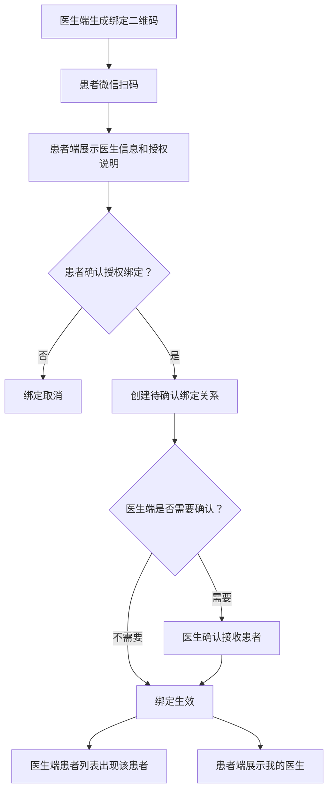
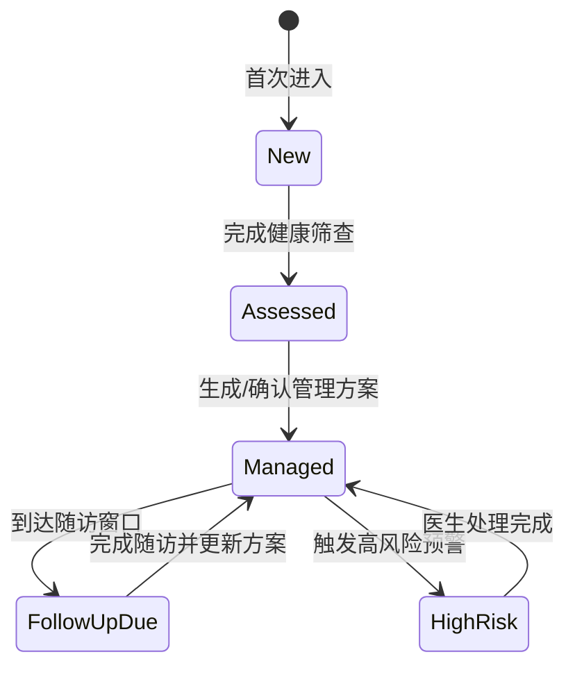
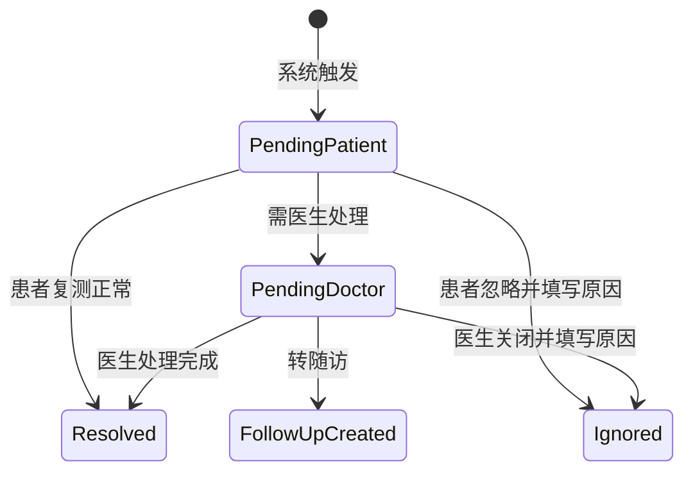

# 慢病管家 PRD

版本：V0.1 MVP  
适用端：患者微信小程序、医生 PC 管理端  
依据：当前首页静态设计、已露出的功能模块、《慢病数字孪生智能管理产品体系蓝图》
目标发布日期：待定

## 1. 产品定位

慢病管家是一款面向 2C 患者的慢病自我管理小程序，并配套医生 PC 管理端。患者端负责完成筛查、指标记录、用药打卡、预警处理、随访准备和健康服务触达；医生端负责患者分层管理、数据查看、风险处置、方案制定、随访管理和医患沟通。

MVP 聚焦糖尿病、慢阻肺、睡眠呼吸障碍风险三类场景，优先跑通“筛查建档 - 生成管理方案 - 日常记录 - 风险预警 - 医生干预 - 随访复盘”的闭环。

### 1.1 面向数字孪生的本期设计原则

根据产品蓝图，未来平台将从慢病管理工具演进为“数字孪生辅助诊疗平台”，用于提升疾病状态预测准确率、耐药机制识别灵敏度、远程诊断与治疗方案准确率，并降低患者并发症率。本期不直接建设完整 AI 诊断模型，但所有 PRD 和数据设计必须为后续数字孪生能力预留基础。

本期必须落实的设计原则：

- 多源数据可融合：患者手动记录、设备采集、健康筛查、院内检查、症状、用药、随访、医生建议均需能关联到同一患者时间轴。
- 数据来源可追溯：每条关键数据必须保留来源、设备号、录入人、记录时间、修改痕迹和有效性状态。
- 规则与模型可解释：预警、评分、建议必须记录触发规则、规则版本、证据数据和医生处理结果。
- 医生确认闭环：系统只做风险提示和辅助建议；管理方案、治疗建议、复诊建议必须支持医生采纳、修改或驳回。
- 干预效果可评估：每次复测、随访、方案调整、医生建议都要能追踪患者是否执行以及执行后的指标变化。
- 个体基线可沉淀：血糖、血氧、睡眠、症状、用药依从性等指标不仅看单次异常，还要保留个体历史基线和趋势偏离。
- 患者端表达克制：患者端避免“确诊”“治疗方案已自动调整”等表述，统一使用“风险提示”“建议复测”“建议咨询医生”。

## 2. 用户与场景

### 2.1 用户角色

| 角色 | 核心诉求 | 典型行为 |
| --- | --- | --- |
| 新患者 | 快速了解自身慢病风险，获得初始建议 | 完成健康筛查、建立档案、绑定设备 |
| 管理中患者 | 按医生方案完成日常记录和用药，知道什么时候需要处理风险 | 记录血糖/血氧/血压/睡眠/症状，处理预警，查看待办和随访 |
| 医生 | 快速识别异常患者，低成本管理多人 | 查看患者列表、处理预警、调整方案、发起随访 |
| 家庭医生 | 覆盖社区医院和基层慢病管理场景，负责辖区患者长期随访和分级管理 | 通过扫码绑定患者，查看数据，处理一般预警，发起随访和转诊建议 |
| 运营/管理员 | 配置内容、规则、医生与患者关系 | 管理指标规则、模板、服务入口、基础数据 |

### 2.2 核心用户旅程

1. 新用户进入首页，看到“先完成健康筛查”，完成约 3 分钟问卷。
2. 系统生成风险画像，提示糖尿病、呼吸、睡眠风险等级。
3. 用户一键生成 7 天初始管理方案，包含记录任务、用药/生活方式建议、随访建议。
4. 用户进入管理中状态，每天完成快速记录、今日待办、用药打卡和症状评估。
5. 系统按规则识别异常，生成风险预警并推动用户复测、查看报告或联系医生。
6. 医生在 PC 端看到预警患者，查看趋势和详情，给出处理建议或调整方案。
7. 用户按随访计划准备数据、报告和用药记录，随访后医生更新阶段目标。

### 2.3 医患扫码绑定流程

医生与患者的管理关系通过扫码建立。绑定完成后，医生端才可查看患者健康数据，患者端可看到绑定医生信息和医生建议。

绑定入口：

| 发起方 | 入口 | 场景 |
| --- | --- | --- |
| 医生端 | 患者管理 - 生成绑定二维码 | 线下门诊、社区随访、健康管理服务 |
| 患者端 | 我的 - 我的医生 - 扫码绑定 | 患者主动绑定医生 |
| 患者端 | 首页/健康档案 - 绑定医生提示 | 未绑定医生但存在高风险或需要随访 |

绑定流程：

绑定规则：

- 二维码需有有效期，建议 10 分钟；过期后需重新生成。
- 患者扫码后必须看到医生姓名、机构、科室/社区医院、服务说明和数据授权范围。
- 患者确认后才可建立绑定关系，不允许静默绑定。
- 医生端可配置“扫码后自动绑定”或“扫码后医生确认”，MVP 可默认自动绑定。
- 绑定成功后，医生可查看该患者授权范围内的健康数据、筛查结果、记录、预警、方案和随访信息。
- 患者可在“我的医生”中查看绑定关系，并支持申请解绑。
- 医生端支持解除绑定；解绑后医生不可继续查看患者新增数据，但历史处理记录和审计日志保留。
- 每次绑定、解绑、授权变更都必须记录操作人、时间、来源和状态。

## 3. 产品目标

### 3.1 MVP 目标

- 患者端从静态首页升级为可交互、可记录、可查看方案的微信小程序。
- 医生端支持管理患者、查看关键指标、处理风险预警、维护方案和随访。
- 建立面向数字孪生的数据底座，支持后续多源数据融合、趋势偏离分析、风险解释、医生采纳反馈和干预效果评估。

### 3.2 成功指标

| 指标 | MVP 目标 |
| --- | --- |
| 新用户筛查完成率 | >= 60% |
| 生成管理方案转化率 | >= 50% |
| 管理中患者 7 日记录留存 | >= 35% |
| 待办完成率 | >= 60% |
| 高风险预警医生处理及时率 | >= 80%，24 小时内 |
| 医生单患者日均查看耗时 | <= 2 分钟 |
| 预警医生采纳/修改/驳回留痕率 | 100% |
| 关键记录来源完整率 | >= 95% |
| 干预后复测/随访结果回收率 | >= 60% |

## 4. 范围定义

### 4.1 MVP 必做

- 患者端：首页、健康筛查、快速记录、记录历史、管理方案、今日待办、用药打卡、风险预警、随访计划、健康档案、我的。
- 医生端：登录、患者列表、患者详情、指标趋势、轻量数字画像、风险预警列表、预警处理、方案管理、随访管理、医生建议。
- 后台能力：用户与患者档案、指标记录、风险规则、规则版本、任务计划、用药计划、医生建议、随访计划、操作审计。

### 4.2 暂不做

- 在线问诊音视频。
- 医保、支付、药品交易闭环。
- 医疗器械真实蓝牙接入，MVP 可保留“设备绑定”入口并支持手动录入。
- 复杂 AI 诊断模型、耐药机制模型、自动治疗方案调整。系统只能做风险提示、趋势偏离和管理建议，诊断与处方调整必须由医生确认。

## 5. 患者端功能需求

### 5.1 首页

当前首页作为患者端主工作台，按用户状态展示不同首屏。

| 状态 | 页面表达 | 主按钮 |
| --- | --- | --- |
| 新用户 | 待评估，提示完成健康筛查 | 开始健康筛查 |
| 已筛查 | 展示风险等级和三类风险摘要 | 生成管理方案 |
| 管理中 | 展示今日状态、关键异常指标和医生阶段方案 | 查看/执行今日方案 |

首页模块：

- 快速记录：血糖、血氧、血压、睡眠、用药，可扩展“添加指标”。
- 风险预警：展示高/中风险事件，支持复测、查看报告、联系医生、标记已处理。
- 今日待办：展示测量、用药、症状评估等任务，显示完成进度。
- 今日用药建议：展示药品、剂量、频次、服用时机、打卡状态和医生调整建议。
- 随访计划：展示下次随访时间、医生、准备材料和近期管理目标。
- 健康档案：展示疾病标签、风险标签、设备绑定状态。
- 健康服务：医生咨询、报告解读、续方购药、设备绑定入口。

交互要求：

- 点击快速记录进入对应记录页，并预选记录类型。
- 点击预警行动按钮进入对应处理流程。
- 首页所有静态卡片需要接真实数据或 mock 数据接口。
- 无数据时展示空状态，例如“今日暂无预警”“还没有用药计划”。

### 5.2 健康筛查

目的：采集病史、症状、用药、生活方式和设备情况，生成初始风险画像。

细化说明：风险筛查问卷、评分模型、建议优先级、结果页、接口与数据结构详见 [风险筛查模块 PRD](/Users/ks-hz/Desktop/数字孪生/docs/风险筛查模块PRD.md)。

表单分组：

- 基础信息：年龄、性别、身高、体重、联系方式。
- 病史：糖尿病、高血压、慢阻肺、睡眠呼吸暂停、心脑血管疾病、家族史。
- 当前症状：多饮多尿、乏力、咳嗽咳痰、气短、夜间憋醒、打鼾、晨起头痛。
- 用药情况：当前药品、剂量、依从性、漏服情况。
- 生活方式：饮食、运动、吸烟、饮酒、睡眠时长。
- 检测数据：最近血糖、血压、血氧、糖化血红蛋白，可选填。

输出：

- 总体风险等级：低/中/高。
- 分项风险：血糖风险、呼吸风险、睡眠风险。
- 推荐动作：生成管理方案、建议线下就医、建议绑定设备、建议复测。

### 5.3 快速记录

细化说明：记录指标的分组、字段、录入规则、异常处理、视觉表达、数据结构和验收标准详见 [记录指标模块 PRD](/Users/ks-hz/Desktop/数字孪生/docs/记录指标模块PRD.md)。

记录类型与字段：

| 类型 | 关键字段 |
| --- | --- |
| 血糖 | 最新血糖值、测量时点标签（凌晨/空腹/三餐前/三餐后2h/睡前/随机）、测量时间、目标范围、备注 |
| 血氧 | SpO2、脉率、测量时间、测量场景、备注；呼吸频率作为可选补充指标 |
| 血压 | 收缩压、舒张压、测量时间、备注 |
| 睡眠 | 睡眠报告卡片，展示睡眠时长、AHI、ODI、最低血氧、风险等级；呼吸事件、睡眠分期、趋势进入睡眠分析二级页 |
| 用药 | 药品、剂量、服用时间、是否漏服、漏服原因；氧疗使用记录氧流量和累计时长 |
| 症状 | 咳喘评分、胸闷、乏力、低血糖症状、其他不适 |

要求：

- 支持手动录入、编辑、删除。
- 记录后立即刷新首页待办和预警。
- 数值超出阈值时即时提示“建议复测/联系医生”。
- 保留异常值，不强行拦截，但要求二次确认。

### 5.4 记录页

- 采用日期选择 + 吸顶锚点导航 + 分区内容结构。
- 锚点导航不是筛选 Tab，点击后定位到对应分区，页面保持完整内容展示。
- 锚点包括：全部、基础指标、血氧呼吸、睡眠、症状、用药。
- 睡眠分区展示整体睡眠报告卡片，不平铺所有睡眠事件指标。
- AHI、ODI、呼吸暂停、低通气、睡眠分期等设备分析指标进入睡眠分析二级页。
- 二级页展示报告概览、呼吸事件、血氧分析、睡眠结构、趋势与建议。
- 支持按日期查看记录明细。
- 支持导出或生成随访摘要，MVP 可先生成页面摘要。

### 5.5 管理方案

方案来源：

- 筛查后系统生成初始方案。
- 医生 PC 端确认或调整后成为医生方案。

方案内容：

- 阶段名称，例如“控糖稳定期第 3 周”。
- 管理目标，例如空腹血糖 4.4-7.0 mmol/L、餐后 2 小时血糖 < 10.0 mmol/L。
- 每日任务：测量、用药、症状评估、运动、睡眠记录。
- 预警规则：哪些异常需要复测、联系医生或就医。
- 随访安排：下次随访时间、准备材料。

### 5.6 今日待办

- 按方案自动生成每日任务。
- 任务类型：指标测量、用药、症状评估、报告上传、随访准备。
- 状态：待完成、已完成、已逾期、已跳过。
- 患者可完成、补记、跳过并填写原因。
- 任务完成后写入对应记录。

### 5.7 风险预警

首页已体现的规则需要产品化：

| 规则 | 级别 | 触发后动作 |
| --- | --- | --- |
| 连续 3 天空腹血糖高于目标 | 高 | 立即复测血糖，推送医生端 |
| 夜间血氧低于 90% 累计 >= 12 分钟 | 中/高 | 查看睡眠报告，建议继续监测，必要时联系医生 |
| 餐后血糖多次高于目标 | 中 | 增加记录频率，提醒饮食/用药备注 |
| 漏服关键药物 | 中 | 用药提醒，记录漏服原因 |
| 咳喘评分持续升高 | 中/高 | 症状复评，推送医生端 |

预警状态：

- 待患者处理。
- 待医生处理。
- 已处理。
- 已忽略，必须记录原因。

### 5.8 用药管理

- 展示今日用药建议：药品、剂量、频次、服用时间、注意事项。
- 支持服药打卡、补打卡、漏服上报。
- 支持医生建议展示，例如“增加血糖监测频率”。
- MVP 中患者不可自行修改医生方案药品，只能备注实际服用情况。

### 5.9 随访计划

- 展示下次随访日期、科室/医生、倒计时。
- 展示准备材料：近 1 个月指标记录、用药情况、检查报告。
- 展示近期管理目标。
- 支持随访前提醒。
- 支持上传报告，MVP 可先上传图片或填写报告结果。

### 5.10 健康档案与我的

健康档案：

- 基础资料。
- 疾病标签：2 型糖尿病、慢阻肺稳定期、睡眠呼吸障碍风险等。
- 设备绑定状态。
- 医生绑定关系。
- 过敏史、既往史、家族史。

我的：

- 个人信息。
- 我的医生。
- 消息通知设置。
- 隐私授权。
- 帮助与反馈。
- 退出登录。

## 6. 医生 PC 端功能需求

医生 PC 端承接患者端健康筛查、指标记录、设备数据、风险预警、管理方案和随访计划，用于帮助医生完成患者分层管理、风险处置和随访闭环。

详细页面结构、交互规则、数据模型和接口草案见 [医生 PC 端 PRD](/Users/ks-hz/Desktop/数字孪生/docs/医生PC端PRD.md)。

### 6.1 工作台

目标：让医生优先处理有风险、有待办、有随访的患者。

核心组件：

- 今日待处理预警数。
- 高风险患者数。
- 今日随访患者数。
- 患者记录缺失数。
- 预警列表快捷入口。
- 最近医生建议记录。

### 6.2 患者列表

筛选条件：

- 风险等级：高/中/低。
- 疾病标签：糖尿病、慢阻肺、睡眠呼吸障碍风险。
- 管理阶段：新建档、初始方案、管理中、待随访。
- 预警状态：待处理、已处理。
- 数据状态：今日未记录、连续缺失、设备未绑定。

列表字段：

- 患者姓名、性别、年龄。
- 疾病标签。
- 今日状态。
- 最近关键指标。
- 最新预警。
- 方案阶段。
- 下次随访时间。

### 6.3 患者详情

页面结构：

- 患者概览：基础信息、疾病标签、风险等级、绑定设备、管理阶段。
- 关键指标趋势：血糖、血压、血氧、睡眠、症状评分。
- 今日记录：待办完成情况、用药打卡、异常记录。
- 风险预警：当前和历史预警。
- 管理方案：当前方案、目标、任务、用药建议。
- 随访记录：计划、历史结论、准备材料。
- 医生建议：已发送建议和患者阅读/执行状态。

### 6.4 预警处理

医生可执行：

- 查看预警依据和原始记录。
- 标记处理结果：建议复测、调整记录频率、发起随访、建议线下就医、继续观察。
- 给患者发送文字建议。
- 将预警转入随访任务。
- 关闭预警并记录原因。

处理要求：

- 高风险预警必须填写处理意见。
- 处理记录对患者端可见，但内部备注可设置仅医生端可见。
- 所有处理动作保留审计日志。

### 6.5 方案管理

医生可创建/编辑患者方案：

- 阶段名称。
- 管理目标。
- 每日/每周任务。
- 指标阈值。
- 用药建议。
- 随访日期。
- 患者注意事项。

方案模板：

- 糖尿病初始 7 天监测方案。
- 糖尿病控糖稳定期方案。
- 慢阻肺稳定期症状监测方案。
- 睡眠低氧观察方案。

### 6.6 随访管理

- 创建随访计划。
- 查看患者随访准备完成度。
- 记录随访结论。
- 更新阶段目标和下一次随访。
- 支持按日期查看当天随访清单。

## 7. 数据与状态设计

### 7.1 关键实体

| 实体 | 说明 |
| --- | --- |
| User | 微信用户账号 |
| PatientProfile | 患者健康档案 |
| Doctor | 医生账号 |
| DoctorPatientRelation | 医患绑定关系，支持扫码绑定、授权范围和解绑审计 |
| Screening | 健康筛查问卷与结果 |
| HealthMetricRecord | 指标记录 |
| MedicationPlan | 用药计划 |
| MedicationCheckin | 用药打卡 |
| ManagementPlan | 管理方案 |
| Task | 今日待办任务 |
| RiskAlert | 风险预警 |
| FollowUpPlan | 随访计划 |
| DoctorAdvice | 医生建议 |
| Report | 检查报告或睡眠报告 |
| DigitalTwinProfile | 轻量数字画像，沉淀个体基线、风险状态、干预状态 |
| RuleExecutionLog | 规则/模型执行记录，保留版本、证据和输出 |
| InterventionOutcome | 干预效果记录，用于追踪建议、任务、方案调整后的指标变化 |

### 7.2 数字孪生数据底座

本期不建设完整数字孪生模型，但必须按“可训练、可解释、可验证”的方向沉淀数据。

| 数据层 | 本期采集/沉淀内容 | 未来用途 |
| --- | --- | --- |
| 基础画像 | 年龄、性别、BMI、病史、家族史、生活方式 | 个体风险分层、疾病状态建模 |
| 疾病画像 | 糖尿病、慢阻肺、睡眠呼吸障碍风险标签和诊断/疑似状态 | 多病共管、疾病进展分析 |
| 生理状态 | 血糖、血压、SpO2、脉率、睡眠报告、体重 | 疾病状态预测、趋势偏离识别 |
| 行为状态 | 用药、饮食备注、运动、吸烟、CPAP/氧疗执行 | 依从性评估、干预推荐 |
| 症状状态 | 症状类型、严重程度、持续时间、与指标记录关联 | 急性加重识别、远程诊断辅助 |
| 风险状态 | 预警等级、触发规则、证据数据、处理状态 | 预警准确率评估、模型优化 |
| 干预状态 | 医生建议、管理方案、随访动作、患者执行结果 | 干预效果评估、方案准确率提升 |

数据底座要求：

- 关键事实数据必须带 `patient_id`、`source`、`recorded_at`、`created_by`、`updated_at`。
- 设备数据必须带设备型号、设备号、同步时间、报告状态和有效性状态。
- 预警和建议必须记录规则/模型版本、证据快照和医生采纳结果。
- 患者执行任务后，需要记录执行状态、执行时间、未执行原因和后续指标变化。
- 未来接入院内检查时，需要能与患者端记录、睡眠报告、随访结论按时间轴对齐。

### 7.3 患者状态机

### 7.4 预警状态机

## 8. 接口需求草案

### 8.1 患者端接口

| 接口 | 方法 | 说明 |
| --- | --- | --- |
| `/api/patient/home` | GET | 获取首页总览 |
| `/api/screenings` | POST | 提交健康筛查 |
| `/api/records` | POST | 新增指标记录 |
| `/api/records` | GET | 查询记录历史 |
| `/api/plans/current` | GET | 获取当前管理方案 |
| `/api/tasks/today` | GET | 获取今日待办 |
| `/api/tasks/{id}/complete` | POST | 完成待办 |
| `/api/medications/checkin` | POST | 用药打卡 |
| `/api/alerts` | GET | 查询预警 |
| `/api/alerts/{id}/action` | POST | 处理预警动作 |
| `/api/followups/current` | GET | 获取随访计划 |
| `/api/profile` | GET/PUT | 查看或更新健康档案 |
| `/api/digital-profile/current` | GET | 获取轻量数字画像摘要 |
| `/api/doctor-binding/qrcode/{token}` | GET | 扫码后获取医生绑定信息 |
| `/api/doctor-binding/confirm` | POST | 患者确认绑定医生 |
| `/api/doctor-binding/revoke` | POST | 患者申请解绑医生 |

### 8.2 医生端接口

| 接口 | 方法 | 说明 |
| --- | --- | --- |
| `/api/doctor/dashboard` | GET | 医生工作台 |
| `/api/doctor/patients` | GET | 患者列表 |
| `/api/doctor/patients/{id}` | GET | 患者详情 |
| `/api/doctor/alerts` | GET | 预警列表 |
| `/api/doctor/alerts/{id}/handle` | POST | 处理预警 |
| `/api/doctor/patients/{id}/plans` | POST/PUT | 创建或更新方案 |
| `/api/doctor/followups` | GET/POST | 查询或创建随访 |
| `/api/doctor/advice` | POST | 发送医生建议 |
| `/api/doctor/patients/{id}/digital-profile` | GET | 查看患者轻量数字画像 |
| `/api/doctor/rule-executions/{id}` | GET | 查看预警/建议触发证据和规则版本 |

## 9. 页面清单

### 9.1 患者小程序

| 页面 | 路径建议 | MVP |
| --- | --- | --- |
| 首页 | `/pages/index/index` | 是 |
| 健康筛查 | `/pages/screening/index` | 是 |
| 快速记录 | `/pages/record/form` | 是 |
| 记录历史 | `/pages/record/index` | 是 |
| 血糖详情 | `/pages/record/glucose-detail` | 是 |
| 血压详情 | `/pages/record/blood-pressure-detail` | 是 |
| 血氧详情 | `/pages/record/oxygen-detail` | 是 |
| 指标记录明细 | `/pages/record/history` | 是 |
| 睡眠分析 | `/pages/sleep/report` | 是 |
| 睡眠历史报告 | `/pages/sleep/history` | 是 |
| 症状详情 | `/pages/symptom/detail` | 是 |
| 用药/治疗详情 | `/pages/medication/detail` | 是 |
| 设备管理 | `/pages/device/index` | 是 |
| 管理方案 | `/pages/plan/index` | 是 |
| 预警详情 | `/pages/alert/detail` | 是 |
| 用药管理 | `/pages/medicine/index` | 是 |
| 随访计划 | `/pages/follow/index` | 是 |
| 健康档案 | `/pages/profile/index` | 是 |
| 我的 | `/pages/me/index` | 是 |

### 9.2 医生 PC 端

| 页面 | MVP |
| --- | --- |
| 登录页 | 是 |
| 工作台 | 是 |
| 患者列表 | 是 |
| 患者详情 | 是 |
| 预警处理 | 是 |
| 方案编辑 | 是 |
| 随访管理 | 是 |
| 模板/规则配置 | 可做轻量版 |

## 10. 权限与合规

- 患者需要授权手机号或账号登录。
- 患者健康数据、筛查结果、用药记录、医生建议属于敏感个人信息，需要明确授权与隐私政策。
- 医生/家庭医生仅能查看已通过扫码绑定、机构分配或患者授权给自己的患者。
- 家庭医生主要处理社区慢病管理、随访、一般预警和转诊建议；高风险或复杂治疗调整应支持转专科医生处理。
- 所有医生处理、方案调整、预警关闭需要记录操作人、时间和内容。
- 患者端文案避免“确诊”“治愈”等诊断性表述，使用“风险提示”“建议复测”“建议咨询医生”。
- 高危异常应提示线下就医或急诊判断，不能仅依赖线上处理。

## 11. 风险规则 MVP

| 指标 | 正常/目标 | 中风险 | 高风险 |
| --- | --- | --- | --- |
| 空腹血糖 | 4.4-7.0 mmol/L | 单次 > 7.0 或连续 2 天高于目标 | 连续 3 天高于目标或单次 >= 11.1 |
| 餐后 2 小时血糖 | < 10.0 mmol/L | 单次 >= 10.0 | 连续 3 次 >= 10.0 |
| 血氧 | >= 95% | 睡眠期间 < 90% 累计 >= 5 分钟 | < 90% 累计 >= 12 分钟或伴随胸闷 |
| 血压 | < 140/90 mmHg | 连续 2 次 >= 140/90 | >= 180/110 |
| 咳喘评分 | 0-2 分 | 3-5 分 | >= 6 分或持续升高 |
| 用药 | 按计划服用 | 单次漏服 | 连续漏服或关键药物漏服 |

规则阈值需支持医生端或后台配置，以上为 MVP 默认值，具体医学阈值上线前需由医生/医学负责人审核。

## 12. 非功能需求

- 性能：小程序首页接口 2 秒内返回，医生端列表 3 秒内返回。
- 可用性：关键记录流程不超过 3 步。
- 可靠性：记录提交失败需要本地保留草稿或允许重试。
- 可扩展：指标类型、预警规则、任务模板、疾病标签需要配置化。
- 安全：接口鉴权、最小权限、敏感字段脱敏、日志审计。

## 13. MVP 迭代建议

### 13.1 第一阶段：患者端可运行闭环

- 首页真实数据化。
- 健康筛查与风险结果。
- 快速记录与记录历史。
- 今日待办与用药打卡。
- 管理方案展示。
- 规则触发预警。

### 13.2 第二阶段：医生端闭环

- 医生登录与患者列表。
- 患者详情与趋势图。
- 预警处理。
- 方案编辑。
- 随访管理。

### 13.3 第三阶段：服务与运营能力

- 报告解读、续方购药、设备绑定流程深化。
- 规则与模板配置后台。
- 消息订阅与精细化提醒。
- 设备数据接入。

## 14. 验收标准

- 新用户可以完成筛查，并从新用户状态进入已筛查状态。
- 已筛查用户可以生成管理方案，并进入管理中首页。
- 管理中用户可以新增血糖、血氧、血压、睡眠、用药、症状记录。
- 完成记录后，今日待办状态和首页关键指标同步更新。
- 触发连续高血糖或夜间低氧规则后，患者端出现预警，医生端同步出现待处理记录。
- 医生可以处理预警并发送建议，患者端可看到建议。
- 医生可以创建或调整管理方案，患者端方案页和首页阶段文案同步更新。
- 患者可以查看随访计划和准备材料。
- 所有关键操作有错误提示、空状态和加载状态。

## 15. 待确认问题

- 首期是否只做糖尿病，还是糖尿病 + 慢阻肺 + 睡眠低氧同时上线。
- 医生端是否需要多机构、多科室、多角色权限。
- 管理方案是否必须医生确认后才生效，还是筛查后可先生成系统方案。
- 是否需要接入微信订阅消息。
- 是否需要真实设备绑定，还是 MVP 使用手动录入和模拟设备状态。
- 续方购药、报告解读是否首期只做入口，还是要做完整业务流程。
