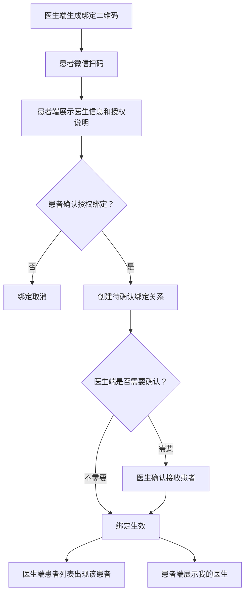
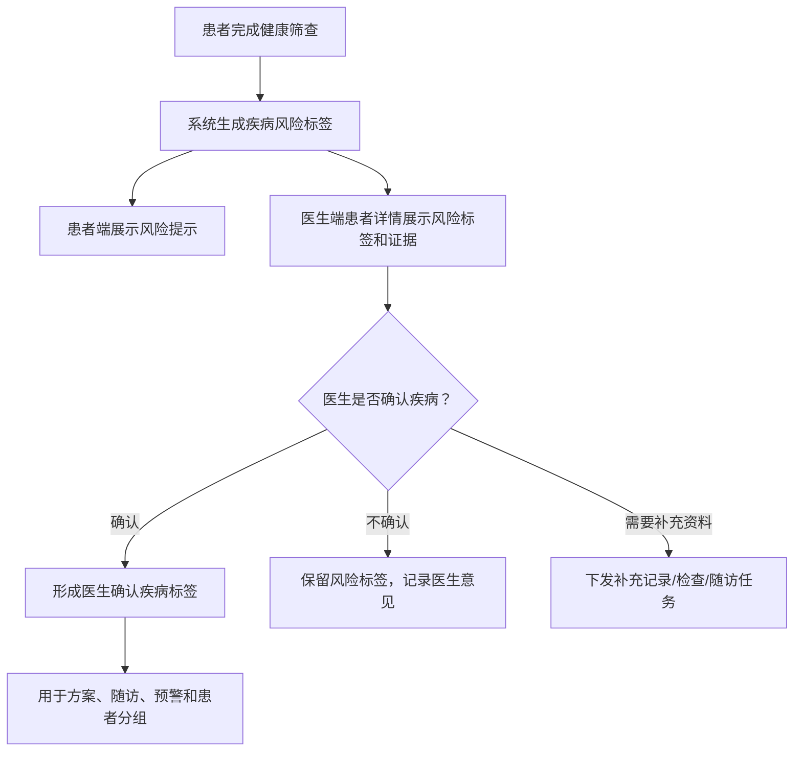
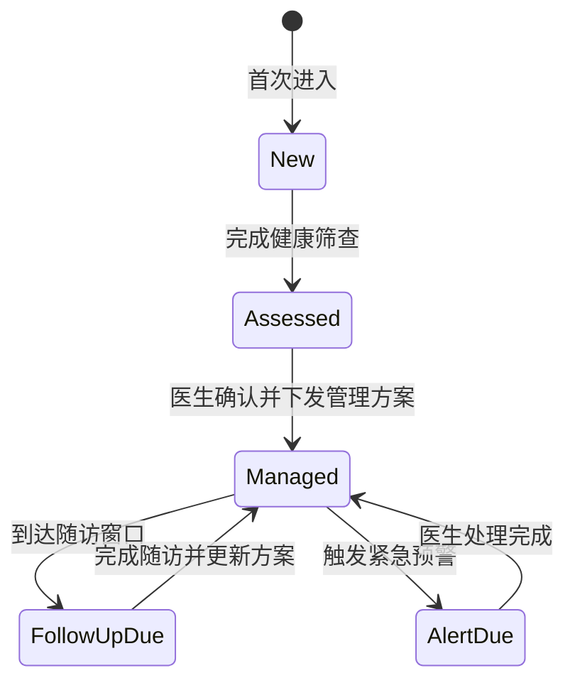
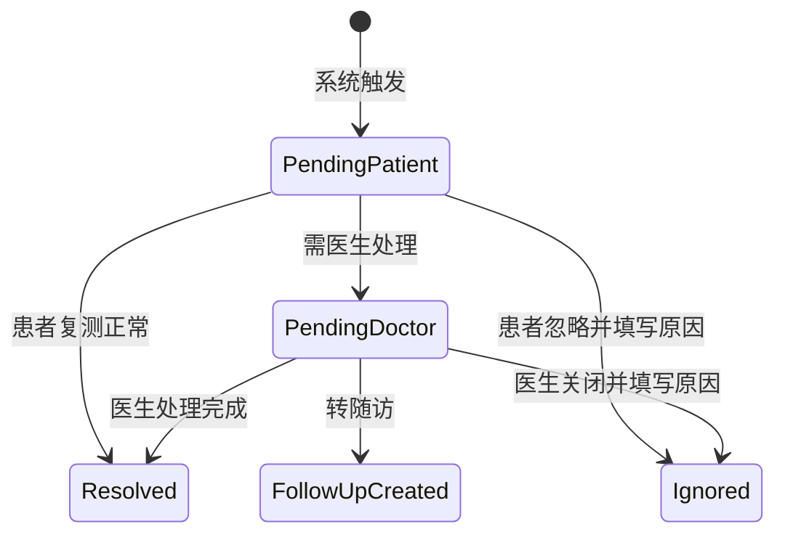

# 慢病管家 PRD

版本：V0.1 MVP  
适用端：患者微信小程序、医生 PC 管理端  
依据：当前首页静态设计、已露出的功能模块、《慢病数字孪生智能管理产品体系蓝图》
目标发布日期：待定

## 1. 产品定位

慢病管家是一款面向 2C 患者的慢病自我管理小程序，并配套医生 PC 管理端。患者端负责完成筛查、指标记录、用药打卡、预警处理、随访准备和健康服务触达；医生端负责患者分层管理、数据查看、风险处置、方案制定、随访管理和医患沟通。

MVP 聚焦糖尿病、慢阻肺、睡眠呼吸障碍风险三类核心场景，并纳入高血压作为常见共病管理场景，优先跑通“筛查建档 - 医生确认管理方案 - 日常记录 - 风险预警 - 医生干预 - 随访复盘”的闭环。

### 1.1 面向数字孪生的本期设计原则

根据产品蓝图，未来平台将从慢病管理工具演进为“数字孪生辅助诊疗平台”，用于提升疾病状态预测准确率、耐药机制识别灵敏度、远程诊断与治疗方案准确率，并降低患者并发症率。本期不直接建设完整 AI 诊断模型，但所有 PRD 和数据设计必须为后续数字孪生能力预留基础。

本期必须落实的设计原则：

- 多源数据可融合：患者手动记录、设备采集、健康筛查、院内检查、症状、用药、随访、医生建议均需能关联到同一患者时间轴。
- 数据来源可追溯：每条关键数据必须保留来源、设备号、录入人、记录时间、修改痕迹和有效性状态。
- 规则与模型可解释：预警、评分、建议必须记录触发规则、规则版本、证据数据和医生处理结果。
- 医生确认闭环：系统只做风险提示和辅助建议；管理方案、治疗建议、复诊建议必须支持医生采纳、修改或驳回。
- 干预效果可评估：每次复测、随访、方案调整、医生建议都要能追踪患者是否执行以及执行后的指标变化。
- 个体基线可沉淀：血糖、血氧、睡眠、症状、用药依从性等指标不仅看单次异常，还要保留个体历史基线和趋势偏离。
- 患者端表达克制：患者端避免“确诊”“治疗方案已自动调整”等表述，统一使用“风险提示”“建议复测”“建议咨询医生”。

## 2. 用户与场景

### 2.1 用户角色

| 角色 | 核心诉求 | 典型行为 |
| --- | --- | --- |
| 新患者 | 快速了解自身慢病风险，获得初始建议 | 完成健康筛查、建立档案、绑定设备 |
| 管理中患者 | 按医生方案完成日常记录和用药，知道什么时候需要处理风险 | 记录血糖/血氧/血压/睡眠/症状，处理预警，查看待办和随访 |
| 医生 | 快速识别异常患者，低成本管理多人 | 查看患者列表、处理预警、调整方案、发起随访 |
| 家庭医生 | 覆盖社区医院和基层慢病管理场景，负责辖区患者长期随访和分级管理 | 通过扫码绑定患者，查看数据，处理一般预警，发起随访和转诊建议 |
| 运营/管理员 | 配置内容、规则、医生与患者关系 | 管理指标规则、模板、服务入口、基础数据 |

### 2.2 核心用户旅程

1. 新用户进入首页，看到“先完成健康筛查”，完成约 3 分钟问卷。
2. 系统生成风险画像，提示糖尿病、呼吸、睡眠风险等级。
3. 用户查看筛查结果，绑定医生并补充健康档案、记录和设备数据。
4. 医生在 PC 端确认并下发管理方案后，用户进入管理中状态，每天完成快速记录、今日待办、用药打卡和症状评估。
5. 系统按规则识别异常，生成风险预警并推动用户复测、查看报告或联系医生。
6. 医生在 PC 端看到预警患者，查看趋势和详情，给出处理建议或调整方案。
7. 用户按随访计划准备数据、报告和用药记录，随访后医生更新阶段目标。

### 2.3 医患扫码绑定流程

当前阶段医患关系只支持“医生生成二维码，患者扫码确认授权”这一条主流程。暂不纳入后台/机构分配患者、患者扫码机构码、服务团队绑定等复杂场景。绑定完成后，医生端才可查看患者健康数据，患者端可看到绑定医生信息和医生建议。

绑定入口：

| 发起方 | 入口 | 场景 |
| --- | --- | --- |
| 医生端 | 患者管理 - 添加患者 | 线下门诊、社区随访、健康管理服务 |
| 患者端 | 我的 - 我的医生 - 扫码绑定 | 患者主动绑定医生 |
| 患者端 | 首页/健康档案 - 绑定医生提示 | 未绑定医生但存在高风险或需要随访 |

绑定流程：



绑定规则：

- 二维码需有有效期，建议 10 分钟；过期后需重新生成。
- 患者扫码后必须看到医生姓名、机构、科室/社区医院、服务说明和数据授权范围。
- 患者确认后才可建立绑定关系，不允许静默绑定。
- 当前版本默认患者确认后绑定生效。
- 绑定成功后，医生可查看该患者授权范围内的健康数据、筛查结果、记录、预警、方案和随访信息。
- 患者可在“我的医生”中查看绑定关系，并支持申请解绑。
- 医生端支持解除绑定；解绑后医生不可继续查看患者新增数据，但历史处理记录和审计日志保留。
- 每次绑定、解绑、授权变更都必须记录操作人、时间、来源和状态。

### 2.4 疾病标签关联流程

疾病标签采用“双层标签”机制：健康筛查系统提示疾病风险，医生确认后形成正式疾病标签。

| 标签类型 | 生成方式 | 患者端表达 | 医生端用途 |
| --- | --- | --- | --- |
| 疾病风险标签 | 健康筛查问卷、关键指标、设备报告触发 | 展示为“糖尿病风险偏高”“睡眠呼吸障碍风险偏高”等风险提示 | 用于患者分层、预警规则、建议完善资料 |
| 医生确认疾病 | 医生基于院内诊断、筛查结果、患者记录和设备报告确认 | 可展示为医生确认的疾病管理标签 | 用于正式管理方案、随访路径、医生端患者分组 |

关联流程：



规则：

- 患者端不把筛查风险直接表达为确诊疾病。
- 医生端必须展示风险标签的证据来源，例如问卷答案、血糖/血氧/睡眠报告、既往病史。
- 医生可确认、修改或移除疾病标签，并记录依据。
- 医生确认疾病标签变更后，患者端健康档案、管理方案、随访计划和预警规则同步更新。
- 暂不设计“患者自报标签独立生效”流程；患者在问卷中填写的既往病史只作为健康筛查和医生确认的证据。

## 3. 产品目标

### 3.1 MVP 目标

- 患者端从静态首页升级为可交互、可记录、可查看方案的微信小程序。
- 医生端支持管理患者、查看关键指标、处理风险预警、维护方案和随访。
- 建立面向数字孪生的数据底座，支持后续多源数据融合、趋势偏离分析、风险解释、医生采纳反馈和干预效果评估。

### 3.2 成功指标

| 指标 | MVP 目标 |
| --- | --- |
| 新用户筛查完成率 | >= 60% |
| 医生确认管理方案转化率 | >= 50% |
| 管理中患者 7 日记录留存 | >= 35% |
| 待办完成率 | >= 60% |
| 紧急预警医生处理及时率 | >= 80%，24 小时内 |
| 医生单患者日均查看耗时 | <= 2 分钟 |
| 预警医生采纳/修改/驳回留痕率 | 100% |
| 关键记录来源完整率 | >= 95% |
| 干预后复测/随访结果回收率 | >= 60% |

## 4. 范围定义

### 4.1 MVP 必做

- 患者端：首页、健康筛查、快速记录、记录历史、管理方案、今日待办、用药打卡、风险预警、随访计划、健康档案、我的。
- 医生端：登录、患者列表、患者详情、指标趋势、轻量数字画像、风险预警列表、预警处理、方案管理、随访管理、医生建议。
- 后台能力：用户与患者档案、指标记录、风险规则、规则版本、任务计划、用药计划、医生建议、随访计划、操作审计。

### 4.2 暂不做

- 在线问诊音视频。
- 医保、支付、药品交易闭环。
- 医疗器械真实蓝牙接入，MVP 可保留“设备绑定”入口并支持手动录入。
- 复杂 AI 诊断模型、耐药机制模型、自动治疗方案调整。系统只能做风险提示、趋势偏离和管理建议，诊断与处方调整必须由医生确认。

## 5. 患者端功能需求

### 5.0 患者端 Mock 身份

为保证患者端和医生端演示闭环一致，MVP mock 环境固定当前患者端登录用户为共享 mock 患者 `P001`。

规则：

- 当前患者：`P001`，展示名为“周明”。
- 当前医生：`D001`，展示名为“林医生”。
- 患者端首页、我的、任务、预警、随访、医生建议均默认读取 `P001` 相关数据。
- 医生端患者管理列表和患者详情也展示同一 `P001`。
- 医生端对 `P001` 创建预警处理、复测、随访、医生建议或下发方案后，患者端应能在对应页面看到同一条 mock 数据。
- 不再在患者端单独硬编码一个医生端不存在的患者姓名，避免两端流程断裂。

### 5.1 首页

当前首页作为患者端主工作台，按用户状态展示不同首屏。

| 状态 | 页面表达 | 主按钮 |
| --- | --- | --- |
| 新用户 | 待评估，提示完成健康筛查 | 开始健康筛查 |
| 已筛查未管理 | 展示筛查结果摘要，引导查看结果、绑定医生和补充资料 | 查看筛查结果 |
| 管理中 | 展示今日状态、关键异常指标和医生阶段方案 | 查看/执行今日方案 |

首页状态判断：

```text
if 用户不存在有效健康筛查记录:
  首页 = 新用户引导态
else if 用户已完成健康筛查 && 未收到医生确认并下发的生效管理方案:
  首页 = 已筛查未管理态
else if 用户已有生效管理方案:
  首页 = 管理执行态
```

若用户存在未提交的健康筛查草稿，仍归入新用户引导态，但主按钮展示为“继续完成筛查”，并回到上次中断题目。

已筛查未管理态不提供“生成管理方案”入口。管理方案必须由医生确认后下发，或在医生确认规则下进入管理中状态；患者端不引导用户自主创建慢病管理计划。

#### 5.1.1 新用户首页

适用条件：

- 用户不存在有效健康筛查记录。
- 若存在未提交的筛查草稿，仍展示新用户引导态。
- 已提交健康筛查的用户不再展示新用户首页，进入“已筛查未管理态”。

页面目标：

- 引导用户完成健康筛查。
- 支持用户先绑定医生。
- 支持用户先完善健康档案。
- 支持用户先记录已有健康数据。
- 支持用户先绑定已有设备。

页面结构：

```text
健康筛查引导卡
医生绑定提示
健康档案补充入口
快捷记录
我的设备
底部轻量说明
```

新用户首页的信息优先级为：

```text
健康筛查 > 医生绑定 > 健康档案 > 快捷记录 > 我的设备 > 合规说明
```

##### 健康筛查引导卡

模块定位：新用户首页的主模块，承担唯一主路径。

从未开始筛查时展示：

```text
状态：未评估
标题：先完成一次健康筛查
说明：约 3 分钟，了解血糖、呼吸、睡眠和血压相关风险。
辅助说明：完成后可生成你的初步健康风险画像，并给出下一步管理建议。
主按钮：开始健康筛查
```

存在未提交草稿时展示：

```text
状态：筛查未完成
标题：继续完成健康筛查
说明：你还有部分问题未完成，提交后可查看健康风险提示。
辅助信息：已完成 6/18 题
主按钮：继续完成筛查
```

交互规则：

| 用户情况 | 按钮文案 | 点击后 |
| --- | --- | --- |
| 从未开始筛查 | 开始健康筛查 | 进入筛查问卷第一页 |
| 有筛查草稿 | 继续完成筛查 | 回到上次中断题目 |
| 已提交筛查 | 不展示本状态首页 | 进入已筛查未管理态首页 |

新用户首页不展示：

- 查看历史筛查入口。
- 风险等级。
- 今日待办。
- 管理方案。
- 用药计划。

##### 医生绑定提示

模块定位：建立医患关系入口，增强信任，但不抢主路径。

未绑定医生时展示：

```text
标题：已有医生或管理师？
说明：扫码绑定后，医生可在授权范围内查看你的筛查结果和健康记录。
按钮：扫码绑定医生
```

已绑定医生时展示：

```text
标题：我的医生
内容：林医生｜呼吸与慢病管理
说明：你的筛查和记录结果会在授权范围内同步给医生查看。
按钮：查看绑定信息
```

交互规则：

| 操作 | 去向 |
| --- | --- |
| 扫码绑定医生 | 医生扫码绑定流程 |
| 查看绑定信息 | 医生绑定信息弹窗或我的页医生信息卡 |

规则说明：

- 未完成筛查也允许先绑定医生。
- 医生绑定成功后，不改变用户健康筛查状态。
- 绑定后仍继续引导用户完成筛查。
- P0 不建设独立“我的医生页”，已绑定医生信息先通过弹窗或“我的”页医生信息卡承接。

##### 健康档案补充入口

模块定位：给用户补充长期基础资料的入口，作为筛查之外的辅助路径。

展示内容：

```text
标题：完善健康档案
说明：补充基础信息、既往病史、当前用药和设备情况，后续建议会更准确。
完成度：20%
待补充项：基础资料 / 既往病史 / 当前用药
按钮：去完善
```

交互规则：

| 操作 | 去向 |
| --- | --- |
| 点击卡片或去完善 | 健康档案页 |

规则说明：

- 健康档案可先于筛查填写。
- 档案信息后续可作为筛查结果、管理方案和医生判断的参考。
- 完善档案不等于完成健康筛查。
- 完成档案后，首页仍保持新用户引导态，继续提示健康筛查。

##### 快捷记录

模块定位：底部弱入口，满足用户已有检测数据、想先记一笔的现实需求。

标题建议：

```text
有近期数据？先记一笔
```

展示入口：

```text
记血糖 / 记血压 / 记血氧 / 记睡眠 / 记用药 / 记症状
```

交互规则：

| 入口 | 去向 |
| --- | --- |
| 记血糖 | 血糖记录表单 |
| 记血压 | 血压记录表单 |
| 记血氧 | 血氧记录表单 |
| 记睡眠 | 睡眠记录或睡眠报告页 |
| 记用药 | 用药记录页 |
| 记症状 | 症状记录页 |

记录完成后提示：

```text
已记录。完成健康筛查后，可生成更完整的健康风险提示。
```

异常值处理：

```text
本次记录偏离常规范围，建议复测。
如伴随明显不适，请及时联系医生或线下就医。
```

规则说明：

- 新用户允许先记录数据。
- 记录数据不改变筛查状态。
- 不展示趋势、达标率、任务完成度。
- 不把快捷记录包装成“今日任务”。
- 记录数据后，可作为后续筛查和方案生成参考。

##### 我的设备

模块定位：底部弱入口，支持已有设备用户先完成绑定。

标题：

```text
已有设备？先完成绑定
```

展示规则：

| 状态 | 页面展示 | 按钮 | 点击后 |
| --- | --- | --- | --- |
| 未绑定 | 未绑定 | 去绑定 | 跳转设备关联页 |
| 已绑定 | 已绑定 X 台 | 查看设备 | 跳转我的设备页 |

交互规则：

- 未绑定状态仅展示“未绑定”和“去绑定”，不展示设备分类列表。
- 点击“去绑定”进入设备关联页，用户可选择血糖仪、血压计、血氧仪、睡眠或呼吸设备等进行绑定。
- 已绑定状态展示“已绑定 X 台”和“查看设备”。
- 点击“查看设备”进入我的设备页。

规则说明：

- 新用户允许先绑定设备。
- 绑定设备不等于完成筛查。
- 绑定设备不自动进入管理中状态。
- 设备数据可作为健康筛查和后续管理方案的参考。
- 设备模块放在快捷记录之后，作为弱入口展示。

我的设备页展示：

```text
页面标题：我的设备

设备卡片：
- 设备名称
- 设备型号
- 最近同步时间
- 同步状态
- 解除绑定
```

通用设备示例：

| 设备名称 | 设备型号 | 最近同步 | 同步状态 |
| --- | --- | --- | --- |
| 血糖仪 | SN-GM01 | 今天 08:12 | 正常 |
| 血压计 | OMRON-BP01 | 昨天 21:30 | 正常 |
| 血氧仪 | ZG-P11H | 今天 07:45 | 正常 |
| 睡眠/呼吸设备 | ZG-M11A | 今日报告生成中 | 同步中 |

解除绑定流程：

1. 用户点击设备卡片中的“解除绑定”。
2. 弹出挽留确认弹窗。
3. 用户点击“继续保留”则关闭弹窗，不执行解绑。
4. 用户点击“确认解绑”后，执行设备解绑。
5. 解绑成功后刷新我的设备列表，并同步更新首页设备状态。

挽留弹窗建议文案：

```text
标题：确认解除绑定？
说明：解绑后，该设备将不再自动同步健康数据，可能影响健康风险提示和医生查看最近记录。
主按钮：继续保留
次按钮：确认解绑
```

若解绑后没有任何设备，首页“我的设备”模块回到未绑定状态。

##### 底部轻量说明

模块定位：医疗合规和数据授权提示，文案克制，不做大段说明。

建议文案：

```text
健康筛查结果仅用于健康风险提示，不作为诊断结论。
如有明显不适或指标异常，请及时联系医生或线下就医。
```

可补充隐私说明：

```text
你的健康数据仅在授权范围内用于健康管理服务。
```

#### 5.1.2 已筛查未管理首页

适用条件：

- 用户已提交有效健康筛查记录。
- 用户尚未进入正式管理中状态。
- 用户没有医生已确认并下发的生效管理方案。

页面定位：

```text
用户已经完成筛查
  -> 看懂风险提示
  -> 继续补充资料、记录和设备数据
  -> 绑定医生后由医生判断是否进入正式管理
```

本状态不引导用户自主创建慢病管理计划。

页面目标：

- 展示筛查结果摘要。
- 引导用户查看筛查结果详情。
- 引导用户绑定医生。
- 引导用户补充健康档案和近期记录。
- 支持用户绑定设备。
- 明确筛查结果仅为健康风险提示，不作为诊断结论。

页面结构：

```text
筛查结果摘要卡
医生绑定提示
健康档案补充入口
快捷记录
我的设备
底部轻量说明
```

该结构与新用户首页保持一致，仅将首卡从“健康筛查引导卡”替换为“筛查结果摘要卡”。

已筛查未管理首页的信息优先级为：

```text
筛查结果 > 医生绑定 > 健康档案 > 快捷记录 > 我的设备 > 合规说明
```

##### 筛查结果摘要卡

模块定位：展示用户已完成筛查后的风险摘要和下一步动作。

未绑定医生时展示：

```text
状态：已完成健康筛查
标题：你的健康筛查已完成
说明：本次筛查提示你存在部分健康风险，需要结合更多健康资料和医生判断进一步确认。

风险摘要：
- 血糖风险：中
- 呼吸风险：低
- 睡眠风险：高
- 血压风险：中

主按钮：查看筛查结果
次按钮：绑定医生
```

已绑定医生时展示：

```text
状态：已完成健康筛查
标题：筛查结果已同步给医生
说明：医生可结合你的筛查结果、健康档案和后续记录，判断是否需要进入正式管理。

风险摘要：
- 血糖风险：中
- 呼吸风险：低
- 睡眠风险：高
- 血压风险：中

主按钮：查看筛查结果
```

交互规则：

| 操作 | 去向 |
| --- | --- |
| 查看筛查结果 | 筛查结果详情页 |
| 绑定医生 | 医生扫码绑定流程 |

展示规则：

- 风险摘要仅展示筛查风险，不展示确诊疾病。
- 风险摘要最多展示血糖、呼吸、睡眠、血压四类风险。
- 不展示“生成管理方案”按钮。
- 不展示今日待办、用药计划、方案任务和随访任务。
- 若存在医生已确认并下发的生效管理方案，用户应进入管理执行态，而不是停留在本状态。

##### 医生绑定提示

模块定位：已筛查用户的医生绑定优先级高于新用户，用于承接医生确认和正式管理入口。

未绑定医生时展示：

```text
标题：需要医生进一步确认？
说明：绑定医生后，医生可结合你的筛查结果和健康记录，判断是否需要正式管理。
按钮：扫码绑定医生
```

已绑定医生时展示：

```text
标题：筛查结果已同步给医生
说明：医生可查看你的筛查结果和后续记录。
按钮：查看绑定信息
```

交互规则与新用户首页医生绑定提示一致：

| 操作 | 去向 |
| --- | --- |
| 扫码绑定医生 | 医生扫码绑定流程 |
| 查看绑定信息 | 医生绑定信息弹窗或我的页医生信息卡 |

##### 健康档案补充入口

模块定位：帮助医生结合病史、用药和设备情况判断风险。

展示内容：

```text
标题：完善健康档案
说明：完善基础信息、既往病史、当前用药和设备情况，帮助医生更准确判断风险。
完成度：20%
待补充项：基础资料 / 既往病史 / 当前用药
按钮：去完善
```

规则说明：

- 健康档案信息可作为医生确认疾病标签、判断管理必要性和制定管理方案的参考。
- 完善档案不等于进入管理中状态。

##### 快捷记录

模块定位：支持用户补充近期健康数据，帮助后续判断风险变化。

标题建议：

```text
补充近期记录
```

说明：

```text
补充血糖、血压、血氧、睡眠、用药和症状记录，帮助后续判断风险变化。
```

展示入口：

```text
记血糖 / 记血压 / 记血氧 / 记睡眠 / 记用药 / 记症状
```

规则说明：

- 已筛查用户允许继续手动记录数据。
- 记录数据不等于进入管理中状态。
- 不展示今日任务完成度。
- 不把快捷记录包装成方案任务。
- 若记录值明显异常，仍需即时提示建议复测、联系医生或线下就医。

##### 我的设备

模块定位：支持已筛查用户绑定设备或查看已绑定设备。

展示规则与新用户首页一致：

| 状态 | 页面展示 | 按钮 | 点击后 |
| --- | --- | --- | --- |
| 未绑定 | 未绑定 | 去绑定 | 跳转设备关联页 |
| 已绑定 | 已绑定 X 台 | 查看设备 | 跳转我的设备页 |

说明：

- 已筛查用户绑定设备后，设备数据可作为医生后续判断风险和是否进入正式管理的参考。
- 绑定设备不等于进入管理中状态。

##### 底部轻量说明

建议文案：

```text
健康筛查结果仅用于健康风险提示，不作为诊断结论。
是否需要进入正式管理，应结合医生判断和后续健康记录确认。
```

#### 5.1.3 管理中首页

适用条件：

- 用户已有医生确认并下发的生效管理方案。
- 用户处于管理中状态，需要按方案完成日常记录、复测、用药/治疗执行和随访准备。

页面定位：

```text
管理中首页 = 今日慢病管理工作台
```

页面只回答三个问题：

- 今天整体状态如何，哪些核心指标最需要关注。
- 今天有哪些风险、任务或医生安排需要处理。
- 当前执行的是哪个医生方案，近期是否有随访或设备异常。

页面结构按以下顺序展示：

```text
今日状态卡（含核心指标）
快捷记录
风险预警卡（存在时展示）
今日待办
医生新安排（存在时展示）
下次随访
当前方案轻摘要
我的设备轻状态
```

说明：快捷记录只保留一处，放在核心指标之后，作为患者主动补录入口，不在今日待办后重复展示。

##### 今日状态卡（含核心指标）

模块定位：管理中首页首屏主模块，集中表达“今天状态如何”和“当前最重要的数据是什么”。

展示内容：

```text
今日状态：稳定 / 需要关注 / 有异常待处理 / 有新方案待确认
健康风险分：82 分
较昨日：-4

核心指标：
- 血糖：最近 7.8 mmol/L｜餐后2h｜略高
- 血氧：最近 94%｜需关注
- 睡眠：昨夜 AHI 18｜最低血氧 86%｜偏高风险
```

核心指标展示规则：

- 首页展示当前用户关联疾病下最重要的 2-4 个指标卡。
- 指标由医生管理方案、疾病标签、风险标签和近期异常共同决定。
- 糖尿病优先展示血糖；高血压优先展示血压；慢阻肺优先展示血氧和症状；睡眠呼吸障碍优先展示睡眠报告、AHI/ODI 和最低血氧。
- 多病共管用户最多展示 4 张，不展示全部指标。
- 点击指标卡进入对应详情页或记录页。
- 今日状态卡不固定展示“主要原因”列表，避免与风险预警、核心指标和今日待办重复。

##### 快捷记录

模块定位：患者主动补录或新增健康数据的入口，不替代今日待办。

展示入口：

```text
记血糖 / 记血压 / 记用药 / 记症状 / 更多
```

规则说明：

- 记血糖：进入血糖记录表单。
- 记血压：进入血压记录表单。
- 记用药：进入用药记录页。
- 记症状：进入症状记录页。
- 更多：跳转记录页，承接血氧、睡眠、历史记录和更多记录类型。
- 若本次记录对应今日任务，提交后同步完成任务。
- 若为主动额外记录，只进入记录历史，不强行生成任务。
- 数值异常时触发风险提示或建议复测。

##### 风险预警卡

模块定位：当存在待患者处理或需要患者配合的预警时展示。

展示规则：

- 无预警时不展示。
- 多个预警同时存在时，首页只展示最高优先级 1 条。
- 其余预警通过“查看全部风险”进入 `/pages/alerts/index`。
- 紧急预警优先级高于待确认方案、医生安排和今日待办。

展示内容：

```text
标题：风险提示
等级：重要 / 紧急
提示：昨夜血氧偏低，建议复测并记录症状
原因：最低血氧 86%，低氧持续时间较前日增加
主按钮：去复测 / 查看报告 / 去处理设备
次入口：查看全部风险
```

##### 今日待办

模块定位：展示当天必须完成、且完成结果会影响当前管理闭环的执行动作。

展示内容：

```text
标题：今日待办
进度：2/5 已完成
任务卡：任务名称 / 建议时间 / 来源 / 状态 / 主按钮
```

展示规则：

- 首页最多展示 3 条待办。
- 更多任务通过“查看全部今日任务”进入 `/pages/me/tasks/index`。
- 已完成任务可折叠或只计入进度。
- 逾期但仍允许补记的任务进入“逾期可补”分组。

##### 医生新安排

模块定位：承接医生临时干预或最近新增且仍有效的安排。

展示条件：

- 存在未完成的医生建议、复测指标、新建随访、补充资料或设备同步提醒。

展示内容：

```text
标题：医生新的安排
内容：请今天晚饭后 2 小时补测一次血糖，并备注饮食情况。
来源：林医生
时间：今天 09:30
主按钮：去完成
```

展示规则：

- 只展示最近 1 条，最多 2 条有效安排。
- 已完成、已读且无后续动作的安排不在首页展示。
- 更多安排根据类型进入我的任务页、医生建议页或随访记录页；方案页只展示正式方案调整摘要。

##### 下次随访

模块定位：提醒随访时间和关键准备动作，不展开完整随访详情。

展示内容：

```text
标题：下次随访
时间：5月28日 10:00
医生：林医生
倒计时：还有 3 天
提醒：请提前补齐近 7 天记录
按钮：查看准备事项
```

展示规则：

- 随访临近时展示，建议 7 天内提高展示优先级。
- 若今天必须完成随访准备动作，该动作进入今日待办。
- 准备详情进入随访详情页或方案页随访安排。

##### 当前方案轻摘要

模块定位：让患者知道当前执行的是哪个医生方案，但不在首页展开方案明细。

展示内容：

```text
当前方案
糖尿病管理方案｜控糖巩固期
本阶段目标：稳定空腹血糖，减少波动
主责医生：林医生
按钮：查看方案
```

展示规则：

- 不展示完整目标范围。
- 不展示版本 diff。
- 不展示医生内部备注。
- 点击进入方案页。

##### 我的设备轻状态

模块定位：展示设备绑定和同步状态，普通状态下放在页面靠下。

展示内容：

```text
我的设备
已绑定 2 台
最近同步：今天 08:30
按钮：查看设备
```

异常时：

```text
我的设备
1 台设备未同步
按钮：去处理
```

规则说明：

- 普通设备状态放在页面靠下。
- 设备同步异常可进入风险预警卡或医生新安排。
- 点击进入我的设备页或设备管理页。

首页通用模块说明：

- 快速记录：血糖、血氧、血压、睡眠、用药，可扩展“添加指标”。
- 风险预警：展示重要/紧急预警事件，支持复测、查看报告、联系医生、标记已处理。
- 今日待办：展示测量、用药、症状评估等任务，显示完成进度。
- 今日用药建议：展示药品、剂量、频次、服用时机、打卡状态和医生调整建议。
- 随访计划：展示下次随访时间、医生、准备材料和近期管理目标。
- 健康档案：展示疾病标签、风险标签、设备绑定状态。
- 健康服务：医生咨询、报告解读、续方购药、设备绑定入口。

说明：以上模块不要求在所有用户状态下完整展示。新用户、已筛查未管理用户、管理中用户应按各自状态结构展示，避免首页变成所有模块的堆叠。

交互要求：

- 点击快速记录进入对应记录页，并预选记录类型。
- 点击预警行动按钮进入对应处理流程。
- 首页所有静态卡片需要接真实数据或 mock 数据接口。
- 无数据时展示空状态，例如“今日暂无预警”“还没有用药计划”。

### 5.2 健康筛查

目的：采集病史、症状、用药、生活方式和设备情况，生成初始风险画像。

细化说明：风险筛查问卷、评分模型、建议优先级、结果页、接口与数据结构详见 [风险筛查模块 PRD](/Users/ks-hz/Desktop/数字孪生/docs/风险筛查模块PRD.md)。

表单分组：

- 基础信息：年龄、性别、身高、体重、联系方式。
- 病史：糖尿病、高血压、慢阻肺、睡眠呼吸暂停、心脑血管疾病、家族史。
- 当前症状：多饮多尿、乏力、咳嗽咳痰、气短、夜间憋醒、打鼾、晨起头痛。
- 用药情况：当前药品、剂量、依从性、漏服情况。
- 生活方式：饮食、运动、吸烟、饮酒、睡眠时长。
- 检测数据：最近血糖、血压、血氧、糖化血红蛋白，可选填。

输出：

- 总体风险等级：低/中/高。
- 分项风险：血糖风险、呼吸风险、睡眠风险。
- 推荐动作：查看筛查结果、建议绑定医生、建议线下就医、建议绑定设备、建议复测。

### 5.3 快速记录

细化说明：记录指标的分组、字段、录入规则、异常处理、视觉表达、数据结构和验收标准详见 [记录指标模块 PRD](/Users/ks-hz/Desktop/数字孪生/docs/记录指标模块PRD.md)。

记录类型与字段：

| 类型 | 关键字段 |
| --- | --- |
| 血糖 | 最新血糖值、测量时点标签（凌晨/空腹/三餐前/三餐后2h/睡前/随机）、测量时间、目标范围、备注 |
| 血氧 | SpO2、脉率、测量时间、测量场景、备注；呼吸频率作为可选补充指标 |
| 血压 | 收缩压、舒张压、测量时间、备注 |
| 睡眠 | 睡眠报告卡片，展示睡眠时长、AHI、ODI、最低血氧、风险等级；呼吸事件、睡眠分期、趋势进入睡眠分析二级页 |
| 用药 | 药品、剂量、服用时间、是否漏服、漏服原因；氧疗使用记录氧流量和累计时长 |
| 症状 | 咳喘评分、胸闷、乏力、低血糖症状、其他不适 |

要求：

- 支持手动录入、编辑、删除。
- 记录后立即刷新首页待办和预警。
- 数值超出阈值时即时提示“建议复测/联系医生”。
- 保留异常值，不强行拦截，但要求二次确认。

### 5.4 记录页

- 采用日期选择 + 吸顶锚点导航 + 分区内容结构。
- 锚点导航不是筛选 Tab，点击后定位到对应分区，页面保持完整内容展示。
- 锚点包括：全部、基础指标、血氧呼吸、睡眠、症状、用药。
- 睡眠分区展示整体睡眠报告卡片，不平铺所有睡眠事件指标。
- AHI、ODI、呼吸暂停、低通气、睡眠分期等设备分析指标进入睡眠分析二级页。
- 二级页展示报告概览、呼吸事件、血氧分析、睡眠结构、趋势与建议。
- 支持按日期查看记录明细。
- 支持导出或生成随访摘要，MVP 可先生成页面摘要。

### 5.5 管理方案

患者端 `方案` Tab 详细 SPEC 见：[患者端-方案页SPEC](./spec/患者端-方案页SPEC.md)。

页面定位：

- 方案页是医生确认后的长期管理依据页。
- 首页承接“今天怎么做、当前状态如何、风险和任务优先处理”。
- 记录页承接数据记录、历史记录、指标详情和趋势洞察。
- 我的任务页承接全部任务列表、逾期补做和完成记录。
- 方案页不重复首页今日待办、快捷记录、风险预警主处理入口和核心指标速览。

方案来源：

- 系统可基于筛查、档案、记录和设备数据生成辅助草稿，但仅供医生端参考。
- 医生 PC 端确认、调整并下发后，才成为患者端可见的正式管理方案。
- 管理方案定位为长期方案，不因单次预警或单次随访频繁变更。
- 短期异常、补充观察和额外跟进优先由医生端“临时干预”生成临时随访或临时任务。
- 患者端只展示医生已确认并下发的方案；系统草稿、待确认方案、医生内部备注不展示。

方案内容：

- 阶段名称，例如“控糖稳定期第 3 周”。
- 本阶段目标，例如稳定空腹血糖、减少夜间低氧、保持规律记录。
- 医生确认的管理要求，例如记录要求、用药配合、设备同步要求和异常处理原则。
- 指标目标，例如空腹血糖 4.4-7.0 mmol/L、餐后 2 小时血糖 < 10.0 mmol/L、家庭血压 < 140/90 mmHg。
- 用药/治疗要求，例如药品、剂量、频次、治疗配合说明。
- 设备要求，例如睡眠设备保持同步、血氧仪按要求复测。
- 随访安排，例如下次随访时间、随访前准备材料。
- 最近方案调整，例如医生调整目标、用药、设备或随访安排的摘要。

患者端展示规则：

- 执行态按“当前方案头卡 - 本阶段目标 - 医生确认的管理要求 - 指标目标 - 用药/治疗要求 - 设备要求 - 随访安排 - 最近方案调整 - 历史方案入口”展示。
- 当前方案头卡展示方案名称、阶段名称、状态、主责医生、生效时间、方案周期和适用疾病。
- 待确认态完整展示方案内容，并提供“确认知晓”主按钮。
- 无方案态提示“医生下发管理方案后，可在这里查看长期管理要求”，引导查看筛查结果、绑定医生或补充档案。
- 方案页不展示今日状态、今日待办列表、快捷记录、风险预警卡、核心指标速览、全部医生建议列表和完整历史趋势图。
- 支持患者确认已知晓、查看当前方案、查看最近调整和查看历史方案。
- 不支持患者自行修改医生确认的目标、用药、治疗执行任务和随访计划。

支持疾病：

| 疾病 | 患者端核心展示 |
| --- | --- |
| 糖尿病 | 血糖记录时点、目标范围、用药打卡、饮食运动备注、低/高血糖提醒 |
| 慢阻肺 | 血氧/呼吸记录、症状评分、吸入药/氧疗任务、急性加重风险提示 |
| 睡眠呼吸障碍 | 睡眠报告、AHI/ODI/最低血氧摘要、CPAP 使用、睡眠症状 |
| 高血压 | 晨起/睡前血压、心率、用药打卡、症状备注、持续高血压提醒 |

### 5.6 今日待办

今日待办是患者执行管理方案、随访准备、预警复测和医生建议的统一入口。

任务来源：

| 来源 | 示例 |
| --- | --- |
| 管理方案 | 每天空腹血糖、晨起血压、用药打卡、CPAP 使用 |
| 随访计划 | 随访前完成症状问卷、上传报告、补齐近 7 天记录 |
| 风险预警 | 血糖/血氧异常后立即复测 |
| 医生建议 | 医生要求本周完成一次睡眠报告或补充备注 |
| 设备管理 | 绑定设备、同步数据、检查设备状态 |

任务类型：

- 指标记录：血糖、血压、血氧、呼吸频率、体重等。
- 用药/治疗执行：服药、吸入药、氧疗、CPAP、肺康复。
- 症状评估：低血糖症状、咳喘气促、睡眠症状、头痛胸闷等。
- 睡眠报告：睡眠报告同步、查看和确认。
- 随访准备：随访问卷、准备材料、补齐记录。
- 复测任务：异常指标后的再次测量。
- 生活方式：饮食、运动、限盐、戒烟、睡眠卫生。
- 设备任务：绑定设备、同步设备、检查连接状态。
- 确认知晓：管理方案下发后的已知晓确认。

任务卡片展示：

- 任务名称。
- 来源标签：管理方案、随访、预警、医生建议。
- 建议执行时间和截止时间。
- 关联疾病或指标。
- 医生说明或患者端说明。
- 操作按钮：去记录、去打卡、上传报告、填写问卷、确认已读。
- 状态：待完成、已完成、已逾期。

患者操作：

- 完成任务，完成后写入对应记录或执行日志。
- 补记任务，需保留实际发生时间和补记时间。
- 查看任务来源，了解该任务来自方案、随访、预警还是医生建议。
- 设备自动采集完成任务时，患者可补充备注。

任务组：

- 同一时间段的多项任务可合并展示，例如“晨间测量”包含空腹血糖、晨起血压。
- 同一随访准备材料去重展示。
- 任务组可展开查看子任务，完成率按子任务计算。

限制规则：

- 患者不能修改医生确认的任务目标、频率、截止时间、用药剂量和治疗执行要求。
- 任务逾期后仍允许补完成，但医生端需看到逾期状态。
- 连续关键任务未完成时，可触发数据缺失预警或随访提醒。

### 5.7 健康风险分

患者端首页展示“健康风险分”，用于帮助患者理解近期慢病管理状态。分值定位为健康管理提示，不作为诊断结论。

#### 5.7.1 分值定义

- 分值范围：0-100 分。
- 展示方向：分数越高，表示当前记录完整度、指标稳定性和依从性越好。
- 默认展示：今日最新分值、较昨日变化、风险等级、主要扣分原因。
- 更新频率：每日固定计算一次；当日新增关键指标、睡眠报告、症状或用药记录后可触发即时重算。
- 医生端同步展示同一分值，但医生端重点展示风险等级、证据链和处理动作。

#### 5.7.2 评分维度

| 维度 | 权重建议 | 说明 | 示例扣分 |
| --- | ---: | --- | --- |
| 指标状态 | 40 | 血糖、血氧、血压、睡眠等是否偏离目标 | 空腹血糖连续高、夜间低氧、AHI 升高 |
| 趋势变化 | 20 | 最近 7/14/30 天是否持续变差 | 血糖波动变大、最低血氧下降 |
| 症状状态 | 15 | 症状是否出现或加重 | 气促、夜间憋醒、低血糖症状 |
| 用药/设备依从性 | 15 | 是否按计划用药、测量、佩戴设备 | 漏服、未测、设备未同步 |
| 数据完整度 | 10 | 关键指标是否按方案记录 | 今日关键任务缺失 |

#### 5.7.3 评分公式

```text
健康风险分 = max(0, min(100, 100 - 指标扣分 - 趋势扣分 - 症状扣分 - 依从性扣分 - 数据完整度扣分 + 改善加分))
```

改善加分用于鼓励患者持续管理，仅用于恢复部分扣分，不允许抵消紧急异常。例如连续完成记录、用药打卡、复测正常可增加 1-5 分；当日存在重要预警未处理时，最高分不得超过 69 分；存在紧急预警时，最高分不得超过 49 分。

#### 5.7.4 分值等级

| 分值 | 患者端展示 | 医生端风险 |
| ---: | --- | --- |
| 85-100 | 状态稳定 | 低风险 |
| 70-84 | 需要关注 | 中风险 |
| 50-69 | 风险偏高 | 高风险 |
| 0-49 | 风险较高，建议尽快联系医生 | 危急/高风险，需医生确认 |

说明：分值等级用于患者教育和医生排序。具体阈值、目标范围和扣分规则需支持医生端或后台配置，并允许医生针对个体化目标调整。

#### 5.7.5 疾病专项分

首页展示总分，二级页展示专项分：

| 专项分 | 主要依据 | 使用场景 |
| --- | --- | --- |
| 血糖管理分 | 空腹/餐后/随机血糖、低血糖、高血糖、波动、记录频率 | 糖尿病患者或糖尿病风险用户 |
| 血氧呼吸分 | SpO2、呼吸频率、低氧持续时间、症状、氧疗/设备依从性 | 慢阻肺患者或呼吸风险用户 |
| 睡眠呼吸分 | AHI、ODI、最低血氧、T90、睡眠时长、CPAP 使用 | 睡眠呼吸障碍风险用户 |
| 用药依从分 | 服药打卡、漏服、备注、不良反应 | 所有管理中患者 |

#### 5.7.6 患者端展示

首页健康分卡片：

- 当前分值，例如“82 分”。
- 等级文案，例如“需要关注”。
- 分值变化，例如“较昨日 -4”。
- 行动入口：去复测、补记录、查看报告、联系医生。
- 首页不固定展开主要原因列表；扣分构成和影响因素进入专项分页面或健康状态详情页展示。

专项分页面：

- 展示近 7/30 天分值趋势。
- 展示扣分构成，不展示复杂公式。
- 点击扣分项可跳转到对应指标记录、报告或预警详情。

### 5.8 风险预警

患者端预警只表达风险提示和下一步动作，不展示诊断结论。预警规则与医生端共用同一套规则版本，患者端文案需更克制。

本期必须支持：

| 预警类型 | 患者端提示 | 触发后动作 |
| --- | --- | --- |
| 低血糖/严重低血糖 | 血糖偏低，请及时处理并复测 | 复测血糖、补充症状，严重时联系医生/线下就医 |
| 连续高血糖 | 近期血糖多次高于目标 | 复测血糖，补充饮食/用药/运动备注 |
| 血氧偏低/明显低氧 | 血氧偏低，请复测并关注症状 | 复测血氧，记录胸闷/气促，必要时联系医生 |
| 夜间低氧 | 睡眠中出现低氧风险 | 查看睡眠报告，必要时联系医生 |
| AHI/ODI 异常 | 睡眠呼吸事件偏多 | 查看睡眠报告，按医生建议随访 |
| 血压明显升高 | 血压偏高，请安静休息后复测 | 复测血压，记录头痛/胸闷/头晕等症状 |
| 疑似急性风险 | 当前指标和症状需要尽快处理 | 强提示联系医生或线下就医 |
| 关键药物未完成 | 有关键用药未完成 | 补充实际服药情况和原因 |
| 关键任务连续未完成 | 近期关键记录缺失 | 补记录或提醒医生关注 |
| 设备同步异常 | 设备数据未同步 | 检查设备连接或手动记录 |

预警状态：

- 待患者处理。
- 待医生处理。
- 已处理。
- 已忽略，必须记录原因。

预警主动作与页面路由：

| 预警类型 | 主按钮 | 建议跳转页面 |
| --- | --- | --- |
| 低血糖/严重低血糖 | 去复测血糖 | `/pages/record/form/index?type=glucose&scene=recheck` |
| 连续高血糖 | 去复测血糖 | `/pages/record/form/index?type=glucose&scene=recheck` |
| 血氧偏低/明显低氧 | 去复测血氧 | `/pages/record/form/index?type=oxygen&scene=recheck` |
| 夜间低氧 | 查看睡眠报告 | `/pages/sleep/report/index` |
| AHI/ODI 异常 | 查看睡眠报告 | `/pages/sleep/report/index` |
| 血压明显升高 | 去复测血压 | `/pages/record/form/index?type=pressure&scene=recheck` |
| 关键药物未完成 | 去打卡 | `/pages/medication/detail/index` |
| 关键任务连续未完成 | 补记录 | `/pages/record/index` |
| 设备同步异常 | 去处理设备 | `/pages/device/index/index` |
| 随访准备不足 | 查看准备事项 | `/pages/followup/detail/index` |
| 疑似急性风险 | 联系医生/线下就医提示 | 先弹窗提示，后续可接医生联系页 |

预警记录页：

- 路径：`/pages/alerts/index`。
- 入口：首页风险提示卡的“查看全部风险”、健康风险分原因项、我的页服务入口。
- 页面定位：集中展示当前和历史风险提示。
- 筛选项：全部、待处理、待医生处理、已处理、已忽略。
- 每条预警展示：等级、标题、触发时间、一句话原因、证据摘要、状态、主按钮。
- 点击主按钮进入对应处理页。
- 首页同时存在多个预警时，只展示最高优先级 1 条，其余通过预警记录页承接。

健康风险分与预警关系：

- 分值用于患者状态表达和医生排序，预警用于具体事件处理。
- 单次紧急异常即使总分较高，也必须触发预警。
- 多个中风险事件叠加，可导致分值下降并升级医生端风险等级。
- 患者端预警文案使用“风险提示”“建议复测”“建议联系医生”，不使用诊断结论。

### 5.9 用药管理

- 展示今日用药建议：药品、剂量、频次、服用时间、注意事项。
- 支持服药打卡、补打卡、漏服上报。
- 支持医生建议展示，例如“增加血糖监测频率”。
- MVP 中患者不可自行修改医生方案药品，只能备注实际服用情况。

### 5.10 随访计划

- 展示下次随访日期、科室/医生、倒计时。
- 展示准备材料：近 1 个月指标记录、用药情况、检查报告。
- 展示近期管理目标。
- 支持随访前提醒。
- 支持上传报告，MVP 可先上传图片或填写报告结果。
- 随访来源包括管理方案自动生成、预警后随访、医生临时创建、患者咨询后创建。
- 随访准备任务进入今日待办，患者完成后医生端可查看准备完成度。
- 随访结束后展示医生确认后的随访结论、下一步任务和下次随访时间。
- 高风险随访取消或改期时，患者端需要展示医生确认后的新安排。

### 5.11 健康档案与我的

健康档案：

- 基础资料。
- 疾病标签：2 型糖尿病、慢阻肺稳定期、睡眠呼吸障碍风险等。
- 设备绑定状态。
- 医生绑定关系。
- 过敏史、既往史、家族史。

我的：

- 个人信息。
- 我的医生。
- 隐私授权。
- 帮助与反馈。
- 退出登录。

#### 5.11.1 个人中心页定位

个人中心页是患者的个人身份、医患服务关系、长期资料和低频设置入口页，不作为今日执行主工作台。

页面主要回答：

- 我是否已绑定医生，当前主责医生是谁。
- 我有哪些高频闭环入口：我的任务、医生建议、随访记录、预警记录。
- 我的健康档案是否需要维护，设备是否已绑定。
- 我在哪里管理隐私授权、帮助反馈和退出登录。

个人中心页不承载：

- 今日待办的完整执行流程。
- 管理方案的完整明细。
- 指标趋势和记录明细。
- 复杂预警处理过程。
- 医生端内部备注、规则阈值和方案版本差异。

#### 5.11.2 页面布局

推荐布局顺序：

```text
个人信息卡
我的医生轻卡
核心快捷入口
健康档案卡
我的设备卡
管理服务
设置与支持
```

页面信息优先级：

```text
个人身份 > 医患关系 > 核心闭环入口 > 健康档案 > 我的设备 > 其他服务与设置
```

说明：

- 个人中心页应比首页更稳定，避免频繁插入临时任务和风险内容。
- 高频闭环入口用固定位置承接，避免患者在菜单列表里寻找。
- 医生卡已绑定时以展示关系为主，不放明显主按钮；未绑定时才展示明确行动按钮。

#### 5.11.3 个人信息卡

模块定位：个人中心首屏身份区，用于确认当前登录患者身份和长期健康标签，不承接首页的管理状态、风险依据和今日提醒。

展示字段：

| 字段 | 说明 |
| --- | --- |
| 头像/昵称 | 可使用微信头像或患者姓名首字 |
| 患者姓名 | 当前 mock 用户为“周明” |
| 基础信息 | 性别、年龄等轻量信息 |
| 长期标签 | 医生确认疾病、筛查风险标签或健康档案标签 |

交互规则：

- 点击个人信息卡不默认跳转。
- 管理状态、今日风险依据和一句话行动建议由首页承接，个人中心不重复展示。
- 未筛查、筛查中、待医生确认、管理中等状态不作为个人中心首卡的主要表达。
- 若需要维护基础信息，通过健康档案卡进入 `/pages/profile/index`，不在个人信息卡内放编辑按钮。

#### 5.11.4 我的医生轻卡

模块定位：展示医患绑定关系，强化慢病服务关系的可信感。

已绑定医生时展示：

```text
我的医生
林医生｜呼吸与慢病管理
当前主责医生
```

未绑定医生时展示：

```text
我的医生
尚未绑定医生
绑定后可查看医生建议、随访安排和管理提醒。
按钮：扫码绑定
```

展示字段：

| 字段 | 已绑定 | 未绑定 |
| --- | --- | --- |
| 医生姓名 | 展示 | 不展示 |
| 医生角色/科室 | 展示 | 不展示 |
| 主责关系 | 展示“当前主责医生” | 展示“尚未绑定医生” |
| 主按钮 | 不展示明显主按钮 | 展示“扫码绑定” |

交互规则：

- P0 不新建独立“我的医生”页。已绑定时整卡可点击，展示医生绑定信息弹窗。
- 已绑定时不放“查看医生建议”主按钮，医生建议由核心快捷入口承接。
- 未绑定时展示“扫码绑定”按钮，P0 可先用演示态承接医生扫码绑定流程。
- 解绑等低频操作不直接放在卡面，进入详情后处理。

#### 5.11.5 核心快捷入口

模块定位：承接慢病管理中最高频的四个闭环入口。

固定展示四项：

```text
我的任务
医生建议
随访记录
预警记录
```

建议展示为一排四个快捷入口，每个入口包含：

- 图标或轻量视觉符号。
- 入口名称。

字段与跳转：

| 入口 | 点击后 |
| --- | --- |
| 我的任务 | `/pages/me/tasks/index` |
| 医生建议 | `/pages/me/advice/index` |
| 随访记录 | `/pages/followup/records/index` 或随访记录页 |
| 预警记录 | `/pages/alerts/index` |

展示规则：

- 四个入口位置固定，不因某类数据为空而消失。
- 不在入口区展示长文案，避免挤压首屏。
- 点击入口直接进入对应列表或记录页，不弹二次菜单。
- 如需提示新内容，最多使用轻量红点，不展示数量、状态摘要或任务进度。

视觉规则：

- 一排四个入口以轻卡或白底分区展示。
- 图标和文字保持中性，不使用风险色表达当前状态。

#### 5.11.6 健康档案卡

模块定位：患者长期健康资料的维护入口，只展示档案完整度。

展示内容：

```text
健康档案
完整度 78%

维护健康档案
```

交互规则：

- 点击卡片或“维护健康档案”进入 `/pages/profile/index`。
- 档案完整度不等于健康风险等级，不使用风险色表达。
- 健康档案卡不展示基础资料、既往史、家族史、过敏史等字段摘要，完整内容在健康档案页维护。
- 健康档案卡不展示管理状态、随访状态、今日风险或任务进度。
- 健康档案卡不展示最近更新时间，更新时间进入健康档案详情页。

#### 5.11.7 我的设备卡

模块定位：展示设备管理入口和绑定概况，不在个人中心展开同步明细。

已绑定状态示例：

```text
我的设备
已绑定 2 台
查看设备
```

未绑定状态示例：

```text
我的设备
尚未绑定设备
去绑定
```

交互规则：

- 点击设备卡或“查看设备”进入 `/pages/device/index/index`。
- 不在个人中心展示单台设备同步时间、同步状态和报告生成状态。
- 设备异常、同步失败、报告生成状态由首页风险提示、设备页或预警记录页承接。
- 未绑定设备时展示“尚未绑定设备”和“去绑定”按钮。

展示字段：

| 字段 | 说明 |
| --- | --- |
| 已绑定数量 | 例如“已绑定 2 台” |
| 入口动作 | 查看设备 / 去绑定 |

#### 5.11.8 管理服务

模块定位：承接慢病相关但不适合放入四个核心入口的服务。

建议入口：

| 入口 | 副标题 | 点击后 |
| --- | --- | --- |
| 评估量表 | CAT、mMRC 等评估 | `/pages/scale/index/index` |
| 用药管理 | 用药提醒与执行记录 | `/pages/medication/detail/index` 或后续用药页 |

展示规则：

- 管理服务入口可用列表，不需要放大卡。
- 已建设路径优先真实跳转；未建设能力可隐藏或标注暂未开放。
- 不建议把“我的任务、医生建议、随访记录、预警记录”再次重复放入本区。

#### 5.11.9 设置与支持

模块定位：承接账号、通知、隐私和帮助类低频能力。

建议入口：

| 入口 | 说明 |
| --- | --- |
| 隐私与授权 | 查看医生授权、设备授权和数据使用说明 |
| 帮助与反馈 | 问题反馈、客服或演示配置入口 |
| 退出登录 | P0 不做真实退出，仅展示确认弹窗或轻提示 |

交互规则：

- 隐私与授权必须常驻展示，不与帮助反馈合并。
- 隐私与授权 P0 不新建真实页面，可先用弹窗或轻提示承接。
- 退出登录放在设置组底部，不进入首屏核心区域；P0 不清除真实登录态。
- 帮助与反馈可保留演示配置彩蛋，但正式产品需隐藏演示配置入口。

#### 5.11.10 个人中心验收标准

- 用户进入个人中心后，首屏能看到个人信息、医生绑定关系和四个核心快捷入口。
- 已绑定医生时，医生卡展示医生姓名和主责关系，不展示“查看医生建议”主按钮。
- 未绑定医生时，医生卡展示“扫码绑定”主按钮。
- 四个核心入口固定展示：我的任务、医生建议、随访记录、预警记录。
- 四个核心入口保持固定位置，不展示任务数量、未读数量、待处理数量等状态摘要。
- 健康档案卡只展示完整度，点击进入健康档案页。
- 我的设备卡展示已绑定数量和入口动作，不展开设备同步明细。
- 管理服务与设置支持分组展示，避免健康服务和账号设置混在同一个列表里。

## 6. 医生 PC 端功能需求

医生 PC 端承接患者端健康筛查、指标记录、设备数据、风险预警、管理方案和随访计划，用于帮助医生完成患者分层管理、风险处置和随访闭环。

详细页面结构、交互规则、数据模型和接口草案见 [医生 PC 端 PRD](/Users/ks-hz/Desktop/数字孪生/docs/医生PC端PRD.md)。

### 6.1 工作台

目标：让医生优先处理有风险、有待办、有随访的患者。

核心组件：

- 今日待处理预警数。
- 高风险患者数。
- 今日随访患者数。
- 患者记录缺失数。
- 预警列表快捷入口。
- 最近医生建议记录。

### 6.2 患者列表

筛选条件：

- 风险等级：高/中/低。
- 疾病标签：糖尿病、慢阻肺、睡眠呼吸障碍风险。
- 管理阶段：新建档、初始方案、管理中、待随访。
- 预警状态：待处理、已处理。
- 数据状态：今日未记录、连续缺失、设备未绑定。

列表字段：

- 患者姓名、性别、年龄。
- 疾病标签。
- 今日状态。
- 最近关键指标。
- 最新预警。
- 方案阶段。
- 下次随访时间。

### 6.3 患者详情

页面结构：

- 患者概览：基础信息、疾病标签、风险等级、绑定设备、管理阶段。
- 关键指标趋势：血糖、血压、血氧、睡眠、症状评分。
- 今日记录：待办完成情况、用药打卡、异常记录。
- 风险预警：当前和历史预警。
- 管理方案：当前方案、目标、任务、用药建议。
- 随访记录：计划、历史结论、准备材料。
- 医生建议：已发送建议和患者阅读/执行状态。

### 6.4 预警处理

医生可执行：

- 查看预警依据和原始记录。
- 标记处理结果：建议复测、调整记录频率、发起随访、建议线下就医、继续观察。
- 给患者发送文字建议。
- 将预警转入随访任务。
- 关闭预警并记录原因。

处理要求：

- 紧急预警必须填写处理意见。
- 处理记录对患者端可见，但内部备注可设置仅医生端可见。
- 所有处理动作保留审计日志。

### 6.5 方案管理

医生可创建/编辑患者方案：

- 阶段名称。
- 管理目标。
- 每日/每周任务。
- 指标阈值。
- 用药建议。
- 随访日期。
- 患者注意事项。

方案模板：

- 糖尿病初始 7 天监测方案。
- 糖尿病控糖稳定期方案。
- 慢阻肺稳定期症状监测方案。
- 睡眠低氧观察方案。

### 6.6 随访管理

- 创建随访计划。
- 查看患者随访准备完成度。
- 记录随访结论。
- 更新阶段目标和下一次随访。
- 支持按日期查看当天随访清单。

## 7. 数据与状态设计

### 7.1 关键实体

| 实体 | 说明 |
| --- | --- |
| User | 微信用户账号 |
| PatientProfile | 患者健康档案 |
| Doctor | 医生账号 |
| DoctorPatientRelation | 医患绑定关系，当前通过医生二维码和患者扫码确认建立 |
| DiseaseRiskTag | 疾病风险标签，由健康筛查系统生成 |
| DoctorConfirmedDisease | 医生确认疾病标签，用于正式管理方案和随访 |
| Screening | 健康筛查问卷与结果 |
| HealthMetricRecord | 指标记录 |
| MedicationPlan | 用药计划 |
| MedicationCheckin | 用药打卡 |
| ManagementPlan | 管理方案 |
| TaskTemplate | 任务模板 |
| PatientTask | 患者待办任务 |
| TaskExecutionLog | 任务执行日志 |
| RiskAlert | 风险预警 |
| FollowUpPlan | 随访计划 |
| DoctorAdvice | 医生建议 |
| Report | 检查报告或睡眠报告 |
| DigitalTwinProfile | 轻量数字画像，沉淀个体基线、风险状态、干预状态 |
| RuleExecutionLog | 规则/模型执行记录，保留版本、证据和输出 |
| InterventionOutcome | 干预效果记录，用于追踪建议、任务、方案调整后的指标变化 |

### 7.2 数字孪生数据底座

本期不建设完整数字孪生模型，但必须按“可训练、可解释、可验证”的方向沉淀数据。

| 数据层 | 本期采集/沉淀内容 | 未来用途 |
| --- | --- | --- |
| 基础画像 | 年龄、性别、BMI、病史、家族史、生活方式 | 个体风险分层、疾病状态建模 |
| 疾病画像 | 健康筛查疾病风险标签、医生确认疾病标签 | 多病共管、疾病进展分析 |
| 生理状态 | 血糖、血压、SpO2、脉率、睡眠报告、体重 | 疾病状态预测、趋势偏离识别 |
| 行为状态 | 用药、饮食备注、运动、吸烟、CPAP/氧疗执行 | 依从性评估、干预推荐 |
| 症状状态 | 症状类型、严重程度、持续时间、与指标记录关联 | 急性加重识别、远程诊断辅助 |
| 风险状态 | 预警等级、触发规则、证据数据、处理状态 | 预警准确率评估、模型优化 |
| 干预状态 | 医生建议、管理方案、随访动作、患者执行结果 | 干预效果评估、方案准确率提升 |

数据底座要求：

- 关键事实数据必须带 `patient_id`、`source`、`recorded_at`、`created_by`、`updated_at`。
- 设备数据必须带设备型号、设备号、同步时间、报告状态和有效性状态。
- 预警和建议必须记录规则/模型版本、证据快照和医生采纳结果。
- 患者执行任务后，需要记录执行状态、执行时间、未执行原因和后续指标变化。
- 未来接入院内检查时，需要能与患者端记录、睡眠报告、随访结论按时间轴对齐。

### 7.3 患者状态机



### 7.4 预警状态机



## 8. 接口需求草案

### 8.1 患者端接口

| 接口 | 方法 | 说明 |
| --- | --- | --- |
| `/api/patient/home` | GET | 获取首页总览 |
| `/api/screenings` | POST | 提交健康筛查 |
| `/api/records` | POST | 新增指标记录 |
| `/api/records` | GET | 查询记录历史 |
| `/api/plans/current` | GET | 获取当前管理方案 |
| `/api/tasks/today` | GET | 获取今日待办 |
| `/api/tasks/{id}` | GET | 查看任务详情 |
| `/api/tasks/{id}/complete` | POST | 完成待办 |
| `/api/tasks/{id}/backfill` | POST | 补记任务 |
| `/api/medications/checkin` | POST | 用药打卡 |
| `/api/alerts` | GET | 查询预警 |
| `/api/alerts/{id}/action` | POST | 处理预警动作 |
| `/api/followups/current` | GET | 获取随访计划 |
| `/api/profile` | GET/PUT | 查看或更新健康档案 |
| `/api/digital-profile/current` | GET | 获取轻量数字画像摘要 |
| `/api/disease-risk-tags/current` | GET | 获取当前疾病风险标签和医生确认疾病 |
| `/api/doctor-binding/qrcode/{token}` | GET | 扫码后获取医生绑定信息 |
| `/api/doctor-binding/confirm` | POST | 患者确认绑定医生 |
| `/api/doctor-binding/revoke` | POST | 患者申请解绑医生 |

### 8.2 医生端接口

| 接口 | 方法 | 说明 |
| --- | --- | --- |
| `/api/doctor/dashboard` | GET | 医生工作台 |
| `/api/doctor/patients` | GET | 患者列表 |
| `/api/doctor/patients/{id}` | GET | 患者详情 |
| `/api/doctor/patients/{id}/profile` | GET/PUT | 查看或更新患者健康档案 |
| `/api/doctor/alerts` | GET | 预警列表 |
| `/api/doctor/alerts/{id}/handle` | POST | 处理预警 |
| `/api/doctor/patients/{id}/plans` | POST/PUT | 创建或更新方案 |
| `/api/doctor/followups` | GET/POST | 查询或创建随访 |
| `/api/doctor/advice` | POST | 发送医生建议 |
| `/api/doctor/patients/{id}/digital-profile` | GET | 查看患者轻量数字画像 |
| `/api/doctor/rule-executions/{id}` | GET | 查看预警/建议触发证据和规则版本 |

## 9. 页面清单

### 9.1 患者小程序

| 页面 | 路径建议 | MVP |
| --- | --- | --- |
| 首页 | `/pages/index/index` | 是 |
| 健康筛查 | `/pages/screening/index` | 是 |
| 快速记录 | `/pages/record/form` | 是 |
| 记录历史 | `/pages/record/index` | 是 |
| 血糖详情 | `/pages/record/glucose-detail` | 是 |
| 血压详情 | `/pages/record/blood-pressure-detail` | 是 |
| 血氧详情 | `/pages/record/oxygen-detail` | 是 |
| 指标记录明细 | `/pages/record/history` | 是 |
| 睡眠分析 | `/pages/sleep/report` | 是 |
| 睡眠历史报告 | `/pages/sleep/history` | 是 |
| 症状详情 | `/pages/symptom/detail` | 是 |
| 用药/治疗详情 | `/pages/medication/detail` | 是 |
| 设备管理 | `/pages/device/index` | 是 |
| 管理方案 | `/pages/plan/index` | 是 |
| 预警记录 | `/pages/alerts/index` | 是 |
| 我的任务 | `/pages/me/tasks/index` | 是 |
| 用药管理 | `/pages/medicine/index` | 是 |
| 随访计划 | `/pages/follow/index` | 是 |
| 健康档案 | `/pages/profile/index` | 是 |
| 我的 | `/pages/me/index` | 是 |

### 9.1.1 方案任务入口与页面路径

患者端方案执行以“方案页”为主入口，“记录页”为通用工具入口，路径关系如下：

- 首页 `今日待办` 的“查看全部今日任务” -> `pages/me/tasks/index`
- 首页风险提示卡片的“查看全部风险” -> `pages/alerts/index`
- Tab `方案` -> `pages/plan/index`
- `pages/plan/index` 的指标目标、设备要求或随访安排 -> 可弱跳转到对应记录、设备或随访页面
- Tab `记录` -> `pages/record/index`，用于主动补录和查看历史

具体任务跳转建议：

| 任务类型 | 页面入口 | 建议跳转页面 |
| --- | --- | --- |
| 指标记录 | 首页待办 / 我的任务 / 记录页快捷入口 / 方案页指标目标弱入口 | `/pages/record/form/index?type=glucose`、`/pages/record/form/index?type=blood_pressure`、`/pages/record/form/index?type=oxygen` |
| 睡眠报告 | 首页风险提示 / 记录页 / 方案页设备要求弱入口 | `/pages/sleep/report/index` |
| 用药/治疗执行 | 首页待办 / 我的任务 / 用药页 | `/pages/medication/detail/index` |
| 症状评估 | 首页待办 / 风险提示后补充症状 / 记录页 | `/pages/symptom/detail/index` |
| 设备任务 | 首页待办 / 我的任务 / 我的设备 / 方案页设备要求弱入口 | `/pages/device/index/index` |
| 随访准备 | 首页待办 / 我的任务 / 方案页随访安排弱入口 | `/pages/followup/detail/index` 或 `/pages/followup/records/index` |
| 确认知晓 | 方案页待确认态 | `/pages/plan/index` 内待确认态承载 |

### 9.1.2 患者端任务展示说明

P0 患者端任务不追求大而全，统一按“执行导向”展示，不暴露后台模块概念。

`/pages/me/tasks/index` 复用现有“我的任务”页面，重新定位为首页“查看全部今日任务”的承接页，同时仍可从“我的”页进入查看历史任务。

页面结构：

```text
任务汇总：待完成 / 逾期可补 / 已完成
今日要完成
逾期可补
已完成
```

每条任务展示：

- 任务名称。
- 建议时间或任务日期。
- 来源标签：管理方案、随访、预警、医生建议。
- 一句话说明。
- 状态。
- 主按钮：去记录、去打卡、查看准备、去填写等。

展示规则：

- 首页最多展示 3 条今日待办，其余通过“我的任务”页承接。
- 已完成任务进入“已完成”分组，不在首页长期展开。
- 逾期但仍允许补记的任务进入“逾期可补”分组。
- “我的任务”页不是设置页，而是患者任务执行和历史留痕页。

任务示例：

| 任务 | 来源 | 状态 | 主按钮 |
| --- | --- | --- | --- |
| 空腹血糖记录 | 管理方案 | 待完成 | 去记录 |
| 晨间血压记录 | 管理方案 | 待完成 | 去记录 |
| 低氧后血氧复测 | 预警 | 待完成 | 去复测 |
| 晚间服药打卡 | 管理方案 | 待完成 | 去打卡 |
| 补充近 7 天血压记录 | 随访准备 | 逾期可补 | 去补记 |
| 填写 CAT 量表 | 随访准备 | 待完成 | 去填写 |
| 上传最近一次检查报告 | 随访准备 | 待完成 | 去上传 |
| 新方案确认知晓 | 医生方案 | 待完成 | 去确认 |
| 血氧设备同步检查 | 设备任务 | 待完成 | 去处理 |
| 餐后 2 小时血糖复测 | 医生建议 | 待完成 | 去记录 |

任务卡示例：

```text
空腹血糖记录
建议时间：07:00-09:00
来源：管理方案
说明：记录今日空腹血糖，用于判断控糖目标执行情况。
状态：待完成
按钮：去记录
```

```text
低氧后血氧复测
建议时间：今天完成
来源：预警
说明：昨夜最低血氧偏低，建议静息状态下复测一次血氧并记录症状。
状态：待完成
按钮：去复测
```

```text
补充近 7 天血压记录
截止时间：随访前
来源：随访准备
说明：下次随访前请补齐近 7 天晨起或睡前血压记录。
状态：逾期可补
按钮：去补记
```

```text
新方案确认知晓
建议时间：今天完成
来源：医生方案
说明：医生已更新你的阶段目标和执行安排，请确认后开始执行。
状态：待完成
按钮：去确认
```

首页今日待办示例：

```text
今日待办 2/5 已完成

1. 空腹血糖记录
2. 低氧后血氧复测
3. 晚间服药打卡

查看全部今日任务
```

我的任务页分组示例：

```text
今日要完成
- 空腹血糖记录
- 低氧后血氧复测
- 晚间服药打卡
- 填写 CAT 量表

逾期可补
- 补充近 7 天血压记录

已完成
- 晨间血压记录
- 早餐后服药打卡
```

任务主状态只保留：

- `pending`：待完成
- `completed`：已完成
- `closed`：已关闭（一般不在患者端主列表展示）

补充标签：

- `overdue`：仅作为 `pending` 的逾期标签展示，前端文案显示为“已逾期”

任务卡片建议统一展示以下信息：

- 任务名称
- 建议执行时间或截止时间
- 一句话任务说明
- 当前状态：待完成 / 已逾期 / 已完成
- 主按钮：去记录 / 去打卡 / 去查看 / 去同步

患者端不提供“无法完成”操作。若患者有疑问或设备异常，通过以下入口单独反馈：

- 方案待确认页 `我有疑问`
- 设备管理页异常反馈
- 风险提示后的补充说明

任务展示分层建议：

- 首页 `今日待办`：只放今天最该完成的任务，是主执行入口
- 我的任务页：承接全部今日任务、逾期可补和已完成任务
- 方案页：解释医生确认后的长期管理依据，不承担高频执行
- 方案页 `随访安排`：展示当前方案内的随访计划和准备要求，可弱跳转随访详情
- 记录页：承接主动补录、历史查看和非今日任务补做

### 9.2 医生 PC 端

| 页面 | MVP |
| --- | --- |
| 登录页 | 是 |
| 工作台 | 是 |
| 患者列表 | 是 |
| 患者详情 | 是 |
| 预警处理 | 是 |
| 方案编辑 | 是 |
| 随访管理 | 是 |
| 模板/规则配置 | 可做轻量版 |

## 10. 权限与合规

- 患者需要授权手机号或账号登录。
- 患者健康数据、筛查结果、用药记录、医生建议属于敏感个人信息，需要明确授权与隐私政策。
- 医生/家庭医生仅能查看已通过医生二维码扫码绑定并获得患者授权的患者。
- 家庭医生主要处理社区慢病管理、随访、一般预警和转诊建议；紧急预警或复杂治疗调整应支持转专科医生处理。
- 所有医生处理、方案调整、预警关闭需要记录操作人、时间和内容。
- 患者端文案避免“确诊”“治愈”等诊断性表述，使用“风险提示”“建议复测”“建议咨询医生”。
- 高危异常应提示线下就医或急诊判断，不能仅依赖线上处理。

## 11. 风险规则 MVP

| 指标 | 正常/目标 | 中风险 | 高风险 |
| --- | --- | --- | --- |
| 空腹血糖 | 4.4-7.0 mmol/L | 单次 > 7.0 或连续 2 天高于目标 | 连续 3 天高于目标或单次 >= 11.1 |
| 餐后 2 小时血糖 | < 10.0 mmol/L | 单次 >= 10.0 | 连续 3 次 >= 10.0 |
| 低血糖 | >= 3.9 mmol/L | < 3.9 | < 3.0 或伴意识异常/需要他人协助 |
| 血氧 | >= 95% | 睡眠期间 < 90% 累计 >= 5 分钟 | < 90% 累计 >= 12 分钟、SpO2 < 88% 或伴随胸闷气促 |
| 睡眠呼吸 | AHI < 5 | AHI >= 15 或 ODI >= 15 | AHI >= 30、最低血氧 < 85% 或 T90 明显升高 |
| 血压 | < 140/90 mmHg 或医生个体目标内 | 连续 3 次 >= 140/90 | SBP >= 180 或 DBP >= 110；伴胸痛/神经症状等按紧急风险 |
| 咳喘评分 | 0-2 分 | 3-5 分 | >= 6 分或持续升高 |
| 用药 | 按计划服用 | 单次未完成 | 关键药物连续 2 次未完成 |
| 数据完整度 | 按方案完成记录 | 关键记录缺失 1-2 天 | 关键记录连续 3 天缺失 |

规则阈值需支持医生端或后台配置，以上为 MVP 默认值，具体医学阈值上线前需由医生/医学负责人审核。

### 11.1 健康风险分 MVP 扣分建议

| 事件 | 扣分建议 | 说明 |
| --- | ---: | --- |
| 单次空腹血糖高于目标 | 3-6 | 按偏离程度扣分 |
| 连续 3 天空腹血糖高于目标 | 10-15 | 同时触发重要预警 |
| 血糖 < 3.9 mmol/L | 10-20 | 需结合症状和是否需要协助 |
| 血糖 < 3.0 mmol/L | 25-40 | 触发紧急预警，总分上限 49 |
| 睡眠期间 SpO2 < 90% 累计 >= 12 分钟 | 12-20 | 同步睡眠/呼吸风险 |
| SpO2 < 88% 或伴胸闷气促 | 25-40 | 触发紧急预警 |
| AHI >= 15 | 8-12 | 中度睡眠呼吸风险 |
| AHI >= 30 | 15-25 | 风险升高，建议医生确认 |
| 咳喘评分 >= 6 或持续升高 | 10-20 | 结合慢阻肺急性加重风险 |
| 单次漏服 | 3-5 | 关键药物可提高扣分 |
| 连续漏服或关键药物漏服 | 10-20 | 触发依从性预警 |
| 关键指标未按方案记录 | 2-8 | 按缺失天数累积，上限控制 |
| 完成复测且结果恢复目标 | +1-3 | 改善加分 |
| 连续 7 天完成计划任务 | +3-5 | 改善加分，不抵消危急异常 |

## 12. 非功能需求

- 性能：小程序首页接口 2 秒内返回，医生端列表 3 秒内返回。
- 可用性：关键记录流程不超过 3 步。
- 可靠性：记录提交失败需要本地保留草稿或允许重试。
- 可扩展：指标类型、预警规则、任务模板、疾病标签需要配置化。
- 安全：接口鉴权、最小权限、敏感字段脱敏、日志审计。

## 13. MVP 迭代建议

### 13.1 第一阶段：患者端可运行闭环

- 首页真实数据化。
- 健康筛查与风险结果。
- 快速记录与记录历史。
- 今日待办与用药打卡。
- 管理方案展示。
- 规则触发预警。

### 13.2 第二阶段：医生端闭环

- 医生登录与患者列表。
- 患者详情与趋势图。
- 预警处理。
- 方案编辑。
- 随访管理。

### 13.3 第三阶段：服务与运营能力

- 报告解读、续方购药、设备绑定流程深化。
- 规则与模板配置后台。
- 消息订阅与精细化提醒。
- 设备数据接入。

## 14. 验收标准

- 新用户可以完成筛查，并从新用户状态进入已筛查状态。
- 已筛查用户不提供自主生成管理方案入口，可查看筛查结果、绑定医生、补充档案/记录/设备数据；医生确认并下发生效管理方案后，用户进入管理中首页。
- 管理中用户可以新增血糖、血氧、血压、睡眠、用药、症状记录。
- 完成记录后，今日待办状态和首页关键指标同步更新。
- 触发连续高血糖或夜间低氧规则后，患者端出现预警，医生端同步出现待处理记录。
- 医生可以处理预警并发送建议，患者端可看到建议。
- 医生可以创建管理方案，必要时正式调整管理方案；若仅需短期变化，应通过临时干预生成临时随访或临时任务，患者端方案页和首页阶段文案同步更新。
- 患者可以查看随访计划和准备材料。
- 所有关键操作有错误提示、空状态和加载状态。

## 15. 待确认问题

- 首期是否只做糖尿病，还是糖尿病 + 慢阻肺 + 睡眠低氧同时上线。
- 医生端是否需要多机构、多科室、多角色权限。
- 是否需要接入微信订阅消息。
- 是否需要真实设备绑定，还是 MVP 使用手动录入和模拟设备状态。
- 续方购药、报告解读是否首期只做入口，还是要做完整业务流程。
