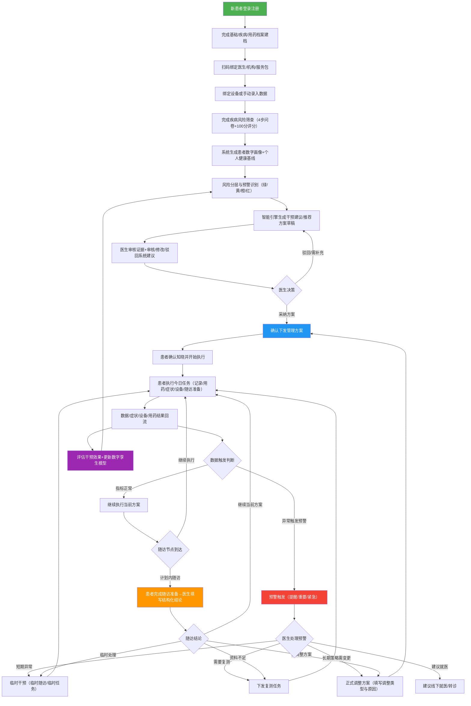
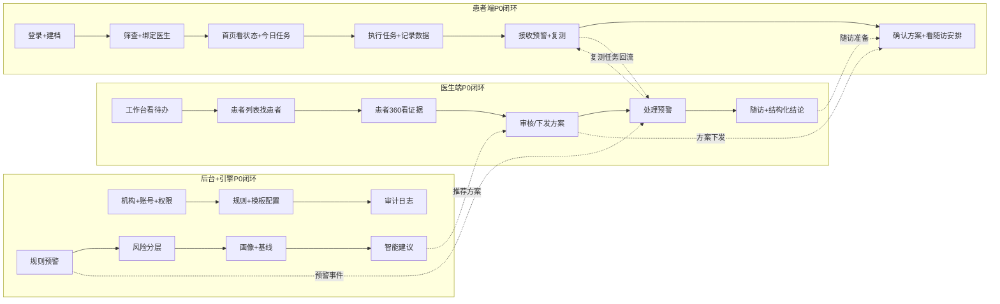

# 慢病数字孪生智能管理平台 — 项目内部汇报材料

> 日期：2026-05-26 | 版本：V2.5 评审版后复合 | 受众：业务领导、产品领导、开发团队

---

## 一、项目核心业务流程

### 1.1 主闭环流程图

以下流程图综合了 PRD V2.5 核心流程与医患闭环主PRD 的业务闭环总图，形成本期项目完整主闭环：

### 1.2 主闭环关键节点说明

| 阶段 | 核心动作 | 医生端 | 患者端 | 系统引擎 |
|------|---------|--------|--------|---------|
| 建档与绑定 | 注册建档→筛查→扫码绑定 | 生成绑定二维码、查看筛查结果 | 完成筛查问卷、授权绑定 | 生成风险标签和初始画像 |
| 画像与基线 | 数字画像→个人基线→风险分层 | 查看画像和风险分 | 查看简化版健康状态 | 计算健康风险分(0-100)、5维评分、风险等级 |
| 方案闭环 | 推荐→审核→下发→确认→执行→复盘 | 创建/审核/修改/下发/调整方案 | 确认知晓、执行任务、查看随访安排 | 生成推荐草稿、编译任务实例 |
| 预警闭环 | 触发→处置→复测/随访/干预/调方案 | 查看证据链、处置动作、留痕 | 复测、补充记录、查看医生建议 | 规则触发、证据聚合、建议生成 |
| 随访闭环 | 准备→执行→结论→下一步 | 查看摘要、填结构化结论、决定下一步 | 完成准备任务、查看结论 | 派生准备任务、聚合摘要 |
| 模型更新 | 效果评估→基线更新→新轮管理 | 查看效果评估 | — | 更新画像、基线、风险分 |

### 1.3 六大子闭环流转摘要

| 子闭环 | 状态机 | 关键规则 |
|--------|--------|---------|
| 管理方案 | draft → pending_patient_confirm → active → stopped/completed, rejected为终态 | 调整=新版本生效+旧版任务关闭；短期异常走临时干预不改方案 |
| 执行任务 | pending → completed → closed (overdue仅标签) | 9种P0任务类型；合并去重防过载；患者看"今日任务"不看模块 |
| 预警 | 提醒/重要/紧急 → 医生处理动作 → 关闭留痕 | 短期走临时干预；长期策略变化才进方案调整；关闭不删事件 |
| 随访 | pending_patient_prepare → pending_doctor → completed/overdue/rescheduled/cancelled | 结论必须明确(继续/临时/补充/转诊/调方案/结束) |
| 医患绑定 | 患者扫码+明确同意→绑定生效 | 风险标签≠确诊标签；医生确认后才进正式方案链路 |
| 设备与报告 | 绑定→同步→报告→可信度判断→回流 | 数据标识来源；设备异常可触发预警 |

---

## 二、端-模块-功能-页面矩阵与优先级标注

> **优先级定义**：P0=最小闭环必须交付（没它闭环跑不通）；P1=闭环增强（跑通后可迭代加入）；P2=暂不纳入本期

### 2.1 患者端 — 微信小程序

| 模块 | 功能 | 涉及页面 | 优先级 | 闭环必要性说明 |
|------|------|---------|--------|---------------|
| **登录注册** | 微信授权登录 | 登录页 | P0 | 入口前提 |
| | 手机号绑定 | 手机号绑定页 | P0 | 唯一身份标识 |
| | 身份确认（姓名/身份证/住院号） | 身份确认页 | P0 | 档案同步前提 |
| | 扫码绑定医生/机构 | 扫码页 | P0 | 进入医患闭环的前提 |
| | 无匹配结果处理 | 引导页 | P0 | 异常兜底 |
| | 院内档案同步 | 同步结果页 | P1 | 可后续迭代 |
| **健康档案** | 基础档案（姓名/性别/年龄/BMI等） | 档案编辑页 | P0 | 画像计算的基础输入 |
| | 疾病档案（糖尿病类型/慢阻肺诊断/睡眠诊断/合并症） | 疾病档案页 | P0 | 方案生成的疾病依据 |
| | 用药档案（药品/剂量/频次/开始时间） | 用药档案页 | P0 | 用药方案模块的来源 |
| | 既往史 | 既往史页 | P0 | 画像风险因子 |
| | 过敏史 | 过敏史页 | P0 | 安全边界 |
| | 生活方式（吸烟/饮酒/运动/饮食/睡眠） | 生活方式页 | P0 | 画像生活方式维度 |
| | 就诊病历 | 病历页 | P1 | 非闭环核心路径 |
| | 家属档案 | TA人档案页 | P1 | 非闭环核心 |
| **疾病风险筛查** | 糖尿病筛查（基础信息/病史/血糖/HbA1c/家族史） | 筛查问卷4步页+结果页 | P0 | 生成风险标签和初始画像 |
| | 慢阻肺筛查（吸烟史/咳嗽/咳痰/气促/CAT/mMRC） | 筛查问卷4步页+结果页 | P0 | 同上 |
| | 睡眠呼吸障碍筛查（STOP-Bang/ESS/颈围/打鼾） | 筛查问卷4步页+结果页 | P0 | 同上 |
| | 风险评估结果展示 | 结果页 | P0 | 患者知情闭环 |
| **首页** | 当前健康状态（稳定/需关注/风险升高/建议就医） | 首页主卡 | P0 | 患者首屏核心信息 |
| | 今日任务 | 首页任务区 | P0 | 执行闭环核心入口 |
| | 快捷记录（血糖/血压/血氧/体重/症状/睡眠/用药） | 首页快捷入口 | P0 | 采集闭环 |
| | 疾病管理入口（糖尿病/慢阻肺/睡眠/多病共管） | 首页疾病入口 | P0 | 分病种管理入口 |
| | 风险提醒 | 首页预警卡 | P0 | 预警闭环患者侧 |
| | 我的医生 | 首页医生卡 | P1 | 增强沟通 |
| | 健康百科 | 首页宣教卡 | P1 | P1宣教闭环 |
| **方案页** | 今日任务列表 | 方案页-今日任务Tab | P0 | 执行闭环主入口 |
| | 方案说明（阶段目标+配合事项+异常提示） | 方案页-方案说明Tab | P0 | 患者知情闭环 |
| | 随访计划（下次时间+准备事项） | 方案页-随访计划Tab | P0 | 随访闭环患者侧 |
| | 方案确认知晓 | 确认弹窗 | P0 | 方案闭环必须承接 |
| **记录页** | 糖尿病指标记录（空腹/餐后/随机血糖/HbA1c/饮食/运动/用药） | 血糖详情页 | P0 | 采集闭环核心 |
| | 慢阻肺指标记录（SpO2/心率/呼吸困难/咳嗽/咳痰/CAT/mMRC/吸入药） | 血氧详情页+量表页 | P0 | 采集闭环核心 |
| | 通用体征记录（血压/体重/BMI/心率/血脂） | 血压详情页+体征页 | P0 | 采集闭环核心 |
| | 睡眠指标记录（睡眠时长/最低血氧/ODI/AHI/CPAP使用/漏气） | 睡眠详情页 | P1 | 可手动录入先行 |
| | 报告上传（检验/检查/睡眠报告/出院小结） | 报告上传页 | P1 | 非闭环核心 |
| **任务中心** | 接收/查看/执行/提交任务 | 任务列表页+任务详情页 | P0 | 执行闭环核心 |
| | 任务历史 | 任务历史页 | P0 | 留痕闭环 |
| | 复测任务执行 | 复测执行页 | P0 | 预警闭环承接 |
| **设备绑定** | 血糖仪/CGM绑定 | 蓝牙绑定流程页 | P0 | 采集自动化 |
| | 血压计绑定 | 蓝牙绑定流程页 | P0 | 同上 |
| | 血氧仪绑定 | 蓝牙绑定流程页 | P0 | 同上 |
| | 体重秤绑定 | 蓝牙绑定流程页 | P1 | 可先手动录入 |
| | 睡眠监测设备绑定 | 蓝牙绑定流程页 | P1 | 同上 |
| | CPAP绑定 | 设备绑定页 | P1 | 同上 |
| | 设备同步状态+异常提示 | 设备状态页 | P0 | 设备闭环核心 |
| **健康教育** | 个性化宣教推送 | 百科列表+详情页 | P1 | 增强闭环 |
| | 课程专题 | 课程页 | P1 | 同上 |
| | 内容阅读记录 | 阅读记录页 | P1 | 同上 |
| **医患沟通** | 医生建议消息卡 | 消息卡页 | P1 | P1增强，P0用风险提醒兜底 |
| | 结构化问题回复 | 回复卡页 | P1 | P1增强 |
| | 健康顾问IM | IM页 | P1 | P1增强 |

**患者端 P0 页面总计**：约 20-22 个核心页面（含4个Tab主页+筛查4步+各类详情/确认页）

### 2.2 医生端 — PC SPA

| 模块 | 功能 | 涉及页面/视图 | 优先级 | 闭环必要性说明 |
|------|------|--------------|--------|---------------|
| **工作台** | 今日待办（预警/建议/随访/逾期） | 工作台视图 | P0 | 医生端入口 |
| | 高风险患者置顶 | 工作台-患者卡 | P0 | 快筛核心 |
| | 管理概览（总患者/活跃/失访/预警数/待处理） | 工作台-统计区 | P0 | 管理感知 |
| | 快捷操作（新建患者/下发任务/发起随访/创建模板） | 工作台-操作区 | P0 | 效率入口 |
| | 病种分布 | 工作台-病种图 | P1 | 统计增强 |
| **患者管理** | 患者列表（搜索/筛选/分页/标签/风险排序） | 患者列表视图 | P0 | 找患者闭环 |
| | 患者分组（按医生/管理师/病种/风险/服务包） | 分组筛选 | P0 | 快筛闭环 |
| | 患者标签（重点关注/依从性差/需复诊/设备异常/失访） | 标签管理 | P0 | 标记闭环 |
| | 患者归属（医生/管理师绑定） | 归属管理 | P0 | 责任闭环 |
| | 批量操作 | 批量操作 | P1 | P1增强 |
| **患者详情360** | 基础信息 | 360-基础信息Tab | P0 | 证据闭环 |
| | 疾病信息+风险等级 | 360-疾病信息Tab | P0 | 决策依据 |
| | 指标趋势（血糖/血压/血氧/体重/肺功能/睡眠/CPAP） | 360-趋势Tab | P0 | 证据闭环 |
| | 数字画像+个人基线+风险解释 | 360-数字孪生Tab | P0 | 画像闭环 |
| | 预警事件（等级/原因/状态/记录） | 360-预警Tab | P0 | 预警闭环 |
| | 智能建议（建议/依据/审核状态/下发） | 360-建议Tab | P0 | 建议闭环 |
| | 任务记录（类型/状态/反馈/逾期） | 360-任务Tab | P0 | 执行闭环 |
| | 随访记录（表单/结论/下一步） | 360-随访Tab | P0 | 随访闭环 |
| | 用药信息（当前用药/依从性/漏服/不良反应） | 360-用药Tab | P0 | 证据闭环 |
| | 报告资料 | 360-报告Tab | P1 | P1增强 |
| | 右侧决策侧栏（风险/建议/操作/最近处理） | 360-决策侧栏 | P0 | 决策闭环 |
| | 时间轴 | 360-时间轴 | P0 | 留痕闭环 |
| **管理方案** | 方案列表 | 方案列表视图 | P0 | 方案管理入口 |
| | 方案详情编辑（基础信息/目标/指标/症状/用药/设备/生活方式/预警/随访） | 方案详情页 | P0 | 方案闭环核心 |
| | 系统推荐方案审核 | 方案审核态 | P0 | 方案闭环核心 |
| | 方案下发+校验 | 下发确认 | P0 | 方案闭环核心 |
| | 方案调整（调整类型+原因+新版本） | 方案调整态 | P0 | 方案闭环核心 |
| | 方案状态流转操作（保存草稿/确认下发/停止/完成/驳回） | 底部操作条 | P0 | 方案闭环核心 |
| | 患者可见内容预览 | 预览区 | P0 | 安全边界 |
| **预警中心** | 预警列表（等级/来源/证据/待处理动作） | 预警列表视图 | P0 | 预警闭环核心 |
| | 预警详情+证据链 | 预警详情页 | P0 | 预警闭环核心 |
| | 处理动作（复测/随访/建议/干预/调方案/转诊/关闭留痕） | 预警处理动作 | P0 | 预警闭环核心 |
| **随访管理** | 随访列表（今日/逾期/预警后/待准备） | 随访列表视图 | P0 | 随访闭环核心 |
| | 创建随访（类型/来源/方案/时间/准备材料） | 创建随访页 | P0 | 随访闭环核心 |
| | 随访详情（摘要+结构化记录+下一步动作） | 随访详情页 | P0 | 随访闭环核心 |
| | 随访结论（继续/临时干预/补充/转诊/调方案/结束） | 结论选择 | P0 | 随访闭环核心 |
| **医生建议** | 医生建议列表 | 建议列表视图 | P1 | P1增强 |
| | 结构化问题模板 | 问题模板 | P1 | P1增强 |
| | 患者回复摘要 | 回复摘要 | P1 | P1增强 |
| **设备与报告** | 设备绑定状态+同步异常 | 设备视图 | P1 | P1增强（P0靠患者端上报+预警兜底） |
| | 睡眠/血氧报告详情 | 报告详情 | P1 | P1增强 |
| | 报告有效性标记 | 标记操作 | P1 | P1增强 |
| **指标字典与目标管理** | 指标字典配置 | 字典视图 | P0 | 方案配置前提 |
| | 目标阈值管理 | 目标视图 | P0 | 方案配置前提 |

**医生端 P0 页面总计**：约 12-15 个核心视图/页面（含7个主视图+患者360内12个子Tab+各类详情/编辑态）

### 2.3 管理后台

| 模块 | 功能 | 优先级 | 闭环必要性说明 |
|------|------|--------|---------------|
| 机构管理（��院/科室/团队/服务点） | P0 | 组织前提 |
| 账号权限（医生/护士/管理师/管理员） | P0 | RBAC前提 |
| 角色权限（RBAC/数据范围/操作权限） | P0 | 安全边界 |
| 规则配置（预警规则/风险分层/任务触发） | P0 | 智能引擎前提 |
| 模板管理（随访/任务/宣教模板） | P0 | 方案和随访配置前提 |
| 审计日志（登录/数据访问/规则修改/建议审核/任务下发） | P0 | 合规闭环 |
| 内容管理（文章/视频/问卷/训练指导） | P1 | P1宣教闭环 |
| 设备管理（设备类型/厂商/绑定规则/数据字段） | P1 | P1设备闭环 |
| 模型管理（模型版本/启停/解释/回滚） | P1 | P1智能引擎增强 |

### 2.4 智能引擎

| 能力 | 功能 | 优先级 | 闭环必要性说明 |
|------|------|--------|---------------|
| 规则预警 | 按配置规则触发预警事件 | P0 | 预警闭环核心 |
| 风险分层 | 输出绿/黄/橙/红风险等级 | P0 | 画像闭环核心 |
| 患者画像 | 聚合5维数据形成数字画像 | P0 | 方案推荐前提 |
| 个人基线 | 基于历史数据形成个体基线 | P0 | 偏离识别前提 |
| 智能建议 | 生成复测/随访/宣教/复诊建议 | P0 | 建议闭环核心 |
| 效果评估 | 干预前后指标对比+任务完成率+风险变化 | P1 | P1增强 |
| 模型更新 | 新数据更新画像与基线 | P1 | P1增强 |

---

## 三、最小闭环功能组合

以"医患管理闭环跑通"为判断标准，P0 功能组合如下：

**闭环跑通的最小验证路径**：1位医生 → 1位糖尿病患者 → 完成筛查绑定 → 医生审核下发方案 → 患者确认执行 → 血糖数据回流 → 触发预警 → 医生处置 → 随访 → 结论闭环 → 方案调整或继续执行

---

## 四、生产级开发预估人日投入

### 4.1 估算方法说明

- 基于 P0 功能范围估算，P1 单列
- 人日 = 1人×1天有效开发产出（含自测不含联调）
- 前端按页面+交互复杂度；后端按接口+业务逻辑+数据模型；引擎按规则+算法

### 4.2 患者端（微信小程序）

| 模块 | 页面数 | 前端人日 | 说明 |
|------|--------|---------|------|
| 登录注册与档案同步 | 6页 | 8 | 含微信授权+多方式身份确认+扫码绑定 |
| 健康档案 | 5页(P0) | 6 | 基础/疾病/用药/既往/过敏档案编辑 |
| 疾病风险筛查 | 3病×4步+结果页=7页 | 10 | 3套不同问卷+评分逻辑+结果展示 |
| 首页 | 1主页 | 5 | 多状态渲染（新用户/已筛查）+卡片组件 |
| 方案页 | 3Tab+确认弹窗 | 8 | 今日任务+方案说明+随访计划 |
| 记录页 | 5详情页(P0)+2(P1) | 12 | 各指标录入+历史趋势+补录逻辑 |
| 任务中心 | 2页 | 5 | 任务列表+详情+执行提交 |
| 设备绑定(P0) | 3设备绑定+状态页 | 6 | 血糖仪/血压计/血氧仪蓝牙 |
| Tab栏+导航+全局组件 | — | 4 | 自定义Tab+通用弹窗+卡片+表单组件 |
| **患者端P0合计** | **~28页** | **~60人日** | |

| 模块(P1) | 页面数 | 前端人日 |
|----------|--------|---------|
| 睡眠记录+CPAP | 2页 | 4 |
| 报告上传 | 1页 | 2 |
| 体重秤/睡眠设备/CPAP绑定 | 3页 | 4 |
| 健康教育(百科+课程) | 3页 | 5 |
| 医患沟通(消息卡+回复) | 3页 | 5 |
| **患者端P1合计** | **~12页** | **~20人日** |

### 4.3 医生端（PC SPA）

| 模块 | 页面数/视图 | 前端人日 | 说明 |
|------|------------|---------|------|
| 工作台 | 1视图 | 5 | 待办卡片+统计区+快捷操作 |
| 患者管理列表 | 1视图 | 8 | 搜索+筛选+统计卡+表格+分页+星标 |
| 患者详情360 | 1主框架+12子Tab+决策侧栏 | 20 | 复杂聚合页，含总览/趋势/画像/预警/方案/随访/任务/用药/时间轴 |
| 管理方案 | 1列表+1详情编辑+审核态+调整态 | 15 | 方案全生命周期，含9个模块配置+校验+预览 |
| 预警中心 | 1列表+1详情 | 8 | 证据链+处理动作弹层 |
| 随访管理 | 1列表+1创建+1详情 | 12 | 结构化记录+结论选择+准备材料 |
| 指标字典+目标管理 | 2视图 | 4 | 配置型页面 |
| 全局组件+布局+权限拦截 | — | 5 | AntD组件复用+路由+权限 |
| **医生端P0合计** | **~12核心视图** | **~79人日** | |

| 模块(P1) | 页面数 | 前端人日 |
|----------|--------|---------|
| 医生建议与结构化沟通 | 3视图 | 8 |
| 设备与报告详情 | 2视图 | 5 |
| 看板 | 1视图 | 4 |
| **医生端P1合计** | **~6视图** | **~17人日** |

### 4.4 管理后台

| 模块 | 前端人日 | 后端人日 | 说明 |
|------|---------|---------|------|
| 机构管理 | 3 | 4 | 组织树CRUD |
| 账号权限+RBAC | 5 | 8 | 权限矩阵+数据范围 |
| 规则配置 | 5 | 10 | 预警规则引擎+风险分层+触发配置 |
| 模板管理 | 4 | 5 | 随访/任务/宣教模板CRUD |
| 审计日志 | 3 | 4 | 全链路审计 |
| **后台P0合计** | **20人日** | **31人日** | |

| 模块(P1) | 前端人日 | 后端人日 |
|----------|---------|---------|
| 内容管理 | 5 | 6 |
| 设备管理 | 4 | 5 |
| 模型管理 | 3 | 4 |
| **后台P1合计** | **12人日** | **15人日** |

### 4.5 后端服务（业务API）

| 模块 | 后端人日 | 说明 |
|------|---------|------|
| 用户体系+认证+医患绑定 | 10 | 多方式注册+微信认证+绑定流程 |
| 患者档案+筛查+评分 | 12 | 档案CRUD+3套筛查+评分算法 |
| 管理方案全生命周期 | 15 | 6状态机+9模块CRUD+版本管理+校验+下发 |
| 任务生成+合并+执行闭环 | 15 | 9类型任务+周期生成+合并降噪+状态流转+补录 |
| 预警触发+处理+留痕 | 12 | 规则引擎+证据聚合+7种处理动作+关闭留痕 |
| 随访全流程 | 10 | 6类型+6状态+准备任务派生+结论驱动后续 |
| 数据记录+指标+趋势 | 8 | 多指标CRUD+趋势聚合+历史查询 |
| 设备绑定+数据同步(P0三设备) | 6 | 蓝牙数据接收+解析+存储 |
| 消息通知+推送 | 4 | 微信模板消息+站内信 |
| 数据模型+接口基础 | 5 | 公共数据对象+分页+筛选+导出 |
| **后端P0合计** | **~97人日** | |

| 模块(P1) | 后端人日 |
|----------|---------|
| 睡眠设备+CPAP+报告 | 6 |
| 结构化沟通 | 5 |
| 宣教内容推送 | 4 |
| 效果评估+看板 | 6 |
| **后端P1合计** | **~21人日** |

### 4.6 智能引擎

| 模块 | 人日 | 说明 |
|------|------|------|
| 预警规则引擎(P0) | 15 | 规则配置+触发计算+证据聚合+等级判定 |
| 风险分层+健康风险分(P0) | 10 | 5维评分+4档分层+个人基线计算 |
| 患者画像+方案推荐(P0) | 10 | 病种画像+推荐草稿生成 |
| 智能建议生成(P0) | 8 | 建议模板+依据拼接+审核状态 |
| **引擎P0合计** | **~43人日** | |

| 模块(P1) | 人日 |
|----------|------|
| 效果评估 | 6 |
| 模型版本+更新 | 4 |
| **引擎P1合计** | **~10人日** |

### 4.7 测试+联调+部署

| 项目 | 人日 | 说明 |
|------|------|------|
| 双端联调 | 10 | 患者端+医生端+后端全链路联调 |
| 集成测试 | 15 | 功能测试+状态机测试+闭环场景测试 |
| 性能+安全测试 | 5 | 基础性能+数据安全+权限边界 |
| 部署+运维搭建 | 5 | 服务器+数据库+小程序发布+CI/CD |
| **合计** | **~35人日** | |

### 4.8 总投入汇总

| 类别 | P0人日 | P1人日 | 合计 |
|------|--------|--------|------|
| 患者端前端 | 60 | 20 | 80 |
| 医生端前端 | 79 | 17 | 96 |
| 管理后台前端 | 20 | 12 | 32 |
| 后端API | 97 | 21 | 118 |
| 智能引擎 | 43 | 10 | 53 |
| 测试+联调+部署 | 35 | 10 | 45 |
| **总计** | **335人日** | **90人日** | **425人日** |

### 4.9 团队配置建议与周期推算

| 角色 | 人数 | P0周期推算 |
|------|------|-----------|
| 患者端前端 | 2人 | 60÷2 = ~30工作日(6周) |
| 医生端前端 | 2人 | 79÷2 = ~40工作日(8周) |
| 后台前端 | 1人 | 20÷1 = ~20工作日(4周) |
| 后端开发 | 3人 | 97÷3 = ~33工作日(7周) |
| 智能引擎 | 1人 | 43÷1 = ~43工作日(9周) |
| 测试 | 2人 | 35÷2 = ~18工作日(4周) |

**P0整体交付周期**：考虑并行开发+联调依赖，按阶段推进：

| 阶段 | 周期 | 内容 |
|------|------|------|
| 阶段1-基础搭建 | 第1-4周 | 后端数据模型+用户体系+档案+筛查+后台基础配置+引擎规则框架 |
| 阶段2-患者端闭环 | 第5-10周 | 患者端建档+记录+任务+预警接收+方案确认+设备绑定 |
| 阶段3-医生端闭环 | 第11-16周 | 医生端患者管理+详情360+方案+预警+随访 |
| 阶段4-引擎闭环 | 第17-22周 | 智能建议+画像+基线+效果评估 |
| 阶段5-联调上线 | 第23-26周 | 全链路联调+测试+后台审计+试点上线 |

**总周期**：约26周（6.5个月），8人核心团队

---

## 五、汇报要点总结

1. **核心闭环**：建档→绑定→画像→方案→执行→数据回流→预警→处置→随访→复盘→模型更新，循环往复。每个子闭环有独立状态机，但通过数据回流和动作触发串联成完整主闭环。

2. **最小闭环跑通路径**：P0共335人日，覆盖患者端28页+医生端12核心视图+后台5模块+引擎4能力+全链路联调。P1共90人日可分批迭代加入。

3. **关键风险提醒**：
   - 方案闭环最复杂（9模块配置+6状态机+版本管理），建议最先拆SPEC
   - 预警规则需临床专家确认阈值，否则引擎无法正确触发
   - 设备蓝牙对接有硬件不确定性，P0先做3个核心设备
   - 数字孪生画像和基线算法依赖足够历史数据，初期可能数据不足需降级处理

4. **团队建议**：8人核心团队（2患者端前端+2医生端前端+1后台前端+3后端+1引擎），26周完成P0交付。