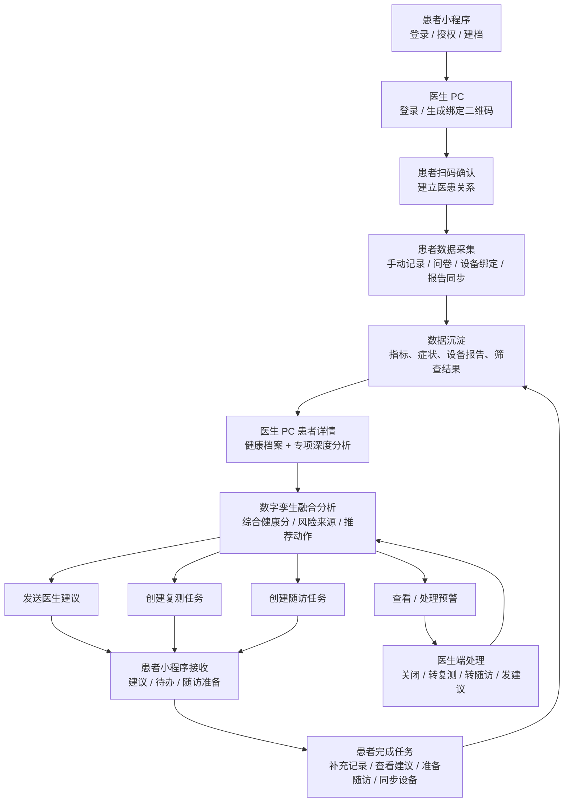
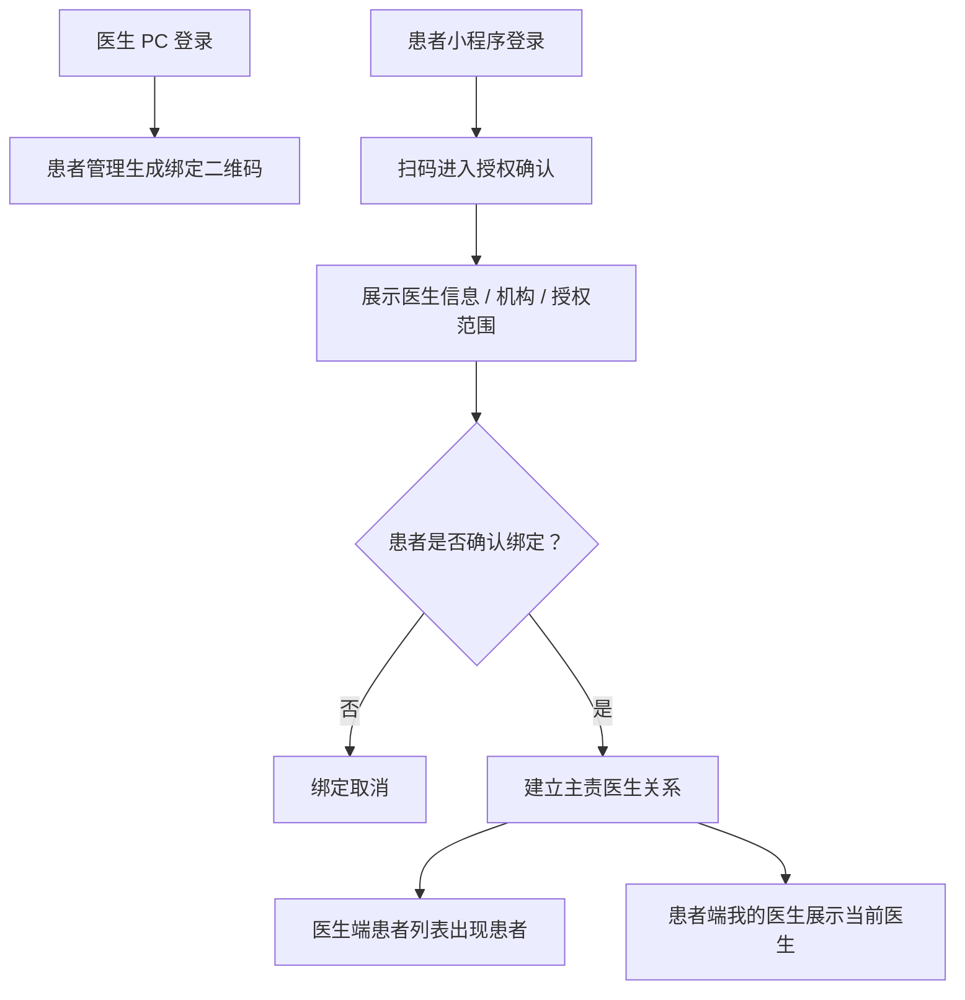
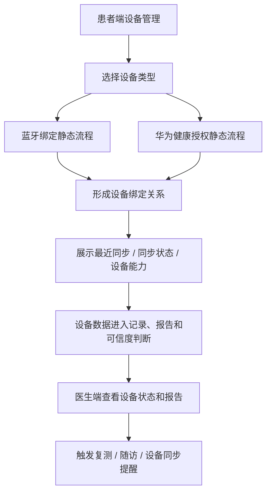
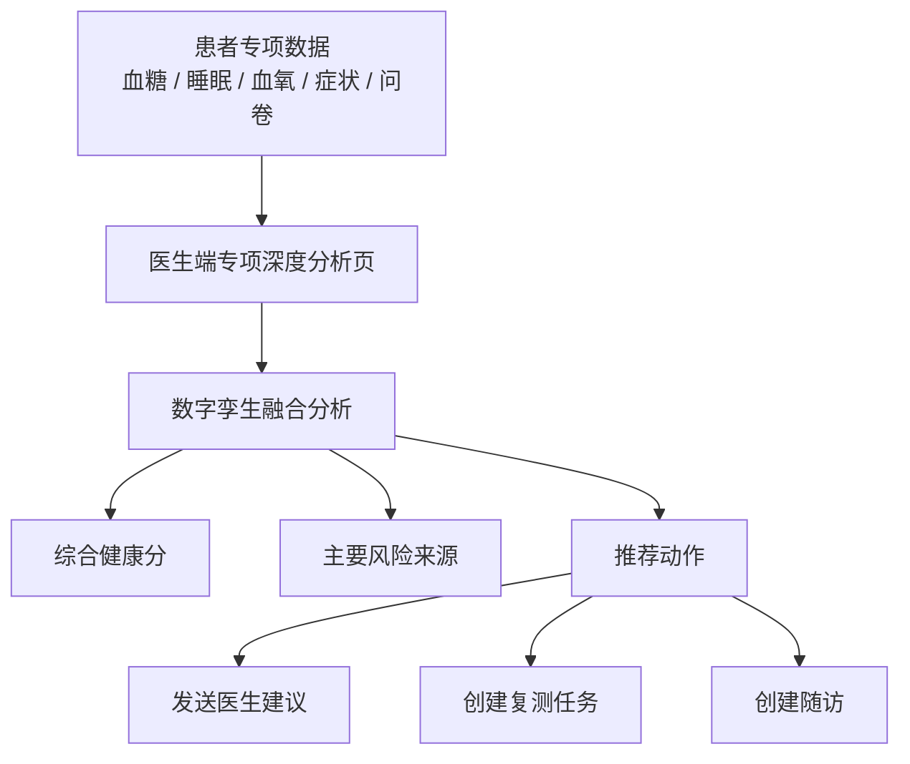
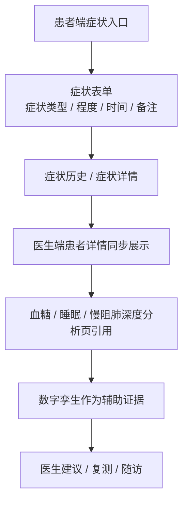
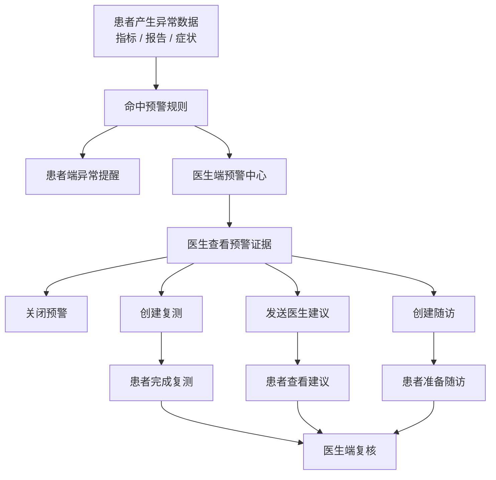
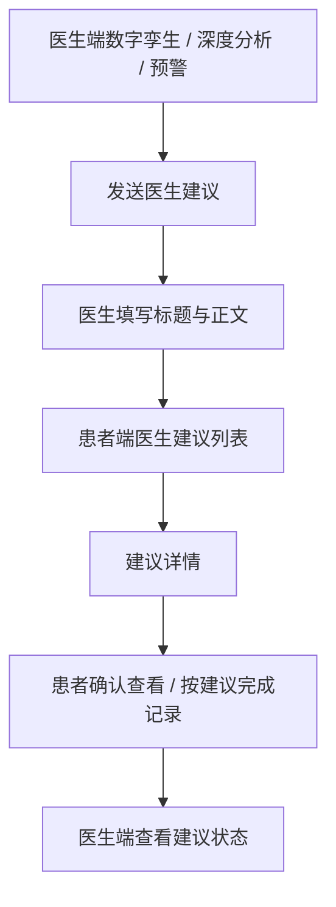
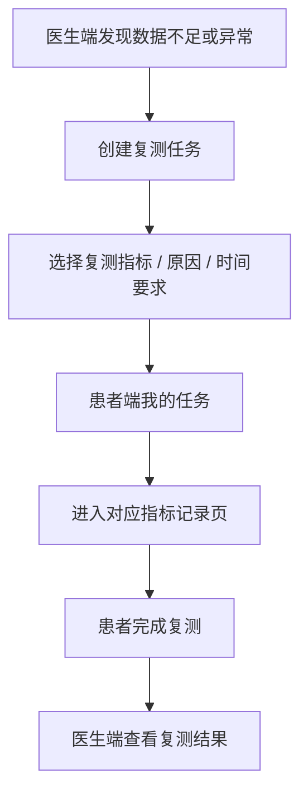
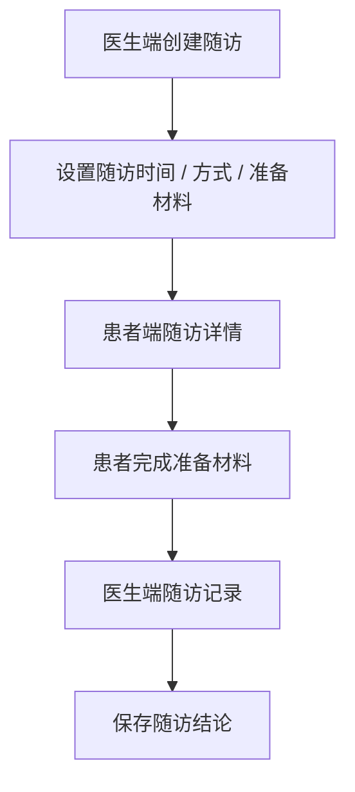

# 数字孪生慢病管理项目汇报：两端功能闭环与优先级

> 适用场景：项目汇报、研发排期评估、最小版本范围确认  
> 范围：医生 PC 端 + 患者小程序端  
> 核心目标：用最小功能闭环支撑“数字孪生慢病管理”演示与阶段性交付

---

## 一、汇报核心叙事

本项目不是单纯展示患者指标，而是建立一个从患者数据采集到医生综合判断，再到管理动作下发和患者执行回流的闭环。

核心叙事：

1. 患者和医生分别完成登录、授权和基础身份建立。
2. 医生通过二维码建立医患关系，患者确认授权后，医生才可查看患者数据。
3. 患者端持续产生健康数据，包括血糖、血氧、症状、睡眠报告、问卷和设备同步数据等。
4. 医生端在患者详情中查看专项证据，包括血糖、睡眠、慢阻肺等深度分析页。
5. 数字孪生融合分析将多病种、多指标、多来源数据汇总为综合健康分、主要风险来源和推荐动作。
6. 医生基于分析结果发起医生建议、复测任务或随访任务。
7. 患者端接收任务并完成记录，数据再次回流医生端，形成持续管理闭环。

---

## 二、端到端核心流程图

---

## 三、功能闭环拆分总览

> P0：最小演示闭环必须  
> P1：完整业务闭环增强  
> P2：平台化、配置化或长期管理增强

| 功能闭环 | 汇报定位 | 患者端最小功能 | 医生 PC 端最小功能 | 闭环结果 / 联动关系 | 优先级 | 页面数 | 人日 |
| --- | --- | --- | --- | --- | --- | ---: | ---: |
| 账号登录与权限闭环 | 两端进入系统的身份底座 | 微信登录、手机号授权、隐私授权、退出登录 | 医生登录、角色权限、登录态 | 决定后续数据归属、权限校验和审计主体 | P0 | 3 | 5 / 8 / 13 |
| 医患关系建立闭环 | 医生可管理患者的前提 | 扫码绑定医生、查看我的医生、申请解绑 | 生成绑定二维码、添加患者、解除绑定 | 绑定后医生端出现患者，患者端展示当前主责医生 | P0 | 4 | 6 / 8 / 14 |
| 患者管理与详情闭环 | 医生端所有处置动作的入口 | 基础信息来源、授权范围提示 | 患者管理列表、患者详情页 | 从患者列表进入详情，再进入分析、建议、复测、随访 | P0 | 2 | 4 / 4 / 8 |
| 设备管理与绑定闭环 | 让居家设备进入管理体系 | 设备分类、华为授权静态页、蓝牙绑定静态页、解绑 | 设备状态、设备筛选、患者设备信息 | 设备绑定状态影响记录、报告、预警和数字孪生可信度 | P0 | 5 | 7 / 7 / 14 |
| 数字孪生分析闭环 | 汇报中的核心亮点和医生综合判断入口 | P0 可暂不展示独立患者端页面 | 数字孪生融合分析 Tab | 汇总多病种证据，输出健康分、风险来源、推荐动作 | P0 | 1 | 10 / 8 / 18 |
| 血糖记录与分析闭环 | 糖尿病专项证据链 | 血糖记录、血糖表单、血糖历史 / 详情 | 血糖深度分析、数字孪生引用 | 血糖异常进入数字孪生依据，可触发建议、复测和随访 | P0 | 4 | 7 / 6 / 13 |
| 血氧 / 慢阻肺证据闭环 | 慢阻肺专项证据链 | 血氧记录、血氧详情、CAT / mMRC 问卷 | 慢阻肺深度分析、数字孪生引用 | 血氧、量表和症状共同支撑慢阻肺风险判断 | P0 | 5 | 8 / 7 / 15 |
| 睡眠报告闭环 | 睡眠呼吸障碍专项证据链 | 睡眠报告页、历史睡眠报告页 | 睡眠深度分析、历史报告弹窗 | AHI、ODI、最低血氧等进入数字孪生风险来源 | P0 | 4 | 7 / 6 / 13 |
| 症状记录闭环 | 补足设备和指标之外的主观证据 | 症状记录、症状表单、症状详情 / 历史 | 患者详情症状展示、深度分析页症状引用 | 症状作为辅助证据进入专项分析和数字孪生判断 | P0 | 5-6 | 7 / 5 / 12 |
| 医生建议闭环 | 最轻量的医生干预动作 | 医生建议列表、建议详情、首页 / 我的任务入口 | 发送医生建议抽屉、医生建议列表 | 医生分析后下发建议，患者查看，医生端留痕 | P0 | 4 | 5 / 5 / 10 |
| 复测任务闭环 | 数据不足或异常后的补数动作 | 我的任务、复测任务详情、对应指标记录页 | 创建复测抽屉、患者详情回看结果 | 医生发起复测，患者补充记录，结果回流医生端 | P0 | 4 | 6 / 6 / 12 |
| 基础随访闭环 | 把一次性建议延伸成连续管理 | 随访详情、随访准备材料、问卷 / 记录入口 | 创建随访抽屉、随访记录 | 医生创建随访，患者准备资料，随访结果回流 | P0 / P1 | 4 | 7 / 6 / 13 |
| 设备数据同步 / 报告接入闭环 | 从演示设备绑定升级到真实数据接入 | 设备同步状态、同步异常处理、报告查看 | 设备报告、数据可信度、报告有效性标记 | 真实设备数据进入报告、可信度、预警和方案依据 | P1 | 4 | 6 / 12 / 18 |
| 预警提醒闭环 | 异常事件的集中处理机制 | 异常提醒、复测 / 补记入口 | 预警中心、预警处理弹窗、患者预警记录 | 预警可转医生建议、复测、随访或关闭 | P1 | 5 | 8 / 8 / 16 |
| 健康筛查闭环 | 新患者风险识别和疾病标签来源 | 筛查页、筛查结果页 | 健康筛查 Tab、疾病确认 | 筛查风险经医生确认后进入正式管理标签 | P1 | 4 | 6 / 5 / 11 |
| 管理方案闭环 | 长期慢病管理的完整方案能力 | 方案页、今日待办、方案详情 | 管理方案列表、方案详情、方案编辑 / 下发 | 医生下发阶段方案，患者执行，后续复盘调整 | P2 | 5 | 12 / 12 / 24 |
| 时间轴 / 留痕闭环 | 合规和复盘的底层留痕能力 | P0 可不展示 | 时间轴 Tab、关键事件留痕 | 记录绑定、数据、预警、建议、随访、方案等关键事件 | P2 | 1 | 3 / 4 / 7 |

> 人日列格式为：前端 / 后端 / 合计。

---

## 四、重点功能闭环说明

### 4.1 账号登录与医患关系闭环

最小版本要求：

| 功能点 | 说明 | 优先级 |
| --- | --- | --- |
| 患者端登录授权 | 微信登录、手机号授权、隐私授权提示 | P0 |
| 医生端登录 | 账号密码或演示账号登录，保留角色信息 | P0 |
| 医生生成绑定二维码 | 二维码带医生、机构、有效期和服务类型 | P0 |
| 患者确认绑定 | 扫码后展示医生信息和数据授权范围，确认后生效 | P0 |
| 绑定关系管理 | 我的医生、医生端解除绑定、审计记录 | P0 / P1 |

### 4.2 设备管理与数据接入闭环

最小版本要求：

| 功能点 | 说明 | 优先级 |
| --- | --- | --- |
| 设备分类与绑定入口 | 睡眠、血糖、血压、血氧、体重、运动 | P0 |
| 蓝牙绑定静态流程 | 重点睡眠/血氧设备进入绑定说明和连接中页 | P0 |
| 华为健康授权静态流程 | 非重点设备进入华为授权演示页 | P0 |
| 我的设备与解绑 | 展示设备、型号、最近同步、同步状态、解绑 | P0 |
| 医生端设备状态 | 患者列表筛选设备未绑定/同步异常，详情展示设备信息 | P0 |
| 真实设备对接与数据同步 | 厂商接口、数据入库、设备能力差异、异常重试 | P1 |
| 报告有效性与可信度 | 医生可判断报告是否可用于临床判断 | P1 |

### 4.3 数字孪生分析闭环

最小版本要求：

| 功能点 | 说明 | 优先级 |
| --- | --- | --- |
| 数字孪生健康分 | 复用现有风险分并结合有限规则修正 | P0 |
| 主要风险来源 | 固定规则生成，如低氧负担、血糖波动、数据不足 | P0 |
| 推荐动作 | 输出复测、随访、医生建议入口 | P0 |
| 推荐依据 | 展示 2-3 条关键证据，解释为什么建议该动作 | P0 |
| 共病风险传导路径 | 只在共病患者展示，按固定链路文案生成 | P0 |
| 3D / 数字人联动 | 可选表现层，不影响闭环 | P2 |

### 4.4 症状记录闭环

涉及功能点：

| 端 | 页面 / 功能 | 优先级 |
| --- | --- | --- |
| 患者端 | 症状记录入口 | P0 |
| 患者端 | 症状表单 | P0 |
| 患者端 | 症状历史 / 症状详情 | P0 |
| 医生端 | 患者详情症状展示 | P0 |
| 医生端 | 深度分析页症状证据引用 | P0 |
| 医生端 | 数字孪生分析引用症状作为辅助证据 | P0 |

### 4.5 预警提醒闭环

最小版本建议：

| 功能点 | 说明 | 优先级 |
| --- | --- | --- |
| 异常规则命中 | 可先用固定规则和 mock 数据 | P1 |
| 医生端预警中心 | 展示预警列表、等级、证据、状态 | P1 |
| 预警处理 | 关闭、转复测、转随访、发建议 | P1 |
| 患者端异常提醒 | 首页 / 我的任务展示提醒入口 | P1 |
| 预警与数字孪生联动 | 数字孪生页展示待处理预警入口 | P0 可弱化展示 |

### 4.6 医生建议闭环

最小版本要求：

| 功能点 | 说明 | 优先级 |
| --- | --- | --- |
| 医生端发送建议抽屉 | 标题、正文、来源信息 | P0 |
| 医生建议列表 | 医生端查看已发建议 | P0 |
| 患者端建议列表 | 患者查看医生建议 | P0 |
| 患者端建议详情 | 展示建议内容 | P0 |
| 已读 / 执行状态 | 可后置 | P1 |

### 4.7 复测任务闭环

最小版本要求：

| 功能点 | 说明 | 优先级 |
| --- | --- | --- |
| 医生端创建复测 | 指标、原因、指导语、时间 | P0 |
| 患者端任务入口 | 我的任务 / 首页待办 | P0 |
| 患者端完成记录 | 跳转到对应记录表单 | P0 |
| 医生端回看结果 | 在患者详情和深度分析页可见 | P0 |

### 4.8 基础随访闭环

最小版本要求：

| 功能点 | 说明 | 优先级 |
| --- | --- | --- |
| 医生端创建随访 | 时间、方式、准备材料 | P0 |
| 患者端随访详情 | 查看随访时间和准备项 | P0 |
| 患者端准备材料入口 | 跳转记录 / 问卷 / 报告 | P0 |
| 医生端随访记录 | 能看到待随访列表 | P1 |
| 完整随访结论 | 可后置增强 | P1 |

---

## 五、患者小程序端页面清单

| 页面 | 功能说明 | 优先级 |
| --- | --- | --- |
| 首页 / 今日待办 | 展示复测、随访、建议、记录任务入口 | P0 |
| 登录 / 授权 | 微信登录、手机号授权、隐私授权 | P0 |
| 我的医生 / 绑定确认 | 扫码绑定医生、展示医生信息和授权范围 | P0 |
| 记录首页 | 血糖、血氧、症状等记录入口 | P0 |
| 血糖记录表单 | 录入空腹、餐后、随机血糖 | P0 |
| 血糖详情 / 历史 | 查看血糖历史和单条详情 | P0 |
| 血氧记录 / 详情 | 查看或补充血氧记录 | P0 |
| 症状记录表单 | 录入症状、程度、时间、备注 | P0 |
| 症状详情 / 历史 | 查看历史症状 | P0 |
| 睡眠报告页 | 查看最新睡眠报告 | P0 |
| 睡眠历史报告 | 查看历史报告 | P0 |
| 医生建议列表 / 详情 | 接收医生建议 | P0 |
| 我的任务 | 承接复测、随访准备、建议待办 | P0 |
| 随访详情 | 查看随访时间和准备材料 | P0 / P1 |
| CAT / mMRC 问卷 | 慢阻肺评估 | P0 |
| 设备管理 | 设备分类、绑定入口、解绑、同步状态 | P0 |
| 华为授权静态页 | 演示第三方健康数据授权入口 | P0 |
| 蓝牙绑定 / 连接中 | 演示重点设备绑定流程 | P0 |
| 健康筛查 / 筛查结果 | 疾病风险识别 | P1 |
| 方案页 / 方案详情 | 长期管理方案执行 | P2 |

患者端最小闭环页面数：约 18 个 P0 页面。  
患者端完整闭环页面数：约 20 个页面。

---

## 六、医生 PC 端页面清单

| 页面 / 弹层 | 功能说明 | 优先级 |
| --- | --- | --- |
| 登录页 | 医生账号登录、角色初始化 | P0 |
| 患者管理 | 找患者、筛选风险、进入详情 | P0 |
| 添加患者 / 绑定二维码弹窗 | 生成医患绑定二维码 | P0 |
| 患者详情框架 | 顶部患者卡 + Tab 承载 | P0 |
| 数字孪生融合分析 | 综合判断和推荐动作 | P0 |
| 血糖深度分析 | 血糖专项证据 | P0 |
| 睡眠深度分析 | 睡眠专项证据 | P0 |
| 慢阻肺深度分析 | COPD 专项证据 | P0 |
| 健康档案 | 基础信息和疾病背景 | P0 |
| 发送医生建议抽屉 | 下发建议 | P0 |
| 医生建议列表 | 查看已发送建议 | P0 |
| 创建复测抽屉 | 分配复测任务 | P0 |
| 创建随访抽屉 | 创建随访 | P0 |
| 随访记录 | 查看患者随访记录 | P0 / P1 |
| 设备与报告 | 查看设备绑定、同步状态和报告可信度 | P0 / P1 |
| 健康筛查 | 筛查结果和疾病确认 | P1 |
| 预警中心 | 集中处理异常 | P1 |
| 预警处理弹窗 | 关闭 / 转建议 / 转复测 / 转随访 | P1 |
| 管理方案 | 长期方案管理 | P2 |
| 时间轴 | 留痕 | P2 |

医生 PC 端最小闭环页面数：约 15 个 P0 页面 / 弹层。  
医生 PC 端完整闭环页面数：约 20 个页面 / 弹层。

---

## 七、最小版本范围建议

### 7.1 P0 最小闭环

P0 目标不是一次性做完整慢病管理平台，而是先完成能汇报、能演示、能讲通业务价值的端到端闭环。

| P0 闭环 | 患者端 | 医生端 | 前端人日 | 后端人日 | 合计人日 |
| --- | --- | --- | ---: | ---: | ---: |
| 账号登录与权限 | 微信登录、手机号授权、隐私授权 | 医生登录、角色权限、登录态 | 5 | 8 | 13 |
| 医患关系建立 | 扫码绑定、我的医生、解绑申请 | 添加患者、生成二维码、解除绑定 | 6 | 8 | 14 |
| 设备管理与绑定 | 设备分类、华为授权静态页、蓝牙绑定、解绑 | 设备状态筛选、患者设备信息 | 7 | 7 | 14 |
| 患者数据记录 | 血糖、血氧、症状、问卷、睡眠报告 | 专项深度分析页查看 | 28 | 22 | 50 |
| 数字孪生分析 | P0 可暂不展示 | 数字孪生融合分析 | 10 | 8 | 18 |
| 医生建议 | 建议列表 / 详情 / 待办入口 | 发送建议 / 建议列表 | 5 | 5 | 10 |
| 复测任务 | 我的任务 / 指标记录 | 创建复测 / 回看结果 | 6 | 6 | 12 |
| 基础随访 | 随访详情 / 准备材料 | 创建随访 / 随访记录 | 7 | 6 | 13 |
| 患者详情与医生入口 | 授权 / 基础信息来源 | 患者管理 / 患者详情 | 7 | 6 | 13 |
| 基础数据联动 | 本地 mock / 接口联调 | 本地 mock / 接口联调 | 6 | 8 | 14 |
| **P0 合计** |  |  | **87** | **84** | **171 人日** |

### 7.2 P1 完整闭环增强

| P1 模块 | 说明 | 前端人日 | 后端人日 | 合计人日 |
| --- | --- | ---: | ---: | ---: |
| 设备数据同步 / 报告接入 | 厂商接口、同步任务、报告入库、异常重试 | 6 | 12 | 18 |
| 预警中心 | 预警列表、处理动作、状态流转 | 8 | 8 | 16 |
| 健康筛查闭环 | 患者筛查、医生确认疾病标签 | 6 | 5 | 11 |
| 完整随访管理 | 随访列表、完成随访、结论记录 | 5 | 5 | 10 |
| 医生建议状态回显 | 已读、执行、关联任务状态 | 3 | 3 | 6 |
| **P1 合计** |  | **28** | **33** | **61 人日** |

### 7.3 P2 平台化能力

| P2 模块 | 说明 | 前端人日 | 后端人日 | 合计人日 |
| --- | --- | ---: | ---: | ---: |
| 管理方案完整闭环 | 方案编辑、下发、患者执行、复盘 | 12 | 12 | 24 |
| 时间轴 | 关键事件留痕 | 3 | 4 | 7 |
| 指标字典 / 目标管理 | 指标口径、目标阈值配置 | 5 | 5 | 10 |
| **P2 合计** |  | **20** | **21** | **41 人日** |

---

## 八、后端能力拆分

| 后端能力 | 覆盖功能 | 优先级 | 后端人日 |
| --- | --- | --- | ---: |
| 账号认证与权限 | 患者微信登录、手机号授权、医生登录、角色权限 | P0 | 8 |
| 医患关系与授权 | 绑定二维码、患者授权确认、解绑、授权范围 | P0 | 8 |
| 用户 / 患者基础数据 | 患者管理、患者详情、基础档案 | P0 | 6 |
| 设备绑定管理 | 设备分类、绑定关系、解绑、同步状态 | P0 | 7 |
| 健康数据记录服务 | 血糖、血氧、症状、问卷、睡眠报告 | P0 | 18 |
| 专项分析证据聚合服务 | 血糖、睡眠、慢阻肺深度分析所需趋势和证据数据 | P0 | 11 |
| 数字孪生分析聚合服务 | 健康分、风险来源、推荐动作、推荐依据 | P0 | 8 |
| 任务服务 | 复测、随访准备、患者待办 | P0 | 10 |
| 医生建议服务 | 建议发送、建议列表、建议详情、状态 | P0 | 5 |
| 随访服务 | 创建随访、随访列表、准备材料、结论 | P0 / P1 | 8 |
| 跨端数据联动 / 接口联调 | 患者端与医生端同患者、同任务、同记录的数据同步 | P0 | 8 |
| 设备数据接入 / 报告同步 | 厂商接口、同步任务、报告入库、异常重试 | P1 | 12 |
| 预警服务 | 规则命中、预警列表、处置状态 | P1 | 8 |
| 筛查 / 疾病确认服务 | 筛查结果、疾病标签确认 | P1 | 5 |
| 管理方案服务 | 方案编辑、下发、执行、复盘 | P2 | 12 |
| 审计 / 时间轴服务 | 操作留痕、关键事件归档 | P2 | 4 |

---

## 九、总体人日汇总

| 阶段 | 范围 | 前端人日 | 后端人日 | 合计人日 |
| --- | --- | ---: | ---: | ---: |
| P0 | 最小端到端演示闭环 | 87 | 84 | 171 |
| P1 | 完整业务闭环增强 | 28 | 33 | 61 |
| P2 | 平台化和长期管理能力 | 20 | 21 | 41 |
| **总计** |  | **135** | **138** | **273 人日** |

说明：

1. 以上为前后端粗估，不含设备厂商联调、真实算法模型训练、正式测试和上线验收周期。
2. 若以 mock 数据演示为目标，登录、医患绑定和设备接入可先做静态/本地数据，P0 后端可明显降低。
3. 若要求真实账号权限、消息通知、设备厂商数据接入、审计日志全部打通，应以完整合计人日评估。

---

## 十、汇报推荐讲法

建议汇报时用一句话概括：

> 本项目最小版本不先追求完整慢病管理方案，而是先打通“账号登录 - 医患绑定授权 - 患者产生数据 / 设备同步 - 医生看到证据 - 数字孪生形成综合判断 - 医生下发建议 / 复测 / 随访 - 患者执行回流”的闭环。

推荐重点强调：

1. 数字孪生不是独立炫技页面，而是医生管理患者的综合判断入口。
2. 血糖、睡眠、慢阻肺三个深度分析页是证据页，不重复做综合 AI 分析。
3. 最小版本的管理动作聚焦医生建议、复测、随访，长期管理方案可后置。
4. 症状记录和复测任务是让患者端参与闭环的关键抓手。
5. 登录、医患关系和设备绑定是业务底座，不属于数字孪生噱头，但决定真实项目是否能跑通。
6. P0 前后端合计约 171 人日，可以支撑一版可演示、可汇报、逻辑完整的端到端闭环。
