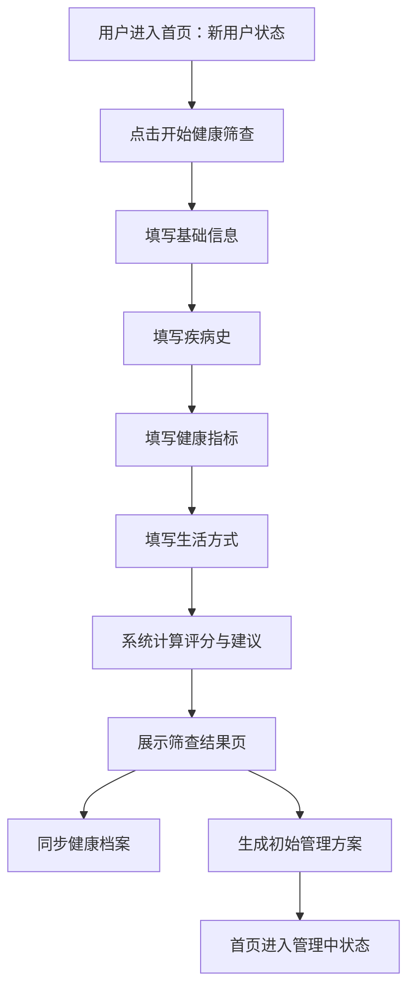

# 风险筛查模块 PRD

版本：V0.1  
所属产品：慢病管家  
适用端：患者微信小程序、医生 PC 管理端  
资料来源：`/Users/ks-hz/Desktop/评估问卷_数据表_表格.csv`

## 1. 模块定位

风险筛查模块用于在患者首次进入慢病管理服务时，完成基础健康状况评估，并生成慢病风险画像、健康建议和初始管理入口。

该模块不是诊断工具，输出应定位为“健康风险提示”和“管理建议”。所有涉及疾病治疗、用药调整、处方、诊断结论的内容，需要由医生确认。

疾病标签规则：

- 健康筛查只生成“疾病风险标签”，例如糖尿病风险、慢阻肺风险、睡眠呼吸障碍风险。
- 疾病风险标签用于患者分层、风险提示、医生端提醒和管理方案建议，不等同于确诊。
- 正式疾病标签必须由医生确认后生成，例如医生确认糖尿病、医生确认慢阻肺、医生确认睡眠呼吸障碍。
- 患者在问卷中填写的既往病史只作为疾病风险标签和医生确认疾病的证据，不单独作为正式疾病标签生效。

## 2. 业务目标

- 将当前“新用户 - 已筛查 - 管理中”的首页状态真正跑通。
- 用 3-5 分钟问卷采集患者基础信息、疾病史、健康指标和生活方式。
- 通过扣分模型生成健康评分、风险等级、异常项和建议文案。
- 将筛查结果沉淀到健康档案，并作为生成初始管理方案的依据。
- 支持后续每日根据健康档案和健康数据自动更新评分。

## 3. 用户流程



## 4. 页面与交互

### 4.1 入口

入口位置：

- 首页新用户状态主按钮：开始健康筛查。
- 我的 - 健康档案：重新评估。
- 医生端患者详情：查看筛查结果。

入口状态：

- 未评估：进入完整问卷。
- 已评估：展示上次评估结果，可重新评估。
- 问卷未完成：继续上次草稿。

### 4.2 问卷页

建议按 4 个步骤展示，降低一次性填写压力。

| 步骤 | 类别 | 题目数 | 说明 |
| --- | --- | ---: | --- |
| 1 | 基础信息 | 3 | 出生年份、性别、身高 |
| 2 | 疾病史 | 2 | 本人疾病史、父母家族史 |
| 3 | 健康指标 | 9 | 体重、BMI、血压、腰围、血糖 |
| 4 | 生活方式 | 9 | 饮食、运动、吸烟、饮酒、睡眠、精神紧张、静坐 |

交互要求：

- 顶部展示步骤进度，例如 `2/4 疾病史`。
- 必填题未完成不可进入下一步。
- 数值题展示单位和范围校验。
- 多选题中的“无/以上全无”与其他选项互斥。
- BMI 由身高和体重自动计算，不允许用户手动编辑。
- 对“未知”类答案保留选择入口，避免用户因不知道数据而中断评估。
- 支持保存草稿，用户退出后再次进入可继续填写。

### 4.3 结果页

结果页内容：

- 健康评分：建议使用 `100 - 扣分` 展示。
- 风险等级：低风险、中风险、高风险。
- 疾病风险标签：糖尿病风险、慢阻肺风险、睡眠呼吸障碍风险等，按触发证据展示。
- 风险摘要：疾病史、健康指标、生活方式三类异常概览。
- 优先建议：按 P0-P7 优先级展示最重要建议。
- 异常明细：列出扣分项、用户答案、扣分、建议动作。
- 后续动作：生成管理方案、完善健康档案、记录关键指标、联系医生。

结果页文案要求：

- 使用“风险”“建议”“关注”等表述。
- 避免“确诊”“治疗方案已确定”等诊断性表述。
- 疾病风险标签不得表达为确诊疾病，例如使用“睡眠呼吸障碍风险偏高”，不使用“已患睡眠呼吸障碍”。
- 若触发高风险或 P0 建议，应强化医生咨询或线下就医提醒。

## 5. 问卷字段配置

### 5.1 基础信息

| 序号 | code | 问题 | 类型 | 校验/选项 | 计分 |
| ---: | --- | --- | --- | --- | --- |
| 1 | `birth` | 您的出生年份 | 数值 | 1900-当前年份 | 45-54 岁扣 3 分；>=55 岁扣 4 分 |
| 2 | `sex` | 您的性别 | 单选 | 男、女 | 不扣分 |
| 3 | `height` | 您的身高 | 数值 | 100-230 cm | 不扣分 |

### 5.2 疾病史

| 序号 | code | 问题 | 类型 | 选项 | 计分 |
| ---: | --- | --- | --- | --- | --- |
| 4 | `disease` | 您是否患有以下疾病 | 多选 | 糖尿病、慢性阻塞性肺疾病、睡眠呼吸障碍、高血压、高血脂、脂肪肝、心脑血管病、痛风、甲状腺疾病、呼吸系统疾病、消化系统疾病、乳腺疾病（女）、其他、无 | 无不扣分；选 1 个扣 20 分；选 2 个扣 22 分；选 3 个扣 24 分；选 4 个及以上扣 26 分 |
| 5 | `family` | 您的父母是否患有以下疾病 | 多选 | 糖尿病、高血压、脑中风、冠心病、其他心血管疾病、肺癌、乳腺癌（女）、无 | 无不扣分；选 1 个扣 1 分；选 2 个扣 2 分；选 3 个及以上扣 4 分 |

规则：

- `disease` 和 `family` 中的“无”与其他选项互斥。
- `sex=男` 时不展示乳腺疾病（女）、乳腺癌（女）选项。
- 选择“其他”时建议展示补充输入框，MVP 可选填。

### 5.3 健康指标

| 序号 | code | 问题 | 类型 | 校验/选项 | 计分 |
| ---: | --- | --- | --- | --- | --- |
| 6 | `weight` | 您的体重 | 数值 | 20-150 kg | 不直接扣分，用于 BMI |
| 7 | `bmi` | 您的 BMI | 计算 | 体重 kg / 身高 m² | <18.5 扣 2 分；24<=BMI<28 扣 4 分；>=28 扣 6 分 |
| 8 | `bpAbnormal` | 你是否存在血压异常 | 单选 | 是、否、未知 | 未知扣 2 分 |
| 9 | `sbp` | 您的收缩压 | 数值 | 60-250 mmHg | 120<SBP<130 扣 1 分；130<=SBP<140 扣 2 分；SBP>=140 扣 4 分 |
| 10 | `dbp` | 您的舒张压 | 数值 | 30-180 mmHg | 80<=DBP<90 扣 2 分；DBP>=90 扣 4 分 |
| 11 | `waistline` | 您的腰围 | 数值 | 50-150 cm | 男性 >=90 扣 4 分；女性 >=85 扣 4 分 |
| 12 | `bsAbnormal` | 您是否存在血糖异常情况 | 单选 | 是、否、未知 | 未知扣 2 分 |
| 13 | `fpg` | 您的空腹血糖 | 数值 | 1.0-33.3 mmol/L | 未患糖尿病：<2.8 扣 4 分，2.8-3.9 扣 2 分，>=6.1 扣 4 分；已患糖尿病：<=3.9 扣 4 分，3.9-4.4 扣 2 分，>7.0 扣 4 分 |
| 14 | `pbg2h` | 您的餐后 2h 血糖 | 数值 | 1.0-33.3 mmol/L | <=3.9 扣 4 分；3.9-4.4 扣 2 分；>=10.0 扣 4 分 |

规则：

- 健康指标总扣分最高封顶 26 分。
- `bmi` 自动计算并实时展示。
- 若用户选择 `bpAbnormal=未知`，仍可选填 SBP/DBP；若填写有效血压，以数值评分为主，同时记录“未知”答案。
- 若用户选择 `bsAbnormal=未知`，仍可选填 FPG/PBG2H；若填写有效血糖，以数值评分为主，同时记录“未知”答案。
- 若数值超出生理合理范围，阻止提交并提示重新输入。

### 5.4 生活方式

| 序号 | code | 问题 | 类型 | 选项 | 计分 |
| ---: | --- | --- | --- | --- | --- |
| 15 | `regularDietary` | 饮食是否规律 | 多选 | 三餐不规律、常不吃早餐、常暴饮暴食、喜欢吃甜食、口味偏咸、食用油摄入过量、以上全无 | 选任意 1 项扣 1 分；选任意 2 项及以上扣 2 分 |
| 16 | `regularSports` | 是否有规律运动 | 单选 | 无、每周运动次数 1-2 次、每周运动次数 2 次以上 | 无扣 2 分；1-2 次扣 1 分 |
| 17 | `sportsTime` | 运动时间 | 单选 | <30 分钟、30-60 分钟、>60 分钟 | <30 分钟扣 1 分 |
| 18 | `smoke` | 是否吸烟 | 单选 | 是、否 | 是扣 4 分 |
| 19 | `alcoholic` | 是否饮酒 | 单选 | 是、否 | 不直接扣分 |
| 20 | `drink` | 每日饮酒量 | 单选 | >=100 ml、<100 ml | >=100 ml 扣 4 分 |
| 21 | `sleep` | 睡眠充足 | 单选 | >=6 小时、<6 小时 | <6 小时扣 4 分 |
| 22 | `nervousness` | 长期精神高度紧张 | 单选 | 是、否 | 是扣 2 分 |
| 23 | `sit` | 每日静坐时长 | 单选 | >=8 小时、<8 小时 | >=8 小时扣 2 分 |

规则：

- `regularDietary` 中“以上全无”与其他选项互斥。
- `alcoholic=否` 时隐藏 `drink`，并按不扣分处理。
- `regularSports=无` 时仍可展示 `sportsTime` 为“暂不填写/不适用”；MVP 可隐藏运动时间，按运动频次扣分。

## 6. 评分模型

### 6.1 基础公式

```text
总扣分 = 年龄扣分 + 疾病史扣分 + 家族史扣分 + min(健康指标扣分, 26) + 生活方式扣分
健康评分 = max(0, 100 - 总扣分)
```

建议风险等级：

| 健康评分 | 风险等级 | 页面表达 |
| ---: | --- | --- |
| >=85 | 低风险 | 当前健康状态较好 |
| 70-84 | 中风险 | 存在部分健康风险 |
| <70 | 高风险 | 存在较明显健康风险 |

说明：CSV 中未给出风险等级阈值，以上阈值为产品 MVP 建议，需医学负责人确认。

### 6.2 P0 特殊建议

P0 文案：

> 您目前处于疾病状态，且存在多个指标异常，生活方式也需要调整，建议您尽快规范治疗，改变生活方式，控制疾病发展。

建议触发条件：

```text
disease 扣分 > 0
且 健康指标异常项数量 >= 2
且 生活方式扣分 > 0
```

命中 P0 后，仅展示 P0 建议，其他建议不展示。

说明：CSV 中只给出 P0 文案和优先级，未明确“多个指标异常”的精确定义，MVP 暂按健康指标异常项数量 >= 2 处理。

### 6.3 建议优先级

| 优先级 | 来源 | 触发条件 | 建议展示 |
| --- | --- | --- | --- |
| P0 | 综合高风险 | 已患疾病 + 多个指标异常 + 生活方式需调整 | 只展示 P0 |
| P1 | 疾病史 | `disease` 选择任一疾病 | 建议定期就诊、疾病监测、积极治疗 |
| P2 | 健康指标 | BMI、血压、腰围、血糖等有数值扣分 | 建议做好数据监测、改善生活方式、定期体检 |
| P3 | 未知指标 | 血压或血糖选择未知 | 建议关注对应指标，了解健康状况 |
| P4 | 生活方式 | 生活方式任一扣分 | 建议培养健康生活习惯 |
| P5 | 家族史 | `family` 任一疾病 | 提示家族史相关高风险，积极预防 |
| P6 | 年龄 | 仅年龄扣分，其他项无扣分 | 提示慢病高发年龄，建议定期体检 |
| P7 | 无扣分 | 其他建议均不触发 | 当前健康状态良好，继续保持 |

建议展示规则：

- 默认展示最高优先级建议 1 条。
- 结果详情中可展示全部异常项和分项建议。
- 若需要更完整的结果页，可展示“主要建议 + 其他关注项”，但 P0 仍只展示 P0。

## 7. 建议文案规则

### 7.1 疾病史建议 P1

触发：`disease` 选择任一疾病或其他。

文案：

```text
建议您对目前所患的相关疾病进行定期就诊，做好疾病监测，积极治疗。
```

### 7.2 健康指标建议 P2

触发：健康指标存在数值扣分项。

文案模板：

```text
您目前{异常指标列表}异常，建议做好数据监测，改善生活方式，定期体检，做好疾病预防。
```

异常指标列表取值示例：

- BMI
- 收缩压
- 舒张压
- 腰围
- 空腹血糖
- 餐后 2h 血糖

### 7.3 未知指标建议 P3

触发：`bpAbnormal=未知` 或 `bsAbnormal=未知`，且无数值扣分项优先覆盖。

文案模板：

```text
您应该关注{未知指标列表}，了解自己健康状况，做好健康监测。
```

未知指标列表：

- 血压
- 血糖

### 7.4 生活方式建议 P4

触发：生活方式任一扣分项。

基础文案：

```text
您目前的生活方式存在健康风险，建议您培养健康生活习惯，请保持规律饮食、良好的运动习惯与充足的睡眠。
```

动态追加：

- `alcoholic=是` 且 `drink>=100ml`：追加“避免过量饮酒”。
- `smoke=是`：追加“务必戒烟”。
- `nervousness=是`：追加“避免长期精神紧张”。
- `sit>=8小时`：追加“减少长时间静坐”。

### 7.5 家族史建议 P5

触发：`family` 选择任一疾病。

文案模板：

```text
您目前最需要关注的是有{疾病列表}疾病家族史，属于高风险人群，建议您积极预防。
```

### 7.6 年龄建议 P6

触发：仅年龄扣分，其他项目均无扣分。

文案：

```text
您目前属于慢性疾病高发年龄，建议做好生活方式管理，定期体检，做好疾病预防。
```

### 7.7 健康状态良好 P7

触发：所有项目无扣分，且其他建议均不触发。

文案：

```text
您目前健康状态良好，建议您继续保持良好生活习惯，做好疾病预防。
```

## 8. 数据更新规则

CSV 中明确评分需要每日更新，规则如下：

- 首次评分数据来源于健康状况评估问卷。
- 问卷可调取健康档案和健康数据中的已有数据。
- 如同一字段存在多条数据，优先采用最新上传的数据值。
- 评分每日更新一次。
- 健康档案当日有更新时，调取最新健康档案信息。
- 健康数据当日有更新时，根据用户最新上传的健康数据重新评分。
- 如果用户当日没有上传任何数据，则沿用原问卷数据评分。

产品落地建议：

- `ScreeningAssessment` 保存首次问卷快照。
- `DailyRiskScore` 保存每日评分快照，避免历史结果被新数据覆盖。
- 首页展示最新评分和最新风险等级。
- 结果页保留“评估时间”和“数据更新时间”。

## 9. 数据结构

### 9.1 问卷配置 `assessment_question`

| 字段 | 类型 | 说明 |
| --- | --- | --- |
| `id` | string | 题目 ID |
| `code` | string | 题目编码 |
| `category` | string | 分类 |
| `question` | string | 题干 |
| `type` | string | number/single/multiple/computed |
| `required` | boolean | 是否必填 |
| `unit` | string | 单位 |
| `min` | number | 最小值 |
| `max` | number | 最大值 |
| `options` | json | 选项配置 |
| `visible_condition` | json | 展示条件 |
| `exclusive_options` | json | 互斥选项 |
| `sort_order` | number | 排序 |
| `enabled` | boolean | 是否启用 |

### 9.2 评估记录 `screening_assessment`

| 字段 | 类型 | 说明 |
| --- | --- | --- |
| `id` | string | 评估 ID |
| `patient_id` | string | 患者 ID |
| `status` | string | draft/submitted |
| `answers` | json | 用户答案快照 |
| `score` | number | 健康评分 |
| `deduction` | number | 总扣分 |
| `risk_level` | string | low/medium/high |
| `disease_risk_tags` | json | 系统生成的疾病风险标签，例如糖尿病风险、慢阻肺风险、睡眠呼吸障碍风险 |
| `disease_risk_evidence` | json | 疾病风险标签触发证据 |
| `primary_advice_priority` | string | P0-P7 |
| `primary_advice` | text | 主建议 |
| `abnormal_items` | json | 异常项列表 |
| `created_at` | datetime | 创建时间 |
| `submitted_at` | datetime | 提交时间 |

### 9.3 每日评分 `daily_risk_score`

| 字段 | 类型 | 说明 |
| --- | --- | --- |
| `id` | string | 记录 ID |
| `patient_id` | string | 患者 ID |
| `score_date` | date | 评分日期 |
| `score` | number | 健康评分 |
| `deduction` | number | 总扣分 |
| `risk_level` | string | 风险等级 |
| `data_sources` | json | 本次评分使用的数据来源 |
| `abnormal_items` | json | 异常项 |
| `advice` | text | 建议 |
| `created_at` | datetime | 创建时间 |

## 10. 接口草案

### 10.1 获取问卷配置

`GET /api/screening/questions`

返回：

```json
{
  "version": "2026-05-16",
  "steps": [
    {
      "category": "基础信息",
      "questions": []
    }
  ]
}
```

### 10.2 保存草稿

`POST /api/screening/draft`

请求：

```json
{
  "answers": {
    "birth": 1972,
    "sex": "女",
    "height": 162
  }
}
```

### 10.3 提交评估

`POST /api/screening/submit`

请求：

```json
{
  "answers": {
    "birth": 1972,
    "sex": "女",
    "height": 162,
    "weight": 68
  }
}
```

返回：

```json
{
  "assessmentId": "assess_001",
  "score": 76,
  "riskLevel": "medium",
  "primaryAdvicePriority": "P2",
  "primaryAdvice": "您目前BMI、空腹血糖异常，建议做好数据监测，改善生活方式，定期体检，做好疾病预防。",
  "abnormalItems": [
    {
      "code": "bmi",
      "label": "BMI",
      "value": 25.9,
      "deduction": 4
    }
  ]
}
```

### 10.4 获取评估结果

`GET /api/screening/result/latest`

用途：

- 首页判断用户是否已筛查。
- 结果页展示最新结果。
- 医生端患者详情展示筛查摘要。

### 10.5 重新计算每日评分

`POST /api/risk-score/recalculate`

触发场景：

- 定时任务每日执行。
- 用户更新健康档案。
- 用户新增血压、血糖、体重、腰围等健康数据。

## 11. 医生端需求

医生 PC 端需要支持查看筛查结果，但 MVP 不要求医生编辑问卷。

患者详情中展示：

- 最新健康评分和风险等级。
- 系统提示的疾病风险标签。
- 疾病风险标签证据，例如问卷答案、异常指标、症状或设备报告。
- 评估时间、数据更新时间。
- 四类分项扣分：基础信息、疾病史、健康指标、生活方式。
- 主要建议。
- 异常项明细。
- 原始问卷答案。

患者列表中可筛选：

- 未筛查。
- 低风险。
- 中风险。
- 高风险。
- 已患疾病。
- 多指标异常。

医生可执行：

- 发送建议。
- 生成管理方案。
- 标记需要随访。
- 建议完善缺失指标。
- 将疾病风险标签确认为医生确认疾病。
- 驳回疾病风险标签或标记资料不足。

## 12. 与首页及管理方案联动

### 12.1 首页状态

| 条件 | 首页状态 |
| --- | --- |
| 无 `screening_assessment.submitted_at` | 新用户 |
| 已完成评估但无管理方案 | 已筛查 |
| 已完成评估且有生效管理方案 | 管理中 |

### 12.2 初始管理方案生成

生成方案时使用：

- 风险等级。
- 已患疾病。
- 健康指标异常项。
- 生活方式异常项。
- 未知指标项。

示例：

- 血糖异常：生成空腹血糖、餐后 2h 血糖记录任务。
- 血压异常或未知：生成血压记录任务。
- BMI/腰围异常：生成体重、运动、饮食任务。
- 吸烟、饮酒、睡眠不足、久坐：生成生活方式改善任务。

## 13. 验收标准

- 用户可以从首页进入风险筛查并完成 4 步问卷。
- 必填、范围、互斥、条件展示校验生效。
- BMI 可根据身高和体重自动计算。
- 提交后可生成健康评分、风险等级、扣分明细和建议文案。
- 疾病史、健康指标、生活方式、家族史、年龄、健康状态良好建议按 P0-P7 优先级正确展示。
- P0 命中时只展示 P0 建议。
- 评估结果可同步健康档案。
- 首页可根据是否完成评估切换新用户/已筛查状态。
- 医生端可查看患者筛查结果摘要和原始问卷。
- 每日评分任务可根据最新健康档案和健康数据生成新的评分快照。

## 14. 待确认问题

- 风险等级阈值是否采用 `>=85 低风险、70-84 中风险、<70 高风险`。
- P0 中“多个指标异常”是否定义为健康指标异常项 >=2。
- 血压/血糖选择“未知”且又填写数值时，是否仍扣未知分。
- `regularSports=无` 时是否隐藏运动时间。
- 健康指标封顶 26 分是否只覆盖 BMI、血压、腰围、血糖和未知指标。
- 结果页是否展示全部建议，还是只展示最高优先级建议。
- 每日评分是否需要推送通知，还是仅更新首页状态。
